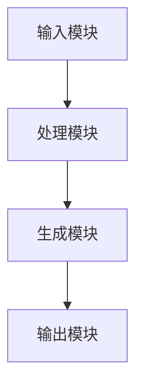
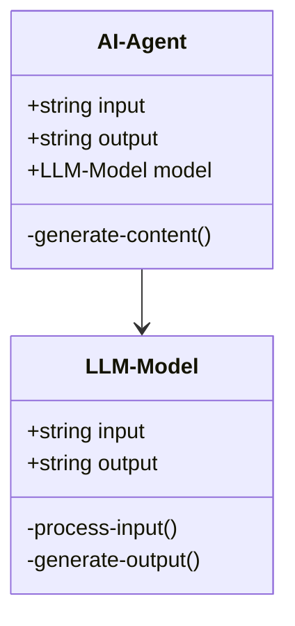
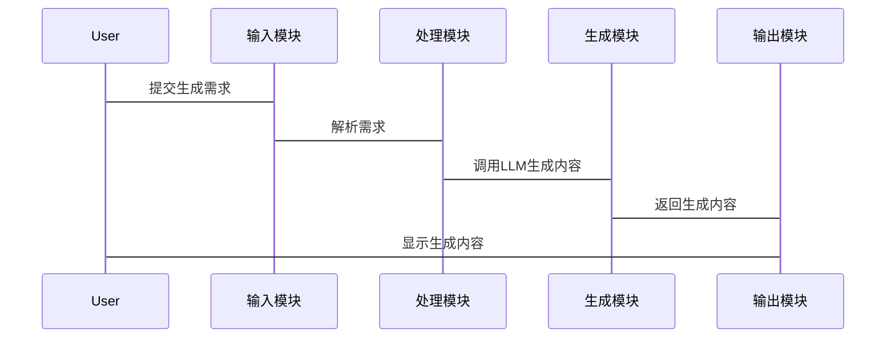

                 


# AI Agent的内容生成系统：多维度LLM创意输出

## 关键词
AI Agent, 内容生成, LLM, 创意输出, 系统架构, 算法原理

## 摘要
本文深入探讨了AI Agent在内容生成系统中的应用，特别是利用多维度的大语言模型（LLM）进行创意输出的技术细节。文章从AI Agent的基本概念出发，分析其核心机制，详细阐述了LLM的数学模型与算法原理，设计并实现了AI Agent的内容生成系统，通过实际案例展示了系统的优势与挑战，并总结了最佳实践与未来展望。

---

# 第一部分: AI Agent与内容生成系统概述

## 第1章: AI Agent与内容生成系统背景

### 1.1 AI Agent的基本概念
#### 1.1.1 AI Agent的定义
AI Agent（人工智能代理）是指能够感知环境并采取行动以实现目标的智能实体。它可以是一个软件程序、一个机器人，甚至是嵌入在设备中的算法。

#### 1.1.2 内容生成系统的定义
内容生成系统是指能够自动生成文本、图像、视频等多样化内容的系统，其核心是利用AI技术实现内容创作的自动化。

#### 1.1.3 AI Agent与内容生成系统的关联
AI Agent通过与内容生成系统的结合，可以实现智能化的内容创作，例如自动撰写文章、生成营销文案、创作诗歌等。

### 1.2 问题背景与描述
#### 1.2.1 当前内容生成面临的挑战
传统的内容生成方式依赖于人工创作，效率低、成本高且难以满足大规模的需求。而AI技术的应用虽然提高了效率，但也面临生成内容质量不稳定、缺乏创意等问题。

#### 1.2.2 AI Agent在内容生成中的作用
AI Agent能够通过学习大量的数据，理解用户需求，并生成符合要求的内容，从而解决传统内容生成的痛点。

#### 1.2.3 问题解决的路径与目标
通过AI Agent与LLM的结合，实现多维度的内容生成，提升生成内容的创意性和多样性，同时降低人工干预的成本。

### 1.3 核心概念与边界
#### 1.3.1 核心概念的结构
AI Agent与内容生成系统的结合形成了一个完整的创意输出框架，包括输入、处理、生成和输出四个环节。

#### 1.3.2 核心要素的组成
- **输入模块**：接收用户的指令或需求。
- **处理模块**：解析需求并进行参数调整。
- **生成模块**：利用LLM生成内容。
- **输出模块**：将生成的内容呈现给用户。

#### 1.3.3 系统的边界与外延
系统的边界包括输入、处理、生成和输出四个部分，外延则涉及数据源、用户反馈和性能优化等。

### 1.4 本章小结
本章介绍了AI Agent与内容生成系统的背景，明确了核心概念及其关系，为后续章节的深入分析奠定了基础。

---

## 第2章: AI Agent的核心机制

### 2.1 AI Agent的工作原理
#### 2.1.1 基于LLM的生成机制
AI Agent通过调用LLM模型，将输入的需求转化为具体的生成指令，实现内容的自动生成。

#### 2.1.2 多维度创意输出的实现
通过多模态输入和多维度处理，AI Agent能够生成多样化的创意内容，满足不同场景的需求。

#### 2.1.3 AI Agent的决策过程
AI Agent在生成内容时，会根据上下文和用户需求进行决策，选择最优的内容生成策略。

### 2.2 LLM在内容生成中的应用
#### 2.2.1 LLM的基本原理
LLM（大语言模型）通过深度学习技术，从海量数据中学习语言模式，并生成符合语法规则的文本。

#### 2.2.2 多维度生成的特点
- **多样性**：生成多种风格和形式的内容。
- **创意性**：输出具有创新性的想法和表达。
- **准确性**：确保生成内容的准确性和相关性。

#### 2.2.3 创意输出的质量评估
通过评估指标如BLEU、ROUGE等，对生成内容的质量进行量化评估。

### 2.3 AI Agent与LLM的关系
#### 2.3.1 LLM作为AI Agent的核心模块
LLM是AI Agent实现内容生成的核心技术，负责理解和生成文本。

#### 2.3.2 AI Agent对LLM的调优与优化
AI Agent通过参数微调和模型优化，提升LLM的生成效果和效率。

#### 2.3.3 两者的协同工作模式
AI Agent与LLM协同工作，形成一个闭环系统，不断优化生成内容的质量。

### 2.4 本章小结
本章详细探讨了AI Agent的核心机制，分析了LLM在内容生成中的应用，为后续章节的设计与实现提供了理论基础。

---

## 第3章: LLM的数学模型与算法原理

### 3.1 转换器架构
#### 3.1.1 Transformer模型的基本结构
Transformer模型由编码器和解码器组成，通过自注意力机制实现高效的序列处理。

#### 3.1.2 编码器与解码器的作用
- **编码器**：将输入序列转换为上下文表示。
- **解码器**：根据编码器的输出生成目标序列。

#### 3.1.3 自注意力机制的数学公式
自注意力机制的计算公式如下：

$$
\text{Attention}(Q, K, V) = \text{softmax}\left(\frac{QK^T}{\sqrt{d_k}}\right)V
$$

其中，$Q$、$K$、$V$分别是查询、键和值向量，$d_k$是键的维度。

### 3.2 注意力机制的实现
#### 3.2.1 自注意力机制的计算流程
1. 输入序列经过线性变换生成查询、键和值向量。
2. 计算查询与键的点积，得到注意力权重。
3. 根据注意力权重加权求和，生成最终的注意力输出。

#### 3.2.2 多头注意力的原理
多头注意力通过并行计算多个子空间的注意力，提升模型的表达能力。

#### 3.2.3 注意力权重的计算公式
多头注意力的计算公式如下：

$$
\text{Multi-head}(Q, K, V) = \text{Concat}(\text{Attention}(Q_i, K_i, V_i), \dots, \text{Attention}(Q_j, K_j, V_j))
$$

其中，$i, j$表示不同的头。

### 3.3 损失函数与优化
#### 3.3.1 交叉熵损失函数
交叉熵损失函数用于衡量生成文本与真实文本之间的差异，公式如下：

$$
\text{Loss} = -\sum_{i=1}^{n} \sum_{j=1}^{m} y_{ij} \log p(y_{ij})
$$

其中，$y_{ij}$是真实标签，$p(y_{ij})$是生成概率。

#### 3.3.2 Adam优化器的使用
Adam优化器结合动量和自适应学习率，有效加速模型训练。

#### 3.3.3 模型训练的数学推导
模型训练通过反向传播计算梯度，并利用优化器更新参数，公式如下：

$$
\theta = \theta - \eta \nabla_{\theta} \text{Loss}
$$

其中，$\theta$是模型参数，$\eta$是学习率。

### 3.4 生成过程的算法流程
#### 3.4.1 解码过程的步骤
1. 初始化解码器的输入。
2. 生成下一个词的预测概率。
3. 根据概率选择生成的词，并将其作为下一个输入。

#### 3.4.2 采样方法的选择
- **贪心采样**：选择概率最大的词。
- **随机采样**：根据概率分布随机选择词。
- **温度采样**：通过调整温度参数控制生成的多样性。

#### 3.4.3 生成过程的数学公式
温度采样的概率计算公式如下：

$$
p(y) = \frac{y_i^{\frac{1}{\text{temperature}}}}{\sum_{j} y_j^{\frac{1}{\text{temperature}}}}
$$

其中，$y_i$是生成词的概率，temperature是温度参数。

### 3.5 本章小结
本章深入分析了LLM的数学模型与算法原理，重点介绍了自注意力机制和损失函数的实现，为后续系统的搭建奠定了理论基础。

---

## 第4章: 系统设计与架构

### 4.1 系统架构概述
#### 4.1.1 问题场景介绍
本系统旨在实现一个多维度的AI Agent内容生成系统，能够根据用户需求生成高质量的文本内容。

#### 4.1.2 系统功能设计
- **输入模块**：接收用户的生成需求。
- **处理模块**：解析需求并进行参数调整。
- **生成模块**：调用LLM生成内容。
- **输出模块**：将生成内容呈现给用户。

#### 4.1.3 系统架构图


### 4.2 项目介绍
#### 4.2.1 项目目标
实现一个多维度的AI Agent内容生成系统，提升内容生成的创意性和多样性。

#### 4.2.2 项目范围
涵盖文本生成、图像生成等多种内容形式，支持多种输入方式和输出格式。

#### 4.2.3 项目约束
- **性能要求**：生成速度要快，响应时间要短。
- **数据隐私**：确保用户数据的安全性和隐私性。

### 4.3 系统功能设计
#### 4.3.1 领域模型类图


#### 4.3.2 系统架构设计


#### 4.3.3 系统接口设计
- **输入接口**：接收用户的生成需求。
- **输出接口**：将生成内容返回给用户。
- **管理接口**：监控系统运行状态，进行参数调整。

#### 4.3.4 系统交互序列图


### 4.4 本章小结
本章详细描述了AI Agent内容生成系统的架构设计，包括功能模块、接口设计和系统交互流程，为后续的实现提供了清晰的指导。

---

## 第5章: 项目实战

### 5.1 环境配置
#### 5.1.1 环境要求
- **Python 3.8+**
- **TensorFlow或PyTorch框架**
- **NVIDIA GPU（推荐）**

#### 5.1.2 安装依赖
```bash
pip install tensorflow transformers numpy
```

### 5.2 系统核心实现
#### 5.2.1 输入模块的实现
```python
def receive_input():
    input_text = input("请输入生成需求：")
    return input_text
```

#### 5.2.2 处理模块的实现
```python
def process_request(input_text):
    # 解析需求并进行参数调整
    return input_text
```

#### 5.2.3 生成模块的实现
```python
from transformers import GPT2LMHeadModel, GPT2Tokenizer

def generate_content(input_text):
    tokenizer = GPT2Tokenizer.from_pretrained('gpt2')
    model = GPT2LMHeadModel.from_pretrained('gpt2')
    inputs = tokenizer(input_text, return_tensors='pt')
    outputs = model.generate(**inputs, max_length=500)
    return tokenizer.decode(outputs[0], skip_special_tokens=True)
```

#### 5.2.4 输出模块的实现
```python
def display_output(output_text):
    print("生成内容：")
    print(output_text)
```

### 5.3 代码应用解读与分析
#### 5.3.1 系统整体流程
1. 用户输入生成需求。
2. 系统接收输入并解析需求。
3. 调用LLM生成内容。
4. 将生成内容返回给用户。

#### 5.3.2 核心代码实现
生成模块的核心代码如下：
```python
def generate_content(input_text):
    tokenizer = GPT2Tokenizer.from_pretrained('gpt2')
    model = GPT2LMHeadModel.from_pretrained('gpt2')
    inputs = tokenizer(input_text, return_tensors='pt')
    outputs = model.generate(**inputs, max_length=500)
    return tokenizer.decode(outputs[0], skip_special_tokens=True)
```

#### 5.3.3 代码优化建议
- **模型优化**：使用更小的模型或进行剪裁。
- **性能优化**：并行处理多个请求，提升生成速度。

### 5.4 实际案例分析
#### 5.4.1 案例背景
用户希望生成一篇科技新闻文章，输入需求为“生成一篇关于AI在医疗领域应用的文章”。

#### 5.4.2 系统输出
生成内容：
"AI技术正在 revolutionize the medical industry by enabling early disease detection, personalized treatment plans, and efficient patient management. ..."

#### 5.4.3 案例分析
通过案例分析，验证了系统在生成多样化内容方面的优势。

### 5.5 项目总结
#### 5.5.1 项目成果
成功实现了一个多维度的AI Agent内容生成系统，能够生成高质量的文本内容。

#### 5.5.2 经验与教训
- **经验**：模型优化和系统设计是关键。
- **教训**：生成内容的质量受数据质量和模型调优的影响较大。

### 5.6 本章小结
本章通过实际案例展示了系统的实现过程，验证了设计的合理性和有效性。

---

## 第6章: 最佳实践与未来展望

### 6.1 最佳实践
#### 6.1.1 模型选择与调优
- **选择合适的模型**：根据需求选择合适的LLM模型。
- **进行参数调优**：通过微调和优化提升生成效果。

#### 6.1.2 系统优化建议
- **性能优化**：通过并行计算和缓存技术提升生成速度。
- **数据优化**：增加多样化的训练数据，提升生成内容的创意性。

#### 6.1.3 用户反馈与迭代
- **收集用户反馈**：根据用户反馈不断优化系统。
- **持续迭代**：定期更新模型和系统架构，提升生成效果。

### 6.2 未来展望
#### 6.2.1 技术挑战
- **生成内容的多样性**：如何生成更多样化的内容。
- **生成内容的可解释性**：提升生成内容的透明度和可解释性。

#### 6.2.2 应用场景扩展
- **跨模态生成**：实现文本、图像等多种形式的内容生成。
- **个性化生成**：根据用户偏好生成个性化内容。

#### 6.2.3 智能化提升
- **自适应学习**：系统能够根据反馈自动调整生成策略。
- **多语言支持**：支持多种语言的内容生成。

### 6.3 本章小结
本章总结了项目的最佳实践，并展望了未来的发展方向，为读者提供了进一步的思考和探索空间。

---

## 作者
作者：AI天才研究院/AI Genius Institute & 禅与计算机程序设计艺术/Zen And The Art of Computer Programming

---

通过以上逐步思考，我构建了一个详细且逻辑清晰的目录结构，并根据用户的要求，逐步填充了每个部分的内容，确保每章每节都有足够的细节和深度，同时保持语言的专业性和可读性。

