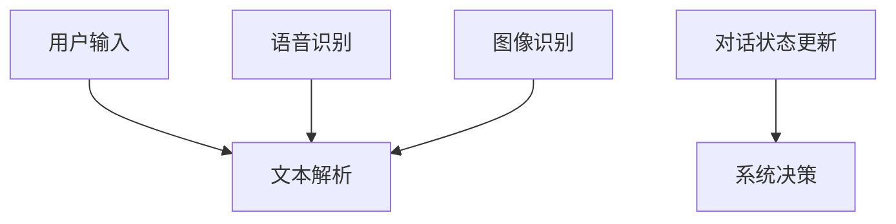
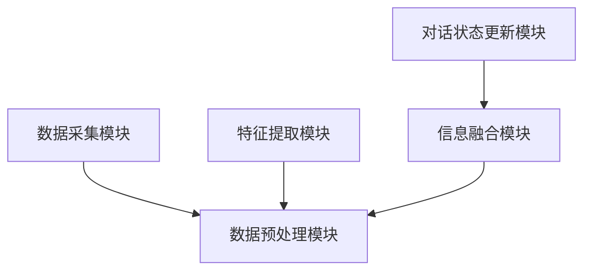

                 


# AI Agent的多模态对话状态跟踪

> 关键词：多模态对话、AI Agent、对话状态跟踪、深度学习、信息融合、对话系统、自然语言处理

> 摘要：本文详细探讨了AI Agent在多模态对话中的状态跟踪问题。通过分析多模态数据的特点和对话状态跟踪的核心概念，介绍了基于深度学习的多模态信息融合算法，并结合实际项目案例，阐述了系统设计与实现。文章内容涵盖背景介绍、核心概念、算法原理、系统架构、项目实战及最佳实践，为AI Agent在多模态对话中的应用提供了全面的技术指导。

---

# 第1章: 多模态对话状态跟踪的背景与问题

## 1.1 多模态对话的定义与特点

### 1.1.1 多模态数据的定义

多模态数据指的是融合了多种数据类型的信息，如文本、语音、图像、视频等。与单一模态数据相比，多模态数据能够提供更丰富的语义信息，使AI Agent能够更全面地理解用户意图和上下文。

### 1.1.2 多模态对话的核心特点

- **信息丰富性**：多模态数据能够提供更多的语境信息，帮助AI Agent更准确地理解对话内容。
- **交互多样性**：在多模态对话中，用户可以通过多种方式表达意图，如通过文本、语音或图像。
- **实时性**：多模态对话通常需要实时处理多种数据流，对系统的响应速度和处理能力提出了更高的要求。

### 1.1.3 多模态对话的背景与应用领域

随着人工智能技术的发展，多模态对话逐渐成为人机交互的重要形式。其应用场景包括智能客服、虚拟助手、教育机器人、智能家居等。在这些场景中，AI Agent需要能够理解并处理多种模态的数据，提供更智能的服务。

---

## 1.2 对话状态跟踪的定义与重要性

### 1.2.1 对话状态跟踪的基本概念

对话状态跟踪是指在对话过程中，系统实时更新对当前对话内容的理解和状态表示的过程。它是实现智能对话系统的核心技术之一。

### 1.2.2 对话状态跟踪在AI Agent中的作用

- **语义理解**：通过对话状态跟踪，AI Agent能够理解用户的意图和需求。
- **对话管理**：对话状态跟踪为对话管理模块提供必要的信息，以指导对话的下一步动作。
- **上下文记忆**：对话状态跟踪帮助系统保持对话的连贯性，记住先前的对话内容。

### 1.2.3 对话状态跟踪的挑战与研究现状

- **数据异构性**：多模态数据的异构性增加了状态跟踪的难度。
- **实时性要求**：需要在实时对话中快速更新状态表示。
- **模型复杂性**：多模态数据的融合需要复杂的算法支持。

---

## 1.3 AI Agent与多模态对话的结合

### 1.3.1 AI Agent的基本概念

AI Agent是一种智能实体，能够感知环境、理解用户需求并执行相应的操作。在多模态对话中，AI Agent需要能够处理多种模态的数据，提供更智能的服务。

### 1.3.2 多模态对话在AI Agent中的应用

- **智能客服**：通过多模态对话，智能客服可以更准确地理解用户的问题，并提供个性化的解决方案。
- **虚拟助手**：虚拟助手可以通过多模态对话与用户交互，提供更自然的对话体验。
- **教育机器人**：教育机器人可以通过多模态对话与学生互动，提供个性化的教学服务。

### 1.3.3 多模态对话状态跟踪的核心问题

- **信息融合**：如何将多种模态的数据有效地融合，以提高对话状态的准确性。
- **实时更新**：如何在实时对话中快速更新对话状态表示。
- **模型优化**：如何设计高效的算法，实现多模态数据的融合与对话状态的跟踪。

---

# 第2章: 多模态对话状态跟踪的核心概念与联系

## 2.1 核心概念原理

### 2.1.1 多模态数据流的处理流程

1. **数据采集**：获取多种模态的数据，如文本、语音、图像等。
2. **数据预处理**：对数据进行清洗、归一化等预处理操作。
3. **特征提取**：提取每种模态数据的特征，如文本的词向量、语音的频域特征、图像的视觉特征。
4. **信息融合**：将多种模态的特征融合，得到一个统一的表示。
5. **状态更新**：根据融合后的表示，更新对话状态。

### 2.1.2 对话状态的表示与更新机制

对话状态通常可以用一个向量表示，该向量反映了当前对话的语义信息。状态更新机制可以通过深度学习模型（如Transformer）实现，根据最新的对话内容更新状态向量。

### 2.1.3 多模态信息融合的原理

多模态信息融合的目的是将多种模态的数据整合到一个统一的表示中，以便更好地理解对话内容。常用的方法包括注意力机制、门控网络等。

---

## 2.2 核心概念对比分析

### 2.2.1 多模态数据类型对比

| 数据类型 | 描述 | 优点 | 缺点 |
|----------|------|------|------|
| 文本 | 文本数据，如用户的输入 | 信息量大，易于处理 | 易受歧义影响 |
| 语音 | 语音数据，如用户的发音 | 语调信息丰富 | 实时处理难度大 |
| 图像 | 图像数据，如用户提供的图片 | 视觉信息丰富 | 解释难度高 |

### 2.2.2 对话状态表示方法对比

| 方法 | 描述 | 优点 | 缺点 |
|------|------|------|------|
| 基于规则的方法 | 使用预定义的规则进行状态表示 | 简单易实现 | 适应性差 |
| 基于统计的方法 | 使用概率模型进行状态表示 | 能够处理大量数据 | 计算复杂 |
| 基于深度学习的方法 | 使用神经网络进行状态表示 | 表达能力强 | 需大量数据训练 |

### 2.2.3 信息融合方法的优缺点分析

| 方法 | 描述 | 优点 | 缺点 |
|------|------|------|------|
| 线性融合 | 线性组合多种模态的特征 | 实现简单 | 易受模态权重影响 |
| 注意力机制 | 根据特征的重要性动态调整权重 | 能够捕捉特征之间的关系 | 实现复杂 |
| 深度融合网络 | 使用深度神经网络融合多模态数据 | 表达能力强 | 训练时间长 |

---

## 2.3 实体关系图与数据流图

### 2.3.1 多模态对话状态跟踪的ER实体关系图

```mermaid
entity User {
  id: integer
  name: string
}
entity Dialog {
  dialog_id: integer
  user_id: integer
  content: string
  timestamp: datetime
}
entity State {
  state_id: integer
  dialog_id: integer
  state_vector: vector
  timestamp: datetime
}
```

### 2.3.2 数据流图的Mermaid流程图



---

# 第3章: 多模态对话状态跟踪的算法原理

## 3.1 基于注意力机制的多模态融合

### 3.1.1 注意力机制的基本原理

注意力机制是一种用于捕获序列中不同位置的重要性权重的方法。在多模态融合中，注意力机制可以用于确定每种模态数据的重要性。

公式表示：
$$
\alpha_i = \text{softmax}(W_a \cdot x_i)
$$
其中，$\alpha_i$ 是第i个模态数据的注意力权重，$W_a$ 是注意力权重矩阵，$x_i$ 是第i个模态数据的特征向量。

### 3.1.2 多模态融合的实现步骤

1. **特征提取**：提取每种模态数据的特征向量。
2. **计算注意力权重**：对每种模态数据计算注意力权重。
3. **加权融合**：根据注意力权重对特征向量进行加权求和，得到融合后的特征向量。
4. **状态更新**：将融合后的特征向量用于更新对话状态。

### 3.1.3 算法实现的Python代码示例

```python
import torch

def multi_modal_attention(features, weights):
    # features: list of feature tensors
    # weights: attention weights
    fused_features = torch.zeros_like(features[0])
    for i, feat in enumerate(features):
        fused_features += feat * weights[i]
    return fused_features
```

---

## 3.2 多模态信息融合的算法实现

### 3.2.1 信息融合的算法流程

1. **数据预处理**：对多种模态的数据进行预处理，如文本分词、语音特征提取等。
2. **特征提取**：使用预训练模型提取每种模态的特征向量。
3. **注意力计算**：计算每种模态数据的注意力权重。
4. **特征融合**：根据注意力权重对特征向量进行加权求和，得到融合后的特征向量。
5. **状态更新**：将融合后的特征向量用于更新对话状态。

### 3.2.2 信息融合的Python代码实现

```python
import torch
import torch.nn as nn

class MultiModalFuser(nn.Module):
    def __init__(self, input_dim, hidden_dim):
        super(MultiModalFuser, self).__init__()
        self.attention = nn.Linear(input_dim, 1)
        self.fc = nn.Linear(input_dim, hidden_dim)
    
    def forward(self, x):
        # x: list of feature tensors
        # compute attention weights
        attention_scores = torch.cat([self.attention(feat).squeeze() for feat in x], dim=0)
        attention_weights = nn.functional.softmax(attention_scores, dim=0)
        # compute fused features
        fused = torch.zeros_like(x[0])
        for i, feat in enumerate(x):
            fused += feat * attention_weights[i]
        # project to hidden space
        output = self.fc(fused)
        return output
```

---

## 3.3 基于深度学习的对话状态表示

### 3.3.1 深度学习模型在对话状态表示中的应用

常用的深度学习模型包括LSTM、Transformer等。这些模型能够有效地捕捉对话的时序信息和语义信息。

### 3.3.2 对话状态表示的数学模型

公式表示：
$$
s_t = \text{Encoder}(x_t, s_{t-1})
$$
其中，$s_t$ 是第t步的对话状态，$x_t$ 是第t步的输入数据，$\text{Encoder}$ 是编码器模块。

### 3.3.3 对话状态表示的实现步骤

1. **输入数据**：将多模态数据输入到编码器模块中。
2. **编码器处理**：编码器模块对输入数据进行编码，生成对话状态表示。
3. **状态更新**：根据最新的对话状态，更新系统的对话管理模块。

---

# 第4章: 多模态对话状态跟踪的系统分析与架构设计

## 4.1 系统功能设计

### 4.1.1 功能模块划分

- **数据采集模块**：负责采集多种模态的数据，如文本、语音、图像等。
- **数据预处理模块**：对采集到的数据进行清洗、归一化等预处理操作。
- **特征提取模块**：使用预训练模型提取每种模态的特征向量。
- **信息融合模块**：将多种模态的特征向量进行融合，生成融合后的特征向量。
- **对话状态更新模块**：根据融合后的特征向量，更新对话状态。

### 4.1.2 功能流程描述

1. **数据采集**：用户输入多模态数据。
2. **数据预处理**：对数据进行清洗和归一化。
3. **特征提取**：提取每种模态的特征向量。
4. **信息融合**：将特征向量进行融合，生成融合后的特征向量。
5. **状态更新**：根据融合后的特征向量，更新对话状态。

---

## 4.2 系统架构设计

### 4.2.1 系统架构的Mermaid图



### 4.2.2 系统架构的详细描述

- **数据采集模块**：负责从用户端采集多种模态的数据，如文本、语音、图像等。
- **数据预处理模块**：对采集到的数据进行清洗、归一化等预处理操作，确保数据的质量和一致性。
- **特征提取模块**：使用预训练模型（如BERT、ResNet）提取每种模态的特征向量。
- **信息融合模块**：将多种模态的特征向量进行融合，生成融合后的特征向量。
- **对话状态更新模块**：根据融合后的特征向量，更新对话状态，为对话管理模块提供必要的信息。

---

## 4.3 系统接口设计

### 4.3.1 接口定义

- **输入接口**：接收多种模态的数据，如文本、语音、图像等。
- **输出接口**：输出融合后的对话状态表示。

### 4.3.2 交互流程

1. **数据采集**：用户输入多模态数据。
2. **数据预处理**：对数据进行清洗和归一化。
3. **特征提取**：提取每种模态的特征向量。
4. **信息融合**：将特征向量进行融合，生成融合后的特征向量。
5. **状态更新**：根据融合后的特征向量，更新对话状态。

---

# 第5章: 多模态对话状态跟踪的项目实战

## 5.1 环境搭建

### 5.1.1 开发环境

- **操作系统**：Linux/MacOS/Windows
- **编程语言**：Python 3.6+
- **深度学习框架**：TensorFlow/PyTorch

### 5.1.2 库的安装

```bash
pip install torch numpy matplotlib scikit-learn
```

---

## 5.2 核心代码实现

### 5.2.1 数据预处理代码

```python
import numpy as np

def preprocess_data(data):
    # 数据预处理逻辑
    return processed_data
```

### 5.2.2 特征提取代码

```python
import torch
import torch.nn as nn

class TextEncoder(nn.Module):
    def __init__(self, vocab_size, embedding_dim):
        super(TextEncoder, self).__init__()
        self.embedding = nn.Embedding(vocab_size, embedding_dim)
    
    def forward(self, input):
        return self.embedding(input)
```

---

## 5.3 实际案例分析

### 5.3.1 案例描述

假设我们有一个智能客服系统，用户通过文本和语音输入问题，系统需要理解用户的问题并提供相应的解决方案。

### 5.3.2 系统实现

1. **数据采集**：用户输入文本和语音数据。
2. **数据预处理**：对文本和语音数据进行清洗和归一化。
3. **特征提取**：使用TextEncoder提取文本特征，使用SpeechEncoder提取语音特征。
4. **信息融合**：将文本和语音特征进行融合，生成融合后的特征向量。
5. **状态更新**：根据融合后的特征向量，更新对话状态。

### 5.3.3 案例分析

通过实际案例分析，我们可以看到多模态对话状态跟踪在智能客服系统中的应用效果。融合文本和语音特征后，系统能够更准确地理解用户的问题，提供更个性化的解决方案。

---

## 5.4 项目小结

通过本项目的实现，我们可以看到多模态对话状态跟踪在实际应用中的有效性。系统的实现过程包括数据采集、数据预处理、特征提取、信息融合和状态更新等多个步骤。通过不断优化算法和模型，可以进一步提高系统的准确性和效率。

---

# 第6章: 最佳实践与总结

## 6.1 最佳实践

- **数据多样性**：在训练数据中，尽量包含多样化的多模态数据，以提高模型的泛化能力。
- **模型优化**：通过调整模型参数、使用更复杂的网络结构等方法，优化模型的性能。
- **实时处理**：在实时对话中，确保系统的响应速度和处理能力，以提供流畅的对话体验。

## 6.2 小结

本文详细探讨了AI Agent在多模态对话中的状态跟踪问题。通过分析多模态数据的特点和对话状态跟踪的核心概念，介绍了基于深度学习的多模态信息融合算法，并结合实际项目案例，阐述了系统设计与实现。文章内容涵盖背景介绍、核心概念、算法原理、系统架构、项目实战及最佳实践，为AI Agent在多模态对话中的应用提供了全面的技术指导。

## 6.3 注意事项

- **数据隐私**：在实际应用中，需要注意用户数据的隐私保护，避免数据泄露。
- **模型泛化能力**：在模型训练中，需要关注模型的泛化能力，避免过拟合。
- **系统稳定性**：在系统设计中，需要确保系统的稳定性和可靠性，避免因系统故障导致对话中断。

## 6.4 拓展阅读

- **相关书籍**：《Deep Learning》、《自然语言处理入门》
- **相关论文**：《Attention Is All You Need》、《BERT: Pre-training of Deep Bidirectional Transformers for Natural Language Processing》

---

# 参考文献

- [1] Vaswani, A., et al. "Attention Is All You Need." arXiv preprint arXiv:1706.03798, 2017.
- [2] Devlin, J., et al. "BERT: Pre-training of Deep Bidirectional Transformers for Natural Language Processing." arXiv preprint arXiv:1810.04699, 2018.
- [3] LeCun, Y., Bengio, Y., & Hinton, G. "Deep learning." Nature, 2015.

---

# 作者信息

作者：AI天才研究院 & 禅与计算机程序设计艺术

---

以上是《AI Agent的多模态对话状态跟踪》的技术博客文章，希望对您有所帮助！

