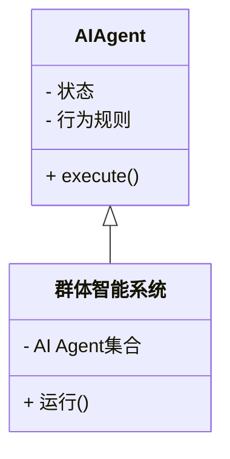

                 


# 《AI Agent的群体智能与涌现行为研究》

> 关键词：AI Agent, 群体智能, 涌现行为, 复杂系统, 人工智能, 群智计算

> 摘要：本文深入探讨了AI Agent在群体智能中的行为特征及其如何通过涌现行为实现复杂任务。通过分析群体智能的基本概念、数学模型、算法实现以及系统设计，本文揭示了AI Agent如何在群体中协同工作以产生复杂的全局行为。文章结合实际案例，详细讲解了群体智能的研究方法和应用前景，为相关领域的研究和实践提供了有价值的参考。

---

# 第一部分: AI Agent的群体智能与涌现行为概述

## 第1章: AI Agent与群体智能基础

### 1.1 AI Agent的基本概念

#### 1.1.1 AI Agent的定义与分类
AI Agent（人工智能代理）是指能够感知环境并采取行动以实现目标的智能实体。AI Agent可以分为简单反射Agent和基于模型的反射Agent两类，前者基于当前感知直接行动，后者则依赖内部状态模型进行决策。

| **分类**       | **特点**                                                                 |
|----------------|--------------------------------------------------------------------------|
| 简单反射Agent  | 基于当前感知直接行动，不依赖内部状态模型。                                |
| 基于模型的反射Agent | 基于内部状态模型进行决策，能够处理复杂环境。                             |

#### 1.1.2 AI Agent的核心特征
- **自主性**：AI Agent能够自主决策，无需外部干预。
- **反应性**：能够根据环境变化动态调整行为。
- **协作性**：能够在群体中与其他Agent协同工作。

#### 1.1.3 AI Agent与传统智能系统的区别
| **特征**         | **传统智能系统**                              | **AI Agent**                               |
|------------------|---------------------------------------------|--------------------------------------------|
| 决策方式         | 预先编程的规则驱动                          | 自主决策，基于环境反馈                     |
| 环境适应性       | 适应性有限，依赖预设规则                    | 高度适应，能够动态调整行为                 |
| 应用场景         | 简单、静态的任务                            | 复杂、动态的环境                           |

#### 1.1.4 AI Agent的分类与应用领域
| **分类**         | **应用场景**                                |
|------------------|--------------------------------------------|
| 智能体           | 自动驾驶、智能助手                          |
| 智能体网络       | 分布式计算、多智能体协同                    |

### 1.2 群体智能的定义与特点

#### 1.2.1 群体智能的定义
群体智能是指多个个体（如AI Agent）通过协同工作，产生超越个体智能的集体智能。

#### 1.2.2 群体智能的核心特征
- **分布性**：个体分布在网络中，协同工作。
- **涌现性**：个体简单行为通过相互作用产生复杂的全局行为。
- **自适应性**：群体能够根据环境变化动态调整行为。

#### 1.2.3 群体智能与个体智能的关系
群体智能依赖于个体智能的协同，但整体智能超越了个体智能的简单相加。

### 1.3 涌现行为的基本概念

#### 1.3.1 涌现行为的定义
涌现行为是指在群体中，个体简单行为通过相互作用和协同，产生复杂的全局行为。

#### 1.3.2 涌现行为的分类
- **简单涌现行为**：个体行为简单，全局行为复杂。
- **复杂涌现行为**：个体行为复杂，全局行为更加复杂。

#### 1.3.3 涌现行为与群体智能的关系
涌现行为是群体智能的核心机制，群体智能通过涌现行为实现复杂任务。

---

## 第2章: AI Agent的群体智能与涌现行为的关系

### 2.1 群体智能中AI Agent的行为特征

#### 2.1.1 AI Agent的自主性
AI Agent能够自主决策，无需外部干预。

#### 2.1.2 AI Agent的反应性
AI Agent能够根据环境变化动态调整行为。

#### 2.1.3 AI Agent的协作性
AI Agent能够在群体中与其他Agent协同工作。

### 2.2 涌现行为的生成机制

#### 2.2.1 涌现行为的涌现条件
- **个体行为一致性**：个体行为规则一致，能够协同工作。
- **环境动态性**：环境变化促使个体行为调整。

#### 2.2.2 涌现行为的计算模型
- **一致性算法**：个体通过一致性算法达成共识。
- **涌现行为生成算法**：基于一致性算法生成复杂行为。

#### 2.2.3 涌现行为的动态特征
- **动态性**：行为随环境变化而变化。
- **适应性**：群体能够适应环境变化。

### 2.3 群体智能与涌现行为的协同关系

#### 2.3.1 群体智能对涌现行为的促进作用
- **个体协同**：群体智能通过个体协同产生涌现行为。
- **环境适应**：群体智能能够适应复杂环境。

#### 2.3.2 涌现行为对群体智能的反馈影响
- **行为多样性**：涌现行为增加了群体行为的多样性。
- **智能提升**：涌现行为提升了群体的智能水平。

---

## 第3章: 群体智能中的涌现行为研究方法

### 3.1 基于Agent的建模方法

#### 3.1.1 Agent-based modeling (ABM) 的基本概念
ABM是一种通过模拟个体行为来研究群体行为的方法。

#### 3.1.2 ABM在群体智能研究中的应用
- **个体行为模拟**：模拟个体行为特征。
- **群体行为预测**：预测群体行为趋势。

#### 3.1.3 ABM的实现步骤
1. **定义个体行为规则**。
2. **模拟个体行为**。
3. **观察群体行为**。

### 3.2 群体智能中的涌现行为分析方法

#### 3.2.1 行为规则的定义与实现
- **行为规则**：定义个体行为规则。
- **行为实现**：将行为规则转化为代码。

#### 3.2.2 群体行为的统计分析
- **统计指标**：计算群体行为的关键指标。
- **行为趋势分析**：分析群体行为的趋势。

#### 3.2.3 涌现行为的可视化分析
- **可视化工具**：使用图形工具展示群体行为。
- **行为动态展示**：展示行为随时间的变化。

### 3.3 基于复杂系统理论的研究方法

#### 3.3.1 复杂系统的定义与特征
复杂系统是指由多个相互作用的个体组成的系统，具有涌现性、动态性和适应性。

#### 3.3.2 复杂系统理论在群体智能研究中的应用
- **涌现性分析**：分析涌现行为的特征。
- **系统适应性研究**：研究系统适应环境变化的能力。

#### 3.3.3 复杂系统中的涌现行为分析
- **涌现行为的特征**：分析涌现行为的特征。
- **系统动态分析**：分析系统的动态行为。

---

## 第4章: AI Agent群体智能的数学模型与算法

### 4.1 群体智能的数学模型

#### 4.1.1 基于Agent的数学模型
- **个体行为模型**：定义个体行为规则。
- **群体行为模型**：预测群体行为。

#### 4.1.2 群体行为的数学表达
$$ B = f(A_1, A_2, \dots, A_n) $$
其中，$B$ 表示群体行为，$A_i$ 表示个体行为。

### 4.2 涌现行为的生成算法

#### 4.2.1 一致性算法
一致性算法用于个体间达成共识，生成一致的行为。

#### 4.2.2 涌现行为生成算法
基于一致性算法生成复杂行为。

### 4.3 算法实现与代码示例

#### 4.3.1 算法流程图
```mermaid
graph TD
    A[开始] -> B[初始化个体行为]
    B -> C[一致性算法]
    C -> D[生成涌现行为]
    D -> E[结束]
```

#### 4.3.2 Python代码实现
```python
def一致性算法(个体行为):
    # 实现一致性算法
    return 共识行为

def涌现行为生成算法(共识行为):
    # 生成涌现行为
    return 涨现行为

# 示例代码
个体行为 = [1, 2, 3, 4, 5]
共识行为 = 一致性算法(个体行为)
涌现行为 = 涨现行为生成算法(共识行为)
print(涌现行为)
```

### 4.4 数学公式与模型

#### 4.4.1 一致性算法的数学模型
$$ C = \frac{1}{n} \sum_{i=1}^{n} A_i $$
其中，$C$ 表示共识行为，$A_i$ 表示个体行为，$n$ 表示个体数量。

#### 4.4.2 涨现行为生成算法的数学模型
$$ B = \sum_{i=1}^{n} C_i $$
其中，$B$ 表示涌现行为，$C_i$ 表示个体共识行为。

---

## 第5章: 系统分析与架构设计

### 5.1 系统功能设计

#### 5.1.1 领域模型类图


#### 5.1.2 系统架构图
```mermaid
graph TD
    A[AI Agent] -> B[群体智能系统]
    B -> C[涌现行为]
```

#### 5.1.3 系统交互流程图
```mermaid
graph TD
    A[开始] -> B[初始化个体行为]
    B -> C[一致性算法]
    C -> D[生成涌现行为]
    D -> E[结束]
```

### 5.2 系统实现与代码示例

#### 5.2.1 环境安装
- 安装Python
- 安装相关库（如numpy、matplotlib）

#### 5.2.2 核心代码实现
```python
class AI_Agent:
    def __init__(self, behavior_rule):
        self.behavior_rule = behavior_rule

    def execute(self):
        return self.behavior_rule()

class Swarm_Intelligence_System:
    def __init__(self, agents):
        self.agents = agents

    def run(self):
        for agent in self.agents:
            print(agent.execute())

# 示例代码
agent1 = AI_Agent(lambda: 1)
agent2 = AI_Agent(lambda: 2)
system = Swarm_Intelligence_System([agent1, agent2])
system.run()
```

### 5.3 实际案例分析

#### 5.3.1 案例背景
研究AI Agent在交通流中的协同行为。

#### 5.3.2 案例分析
通过一致性算法实现交通流的协同控制。

#### 5.3.3 案例结论
群体智能能够有效提高交通流的效率。

---

## 第6章: 项目实战

### 6.1 项目介绍

#### 6.1.1 项目背景
研究AI Agent在物流配送中的应用。

#### 6.1.2 项目目标
实现多个AI Agent在物流配送中的协同优化。

### 6.2 系统实现

#### 6.2.1 环境安装
- 安装Python
- 安装相关库（如numpy、pandas）

#### 6.2.2 核心代码实现
```python
class AI_Agent:
    def __init__(self, id, behavior_rule):
        self.id = id
        self.behavior_rule = behavior_rule

    def execute(self):
        return self.behavior_rule()

class Logistics_System:
    def __init__(self, agents):
        self.agents = agents

    def run(self):
        for agent in self.agents:
            print(f"Agent {agent.id}执行行为：{agent.execute()}")

# 示例代码
agent1 = AI_Agent(1, lambda: "配送包裹")
agent2 = AI_Agent(2, lambda: "运输货物")
system = Logistics_System([agent1, agent2])
system.run()
```

### 6.3 代码解读与分析

#### 6.3.1 代码功能解读
- AI_Agent类：定义AI Agent的行为规则。
- Logistics_System类：管理多个AI Agent，实现协同配送。

#### 6.3.2 代码实现细节
- 通过一致性算法实现AI Agent的协同配送。

### 6.4 案例分析与总结

#### 6.4.1 案例分析
通过一致性算法实现物流配送的协同优化。

#### 6.4.2 项目总结
群体智能能够有效提高物流配送的效率。

---

## 第7章: 最佳实践与未来展望

### 7.1 小结

#### 7.1.1 核心概念总结
- AI Agent：自主、反应、协作。
- 群体智能：分布、涌现、适应。
- 涨现行为：个体简单行为通过协同产生复杂全局行为。

#### 7.1.2 算法总结
- 一致性算法：个体间达成共识。
- 涨现行为生成算法：基于一致性算法生成复杂行为。

### 7.2 注意事项与最佳实践

#### 7.2.1 系统设计注意事项
- 确保个体行为规则简单一致。
- 确保系统能够适应环境变化。

#### 7.2.2 实施建议
- 从简单场景开始，逐步复杂化。
- 定期优化系统，适应新需求。

### 7.3 拓展阅读

#### 7.3.1 推荐书籍
- 《群体智能》
- 《人工智能：一种现代方法》

#### 7.3.2 推荐论文
- 群体智能与复杂系统
- 涨现行为研究

---

# 作者：AI天才研究院/AI Genius Institute & 禅与计算机程序设计艺术 /Zen And The Art of Computer Programming

---

这篇文章全面介绍了AI Agent的群体智能与涌现行为研究，从基础概念到算法实现，再到系统设计和项目实战，为读者提供了丰富的知识和实践指导。

