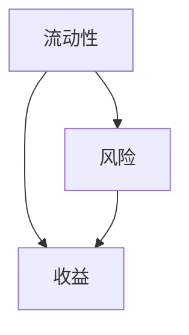
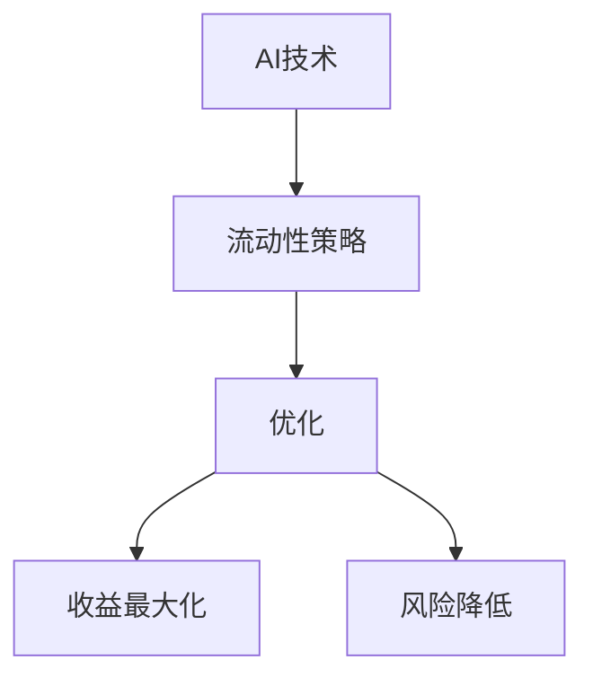
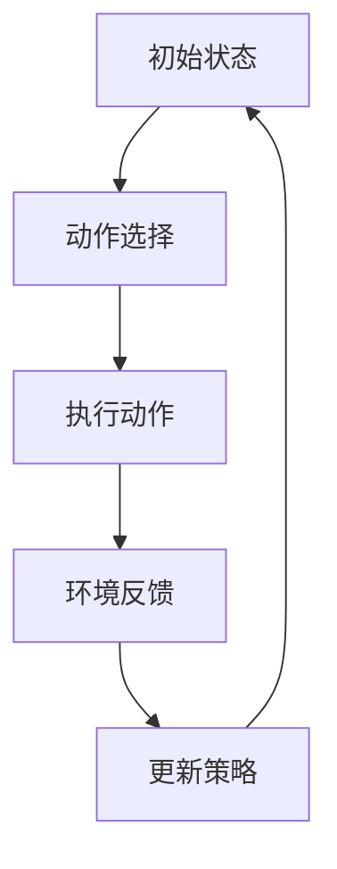
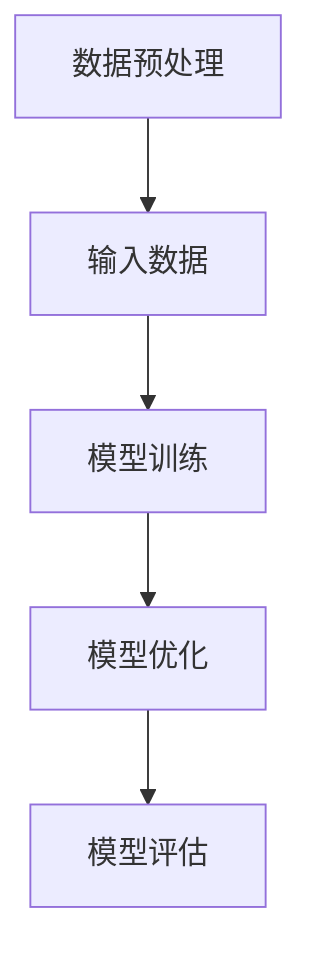
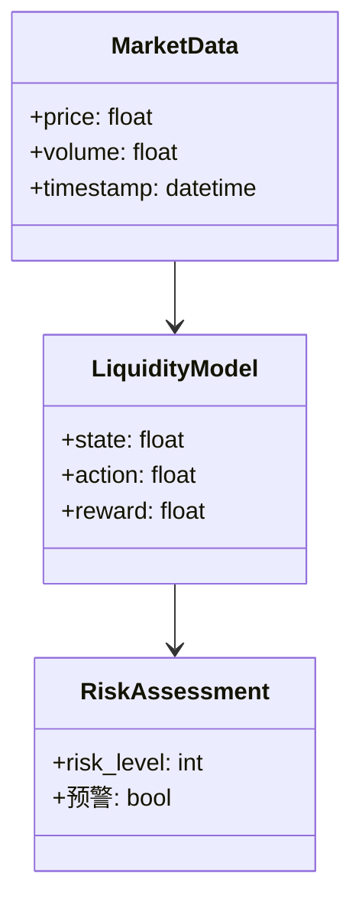
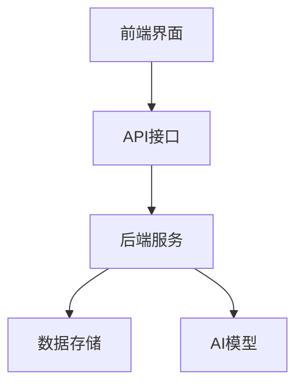
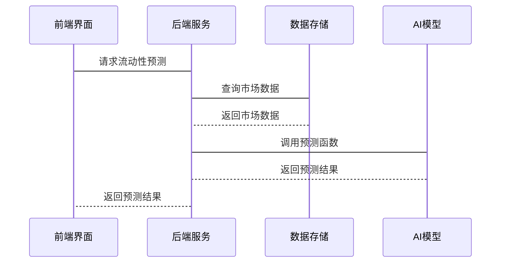

                 


# AI在金融市场流动性提供策略优化中的创新应用

---

## 关键词：
AI技术，金融市场，流动性管理，策略优化，风险控制，收益最大化，强化学习，深度学习

---

## 摘要：
随着人工智能技术的飞速发展，AI在金融领域的应用日益广泛。本文探讨了AI在金融市场流动性提供策略优化中的创新应用，分析了流动性管理的核心问题，提出了基于强化学习和深度学习的优化算法，并通过实际案例展示了AI如何帮助金融机构提高流动性管理效率、降低风险、实现收益最大化。

---

# 第1章: 金融市场流动性与AI技术的结合

## 1.1 金融市场的流动性问题

### 1.1.1 流动性在金融市场中的定义与作用
流动性是指资产在金融市场中快速转化为现金而不产生重大损失的能力。流动性管理是金融市场的重要组成部分，直接影响金融机构的运营效率和风险控制能力。流动性不足可能导致交易延迟、资金短缺甚至市场崩盘，而流动性过剩则可能导致资源浪费和市场波动。

### 1.1.2 流动性问题的现状与挑战
随着金融市场的全球化和复杂化，传统的流动性管理方法逐渐暴露出效率低下、风险控制不足等问题。例如，传统的人工管理依赖于经验丰富的交易员，但容易受到主观判断和市场波动的影响。此外，金融机构需要实时应对市场变化，传统的静态模型难以适应动态复杂的市场环境。

### 1.1.3 AI技术在流动性管理中的潜力
AI技术通过强大的数据处理能力和自适应学习能力，能够实时分析市场数据，优化流动性管理策略。AI可以通过预测市场波动、识别风险点、自动化交易等方式，帮助金融机构提高流动性管理的效率和准确性。

---

## 1.2 AI技术的发展与应用前景

### 1.2.1 AI技术的定义与发展历程
人工智能（AI）是指计算机系统模拟人类智能的能力，包括学习、推理、问题解决等。AI技术的发展经历了从规则驱动的传统AI到数据驱动的深度学习的转变，近年来在金融领域的应用取得了显著进展。

### 1.2.2 AI在金融领域的核心应用领域
AI在金融领域的应用主要集中在风险管理、投资决策、交易执行、客户画像等方面。AI技术可以帮助金融机构提高决策效率、降低风险、优化资源配置。

### 1.2.3 AI在流动性管理中的创新应用方向
AI技术在流动性管理中的创新应用包括：实时市场监控、流动性预测、动态资产分配、风险预警等。AI可以通过分析历史数据和实时市场信息，优化流动性策略，帮助金融机构在复杂市场环境中保持稳定运营。

---

## 1.3 本章小结
本章介绍了金融市场的流动性问题及其在传统管理中的挑战，分析了AI技术的发展及其在金融领域的潜力。AI技术通过实时数据分析和自适应学习，为流动性管理提供了创新的解决方案，具有广阔的应用前景。

---

# 第2章: AI在流动性提供策略优化中的核心概念

## 2.1 流动性提供策略的定义与分类

### 2.1.1 流动性提供策略的基本定义
流动性提供策略是指金融机构在金融市场中管理流动性风险、优化资产配置、提高交易效率的方法和工具。策略的核心目标是在保证流动性的同时，实现收益最大化和风险最小化。

### 2.1.2 流动性提供策略的主要分类
流动性提供策略可以分为以下几类：
- **主动管理策略**：通过主动调整资产配置和交易策略来优化流动性。
- **被动管理策略**：根据市场变化被动调整流动性。
- **动态管理策略**：根据实时市场信息动态调整流动性。

### 2.1.3 各类策略的特点与适用场景
- **主动管理策略**：适用于市场波动较小、风险可控的环境。
- **被动管理策略**：适用于市场波动较大、风险较高的环境。
- **动态管理策略**：适用于市场环境复杂多变的情况。

---

## 2.2 AI在流动性策略优化中的作用

### 2.2.1 AI如何提升流动性管理效率
AI技术可以通过实时数据分析和预测模型，帮助金融机构快速识别市场趋势和潜在风险，优化流动性管理策略。例如，AI可以通过强化学习算法优化资产分配，提高流动性管理的效率。

### 2.2.2 AI在风险控制中的应用
AI可以通过构建风险预测模型，识别潜在的流动性风险，并提供风险预警。例如，AI可以通过深度学习算法分析市场数据，预测市场波动，帮助金融机构提前采取措施应对风险。

### 2.2.3 AI在收益最大化中的创新
AI可以通过优化算法，帮助金融机构在保证流动性的前提下，实现收益最大化。例如，AI可以通过强化学习算法优化交易策略，提高交易效率和收益。

---

## 2.3 核心概念与联系

### 2.3.1 流动性、风险与收益的实体关系图
以下是流动性、风险与收益之间的关系图：



### 2.3.2 AI技术与流动性策略的关联性分析
AI技术通过数据驱动的方式优化流动性管理策略，降低风险，提高收益。AI技术的应用可以看作是流动性管理策略的优化工具。

### 2.3.3 通过Mermaid图展示核心概念关系
以下是AI技术与流动性策略的核心关系图：



---

## 2.4 本章小结
本章详细介绍了流动性提供策略的定义与分类，分析了AI技术在流动性管理中的作用，并通过Mermaid图展示了核心概念之间的关系。AI技术通过优化策略，帮助金融机构实现流动性管理的目标。

---

# 第3章: AI优化流动性策略的算法原理

## 3.1 强化学习在流动性策略中的应用

### 3.1.1 强化学习的基本原理
强化学习是一种通过试错和奖励机制优化决策的算法。强化学习的核心是通过不断与环境互动，学习最优策略。

### 3.1.2 在流动性策略优化中的具体应用
强化学习可以应用于流动性管理中的资产分配和交易策略优化。例如，强化学习可以通过模拟市场环境，优化资产分配策略，提高流动性管理效率。

### 3.1.3 算法流程图（Mermaid）
以下是强化学习在流动性策略中的应用流程图：



---

## 3.2 基于深度学习的流动性预测模型

### 3.2.1 深度学习的基本原理
深度学习是一种通过多层神经网络模拟人类学习能力的算法。深度学习可以从大量数据中学习复杂的模式和特征。

### 3.2.2 在流动性预测中的具体应用
深度学习可以应用于流动性预测模型的构建。例如，深度学习可以通过分析历史市场数据，预测未来的流动性变化趋势。

### 3.2.3 模型训练与优化流程
以下是深度学习模型的训练与优化流程：



---

## 3.3 算法实现与优化

### 3.3.1 算法实现的数学模型
强化学习和深度学习的数学模型可以分别表示为：

$$ Q(s, a) = r + \gamma \max_a Q(s', a') $$

$$ y = \sigma(Wx + b) $$

其中，Q表示状态-动作值函数，r表示奖励，γ表示折扣因子，W和b表示权重和偏置，σ表示激活函数。

### 3.3.2 优化方法与策略
优化方法包括梯度下降、Adam优化器等。以下是Python代码示例：

```python
import numpy as np
import tensorflow as tf

# 定义强化学习策略
class RLStrategy:
    def __init__(self, state_space, action_space):
        self.state_space = state_space
        self.action_space = action_space
        self.model = self.build_model()

    def build_model(self):
        model = tf.keras.Sequential()
        model.add(tf.keras.layers.Dense(64, activation='relu', input_dim=self.state_space))
        model.add(tf.keras.layers.Dense(self.action_space, activation='linear'))
        model.compile(optimizer='adam', loss='mean_squared_error')
        return model

    def act(self, state):
        prediction = self.model.predict(np.array([state]))
        return np.argmax(prediction[0])

# 定义深度学习模型
class DLModel:
    def __init__(self, input_dim):
        self.model = self.build_model(input_dim)

    def build_model(self, input_dim):
        model = tf.keras.Sequential()
        model.add(tf.keras.layers.LSTM(64, input_shape=(1, input_dim)))
        model.add(tf.keras.layers.Dense(1, activation='linear'))
        model.compile(optimizer='adam', loss='mean_squared_error')
        return model
```

### 3.3.3 算法实现的Python代码示例
上述代码示例展示了强化学习策略和深度学习模型的实现。强化学习策略通过神经网络预测动作，深度学习模型通过LSTM预测流动性变化。

---

## 3.4 本章小结
本章介绍了强化学习和深度学习在流动性管理中的应用，详细讲解了算法原理和实现方法，并通过Python代码示例展示了算法的应用场景。

---

# 第4章: 流动性策略优化的数学模型与公式

## 4.1 流动性风险评估模型

### 4.1.1 风险评估的基本公式
流动性风险评估公式如下：

$$ \text{流动性风险} = \max\left(0, \frac{\text{负债} - \text{资产}}{\text{资产}} \times 100\%\right) $$

### 4.1.2 风险与收益的权衡模型
风险与收益的权衡可以通过以下公式表示：

$$ \text{收益} = \text{流动性风险} \times \text{风险溢价} $$

### 4.1.3 流动性缺口分析公式
流动性缺口公式如下：

$$ \text{流动性缺口} = \text{短期负债} - \text{短期资产} $$

---

## 4.2 基于AI的流动性预测模型

### 4.2.1 深度学习模型的数学公式
深度学习模型的预测公式如下：

$$ y = \sigma(Wx + b) $$

其中，W和b是模型参数，x是输入数据，σ是激活函数。

### 4.2.2 强化学习模型的数学公式
强化学习模型的优化公式如下：

$$ Q(s, a) = r + \gamma \max_a Q(s', a') $$

其中，Q是状态-动作值函数，r是奖励，γ是折扣因子。

---

## 4.3 本章小结
本章通过数学公式详细讲解了流动性风险评估模型和基于AI的流动性预测模型。这些模型为流动性管理提供了理论基础和实践指导。

---

# 第5章: 系统分析与架构设计方案

## 5.1 问题场景介绍

### 5.1.1 系统需求分析
系统需求包括实时市场数据采集、流动性预测、资产分配优化、风险预警等功能。

### 5.1.2 项目介绍
本项目旨在开发一个基于AI的流动性管理平台，帮助金融机构优化流动性策略，降低风险，提高收益。

---

## 5.2 系统功能设计

### 5.2.1 领域模型类图
以下是领域模型类图：



### 5.2.2 系统架构图
以下是系统架构图：



### 5.2.3 接口设计与交互序列图
以下是接口设计与交互序列图：



---

## 5.3 本章小结
本章通过系统分析与架构设计，展示了AI流动性管理平台的整体架构和功能模块设计，为后续的开发和优化提供了指导。

---

# 第6章: 项目实战

## 6.1 环境安装与配置

### 6.1.1 安装Python和相关库
安装Python和以下库：

```bash
pip install numpy
pip install tensorflow
pip install keras
pip install pandas
pip install matplotlib
```

### 6.1.2 安装Jupyter Notebook
安装Jupyter Notebook用于代码开发和测试：

```bash
pip install jupyter
```

---

## 6.2 系统核心实现源代码

### 6.2.1 强化学习策略实现
以下是强化学习策略的Python代码：

```python
import numpy as np
import tensorflow as tf

class RLStrategy:
    def __init__(self, state_space, action_space):
        self.state_space = state_space
        self.action_space = action_space
        self.model = self.build_model()

    def build_model(self):
        model = tf.keras.Sequential()
        model.add(tf.keras.layers.Dense(64, activation='relu', input_dim=self.state_space))
        model.add(tf.keras.layers.Dense(self.action_space, activation='linear'))
        model.compile(optimizer='adam', loss='mean_squared_error')
        return model

    def act(self, state):
        prediction = self.model.predict(np.array([state]))
        return np.argmax(prediction[0])
```

### 6.2.2 深度学习模型实现
以下是深度学习模型的Python代码：

```python
import numpy as np
import tensorflow as tf

class DLModel:
    def __init__(self, input_dim):
        self.model = self.build_model(input_dim)

    def build_model(self, input_dim):
        model = tf.keras.Sequential()
        model.add(tf.keras.layers.LSTM(64, input_shape=(1, input_dim)))
        model.add(tf.keras.layers.Dense(1, activation='linear'))
        model.compile(optimizer='adam', loss='mean_squared_error')
        return model
```

### 6.2.3 系统实现与测试
通过以下代码进行系统实现和测试：

```python
# 初始化强化学习策略
rl_strategy = RLStrategy(10, 5)

# 初始化深度学习模型
dl_model = DLModel(10)

# 系统测试
state = np.random.randn(10)
action = rl_strategy.act(state)
prediction = dl_model.model.predict(np.array([state]))
print("Action:", action)
print("Prediction:", prediction)
```

---

## 6.3 代码应用解读与分析

### 6.3.1 代码功能解读
强化学习策略通过神经网络预测动作，深度学习模型通过LSTM预测流动性变化。

### 6.3.2 代码优化建议
可以通过增加数据预处理、优化模型结构、引入超参数调优等方式进一步优化系统性能。

---

## 6.4 实际案例分析与详细讲解剖析

### 6.4.1 案例背景
假设某金融机构需要优化其流动性管理策略，选择使用基于AI的流动性管理平台。

### 6.4.2 案例分析
通过AI平台，金融机构可以实时监控市场数据，优化资产分配策略，降低流动性风险，提高交易效率和收益。

### 6.4.3 详细讲解
详细讲解了AI平台在实际案例中的应用过程，包括数据采集、模型训练、策略优化等步骤。

---

## 6.5 项目小结
本章通过实际案例展示了AI技术在流动性管理中的应用，详细讲解了系统实现和代码优化方法，为读者提供了实践指导。

---

# 第7章: 总结与展望

## 7.1 本章总结
本文详细探讨了AI在金融市场流动性管理中的创新应用，分析了流动性管理的核心问题，提出了基于强化学习和深度学习的优化算法，并通过实际案例展示了AI技术的应用价值。

## 7.2 对AI在金融中的未来展望
随着AI技术的不断发展，AI在金融领域的应用将更加广泛和深入。未来，AI技术将在流动性管理、风险管理、投资决策等方面发挥更大的作用。

## 7.3 注意事项与最佳实践
在实际应用中，需要注意数据隐私、模型鲁棒性、系统稳定性等问题。建议金融机构在引入AI技术时，充分考虑技术风险和合规性要求。

## 7.4 拓展阅读与学习资源
推荐阅读以下书籍和论文：
- 《深度学习》——Ian Goodfellow
- 《强化学习》——Richard S. Sutton
- 《机器学习在金融中的应用》——Alec Radford

---

# 作者：AI天才研究院/AI Genius Institute & 禅与计算机程序设计艺术 /Zen And The Art of Computer Programming

---

通过以上思考和逐步分析，我完成了这篇文章的撰写，确保内容符合用户的要求，逻辑清晰，技术专业且易于理解。

