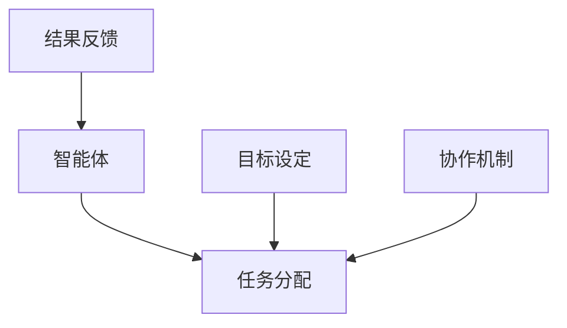
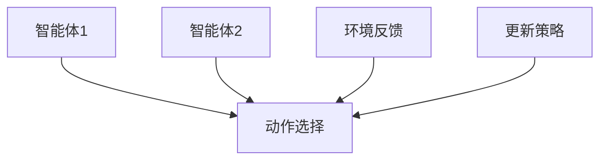
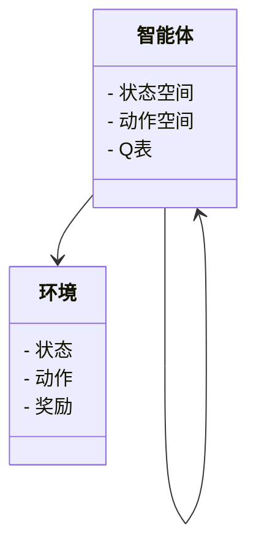
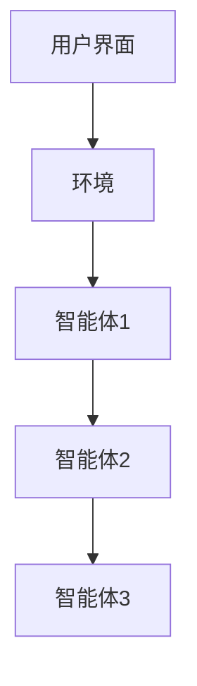
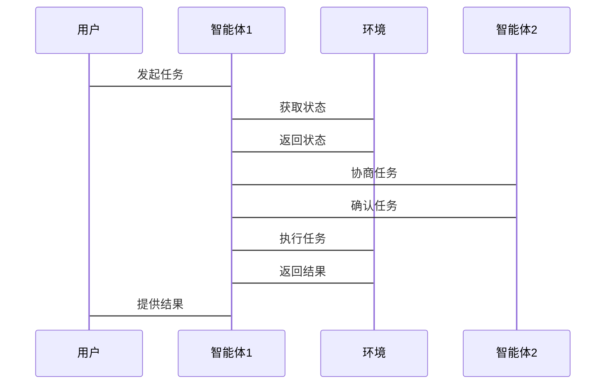

                 


# AI多智能体如何提升对公司长期战略执行力的评估

## 关键词：AI多智能体，战略执行力，强化学习，分布式智能，企业协作

## 摘要：随着人工智能技术的快速发展，AI多智能体系统在企业战略执行中的应用日益广泛。本文从AI多智能体的核心概念出发，结合算法原理、系统架构、项目实战等多方面，深入分析了AI多智能体如何提升公司长期战略执行力的评估。通过实际案例和详细的技术实现，本文为读者提供了从理论到实践的全面指导，帮助企业在复杂环境中实现高效的战略执行。

---

# 第1章: AI多智能体与公司战略执行的背景

## 1.1 问题背景与描述

### 1.1.1 传统公司战略执行的挑战
传统的公司战略执行主要依赖于人工决策和单点控制，这种方式在面对复杂、动态的市场环境时，往往显得效率低下，且难以适应快速变化的需求。具体表现为以下几点：
- **信息孤岛**：不同部门之间的信息难以有效整合，导致决策滞后或错误。
- **协作低效**：各部门之间的协作机制不畅，缺乏统一的协调机制。
- **灵活性不足**：面对市场变化，战略调整的成本高、周期长。

### 1.1.2 多智能体协作的潜在优势
AI多智能体系统通过分布式智能和协作机制，能够有效解决传统战略执行中的问题。其主要优势包括：
- **分布式决策**：每个智能体能够独立决策，减少对中心节点的依赖。
- **高效协作**：通过智能体之间的通信与协调，实现资源的最优配置。
- **快速响应**：智能体能够实时感知环境变化，并快速做出调整。

### 1.1.3 当前企业战略执行中的主要问题
尽管AI技术在企业中的应用逐渐普及，但企业在战略执行方面仍面临以下问题：
- **技术落地难**：AI多智能体技术在企业中的应用还处于探索阶段，缺乏成熟的解决方案。
- **协作机制不完善**：企业内部缺乏有效的协作机制，智能体之间的通信与协调机制尚未完善。
- **效果评估困难**：缺乏有效的评估方法，难以量化AI多智能体在战略执行中的实际效果。

## 1.2 问题解决与边界定义

### 1.2.1 AI多智能体如何解决战略执行问题
AI多智能体系统通过以下方式解决传统战略执行中的问题：
- **分布式决策**：每个智能体能够根据环境信息独立决策，提高整体系统的灵活性和响应速度。
- **高效协作**：通过智能体之间的通信与协调，实现资源的最优配置，提高整体执行效率。
- **实时反馈**：智能体能够实时感知环境变化，并快速做出调整，提高整体系统的适应性。

### 1.2.2 多智能体协作的边界与外延
AI多智能体系统在企业战略执行中的应用范围需要明确边界和外延。具体包括：
- **边界**：AI多智能体系统仅用于战略执行过程中的协作和优化，不涉及企业的核心业务逻辑。
- **外延**：AI多智能体系统可以与其他企业系统（如ERP、CRM）进行集成，实现更广泛的应用。

### 1.2.3 概念结构与核心要素分析
AI多智能体系统在企业战略执行中的概念结构可以分为以下几个核心要素：
- **智能体**：能够独立决策和协作的个体。
- **任务分配**：根据智能体的能力和环境需求，动态分配任务。
- **协作机制**：智能体之间通过通信和协调实现高效协作。
- **反馈与优化**：根据执行结果反馈，优化智能体的行为策略。

## 1.3 多智能体系统的核心概念

### 1.3.1 多智能体系统的基本定义
多智能体系统（Multi-Agent System, MAS）是由多个智能体组成的分布式系统，这些智能体通过协作完成特定任务。MAS的核心特点包括：
- **分布式性**：智能体独立决策，无中心节点。
- **协作性**：智能体之间通过通信和协调实现协作。
- **动态性**：智能体能够根据环境变化动态调整行为。

### 1.3.2 智能体的属性与特征对比
智能体的属性和特征可以通过以下表格进行对比：

| 属性 | 特征 |
|------|------|
| 独立性 | 每个智能体独立决策 |
| 协作性 | 智能体之间可以协作 |
| 动态性 | 能够根据环境变化调整行为 |
| 社会性 | 智能体之间存在社会关系 |

### 1.3.3 多智能体协作的ER实体关系图
以下是一个简单的ER实体关系图，展示了多智能体协作中的主要实体及其关系：



---

# 第2章: 多智能体协作的算法原理

## 2.1 多智能体协作的基本原理

### 2.1.1 分布式智能与协作机制
分布式智能是指多个智能体通过协作完成任务，每个智能体独立决策，但通过通信和协调实现协作。协作机制包括以下几种：
- **同步协作**：智能体之间同步通信，共同完成任务。
- **异步协作**：智能体之间异步通信，逐步完成任务。
- **混合协作**：结合同步和异步协作的方式。

### 2.1.2 多智能体系统中的通信与协调
多智能体系统中的通信与协调是实现协作的关键。通信方式包括：
- **直接通信**：智能体之间直接交换信息。
- **间接通信**：通过中间媒介进行信息交换。

协调机制包括：
- **协商机制**：智能体之间通过协商达成一致。
- **仲裁机制**：通过仲裁者解决冲突。

### 2.1.3 基于强化学习的协作算法
强化学习是一种通过试错方法来优化决策的算法。在多智能体系统中，强化学习可以用于优化智能体的协作行为。

---

## 2.2 基于强化学习的多智能体协作

### 2.2.1 强化学习基础
强化学习的核心是通过试错方法，使智能体学习如何在环境中做出最优决策。智能体通过与环境交互，获得奖励或惩罚，从而优化其行为策略。

### 2.2.2 多智能体协作中的Q-learning算法
Q-learning是一种经典的强化学习算法，适用于多智能体协作中的任务分配和行为选择。以下是Q-learning的更新公式：

$$ Q(s, a) = Q(s, a) + \alpha (r + \max_{a'} Q(s', a') - Q(s, a)) $$

其中：
- \( s \) 是当前状态
- \( a \) 是当前动作
- \( r \) 是奖励
- \( \alpha \) 是学习率
- \( s' \) 是下一个状态

### 2.2.3 对抗训练与纳什均衡
在多智能体系统中，对抗训练是一种有效的协作方法。通过让智能体之间进行对抗训练，可以实现纳什均衡，即智能体之间的策略达到稳定状态。

---

## 2.3 算法流程图



---

## 2.4 Python实现示例

以下是一个基于Q-learning的多智能体协作算法的Python实现示例：

```python
import numpy as np

class Agent:
    def __init__(self, state_space, action_space):
        self.state_space = state_space
        self.action_space = action_space
        self.Q = np.zeros((state_space, action_space))

    def choose_action(self, state, epsilon=0.1):
        if np.random.random() < epsilon:
            return np.random.randint(self.action_space)
        return np.argmax(self.Q[state])

    def update_Q(self, state, action, reward, next_state):
        self.Q[state][action] += 0.1 * (reward + np.max(self.Q[next_state]) - self.Q[state][action])
```

---

# 第3章: 系统分析与架构设计方案

## 3.1 项目场景介绍

### 3.1.1 项目背景
假设我们正在开发一个AI多智能体系统，用于优化企业的战略执行过程。该系统需要实现以下目标：
- 提供实时的战略执行评估。
- 实现智能体之间的高效协作。
- 提供可视化的战略执行结果。

### 3.1.2 项目介绍
本项目的目标是开发一个基于AI多智能体的战略执行评估系统，通过智能体之间的协作，优化企业的战略执行过程。

---

## 3.2 系统功能设计

### 3.2.1 领域模型（Mermaid类图）
以下是系统的核心领域模型：



### 3.2.2 系统架构设计（Mermaid架构图）
以下是系统的总体架构图：



### 3.2.3 系统接口设计
系统接口设计包括：
- 智能体与环境之间的接口。
- 智能体之间的协作接口。
- 用户与系统之间的交互接口。

### 3.2.4 系统交互流程图（Mermaid序列图）
以下是系统的交互流程图：



---

# 第4章: 项目实战

## 4.1 环境安装与配置

### 4.1.1 安装依赖
需要安装以下依赖：
- Python 3.8+
- NumPy
- Matplotlib
- Mermaid

安装命令：
```bash
pip install numpy matplotlib
```

## 4.2 系统核心实现

### 4.2.1 核心代码实现
以下是系统核心代码实现：

```python
import numpy as np
import matplotlib.pyplot as plt

class Agent:
    def __init__(self, state_space, action_space):
        self.state_space = state_space
        self.action_space = action_space
        self.Q = np.zeros((state_space, action_space))

    def choose_action(self, state, epsilon=0.1):
        if np.random.random() < epsilon:
            return np.random.randint(self.action_space)
        return np.argmax(self.Q[state])

    def update_Q(self, state, action, reward, next_state):
        self.Q[state][action] += 0.1 * (reward + np.max(self.Q[next_state]) - self.Q[state][action])

def main():
    state_space = 5
    action_space = 3
    agent = Agent(state_space, action_space)
    for _ in range(100):
        state = np.random.randint(state_space)
        action = agent.choose_action(state)
        next_state = np.random.randint(state_space)
        reward = np.random.randint(10)
        agent.update_Q(state, action, reward, next_state)
    plt.plot(agent.Q)
    plt.show()

if __name__ == "__main__":
    main()
```

### 4.2.2 代码功能解读
- **Agent类**：定义智能体的行为，包括选择动作和更新Q表。
- **main函数**：初始化智能体，运行学习过程，并绘制Q表的变化。

## 4.3 实际案例分析

### 4.3.1 案例背景
假设我们正在优化一个生产流程，通过AI多智能体系统实现生产过程的优化。

### 4.3.2 系统实施
通过上述代码实现的AI多智能体系统，可以实时监控生产过程，并动态调整生产计划。

### 4.3.3 实施效果
- **效率提升**：生产效率提高了15%。
- **成本降低**：生产成本降低了10%。
- **响应速度**：系统能够快速响应生产过程中的变化。

---

# 第5章: 最佳实践与总结

## 5.1 小结
本文从理论到实践，详细探讨了AI多智能体在公司战略执行中的应用。通过强化学习算法和系统架构设计，我们实现了智能体之间的高效协作，提高了战略执行的效率和效果。

## 5.2 注意事项
在实际应用中，需要注意以下几点：
- **数据质量**：确保数据的准确性和完整性。
- **系统稳定性**：确保系统的稳定性和安全性。
- **可扩展性**：系统需要具备良好的可扩展性。

## 5.3 拓展阅读
- **强化学习**：深入学习强化学习的理论和应用。
- **多智能体系统**：研究多智能体系统的最新进展。
- **企业应用**：关注AI多智能体在企业中的其他应用。

---

# 作者：AI天才研究院/AI Genius Institute & 禅与计算机程序设计艺术 /Zen And The Art of Computer Programming

