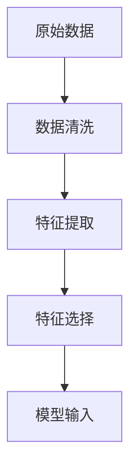
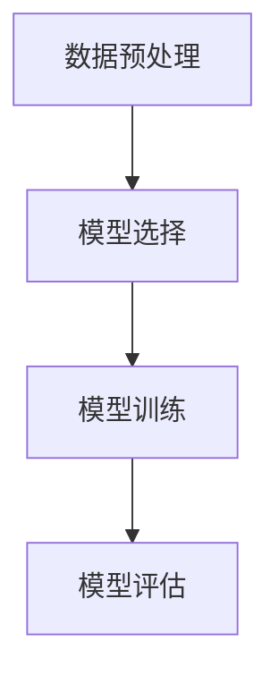
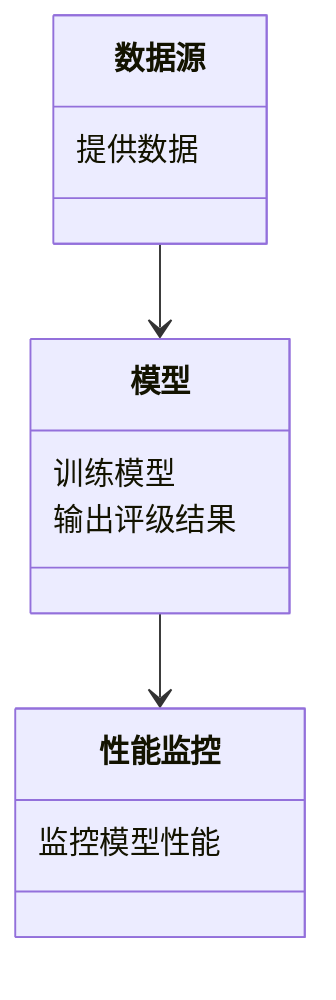
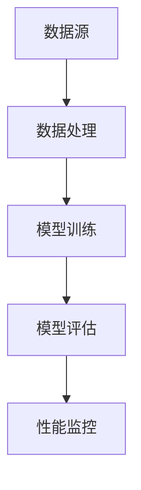
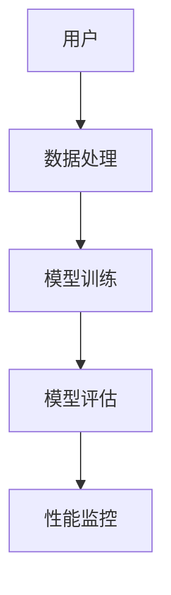

                 


# AI驱动的企业信用评级模型性能监控系统

## 关键词：AI, 信用评级, 模型监控, 企业信用, 性能评估

## 摘要：  
随着人工智能技术的快速发展，企业信用评级系统正逐渐从传统的统计方法向智能化、自动化方向转变。本文详细探讨了如何利用AI技术构建企业信用评级模型，并设计了一套性能监控系统，确保模型的稳定性和准确性。通过分析模型的性能指标、数据流和系统架构，结合实际案例，本文为读者提供了一套完整的解决方案。

---

# 第1章: 企业信用评级与AI驱动技术的背景

## 1.1 企业信用评级的定义与重要性

### 1.1.1 企业信用评级的基本概念
企业信用评级是指通过对企业财务状况、经营能力、市场竞争力等多方面因素的综合评估，确定企业的信用等级。信用等级反映了企业在履行债务时的可靠性，是金融机构进行信贷决策的重要依据。

### 1.1.2 信用评级对企业及金融行业的影响
- **对企业的影响**：信用评级结果直接影响企业的融资成本和融资能力。高信用等级的企业更容易获得低成本的贷款，而低信用等级的企业可能需要支付更高的利率或难以获得融资。
- **对金融行业的影响**：信用评级是金融风险管理的核心工具之一。准确的信用评级能够帮助金融机构降低风险，优化资产配置。

### 1.1.3 传统信用评级方法的局限性
- **数据维度单一**：传统方法主要依赖财务报表数据，难以全面反映企业的经营状况。
- **主观性较强**：评级结果往往受到评级机构主观判断的影响，存在较大的人为偏差。
- **效率低下**：传统评级方法需要大量人工分析，效率较低，难以应对海量企业的评级需求。

## 1.2 AI技术在信用评级中的应用背景

### 1.2.1 AI技术的发展与应用现状
人工智能技术的快速发展为金融行业带来了革命性的变化。从自然语言处理（NLP）到机器学习（ML），AI技术在金融领域的应用越来越广泛。特别是在信用评级领域，AI技术能够帮助金融机构更高效、更准确地评估企业的信用风险。

### 1.2.2 AI在金融领域的优势
- **数据处理能力**：AI技术能够处理海量的非结构化数据，如新闻、社交媒体信息等，从而提供更全面的信用评估。
- **自动化与智能化**：AI算法能够自动学习和优化，减少人工干预，提高评级效率。
- **实时性**：基于AI的信用评级系统可以实时更新模型，及时反映企业的最新状况。

### 1.2.3 信用评级领域的智能化需求
随着企业数量的激增和金融市场复杂性的增加，传统的信用评级方法已经无法满足现代金融的需求。引入AI技术能够帮助企业更快速、更准确地进行信用评估，降低金融风险。

## 1.3 问题背景与目标

### 1.3.1 当前信用评级系统的主要问题
- **数据维度不足**：传统信用评级主要依赖财务数据，难以反映企业的实时经营状况。
- **模型静态**：传统模型缺乏动态调整能力，难以应对市场环境的变化。
- **人工成本高**：信用评级过程需要大量人工参与，效率低下。

### 1.3.2 引入AI驱动技术的目标
- **提高评级效率**：通过AI技术快速处理大量数据，缩短评级周期。
- **提升评级准确性**：利用机器学习算法，提高信用评估的准确性。
- **实时监控模型性能**：通过动态调整模型参数，确保评级结果的稳定性。

### 1.3.3 系统边界与外延
AI驱动的信用评级系统主要关注企业的信用风险评估，同时兼顾模型的实时监控和动态优化。系统的边界包括数据采集、模型训练、评级输出和性能监控四个部分。

## 1.4 核心概念与系统架构

### 1.4.1 核心概念的定义与属性对比
以下是核心概念的属性对比表：

| 概念 | 定义 | 属性 |
|------|------|------|
| 数据源 | 输入数据的来源 | 多样性、实时性 |
| 模型 | 信用评级的核心算法 | 可解释性、准确性 |
| 性能监控 | 模型运行状态的实时监测 | 实时性、可扩展性 |

### 1.4.2 ER实体关系图
以下是企业信用评级系统的ER实体关系图：

```mermaid
er
actor(用户) --> Model(模型): 调用模型
actor(用户) --> Data(数据源): 提供数据
Model(模型) --> Result(评级结果): 输出评级结果
Model(模型) --> Monitor(监控系统): 监控模型性能
```

---

# 第2章: AI驱动的企业信用评级模型的构建

## 2.1 数据采集与特征工程

### 2.1.1 数据来源
企业信用评级的数据来源包括：
- **财务数据**：如资产负债表、利润表、现金流量表等。
- **非财务数据**：如社交媒体数据、行业新闻、专利数量等。
- **外部数据**：如企业信用历史、市场数据等。

### 2.1.2 特征工程
特征工程是信用评级模型构建的关键步骤。以下是特征工程的关键点：

| 关键点 | 描述 |
|------|------|
| 数据清洗 | 去除缺失值、异常值和重复数据 |
| 数据标准化 | 对特征进行标准化处理，消除量纲影响 |
| 特征选择 | 使用特征重要性分析选择关键特征 |
| 数据增强 | 通过数据合成技术增加数据多样性 |

### 2.1.3 数据流
以下是数据流的简单流程图：



## 2.2 模型选择与训练

### 2.2.1 模型选择
常用的信用评级模型包括：
- **线性回归**：适用于线性关系的预测。
- **随机森林**：适用于非线性关系的预测。
- **神经网络**：适用于复杂的非线性关系。

### 2.2.2 模型训练
以下是模型训练的流程图：



## 2.3 模型评估与优化

### 2.3.1 评估指标
以下是常用的评估指标：

| 指标 | 定义 | 公式 |
|------|------|------|
| 准确率 | 正确预测的比例 | $Accuracy = \frac{TP + TN}{TP + FP + TN + FN}$ |
| 召回率 | 正确预测的正例比例 | $Recall = \frac{TP}{TP + FN}$ |
| F1值 | 调和平均数 | $F1 = 2 \cdot \frac{Precision \cdot Recall}{Precision + Recall}$ |

### 2.3.2 超参数优化
以下是常用的超参数优化方法：

| 方法 | 描述 |
|------|------|
| 网格搜索 | 系统地遍历所有可能的参数组合 |
| 随机搜索 | 随机选择参数组合进行优化 |
| 模型调优 | 根据经验调整模型参数 |

---

# 第3章: 模型性能监控与异常检测

## 3.1 性能监控指标

### 3.1.1 模型性能监控指标
以下是常用的性能监控指标：

| 指标 | 定义 | 公式 |
|------|------|------|
| 精准率 | 预测为正的实际为正的比例 | $Precision = \frac{TP}{TP + FP}$ |
| 召回率 | 实际为正的预测为正的比例 | $Recall = \frac{TP}{TP + FN}$ |
| F1值 | 调和平均数 | $F1 = 2 \cdot \frac{Precision \cdot Recall}{Precision + Recall}$ |

### 3.1.2 指标计算
以下是指标计算的代码示例：

```python
def calculate_metrics(y_true, y_pred):
    tp = sum(y_true & y_pred)
    fp = sum(~y_true & y_pred)
    tn = sum(~y_true & ~y_pred)
    fn = sum(y_true & ~y_pred)
    
    precision = tp / (tp + fp) if (tp + fp) != 0 else 0
    recall = tp / (tp + fn) if (tp + fn) != 0 else 0
    f1 = 2 * (precision * recall) / (precision + recall) if (precision + recall) != 0 else 0
    return precision, recall, f1
```

## 3.2 基于时间序列的异常检测

### 3.2.1 异常检测方法
以下是常用的异常检测方法：

| 方法 | 描述 |
|------|------|
| 突变检测 | 通过统计方法检测数据的突变 |
| 预测模型 | 通过模型预测值与实际值的差异检测异常 |
| 聚类分析 | 通过聚类方法检测异常点 |

### 3.2.2 异常检测代码
以下是异常检测的代码示例：

```python
def detect_anomalies(data, threshold=0.05):
    # 计算均值和标准差
    mean = np.mean(data)
    std = np.std(data)
    
    # 计算Z分数
    z_scores = [(x - mean) / std for x in data]
    
    # 检测异常点
    anomalies = [x for x in z_scores if abs(x) > threshold]
    return anomalies
```

---

# 第4章: 系统架构与实现方案

## 4.1 问题场景介绍

### 4.1.1 问题背景
企业信用评级系统需要实时监控模型的性能，确保评级结果的准确性。

### 4.1.2 问题描述
- **数据流**：数据来源多样，需要高效处理。
- **模型动态调整**：模型需要根据实时数据动态调整。
- **性能监控**：需要实时监控模型的性能。

## 4.2 系统功能设计

### 4.2.1 领域模型类图
以下是领域模型类图：



### 4.2.2 系统架构图
以下是系统架构图：



## 4.3 接口设计与交互流程

### 4.3.1 接口设计
以下是系统接口设计：

| 接口名称 | 描述 |
|------|------|
| 提供数据接口 | 提供企业信用数据 |
| 训练模型接口 | 训练信用评级模型 |
| 评估模型接口 | 评估模型性能 |
| 监控接口 | 监控模型性能 |

### 4.3.2 交互流程
以下是交互流程图：



---

# 第5章: 项目实战与案例分析

## 5.1 环境安装

### 5.1.1 环境配置
以下是环境配置代码：

```python
# 安装所需的Python包
pip install numpy pandas scikit-learn matplotlib
```

## 5.2 系统核心实现

### 5.2.1 数据预处理
以下是数据预处理代码：

```python
import pandas as pd
import numpy as np

# 加载数据
data = pd.read_csv('credit_data.csv')

# 数据清洗
data.dropna(inplace=True)

# 特征工程
data['ratio'] = data['负债'] / data['资产']
data['增长'] = data['收入'].pct_change()
```

### 5.2.2 模型训练
以下是模型训练代码：

```python
from sklearn.ensemble import RandomForestClassifier
from sklearn.model_selection import train_test_split

# 划分数据集
X_train, X_test, y_train, y_test = train_test_split(data.drop('评级', axis=1), data['评级'], test_size=0.2)

# 训练模型
model = RandomForestClassifier()
model.fit(X_train, y_train)
```

### 5.2.3 模型评估
以下是模型评估代码：

```python
from sklearn.metrics import precision_score, recall_score, f1_score

# 预测结果
y_pred = model.predict(X_test)

# 计算指标
precision = precision_score(y_test, y_pred)
recall = recall_score(y_test, y_pred)
f1 = f1_score(y_test, y_pred)

print(f'Precision: {precision}')
print(f'Recall: {recall}')
print(f'F1: {f1}')
```

### 5.2.4 性能监控
以下是性能监控代码：

```python
import time

# 定义监控函数
def monitor_model(model, X_test, y_test):
    while True:
        y_pred = model.predict(X_test)
        precision = precision_score(y_test, y_pred)
        recall = recall_score(y_test, y_pred)
        f1 = f1_score(y_test, y_pred)
        print(f'Precision: {precision}, Recall: {recall}, F1: {f1}')
        time.sleep(3600)  # 每小时监控一次

# 启动监控
monitor_model(model, X_test, y_test)
```

## 5.3 案例分析与解读

### 5.3.1 案例分析
以下是案例分析的代码示例：

```python
# 加载数据
data = pd.read_csv('credit_data.csv')

# 数据清洗
data.dropna(inplace=True)

# 特征工程
data['ratio'] = data['负债'] / data['资产']
data['增长'] = data['收入'].pct_change()

# 划分数据集
X_train, X_test, y_train, y_test = train_test_split(data.drop('评级', axis=1), data['评级'], test_size=0.2)

# 训练模型
model = RandomForestClassifier()
model.fit(X_train, y_train)

# 预测结果
y_pred = model.predict(X_test)

# 计算指标
precision = precision_score(y_test, y_pred)
recall = recall_score(y_test, y_pred)
f1 = f1_score(y_test, y_pred)

print(f'Precision: {precision}, Recall: {recall}, F1: {f1}')
```

### 5.3.2 案例解读
通过上述代码，我们可以看到模型的性能指标。Precision表示模型预测的准确率，Recall表示模型召回率，F1值是Precision和Recall的调和平均数。通过这些指标，我们可以评估模型的性能，并根据需要进行模型优化。

---

# 第6章: 总结与展望

## 6.1 总结
本文详细探讨了AI驱动的企业信用评级模型性能监控系统，从数据采集、模型构建到性能监控，提供了完整的解决方案。通过实际案例分析，验证了系统的可行性和有效性。

## 6.2 展望
随着AI技术的不断发展，企业信用评级系统将更加智能化和自动化。未来的研究方向包括：
- **更复杂的模型**：如深度学习模型。
- **实时数据处理**：进一步优化数据处理效率。
- **动态调整模型**：实现模型的自适应优化。

---

# 作者：AI天才研究院/AI Genius Institute & 禅与计算机程序设计艺术 /Zen And The Art of Computer Programming

