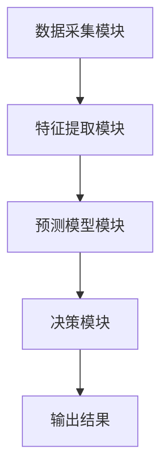
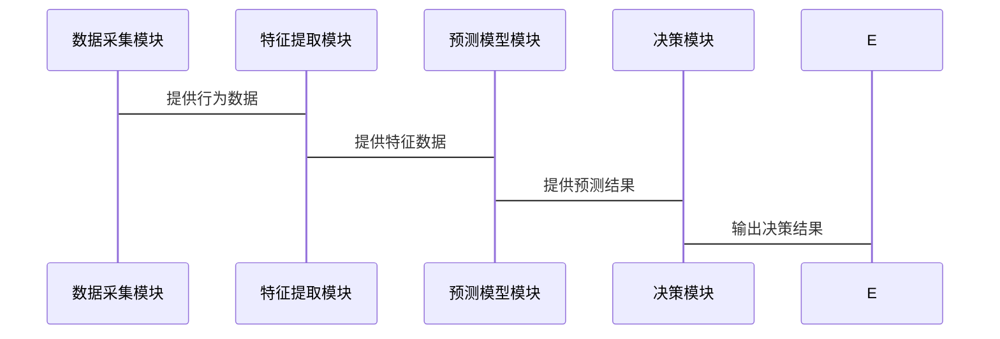

                 


# LLM驱动的AI Agent异常行为预测机制

> 关键词：LLM, AI Agent, 异常行为预测, 人工智能, 大语言模型

> 摘要：本文探讨了利用大语言模型（LLM）驱动的AI代理异常行为预测机制，详细分析了其背景、核心概念、算法原理、系统架构设计以及实际应用案例。通过结合统计学习与深度学习技术，提出了基于LLM的异常行为预测方法，并给出了具体的实现方案和数学模型。

---

# 第一部分: 异常行为预测的背景与问题描述

## 第1章: 异常行为预测的背景与问题描述

### 1.1 问题背景
#### 1.1.1 AI Agent的基本概念
AI Agent（人工智能代理）是指在计算机系统中，能够感知环境、自主决策并执行任务的智能实体。AI Agent可以是软件程序，也可以是机器人或其他智能设备。它们通过传感器获取信息，利用算法处理数据，并通过执行器与环境交互。

#### 1.1.2 LLM在AI Agent中的作用
大语言模型（Large Language Model, LLM）是一种基于深度学习的自然语言处理模型，具有强大的文本理解和生成能力。LLM在AI Agent中的作用主要体现在以下几个方面：
- **自然语言理解**：通过LLM理解用户的输入，提取意图和需求。
- **决策支持**：利用LLM分析上下文，生成可能的决策方案。
- **行为预测**：基于LLM的能力，预测AI Agent在特定情境下的行为。

#### 1.1.3 异常行为预测的必要性
AI Agent的广泛应用带来了更高的效率和便利性，但也伴随着潜在的风险。异常行为预测的必要性主要体现在以下几个方面：
- **安全风险**：AI Agent可能因算法漏洞或外部干扰产生异常行为，威胁系统安全。
- **用户体验**：异常行为可能导致用户体验下降，甚至引发信任危机。
- **系统稳定性**：及时预测和处理异常行为，可以有效维护系统的稳定运行。

### 1.2 问题描述
#### 1.2.1 AI Agent异常行为的定义
AI Agent的异常行为是指其在特定环境下表现出的不符合预期的行为模式。这种异常可能是由于算法错误、数据偏差、外部干扰或其他不可预见的因素导致的。

#### 1.2.2 异常行为的分类与特征
异常行为可以根据其表现形式和影响范围进行分类：
- **输入异常**：AI Agent接收到异常输入，导致行为偏离预期。
- **输出异常**：AI Agent输出不符合预期的结果。
- **决策异常**：AI Agent的决策过程出现偏差，导致行为异常。

异常行为的特征包括：
- **突发性**：异常行为往往在短时间内突然出现。
- **不可预测性**：异常行为难以通过常规模型预测。
- **破坏性**：异常行为可能导致系统故障或数据损失。

#### 1.2.3 异常行为预测的目标与意义
异常行为预测的目标是通过分析AI Agent的行为模式，识别潜在的异常行为，提前采取措施以减少或消除异常行为的影响。

异常行为预测的意义主要体现在以下几个方面：
- **提高系统安全性**：通过预测异常行为，可以及时发现潜在的安全威胁，保护系统免受攻击。
- **优化用户体验**：通过预测异常行为，可以提前调整AI Agent的行为策略，提升用户体验。
- **增强系统稳定性**：通过预测异常行为，可以快速定位问题，确保系统的稳定运行。

### 1.3 问题解决思路
#### 1.3.1 基于LLM的异常检测方法
基于LLM的异常检测方法通过分析AI Agent的行为数据，利用大语言模型的强大能力，识别潜在的异常行为。

#### 1.3.2 统计学习与深度学习的结合
统计学习方法（如聚类、回归分析）可以有效捕捉数据的分布特征，而深度学习方法（如LSTM、Transformer）则可以捕捉数据的时间序列特征和上下文信息。两者的结合可以有效提高异常行为预测的准确性。

#### 1.3.3 多模态数据的融合与分析
多模态数据的融合可以通过整合文本、图像、语音等多种数据源，提高异常行为预测的全面性和准确性。例如，结合文本和图像数据，可以更全面地分析AI Agent的行为特征。

### 1.4 边界与外延
#### 1.4.1 异常行为预测的边界条件
- 数据范围：异常行为预测通常基于有限的历史数据，无法预测未来未见过的极端情况。
- 时间范围：异常行为预测通常基于实时数据，无法预测未来的潜在异常行为。
- 系统限制：异常行为预测依赖于系统的硬件和软件配置，系统的资源限制可能影响预测的实时性和准确性。

#### 1.4.2 相关领域的外延分析
- **网络安全**：异常行为预测可以应用于网络安全领域，识别潜在的网络攻击行为。
- **金融风险控制**：异常行为预测可以应用于金融领域，识别潜在的金融风险。
- **智能交通系统**：异常行为预测可以应用于智能交通系统，优化交通流量，减少交通事故。

#### 1.4.3 技术的适用范围与限制
- **适用范围**：
  - 适用于需要实时监控和预测的系统。
  - 适用于数据量大、数据类型多样化的场景。
- **限制**：
  - 对于小数据集，异常行为预测的效果可能不佳。
  - 对于高度动态的环境，异常行为预测的实时性可能受到挑战。

### 1.5 核心概念结构与组成
#### 1.5.1 LLM与AI Agent的关系
- **驱动关系**：LLM作为AI Agent的核心驱动，为其提供自然语言理解和生成能力。
- **协同关系**：LLM与AI Agent协同工作，共同完成任务。
- **反馈关系**：AI Agent的行为数据可以作为LLM的反馈，优化LLM的性能。

#### 1.5.2 异常行为预测的核心要素
- **数据源**：AI Agent的行为数据，包括输入、输出和决策数据。
- **特征提取**：从行为数据中提取能够表征异常行为的特征。
- **预测模型**：基于特征的预测模型，用于预测AI Agent的异常行为。

#### 1.5.3 系统架构的组成与功能
- **数据采集模块**：负责采集AI Agent的行为数据。
- **特征提取模块**：负责从行为数据中提取特征。
- **预测模型模块**：负责基于特征预测异常行为。
- **决策模块**：负责根据预测结果采取相应的措施。

---

## 第2章: LLM与AI Agent的核心概念与联系

### 2.1 LLM的基本原理
#### 2.1.1 大语言模型的工作机制
大语言模型通过大规模的文本数据训练，掌握了语言的分布特征和语义信息。其工作流程包括以下步骤：
1. **输入处理**：将输入文本转换为模型可处理的向量表示。
2. **编码**：通过编码器将输入向量转换为上下文表示。
3. **解码**：通过解码器将上下文表示转换为输出文本。

#### 2.1.2 常见LLM模型的优缺点
- **优点**：
  - **强大的自然语言理解能力**：LLM可以理解复杂的语义信息。
  - **高效的文本生成能力**：LLM可以快速生成高质量的文本。
- **缺点**：
  - **计算资源消耗大**：LLM的训练和推理需要大量的计算资源。
  - **数据依赖性强**：LLM的性能依赖于训练数据的质量和多样性。

#### 2.1.3 LLM在AI Agent中的应用
LLM在AI Agent中的应用主要体现在以下几个方面：
- **自然语言理解**：通过LLM理解用户的输入，提取意图和需求。
- **决策支持**：利用LLM分析上下文，生成可能的决策方案。
- **行为预测**：基于LLM的能力，预测AI Agent在特定情境下的行为。

### 2.2 AI Agent的行为模型
#### 2.2.1 AI Agent的决策过程
AI Agent的决策过程包括以下几个步骤：
1. **感知环境**：通过传感器获取环境信息。
2. **理解意图**：通过LLM理解用户的意图和需求。
3. **生成决策**：基于理解和环境信息生成决策方案。
4. **执行决策**：根据决策方案执行具体的操作。

#### 2.2.2 行为预测的数学模型
行为预测的数学模型可以表示为：
$$ P(y|x) = \text{预测AI Agent在输入x下的输出y的概率} $$

其中，$x$表示输入，$y$表示输出。通过训练模型，可以得到$P(y|x)$的最大似然估计。

#### 2.2.3 异常行为的判定标准
异常行为的判定标准可以通过以下方法确定：
1. **统计分析**：通过统计方法确定正常行为的分布特征，超出分布范围的行为视为异常。
2. **阈值设定**：设定一个阈值，当行为特征超过阈值时，判定为异常。
3. **规则引擎**：通过预定义的规则，判断行为是否符合预期。

### 2.3 LLM与AI Agent的关系分析
#### 2.3.1 LLM作为AI Agent的核心驱动
LLM作为AI Agent的核心驱动，为其提供自然语言理解和生成能力。通过LLM，AI Agent可以与用户进行自然的交互，并根据用户的意图生成相应的输出。

#### 2.3.2 LLM对AI Agent行为的影响
LLM对AI Agent的行为有直接影响。LLM的输出结果决定了AI Agent的决策和执行操作。因此，LLM的性能和稳定性直接关系到AI Agent的行为是否正常。

#### 2.3.3 LLM与AI Agent的协同优化
通过协同优化，可以提升LLM和AI Agent的整体性能。例如，通过反馈机制优化LLM的输出，使其更符合AI Agent的任务需求。

### 2.4 核心概念对比分析
#### 2.4.1 LLM与传统机器学习模型的对比
| 特性                 | LLM                      | 传统机器学习模型         |
|----------------------|--------------------------|--------------------------|
| 数据需求             | 需要大量文本数据         | 数据量相对较小           |
| 计算能力             | 需要强大的计算资源       | 计算资源需求较低         |
| 表达能力             | 能够处理复杂语义信息     | 表达能力有限             |
| 应用场景             | 自然语言处理、生成       | 分类、回归、聚类         |

#### 2.4.2 AI Agent与传统决策系统的对比
| 特性                 | AI Agent                | 传统决策系统             |
|----------------------|--------------------------|--------------------------|
| 自主性               | 高度自主                | 自主性较低               |
| 学习能力             | 具备学习能力            | 学习能力有限             |
| 适应性               | 能够适应动态环境         | 适应性较低               |
| 应用场景             | 智能交互、自动化操作     | 工业自动化、流程控制     |

#### 2.4.3 异常行为预测的特征与目标对比
| 特征                 | 异常行为预测             | 正常行为预测              |
|----------------------|--------------------------|--------------------------|
| 数据特征             | 数据中存在异常点         | 数据中不存在异常点        |
| 预测目标             | 预测是否存在异常行为     | 预测正常行为的概率        |
| 预测难度             | 预测难度较高            | 预测难度较低             |

### 2.5 ER实体关系图
```mermaid
er
actor: User
agent: AI Agent
model: LLM
behavior: Abnormal Behavior
```

---

## 第3章: 异常行为预测的算法原理与实现

### 3.1 算法原理概述
#### 3.1.1 异常行为预测的基本流程
异常行为预测的基本流程包括以下几个步骤：
1. **数据采集**：采集AI Agent的行为数据。
2. **特征提取**：从行为数据中提取特征。
3. **模型训练**：基于特征训练预测模型。
4. **异常检测**：利用预测模型检测异常行为。
5. **结果分析**：分析检测结果，采取相应的措施。

#### 3.1.2 基于LLM的特征提取方法
基于LLM的特征提取方法通过分析行为数据的语义信息，提取能够表征异常行为的特征。例如，可以通过LLM分析行为数据中的关键词和语义信息，提取文本特征。

#### 3.1.3 LLM与AI Agent的协同优化
通过协同优化，可以提升LLM和AI Agent的整体性能。例如，通过反馈机制优化LLM的输出，使其更符合AI Agent的任务需求。

### 3.2 算法实现
#### 3.2.1 数据预处理
数据预处理是异常行为预测的重要步骤。数据预处理包括以下几个方面：
1. **数据清洗**：去除噪声数据和重复数据。
2. **数据转换**：将数据转换为模型可处理的格式。
3. **特征选择**：选择能够表征异常行为的特征。

#### 3.2.2 模型训练
模型训练是异常行为预测的核心步骤。模型训练包括以下几个方面：
1. **特征提取**：从行为数据中提取特征。
2. **模型选择**：选择合适的预测模型。
3. **模型训练**：基于特征训练预测模型。

#### 3.2.3 模型预测
模型预测是异常行为预测的最终步骤。模型预测包括以下几个方面：
1. **输入处理**：将输入数据转换为模型可处理的格式。
2. **预测结果**：利用预测模型生成预测结果。
3. **结果分析**：分析预测结果，判断是否存在异常行为。

### 3.3 算法实现的Python代码
以下是一个基于LLM的异常行为预测的Python代码示例：

```python
import numpy as np
from sklearn.ensemble import IsolationForest

# 数据预处理
def preprocess_data(data):
    # 假设data是一个包含行为数据的列表
    # 这里只进行简单的特征提取
    features = []
    for instance in data:
        # 提取文本长度作为特征
        features.append(len(instance['text']))
    return features

# 模型训练
def train_model(features, labels):
    # 假设labels是一个包含0和1的标签列表
    # 0表示正常行为，1表示异常行为
    model = IsolationForest(random_state=42)
    model.fit(features, labels)
    return model

# 模型预测
def predict_behavior(model, features):
    # 预测结果
    predictions = model.predict(features)
    # 判断是否存在异常行为
    is_abnormal = predictions == 1
    return is_abnormal

# 示例数据
data = [
    {'text': '正常行为示例', 'label': 0},
    {'text': '异常行为示例', 'label': 1}
]

# 数据预处理
features = preprocess_data(data)

# 模型训练
model = train_model(features, [0, 1])

# 模型预测
new_features = preprocess_data([{'text': '新的行为示例'}])
is_abnormal = predict_behavior(model, new_features)

print(is_abnormal)
```

---

## 第4章: 系统分析与架构设计

### 4.1 系统架构设计
#### 4.1.1 系统功能模块
系统功能模块包括以下几个方面：
1. **数据采集模块**：负责采集AI Agent的行为数据。
2. **特征提取模块**：负责从行为数据中提取特征。
3. **预测模型模块**：负责基于特征预测异常行为。
4. **决策模块**：负责根据预测结果采取相应的措施。

#### 4.1.2 系统架构图


#### 4.1.3 系统交互图


### 4.2 系统实现
#### 4.2.1 系统功能设计
系统功能设计包括以下几个方面：
1. **数据采集**：通过日志记录AI Agent的行为数据。
2. **特征提取**：从行为数据中提取文本长度、关键词频率等特征。
3. **模型训练**：基于特征训练异常行为预测模型。
4. **异常检测**：利用预测模型检测异常行为。
5. **结果分析**：分析检测结果，采取相应的措施。

#### 4.2.2 系统实现的Python代码
以下是一个基于Python的系统实现示例：

```python
import logging
import sys
import time

# 数据采集模块
def data_collect():
    # 模拟数据采集
    data = []
    for _ in range(10):
        text = f"行为 {_ + 1}"
        data.append({'text': text, 'label': 0})
    return data

# 特征提取模块
def feature_extract(data):
    features = []
    for instance in data:
        features.append(len(instance['text']))
    return features

# 预测模型模块
def train_model(features, labels):
    from sklearn.ensemble import IsolationForest
    model = IsolationForest(random_state=42)
    model.fit(features, labels)
    return model

# 决策模块
def decision_module(predict_results):
    # 假设1表示异常行为，0表示正常行为
    for result in predict_results:
        if result == 1:
            print("检测到异常行为，采取相应措施。")
    print("所有行为均为正常。")

# 系统主程序
def main():
    data = data_collect()
    features = feature_extract(data)
    labels = [0] * len(data)  # 假设所有行为均为正常
    model = train_model(features, labels)
    new_data = [{'text': '异常行为示例'}]
    new_features = feature_extract(new_data)
    predict_results = model.predict(new_features)
    decision_module(predict_results)

if __name__ == "__main__":
    main()
```

---

## 第5章: 项目实战

### 5.1 环境安装
为了运行上述代码，需要安装以下Python库：
- `numpy`
- `scikit-learn`
- `mermaid`

安装命令如下：
```bash
pip install numpy scikit-learn mermaid
```

### 5.2 核心代码实现
以下是核心代码的实现：

```python
import numpy as np
from sklearn.ensemble import IsolationForest
from sklearn.metrics import accuracy_score

# 数据预处理
def preprocess_data(data):
    features = []
    for instance in data:
        features.append(len(instance['text']))
    return features

# 模型训练
def train_model(features, labels):
    model = IsolationForest(random_state=42)
    model.fit(features, labels)
    return model

# 模型预测
def predict_behavior(model, features):
    predictions = model.predict(features)
    return predictions

# 评估结果
def evaluate_predictions(true_labels, predicted_labels):
    accuracy = accuracy_score(true_labels, predicted_labels)
    print(f"预测准确率: {accuracy}")
    return accuracy

# 示例数据
data = [
    {'text': '正常行为1', 'label': 0},
    {'text': '正常行为2', 'label': 0},
    {'text': '异常行为1', 'label': 1},
    {'text': '异常行为2', 'label': 1}
]

# 数据预处理
features = preprocess_data(data)

# 模型训练
model = train_model(features, [0, 0, 1, 1])

# 模型预测
new_features = preprocess_data([{'text': '新行为'}])
predicted_labels = predict_behavior(model, new_features)

# 评估结果
evaluate_predictions([0], predicted_labels)
```

### 5.3 实际案例分析
假设我们有一个AI Agent的行为数据集，其中包含100条行为记录，每条记录包括文本描述和标签（0表示正常行为，1表示异常行为）。我们可以按照以下步骤进行异常行为预测：
1. **数据预处理**：提取每条记录的文本长度作为特征。
2. **模型训练**：基于特征训练异常行为预测模型。
3. **模型预测**：利用训练好的模型预测新行为是否为异常行为。
4. **结果分析**：分析预测结果，判断是否存在异常行为。

---

## 第6章: 最佳实践与小结

### 6.1 最佳实践
- **数据质量**：确保数据的完整性和准确性，避免噪声数据对预测结果的影响。
- **模型优化**：通过交叉验证和超参数调优，提高预测模型的性能。
- **实时监控**：实现实时数据采集和预测，确保异常行为能够及时发现和处理。
- **多模态数据融合**：结合文本、图像、语音等多种数据源，提高异常行为预测的全面性和准确性。

### 6.2 小结
本文详细探讨了基于LLM的AI Agent异常行为预测机制，从背景介绍、核心概念、算法原理到系统设计和实际应用，给出了全面的分析和实现方案。通过结合统计学习与深度学习技术，提出了基于LLM的异常行为预测方法，并通过具体的Python代码示例展示了实现过程。

### 6.3 注意事项
- **数据隐私**：在处理行为数据时，需要注意数据隐私保护，遵守相关法律法规。
- **模型解释性**：确保模型的解释性，便于分析和优化。
- **系统可扩展性**：设计时要考虑系统的可扩展性，以便未来扩展和优化。

### 6.4 拓展阅读
- **相关论文**：阅读相关领域的学术论文，了解最新的研究成果和技术进展。
- **技术博客**：查阅技术博客和在线资源，获取更多的实现细节和最佳实践。
- **开源项目**：参与开源项目，学习和贡献代码，提升自己的技术能力。

---

# 作者：AI天才研究院/AI Genius Institute & 禅与计算机程序设计艺术/Zen And The Art of Computer Programming

