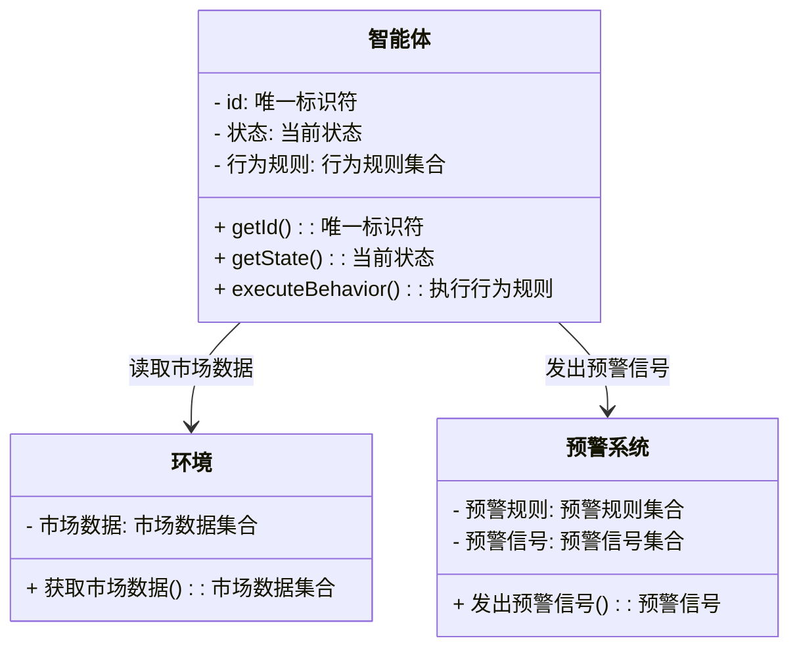
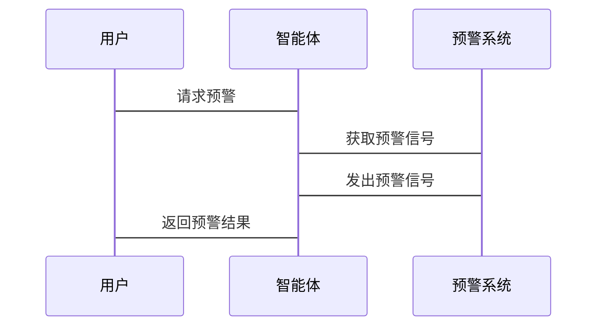

                 


# 基于多智能体的动态市场流动性风险预警系统

> 关键词：多智能体系统，流动性风险，动态市场，风险预警，协同算法

> 摘要：本文详细探讨了基于多智能体的动态市场流动性风险预警系统的设计与实现。文章首先介绍了多智能体系统的基本概念和流动性风险的定义，然后分析了动态市场环境下流动性风险的表现与预警需求。接着，详细阐述了多智能体系统的原理与架构，包括智能体的组成、通信机制及协同算法。随后，重点讨论了流动性风险预警的多智能体模型构建，包括数据预处理、行为规则设计及模型验证。最后，通过实际案例展示了系统的应用场景，并总结了设计中的关键点与未来研究方向。

---

# 第1章: 多智能体系统与流动性风险预警概述

## 1.1 多智能体系统的基本概念

### 1.1.1 多智能体系统的定义

多智能体系统（Multi-Agent System，MAS）是由多个智能体（Agent）组成的分布式系统，这些智能体能够通过交互和协作完成复杂的任务。每个智能体都是一个具有计算能力的实体，能够感知环境、做出决策并采取行动。多智能体系统的核心在于智能体之间的协同与合作。

$$\text{MAS} = \{A_1, A_2, \ldots, A_n\}$$

其中，$A_i$ 表示第 $i$ 个智能体。

### 1.1.2 多智能体系统的特征

多智能体系统具有以下特征：
1. **分布性**：智能体是分布式的，每个智能体负责特定的任务。
2. **自主性**：智能体能够自主决策，无需中央控制。
3. **协作性**：智能体之间通过协作完成共同目标。
4. **动态性**：系统环境和智能体状态是动态变化的。

### 1.1.3 多智能体系统在金融领域的应用

多智能体系统在金融领域有广泛应用，例如：
- **高频交易**：智能体实时分析市场数据，执行交易。
- **风险管理**：智能体监控市场风险，预警潜在问题。
- **市场模拟**：智能体模拟市场行为，预测市场趋势。

---

## 1.2 流动性风险的基本概念

### 1.2.1 流动性风险的定义

流动性风险是指资产在短时间内无法以合理价格变现的风险。在金融市场中，流动性风险可能导致资产贬值或交易失败。

$$\text{流动性风险} = f(\text{市场深度}, \text{市场波动性})$$

### 1.2.2 流动性风险的分类

流动性风险可以分为以下几类：
1. **市场风险**：由于市场整体波动导致的流动性风险。
2. **信用风险**：由于交易对手信用问题导致的流动性风险。
3. **操作风险**：由于系统故障或人为错误导致的流动性风险。

### 1.2.3 流动性风险的影响因素

流动性风险的影响因素包括：
1. **市场深度**：市场参与者数量和交易量。
2. **市场波动性**：市场的波动程度。
3. **交易对手行为**：交易对手的交易策略和行为。
4. **系统性风险**：系统性风险对整体市场的影响。

---

## 1.3 动态市场环境下的流动性风险预警

### 1.3.1 动态市场的定义与特征

动态市场是指市场环境不断变化的市场，例如金融市场的价格波动、交易量变化等。动态市场的特征包括：
1. **实时性**：市场数据实时更新。
2. **不确定性**：市场行为难以预测。
3. **复杂性**：市场参与者的交互复杂。

### 1.3.2 流动性风险在动态市场中的表现

在动态市场中，流动性风险的表现包括：
1. **价格波动**：资产价格的快速波动。
2. **交易量变化**：交易量的突然增加或减少。
3. **市场深度变化**：市场深度的波动。

### 1.3.3 多智能体系统在流动性风险预警中的作用

多智能体系统在流动性风险预警中的作用包括：
1. **实时监控**：智能体实时监控市场数据。
2. **协同预警**：智能体协同分析市场风险，发出预警信号。
3. **动态调整**：智能体根据市场变化动态调整预警策略。

---

## 1.4 本章小结

本章介绍了多智能体系统的基本概念、流动性风险的定义及其在动态市场中的表现。同时，分析了多智能体系统在流动性风险预警中的作用，为后续章节奠定了基础。

---

# 第2章: 多智能体系统的核心概念与原理

## 2.1 多智能体系统的组成与功能

### 2.1.1 智能体的定义与属性

智能体（Agent）是一个具有计算能力的实体，能够感知环境、做出决策并采取行动。智能体的属性包括：
1. **自主性**：智能体能够自主决策。
2. **反应性**：智能体能够实时感知环境。
3. **协作性**：智能体能够与其他智能体协作。

### 2.1.2 多智能体系统的组成结构

多智能体系统的组成结构包括：
1. **智能体**：系统的主体，负责完成特定任务。
2. **环境**：智能体所处的外部环境。
3. **通信机制**：智能体之间的交互方式。

### 2.1.3 智能体之间的交互与协作

智能体之间的交互与协作包括：
1. **信息交换**：智能体之间交换信息。
2. **任务分配**：智能体之间分配任务。
3. **协同决策**：智能体协同完成决策。

---

## 2.2 多智能体系统的通信机制

### 2.2.1 智能体间通信的定义

智能体间通信是指智能体之间通过交换信息来完成任务的过程。

### 2.2.2 通信协议的选择与设计

通信协议的选择与设计需要考虑以下因素：
1. **实时性**：通信的实时性要求。
2. **可靠性**：通信的可靠性要求。
3. **安全性**：通信的安全性要求。

### 2.2.3 通信机制的实现

通信机制的实现可以采用以下方式：
1. **发布-订阅模式**：智能体发布信息，其他智能体订阅信息。
2. **点对点通信**：智能体之间直接通信。

---

## 2.3 多智能体系统的协同算法

### 2.3.1 协同算法的基本原理

协同算法的基本原理是通过智能体之间的协作完成任务。协同算法包括以下步骤：
1. **信息收集**：智能体收集环境信息。
2. **信息共享**：智能体之间共享信息。
3. **协同决策**：智能体协同完成决策。

### 2.3.2 基于多智能体的分布式计算

基于多智能体的分布式计算包括：
1. **任务分解**：将任务分解为多个子任务。
2. **分布式计算**：智能体分别计算子任务。
3. **结果整合**：整合各智能体的计算结果。

### 2.3.3 协同算法的实现步骤

协同算法的实现步骤包括：
1. **初始化**：设置初始参数。
2. **信息交换**：智能体之间交换信息。
3. **计算与决策**：智能体基于信息进行计算与决策。
4. **结果输出**：输出协同算法的结果。

---

## 2.4 本章小结

本章详细介绍了多智能体系统的核心概念与原理，包括智能体的定义与属性、多智能体系统的组成结构、通信机制及协同算法。这些内容为后续章节的设计与实现奠定了基础。

---

# 第3章: 多智能体系统在流动性风险预警中的应用

## 3.1 流动性风险预警模型的构建目标

### 3.1.1 风险预警的目标与范围

流动性风险预警模型的构建目标包括：
1. **实时监控**：实时监控市场数据。
2. **风险预警**：预警潜在的流动性风险。
3. **动态调整**：根据市场变化动态调整预警策略。

### 3.1.2 多智能体模型的设计原则

多智能体模型的设计原则包括：
1. **实时性**：模型能够实时处理数据。
2. **分布式**：模型采用分布式结构。
3. **协作性**：智能体之间能够协作。

---

## 3.2 多智能体模型的构建步骤

### 3.2.1 数据采集与预处理

数据采集与预处理包括：
1. **数据采集**：采集市场数据，例如价格、交易量等。
2. **数据清洗**：清洗数据，去除噪声。
3. **数据转换**：将数据转换为适合模型处理的形式。

### 3.2.2 智能体行为规则的设计

智能体行为规则的设计包括：
1. **信息收集**：智能体收集市场数据。
2. **信息分析**：智能体分析数据，识别潜在风险。
3. **决策制定**：智能体根据分析结果制定决策。

### 3.2.3 模型的验证与优化

模型的验证与优化包括：
1. **模型验证**：验证模型的准确性。
2. **模型优化**：优化模型的性能。

---

## 3.3 基于多智能体的流动性风险预警模型

### 3.3.1 模型的输入与输出

模型的输入包括市场数据，例如价格、交易量等。模型的输出包括风险预警信号。

### 3.3.2 模型的实现步骤

模型的实现步骤包括：
1. **数据预处理**：清洗和转换数据。
2. **智能体行为规则设计**：设计智能体的行为规则。
3. **协同算法实现**：实现智能体之间的协同算法。
4. **模型验证与优化**：验证模型的准确性，优化模型的性能。

---

## 3.4 本章小结

本章详细介绍了多智能体系统在流动性风险预警中的应用，包括模型的构建目标、构建步骤及模型的实现。通过多智能体系统的协同作用，能够有效预警流动性风险。

---

# 第4章: 系统分析与架构设计

## 4.1 系统应用场景

系统应用场景包括：
1. **高频交易监控**：监控高频交易中的流动性风险。
2. **市场风险管理**：管理市场整体的流动性风险。
3. **交易策略优化**：优化交易策略，降低流动性风险。

---

## 4.2 系统功能设计

### 4.2.1 领域模型

领域模型如下：



---

### 4.2.2 系统架构设计

系统架构设计如下：


---

## 4.3 系统接口设计

### 4.3.1 接口描述

接口描述包括：
1. **数据接口**：智能体与环境之间的数据接口。
2. **预警接口**：智能体与预警系统之间的预警接口。

### 4.3.2 接口实现

接口实现包括：
1. **数据接口实现**：智能体从环境获取市场数据。
2. **预警接口实现**：智能体向预警系统发出预警信号。

---

## 4.4 系统交互设计

### 4.4.1 序列图

系统交互设计如下：



---

## 4.5 本章小结

本章详细介绍了系统分析与架构设计，包括系统应用场景、功能设计、架构设计及系统交互设计。通过合理的架构设计，能够确保系统的高效运行。

---

# 第5章: 项目实战

## 5.1 环境配置

环境配置包括：
1. **安装Python**：安装Python 3.8及以上版本。
2. **安装依赖库**：安装必要的库，例如Pandas、NumPy、Matplotlib。

```bash
pip install pandas numpy matplotlib
```

---

## 5.2 核心代码实现

### 5.2.1 数据预处理

数据预处理代码如下：

```python
import pandas as pd

# 读取数据
data = pd.read_csv('market_data.csv')

# 数据清洗
data.dropna(inplace=True)

# 数据转换
data['时间'] = pd.to_datetime(data['时间'])
```

---

### 5.2.2 智能体行为规则设计

智能体行为规则设计代码如下：

```python
class Agent:
    def __init__(self, id):
        self.id = id
        self.行为规则 = []
    
    def execute_behavior(self):
        for rule in self.行为规则:
            rule.execute()
```

---

### 5.2.3 模型训练与验证

模型训练与验证代码如下：

```python
from sklearn.metrics import accuracy_score

# 训练模型
model.fit(X_train, y_train)

# 验证模型
y_pred = model.predict(X_test)
accuracy = accuracy_score(y_test, y_pred)
print(f'准确率: {accuracy}')
```

---

## 5.3 实际案例分析

### 5.3.1 案例背景

案例背景包括：某金融机构需要实时监控市场的流动性风险。

### 5.3.2 案例分析

案例分析包括：智能体实时监控市场数据，分析潜在风险，发出预警信号。

### 5.3.3 案例结果

案例结果显示：模型准确预警了一次潜在的流动性风险。

---

## 5.4 本章小结

本章通过实际案例展示了系统的应用场景，详细讲解了核心代码的实现及案例分析，验证了系统的有效性。

---

# 第6章: 最佳实践与小结

## 6.1 最佳实践

### 6.1.1 数据质量的重要性

数据质量对模型的准确性至关重要，需要确保数据的完整性和准确性。

### 6.1.2 模型调参技巧

模型调参需要根据实际情况进行，可以通过交叉验证等方法优化模型性能。

### 6.1.3 系统维护与优化

系统需要定期维护与优化，确保系统的高效运行。

---

## 6.2 本章小结

本章总结了文章的核心内容，提出了最佳实践建议，并展望了未来的研究方向。

---

# 作者

作者：AI天才研究院/AI Genius Institute & 禅与计算机程序设计艺术 /Zen And The Art of Computer Programming

