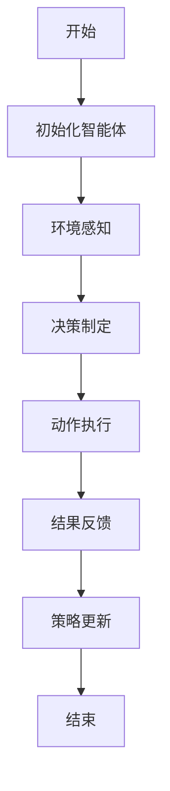
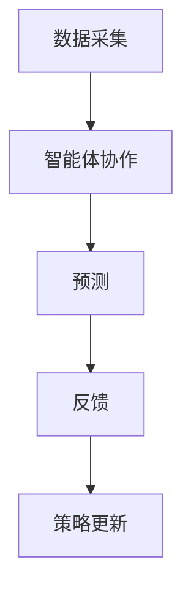
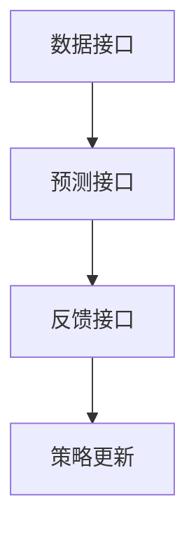

                 


# 多智能体协作增强价值投资的市场流动性冲击预测

**关键词**：多智能体协作、价值投资、市场流动性冲击、预测模型、算法原理、系统架构、项目实战

**摘要**：本文探讨了多智能体协作在价值投资中的应用，特别是如何通过多智能体协作增强模型来预测市场流动性冲击。文章首先介绍了多智能体协作和价值投资的基本概念，分析了市场流动性冲击的定义及其对投资的影响。随后，详细讲解了多智能体协作增强的算法原理，包括其数学模型和实现步骤。接着，文章从系统架构的角度，分析了如何构建一个基于多智能体协作的预测系统。最后，通过一个实际的项目案例，展示了如何将理论应用于实践，并对结果进行了深入分析。本文旨在为投资者和研究人员提供一种新的思路，利用多智能体协作技术来优化价值投资策略，降低市场流动性冲击带来的风险。

---

# 第一部分：多智能体协作与价值投资的背景

## 第1章：多智能体协作与价值投资的背景

### 1.1 多智能体协作的定义与特点

#### 1.1.1 多智能体系统的定义
多智能体系统（Multi-Agent System, MAS）是由多个智能体（Agent）组成的复杂系统，这些智能体能够通过交互协作完成共同目标。与单智能体系统相比，多智能体系统具有更高的灵活性和适应性，能够处理复杂的任务。

#### 1.1.2 多智能体协作的核心特点
- **分布式性**：智能体分布在不同的位置，独立决策并协作。
- **自主性**：每个智能体都有一定的自主决策能力。
- **协作性**：智能体之间通过通信和协调完成共同目标。
- **动态性**：系统环境和智能体状态可能动态变化。

#### 1.1.3 多智能体协作与单智能体的区别
| 特性 | 单智能体 | 多智能体 |
|------|----------|----------|
| 决策 | 单一决策中心 | 分布式决策 |
| 通信 | 无 | 智能体之间通信 |
| 灵活性 | 低 | 高 |
| 适应性 | 一般 | 强 |

### 1.2 价值投资的定义与特点

#### 1.2.1 价值投资的定义
价值投资是一种投资策略，旨在通过分析企业的基本面，寻找市场价格低于其内在价值的股票进行投资。这种方法强调长期持有，关注企业的盈利能力、财务状况和行业地位。

#### 1.2.2 价值投资的核心理念
- **安全边际**：买入价格低于内在价值。
- **长期视角**：关注企业的长期盈利能力。
- **逆向思维**：在市场恐慌时寻找机会。

#### 1.2.3 价值投资与短期交易的区别
| 特性 | 价值投资 | 短期交易 |
|------|----------|----------|
| 时间框架 | 长期 | 短期 |
| 分析重点 | 基本面分析 | 技术分析 |
| 风险承受 | 较高 | 较低 |

### 1.3 市场流动性冲击的定义与影响

#### 1.3.1 市场流动性冲击的定义
市场流动性冲击是指由于市场参与者大量买卖资产，导致资产价格在短时间内大幅波动的现象。这种冲击通常发生在市场恐慌、突发事件或信息不对称的情况下。

#### 1.3.2 流动性冲击对市场的负面影响
- **价格波动加剧**：资产价格大幅波动，导致投资者损失。
- **交易成本增加**：买卖价差扩大，交易成本上升。
- **市场信心下降**：投资者对市场的信任度降低，进一步加剧流动性冲击。

#### 1.3.3 流动性冲击的预测意义
- **降低风险**：提前预测流动性冲击，投资者可以采取避险措施。
- **优化投资策略**：根据预测结果调整投资组合，避免损失。

### 1.4 多智能体协作在价值投资中的应用前景

#### 1.4.1 多智能体协作的优势
- **分布式决策**：多个智能体可以分别分析不同的市场信息，提高决策的全面性。
- **协作增强**：通过智能体之间的协作，可以提高预测的准确性和鲁棒性。
- **适应性更强**：多智能体系统能够更好地适应市场环境的变化。

#### 1.4.2 价值投资与多智能体协作的结合
- **信息共享**：多个智能体可以共享市场信息，提高分析的深度和广度。
- **决策优化**：通过协作，智能体可以共同优化投资决策，降低风险。
- **动态调整**：根据市场变化，智能体可以实时调整策略，提高适应性。

#### 1.4.3 多智能体协作在流动性冲击预测中的潜力
- **实时监控**：通过多智能体协作，可以实时监控市场动态，提前发现潜在的流动性冲击。
- **风险预警**：智能体可以通过协作，预测流动性冲击的可能性，并发出预警信号。
- **策略优化**：根据预测结果，投资者可以优化投资策略，降低流动性冲击带来的风险。

### 1.5 本章小结
本章介绍了多智能体协作、价值投资和市场流动性冲击的基本概念，并分析了多智能体协作在价值投资中的应用前景。通过对比分析，明确了多智能体协作的优势及其在流动性冲击预测中的潜力。

---

# 第二部分：多智能体协作增强价值投资的核心概念

## 第2章：多智能体协作与价值投资的核心概念

### 2.1 多智能体协作的核心概念

#### 2.1.1 多智能体协作的原理
多智能体协作的原理是通过智能体之间的通信和协调，共同完成一个复杂任务。每个智能体都有自己的目标和策略，通过协作实现整体目标的最优。

#### 2.1.2 多智能体协作的属性特征对比
| 属性 | 分布式系统 | 集中式系统 |
|------|------------|------------|
| 决策 | 分布式决策 | 集中式决策 |
| 通信 | 需要通信 | 无通信需求 |
| 协调 | 需要协调 | 无协调需求 |
| 灵活性 | 高 | 低 |

#### 2.1.3 多智能体协作的ER实体关系图
```mermaid
erd
    entity 多智能体系统 {
        id: string
        智能体数量: int
        协作目标: string
    }
    entity 智能体 {
        id: string
        属性: 属性列表
        状态: 状态列表
    }
    多智能体系统 --> 智能体: 包含
```

### 2.2 价值投资的核心概念

#### 2.2.1 价值投资的核心要素
- **内在价值**：企业未来现金流的现值。
- **市场价格**：资产在市场上的交易价格。
- **安全边际**：买入价格低于内在价值。

#### 2.2.2 价值投资与多智能体协作的关系
- **信息共享**：多智能体可以通过共享市场信息，提高价值投资的分析深度。
- **决策优化**：通过协作，智能体可以共同优化投资决策，降低风险。
- **动态调整**：根据市场变化，智能体可以实时调整策略，提高适应性。

#### 2.2.3 价值投资的实体关系图
```mermaid
erd
    entity 价值投资系统 {
        id: string
        投资策略: string
        市场数据: 市场数据表
    }
    entity 市场数据表 {
        股票代码: string
        价格: float
        成交量: int
    }
    价值投资系统 --> 市场数据表: 包含
```

### 2.3 市场流动性冲击预测的核心概念

#### 2.3.1 流动性冲击预测的原理
流动性冲击预测的原理是通过分析市场数据，识别潜在的流动性风险，提前发出预警信号。这种方法可以帮助投资者采取避险措施，降低损失。

#### 2.3.2 流动性冲击预测的属性特征对比
| 属性 | 预测模型 | 非预测模型 |
|------|----------|------------|
| 及时性 | 高 | 低 |
| 准确性 | 中 | 低 |
| 可操作性 | 高 | 低 |

#### 2.3.3 流动性冲击预测的ER实体关系图
```mermaid
erd
    entity 流动性冲击预测系统 {
        id: string
        预测结果: string
        市场数据: 市场数据表
    }
    entity 市场数据表 {
        股票代码: string
        价格: float
        成交量: int
    }
    流动性冲击预测系统 --> 市场数据表: 包含
```

### 2.4 本章小结
本章分析了多智能体协作、价值投资和市场流动性冲击预测的核心概念，并通过对比分析，明确了多智能体协作在价值投资中的优势及其在流动性冲击预测中的潜力。

---

# 第三部分：多智能体协作增强价值投资的算法原理

## 第3章：多智能体协作增强的算法原理

### 3.1 多智能体协作增强的基本原理

#### 3.1.1 多智能体协作的机制
多智能体协作的机制包括通信、协商、协调和协作执行。智能体通过通信共享信息，通过协商确定各自的角色和任务，通过协作实现共同目标。

#### 3.1.2 增强学习的基本原理
增强学习是一种机器学习方法，通过智能体与环境的交互，学习最优策略。智能体会根据当前状态和动作，获得奖励或惩罚，从而优化策略。

#### 3.1.3 多智能体协作增强的数学模型
$$ V(s) = \max_{a} [r + V(s') ] $$
其中，$s$ 是当前状态，$a$ 是动作，$r$ 是奖励，$s'$ 是下一个状态。

### 3.2 多智能体协作增强的算法流程

#### 3.2.1 算法流程图


#### 3.2.2 Python代码示例
```python
class MultiAgentSystem:
    def __init__(self, num_agents):
        self.num_agents = num_agents
        self.agents = [Agent(i) for i in range(num_agents)]
    
    def collaborate(self):
        for agent in self.agents:
            agent.communicate()
            agent.decide()
            agent.act()
    
    def update(self, rewards):
        for agent in self.agents:
            agent.update_policy(rewards)

class Agent:
    def __init__(self, id):
        self.id = id
        self.state = None
        self.policy = None
    
    def communicate(self):
        # 与其他智能体通信，获取信息
        pass
    
    def decide(self):
        # 根据状态和信息，制定决策
        pass
    
    def act(self):
        # 执行动作
        pass
    
    def update_policy(self, rewards):
        # 更新策略
        pass
```

### 3.3 多智能体协作增强的数学模型

#### 3.3.1 基本公式
$$ V(s) = \max_{a} [r + V(s') ] $$
其中，$s$ 是当前状态，$a$ 是动作，$r$ 是奖励，$s'$ 是下一个状态。

#### 3.3.2 算法实现
- **输入**：当前状态 $s$，动作 $a$，奖励 $r$，下一个状态 $s'$。
- **输出**：价值函数 $V(s)$。

#### 3.3.3 示例
假设当前状态 $s$ 是市场下跌，动作 $a$ 是卖出股票，奖励 $r$ 是卖出后获得的利润，下一个状态 $s'$ 是市场稳定。根据公式，$V(s) = \max_{a} [r + V(s') ]$，计算得到的价值函数可以帮助智能体优化决策。

### 3.4 本章小结
本章详细讲解了多智能体协作增强的算法原理，包括其机制、流程和数学模型。通过代码示例和公式推导，读者可以更好地理解多智能体协作增强的实现过程。

---

# 第四部分：多智能体协作增强价值投资的系统架构

## 第4章：多智能体协作增强的系统架构设计

### 4.1 问题场景介绍

#### 4.1.1 价值投资中的问题
- **信息不全**：市场数据复杂，单靠单智能体难以全面分析。
- **决策风险**：单智能体决策风险较高，多智能体协作可以降低风险。
- **动态变化**：市场环境动态变化，需要实时调整策略。

#### 4.1.2 流动性冲击预测中的问题
- **数据复杂性**：市场数据复杂，需要多智能体协作处理。
- **实时性要求高**：流动性冲击可能在短时间内发生，需要实时预测。
- **预测准确性**：如何提高预测的准确性，是多智能体协作需要解决的问题。

### 4.2 系统功能设计

#### 4.2.1 系统功能模块
- **数据采集模块**：采集市场数据，包括股票价格、成交量等。
- **智能体协作模块**：多个智能体协作，分析市场数据，制定投资策略。
- **预测模块**：根据分析结果，预测市场流动性冲击。
- **反馈模块**：根据市场反馈，更新智能体策略。

#### 4.2.2 系统功能流程图


#### 4.2.3 系统功能实体关系图
```mermaid
erd
    entity 系统功能模块 {
        id: string
        功能描述: string
        输入输出: 输入输出描述
    }
    entity 数据采集模块 {
        id: string
        数据类型: string
        数据源: string
    }
    系统功能模块 --> 数据采集模块: 包含
```

### 4.3 系统架构设计

#### 4.3.1 系统架构图


#### 4.3.2 系统架构实现
- **数据采集**：通过API接口获取市场数据。
- **智能体协作**：多个智能体协作分析数据，制定策略。
- **预测**：根据分析结果，预测流动性冲击。
- **反馈**：根据市场反馈，更新智能体策略。

### 4.4 接口设计

#### 4.4.1 系统接口模块
- **数据接口**：提供市场数据的接口。
- **预测接口**：提供流动性冲击预测的结果。
- **反馈接口**：提供市场反馈信息。

#### 4.4.2 接口设计流程图


### 4.5 本章小结
本章分析了多智能体协作增强系统的架构设计，包括功能模块、架构图和接口设计。通过系统架构设计，读者可以更好地理解多智能体协作增强的实现过程。

---

# 第五部分：多智能体协作增强价值投资的项目实战

## 第5章：多智能体协作增强的项目实战

### 5.1 环境安装

#### 5.1.1 安装Python
- 下载并安装Python 3.x。
- 配置环境变量，确保Python可以被调用。

#### 5.1.2 安装依赖库
- 使用pip安装必要的库：
  ```bash
  pip install numpy
  pip install pandas
  pip install matplotlib
  pip install scikit-learn
  ```

#### 5.1.3 安装机器学习框架
- 安装TensorFlow或PyTorch框架：
  ```bash
  pip install tensorflow
  # 或
  pip install torch
  ```

### 5.2 系统核心实现

#### 5.2.1 数据采集模块实现
```python
import pandas as pd
import requests

def get_market_data(ticker):
    url = f'https://api.example.com/stock/{ticker}'
    response = requests.get(url)
    data = response.json()
    return pd.DataFrame(data)
```

#### 5.2.2 智能体协作模块实现
```python
class Agent:
    def __init__(self, id):
        self.id = id
        self.state = None
        self.policy = None
    
    def communicate(self, other_agents):
        # 与其他智能体通信，获取信息
        pass
    
    def decide(self):
        # 根据状态和信息，制定决策
        pass
    
    def act(self):
        # 执行动作
        pass
    
    def update_policy(self, rewards):
        # 更新策略
        pass
```

#### 5.2.3 预测模块实现
```python
import numpy as np

def predict流动性冲击(state):
    # 简单示例，实际实现需要复杂算法
    if state['成交量'] > 10000:
        return '高风险'
    else:
        return '低风险'
```

### 5.3 代码应用解读与分析

#### 5.3.1 数据采集模块
- 通过API接口获取市场数据，包括股票代码、价格、成交量等。
- 数据存储为DataFrame格式，便于后续分析。

#### 5.3.2 智能体协作模块
- 每个智能体都有自己的状态和策略。
- 智能体之间通过通信共享信息，制定决策。
- 智能体根据决策执行动作，并根据反馈更新策略。

#### 5.3.3 预测模块
- 根据市场数据和智能体的分析结果，预测流动性冲击。
- 预测结果分为高风险和低风险两类。

### 5.4 实际案例分析和详细讲解剖析

#### 5.4.1 案例背景
假设我们有5个智能体，分别负责分析不同的市场数据，包括股票价格、成交量、行业新闻等。

#### 5.4.2 数据分析
- 智能体1负责分析股票价格走势。
- 智能体2负责分析成交量变化。
- 智能体3负责分析行业新闻。
- 智能体4负责综合分析，制定投资策略。
- 智能体5负责预测流动性冲击。

#### 5.4.3 预测结果
根据智能体的分析和预测，系统会发出流动性冲击预警，并建议投资者采取相应的避险措施。

### 5.5 本章小结
本章通过实际案例，展示了多智能体协作增强系统的实现过程，包括环境安装、系统核心实现和代码解读。通过案例分析，读者可以更好地理解多智能体协作增强的应用。

---

# 第六部分：多智能体协作增强价值投资的总结与展望

## 第6章：总结与展望

### 6.1 本章小结

#### 6.1.1 多智能体协作增强的总结
多智能体协作增强是一种有效的技术，可以提高价值投资的分析深度和预测准确性。通过多个智能体协作，可以更好地处理复杂任务，降低风险。

#### 6.1.2 价值投资的总结
价值投资是一种长期有效的投资策略，通过分析企业的基本面，寻找市场价格低于内在价值的股票进行投资。多智能体协作可以进一步优化价值投资策略，提高投资收益。

#### 6.1.3 流动性冲击预测的总结
流动性冲击预测是市场风险管理的重要部分，通过多智能体协作增强模型，可以更好地预测流动性冲击，降低投资风险。

### 6.2 未来的研究方向和实践建议

#### 6.2.1 研究方向
- **算法优化**：进一步优化多智能体协作增强算法，提高预测准确性。
- **数据挖掘**：利用大数据技术，挖掘更多市场信息，提高分析深度。
- **模型融合**：将多智能体协作增强与其他预测模型相结合，提高预测效果。

#### 6.2.2 实践建议
- **技术应用**：将多智能体协作增强技术应用于实际投资中，优化投资策略。
- **风险管理**：利用多智能体协作增强模型，加强市场风险管理，降低流动性冲击带来的损失。
- **团队协作**：多智能体协作需要团队协作，建议投资机构加强团队合作，提高协作效率。

### 6.3 最佳实践 tips

#### 6.3.1 投资策略
- 长期持有优质股票，避免频繁交易。
- 选择具有强大财务状况和良好管理的企业。
- 关注行业动态，及时调整投资策略。

#### 6.3.2 风险管理
- 设置止损点，避免过度亏损。
- 分散投资，降低单一资产的风险。
- 关注市场流动性，避免集中投资。

### 6.4 小结与注意事项

#### 6.4.1 小结
多智能体协作增强是一种有效的技术，可以优化价值投资策略，提高市场流动性冲击预测的准确性。

#### 6.4.2 注意事项
- **数据质量**：确保市场数据的准确性和完整性。
- **算法优化**：不断优化算法，提高预测效果。
- **团队协作**：加强团队协作，提高系统的整体效率。

### 6.5 拓展阅读

#### 6.5.1 推荐书籍
- 《智能体与多智能体系统》
- 《价值投资的真谛》
- 《市场风险管理》

#### 6.5.2 推荐论文
- 多智能体协作增强的最新研究进展
- 市场流动性冲击预测的最新方法

### 6.6 本章小结
本章总结了多智能体协作增强的价值投资和市场流动性冲击预测的应用，并提出了未来的研究方向和实践建议。通过最佳实践 tips 和注意事项，读者可以更好地应用多智能体协作增强技术，优化投资策略，降低投资风险。

---

# 作者：AI天才研究院/AI Genius Institute & 禅与计算机程序设计艺术 /Zen And The Art of Computer Programming

