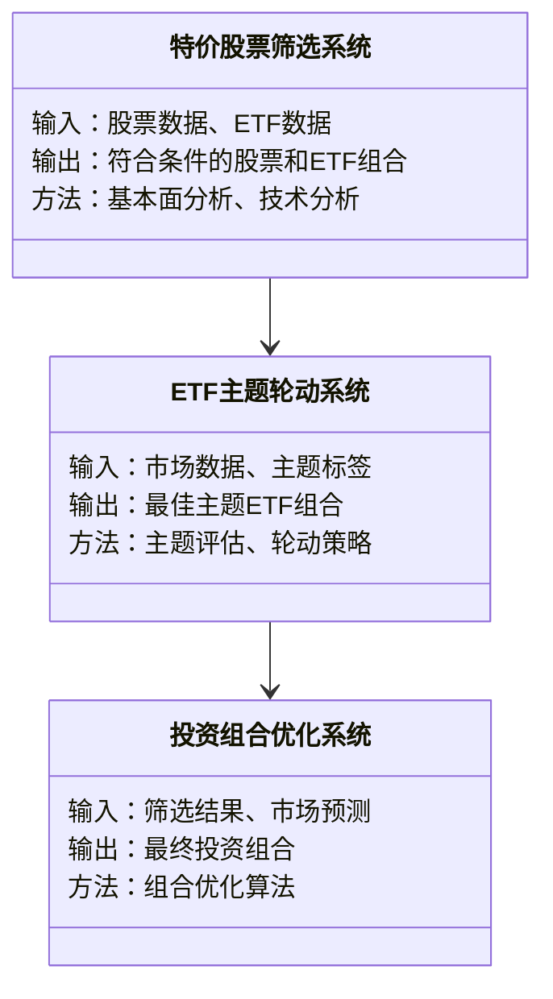
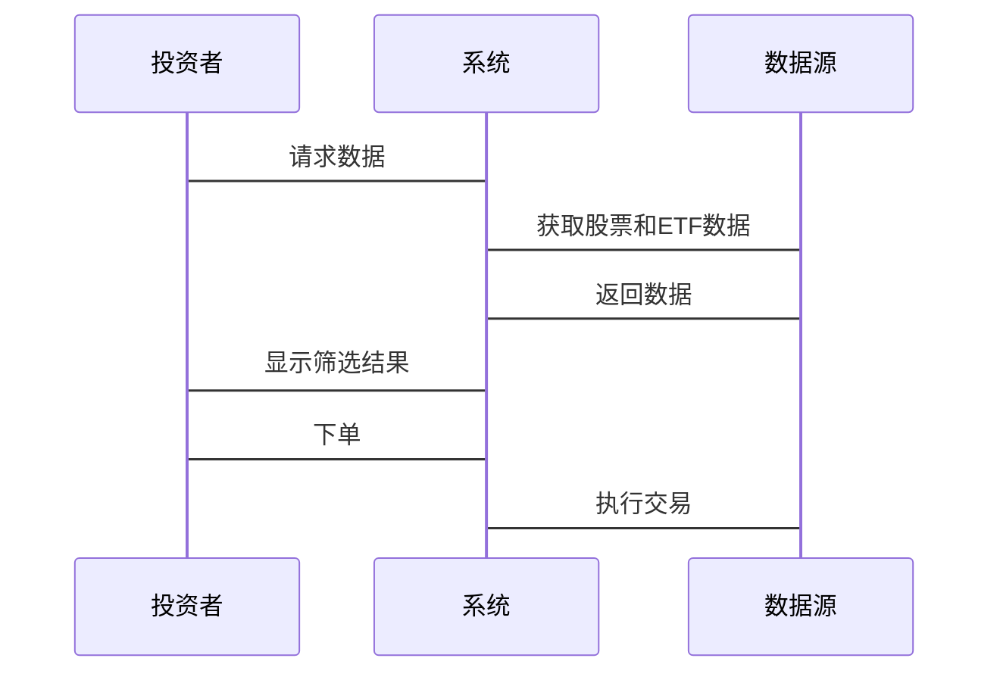

                 


# 如何将特价股票策略与主题式ETF投资相结合

> 关键词：特价股票，主题式ETF，投资策略，股票筛选，ETF组合优化

> 摘要：本文详细探讨了如何将特价股票策略与主题式ETF投资相结合，通过理论分析、策略匹配、系统设计和实战案例，展示了如何利用这两种投资工具的优势，实现风险可控、收益增强的投资目标。文章内容包括特价股票的识别方法、主题式ETF的投资逻辑、两者结合的策略优化、系统架构设计，以及实际投资案例分析，帮助投资者更好地理解和应用这一投资策略。

---

## 第1章: 特价股票策略与主题式ETF投资的背景与概念

### 1.1 特价股票策略的定义与特点

#### 1.1.1 特价股票的定义
特价股票是指市场价格低于其内在价值的股票。这种股票通常被认为被市场低估，具有较大的增值潜力。识别特价股票的关键在于分析公司的基本面，包括盈利能力、成长性和财务健康状况。

#### 1.1.2 特价股票的核心特点
- **低估性**：市场价格低于内在价值。
- **高回报潜力**：长期来看，被低估的股票有较大的上涨空间。
- **周期性**：通常出现在市场低迷或公司暂时困境时期。

#### 1.1.3 特价股票与普通股票的区别
| 特性 | 特价股票 | 普通股票 |
|------|----------|----------|
| 价格 | 低于内在价值 | 价格反映市场预期 |
| 风险 | 较高，但潜在回报大 | 风险适中，回报稳定 |
| 适用场景 | 市场低迷或公司困境时 | 市场稳定或成长期 |

### 1.2 主题式ETF的定义与特点

#### 1.2.1 ETF的基本概念
ETF（Exchange-Traded Fund）是一种在交易所上市交易的基金，兼具开放式和封闭式基金的特点，投资者可以像买卖股票一样买卖ETF。

#### 1.2.2 主题式ETF的定义
主题式ETF是以特定行业、主题或概念为投资标的ETF。例如，科技主题ETF、医疗主题ETF等。

#### 1.2.3 主题式ETF的优势与劣势
- **优势**：
  - 专业化投资：聚焦特定行业或主题，简化了投资决策。
  - 分散风险：通过持有多个相关股票，降低单一股票风险。
  - 方便交易：ETF可以在交易所实时交易，流动性高。
- **劣势**：
  - 主题集中：如果主题表现不佳，可能拖累整体收益。
  - 周期性风险：某些主题受市场波动影响较大。

### 1.3 特价股票策略与主题式ETF的结合意义

#### 1.3.1 结合的背景与动机
- 市场波动加剧，投资者需要更灵活的投资策略。
- 特价股票的长期收益潜力与主题式ETF的短期灵活性相结合，可以实现攻守兼备的投资目标。

#### 1.3.2 结合的潜在优势
- **风险分散**：通过主题式ETF分散单一股票风险，同时利用特价股票的低估优势。
- **收益增强**：主题式ETF可以捕捉行业趋势，而特价股票则提供估值修复的潜力。
- **灵活性与稳定性结合**：投资者可以在市场波动时通过ETF快速调整仓位，同时长期持有低估股票。

#### 1.3.3 结合的挑战与风险
- **策略协调性**：如何平衡特价股票的长期性和主题式ETF的短期性。
- **市场波动影响**：主题式ETF可能受市场情绪影响较大，影响策略效果。
- **信息不对称**：需要及时跟踪市场变化和公司基本面。

---

## 第2章: 特价股票策略的核心原理

### 2.1 特价股票的识别方法

#### 2.1.1 市净率法
市净率（P/B）是市场价格与每股净资产的比率。P/B < 1通常被视为低估的信号。

$$ P/B = \frac{\text{股价}}{\text{每股净资产}} $$

**案例**：某公司股价为5元，每股净资产为6元，则P/B = 0.83，低于1，可能被视为低估。

#### 2.1.2 市盈率法
市盈率（P/E）是市场价格与每股收益的比率。P/E < 市场平均值通常被视为低估。

$$ P/E = \frac{\text{股价}}{\text{每股收益}} $$

**案例**：市场平均P/E为15，某公司P/E为12，可能被视为低估。

#### 2.1.3 股息率法
股息率是股息与股价的比率。高股息率可能表明股票被低估或 dividend trap。

$$ \text{股息率} = \frac{\text{股息/每股}}{\text{股价}} $$

**案例**：某公司股息为1元，股价为5元，股息率为20%，可能表明股票被市场忽视。

### 2.2 特价股票的筛选标准

#### 2.2.1 基本面分析
- 盈利能力：ROE（净资产收益率）、净利润增长率。
- 财务健康：低负债率、健康的现金流。
- 行业地位：龙头企业更具竞争优势。

#### 2.2.2 技术分析
- 趋势线：股价长期低于均线。
- 市场情绪：成交量萎缩，显示抛压减少。

#### 2.2.3 综合指标分析
结合市净率、市盈率、股息率等多指标筛选低估股票。

### 2.3 特价股票投资的误区与注意事项

#### 2.3.1 过度依赖单一指标的风险
- 单一指标可能误导，需结合多指标分析。
- 示例：仅看市净率 < 1，但公司财务状况可能不佳。

#### 2.3.2 市场波动对策略的影响
- 市场下跌时，低估股票可能继续下跌，需警惕。
- 示例：市场恐慌时，某些股票可能被超跌。

#### 2.3.3 选股与择时的平衡
- 选股是基础，择时是辅助。
- 示例：在市场底部区域更容易找到低估股票。

---

## 第3章: 主题式ETF的投资策略

### 3.1 主题式ETF的分类与选择

#### 3.1.1 行业主题ETF
- 科技、医疗、金融等行业的ETF。
- 适合长期看好行业趋势的投资者。

#### 3.1.2 概念主题ETF
- 智能汽车、绿色能源等概念的ETF。
- 适合短期捕捉市场热点的投资者。

#### 3.1.3 区域主题ETF
- 美国、欧洲、新兴市场的ETF。
- 适合分散区域风险的投资者。

### 3.2 主题式ETF的投资逻辑

#### 3.2.1 主题投资的周期性
- 每个主题有其生命周期：启动、上升、成熟、衰退。
- 示例：科技主题在创新周期中表现较好。

#### 3.2.2 主题投资的驱动因素
- 行业政策：政府支持的行业可能表现较好。
- 市场情绪：主题热度与ETF表现密切相关。

#### 3.2.3 主题投资的风险管理
- 设置止损点：防止市场突然下跌。
- 分散投资：避免过度集中于单一主题。

### 3.3 主题式ETF的组合配置

#### 3.3.1 单一主题投资
- 适合对某主题有深入了解的投资者。
- 示例：长期看好科技行业的投资者可配置科技ETF。

#### 3.3.2 多主题组合投资
- 通过多个主题ETF分散风险。
- 示例：同时配置科技、医疗、金融等行业的ETF。

#### 3.3.3 主题与非主题资产的结合
- 配置部分债券或黄金等资产，平衡风险。
- 示例：牛市时加大主题ETF配置，熊市时增加债券比例。

---

## 第4章: 特价股票策略与主题式ETF的结合方法

### 4.1 策略匹配与协同效应

#### 4.1.1 特价股票的低估特性与主题式ETF的聚焦特性
- 特价股票提供估值修复机会，主题式ETF捕捉行业趋势。
- 示例：在科技行业整体低迷时，选择低估的科技股或科技ETF。

#### 4.1.2 两者的互补性分析
- ETF提供多样化投资，降低个股风险。
- 特价股票提供超额收益潜力。

#### 4.1.3 结合策略的潜在收益
- 通过ETF捕捉行业趋势，同时利用特价股票的低估优势。

### 4.2 动态调整与优化

#### 4.2.1 市场环境变化的应对策略
- 根据市场周期调整ETF和股票的配置比例。
- 示例：在市场上涨时增加ETF配置，市场下跌时增加特价股票配置。

#### 4.2.2 ETF主题的轮动策略
- 定期评估主题表现，及时切换到表现较好的主题。
- 示例：从科技主题切换到医疗主题。

#### 4.2.3 特价股票的动态筛选
- 定期重新筛选低估股票，剔除不再符合标准的个股。

### 4.3 风险控制与策略稳健性

#### 4.3.1 组合风险的分散
- 通过ETF和个股结合，分散行业和个股风险。

#### 4.3.2 市场波动的应对
- 设置止损点，控制最大回撤。
- 示例：在市场大幅波动时，调整ETF仓位。

#### 4.3.3

---

## 第5章: 系统分析与架构设计方案

### 5.1 问题场景介绍
投资者希望通过自动化系统实现特价股票与主题式ETF的结合投资，需要一个实时监控、动态调整的系统。

### 5.2 项目介绍
开发一个投资管理系统，实现以下功能：
- 数据采集与处理
- 策略制定与执行
- 风险监控与预警

### 5.3 系统功能设计（领域模型）



### 5.4 系统架构设计


### 5.5 系统接口设计
- **数据接口**：从数据源获取股票和ETF数据。
- **策略接口**：执行特价股票筛选和主题轮动策略。
- **执行接口**：根据策略结果下单。

### 5.6 系统交互设计



---

## 第6章: 项目实战

### 6.1 环境安装
- 安装Python和相关库（pandas、numpy、yfinance等）。
- 安装TradingView或其他数据获取工具。

### 6.2 系统核心实现源代码

#### 6.2.1 特价股票筛选代码

```python
import pandas as pd
import yfinance as yf

def screen_cheap_stocks(tickers):
    df = pd.DataFrame()
    for ticker in tickers:
        stock = yf.Ticker(ticker)
        hist = stock.history(period="max")
        if not hist.empty:
            current_price = hist['Close'][-1]
            book_value = stock.balance_sheet['Total Stockholder Equity'][-1] / 10**6
            pe_ratio = stock.info.get('pegRatio', None)
            ps_ratio = stock.info.get('priceToSalesRatio', None)
            df = df.append({
                'Ticker': ticker,
                'Current Price': current_price,
                'P/B': current_price / book_value,
                'P/E': pe_ratio,
                'P/S': ps_ratio
            }, ignore_index=True)
    return df

# 示例
tickers = ['AAPL', 'MSFT', 'GOOGL']
result = screen_cheap_stocks(tickers)
print(result)
```

#### 6.2.2 ETF主题轮动代码

```python
import pandas as pd
import yfinance as yf

def select_theme_etfs(theme, num=5):
    etfs = yf.utils.get_tickers()
    theme_scores = {}
    for etf in etfs:
        try:
            stock = yf.Ticker(etf)
            sector = stock.info['sector']
            if theme in sector:
                theme_scores[etf] = stock.info.get(' MorningStar Rating', 0)
        except:
            pass
    sorted_etfs = sorted(theme_scores.items(), key=lambda x: -x[1])[:num]
    return [etf for etf, score in sorted_etfs]

# 示例
theme = 'Technology'
etfs = select_theme_etfs(theme)
print(etfs)
```

### 6.3 代码应用解读与分析
- **screen_cheap_stocks**：筛选特定股票的低估指标。
- **select_theme_etfs**：根据主题选择表现较好的ETF。

### 6.4 实际案例分析
- **案例1**：市场低迷时，选择低估的金融股ETF。
- **案例2**：科技行业复苏时，选择科技主题ETF。

### 6.5 项目小结
通过代码实现，投资者可以自动化筛选特价股票和选择主题式ETF，提高投资效率。

---

## 第7章: 总结与展望

### 7.1 本章小结
本文详细探讨了如何将特价股票策略与主题式ETF相结合，通过理论分析、策略匹配和系统设计，展示了实现风险可控、收益增强的投资目标的方法。

### 7.2 最佳实践 tips
- 定期评估投资组合，动态调整策略。
- 保持对市场趋势的关注，及时捕捉投资机会。
- 结合定量分析和定性分析，提升策略的有效性。

### 7.3 注意事项
- 风险控制是关键，避免过度集中。
- 选择可信赖的平台和工具，确保数据准确性。

### 7.4 拓展阅读
- 阅读更多关于ETF投资的书籍，如《ETF投资指南》。
- 关注行业动态，了解最新投资策略。

---

## 作者：AI天才研究院/AI Genius Institute & 禅与计算机程序设计艺术 /Zen And The Art of Computer Programming

---

以上是完整的技术博客文章，涵盖了从理论到实践的各个方面，通过详细的分析和代码示例，帮助读者理解如何将特价股票策略与主题式ETF投资相结合。

