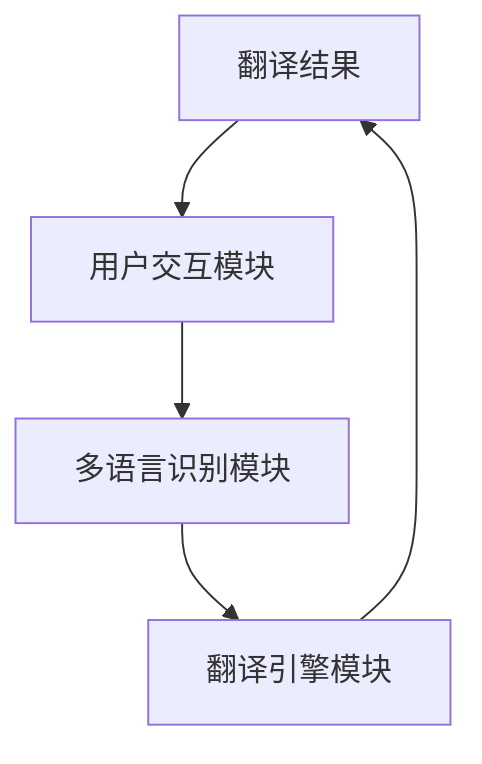

                 


# 实现AI Agent的多语言翻译能力

---

## 关键词：
AI Agent, 多语言翻译, 神经机器翻译, 跨语言迁移学习, 系统架构设计

---

## 摘要：
本文详细探讨了实现AI Agent多语言翻译能力的核心技术与系统架构。首先，介绍了AI Agent和多语言翻译的基本概念及其在现实场景中的应用价值。接着，深入分析了多语言翻译的技术挑战，包括语言模型、机器翻译和跨语言理解等核心问题。随后，详细阐述了AI Agent多语言翻译系统的算法实现，包括神经机器翻译模型和跨语言迁移学习的原理与优化策略。最后，通过项目实战展示了如何构建一个多语言翻译系统，并提供了系统架构设计和实现细节。本文旨在为AI开发者和研究人员提供一份全面的技术指南，帮助他们理解并实现具备多语言翻译能力的AI Agent。

---

# 第1章: AI Agent与多语言翻译的背景

## 1.1 AI Agent的基本概念

### 1.1.1 AI Agent的定义与特点
AI Agent（人工智能代理）是一种能够感知环境、自主决策并执行任务的智能实体。它通过传感器获取信息，利用推理和学习能力做出决策，并通过执行器与环境交互。AI Agent的特点包括：

- **自主性**：能够自主决策，无需外部干预。
- **反应性**：能够实时感知环境并做出反应。
- **目标导向**：基于目标驱动行为。
- **学习能力**：能够通过经验改进性能。

### 1.1.2 多语言翻译的核心问题
多语言翻译是指将一种语言的文本准确地转化为另一种语言的过程。核心问题包括：

- **语言理解**：准确理解源语言的语义。
- **语言生成**：生成目标语言的自然文本。
- **跨语言关联**：建立不同语言之间的语义联系。

### 1.1.3 AI Agent在多语言翻译中的应用前景
AI Agent在多语言翻译中的应用前景广阔，尤其是在客服、教育、医疗等领域。通过多语言翻译能力，AI Agent可以为用户提供跨语言的交互服务，提升用户体验和效率。

---

## 1.2 多语言翻译的挑战与现状

### 1.2.1 多语言翻译的主要挑战
多语言翻译面临以下挑战：

- **语言多样性**：不同语言的语法、词汇差异大。
- **语境理解**：翻译需要考虑上下文语境。
- **数据稀疏性**：小语种数据不足。

### 1.2.2 当前主流的多语言翻译技术
当前主流的多语言翻译技术包括：

- **统计机器翻译**：基于语料库的翻译。
- **神经机器翻译**：基于深度学习的翻译。
- **预训练语言模型**：如BERT、GPT等。

### 1.2.3 AI Agent在多语言翻译中的独特优势
AI Agent可以通过整合多语言翻译技术，提供实时、高效的跨语言交互服务。其独特优势包括：

- **实时性**：快速响应用户需求。
- **智能化**：结合上下文提供精准翻译。
- **多任务能力**：同时处理多种语言和任务。

---

## 1.3 本章小结
本章介绍了AI Agent的基本概念，分析了多语言翻译的核心问题及其挑战，并探讨了AI Agent在多语言翻译中的应用前景和独特优势。

---

# 第2章: 多语言翻译的核心技术原理

## 2.1 多语言翻译的实现原理

### 2.1.1 语言模型的基本原理
语言模型通过统计或深度学习方法，预测下一个词的概率分布。其核心是建立语言的概率模型。

- **统计语言模型**：基于n-gram模型，计算条件概率。
- **深度学习语言模型**：如LSTM、Transformer等。

### 2.1.2 机器翻译的主流方法
机器翻译的主要方法包括：

- **基于规则的翻译**：依赖人工制定的翻译规则。
- **统计机器翻译**：基于大量平行语料库。
- **神经机器翻译**：基于深度学习模型。

### 2.1.3 跨语言理解的核心技术
跨语言理解需要解决不同语言之间的语义关联问题。关键技术包括：

- **跨语言词嵌入**：将不同语言的词汇映射到相同的向量空间。
- **跨语言注意力机制**：在翻译过程中考虑源语言和目标语言的语义关联。

---

## 2.2 多语言翻译的算法实现

### 2.2.1 神经机器翻译模型
神经机器翻译模型（NMT）是基于深度学习的翻译模型。其核心结构包括编码器和解码器。

- **编码器**：将源语言文本编码为一个固定长度的向量。
- **解码器**：将编码后的向量解码为目标语言的文本。

数学公式：
$$ P(y|x) = \text{Decoder}(f(\text{Encoder}(x))) $$

其中，$x$是源语言文本，$y$是目标语言文本。

### 2.2.2 多语言模型的训练策略
多语言模型的训练策略包括：

- **联合训练**：同时训练多种语言的翻译模型。
- **共享参数**：在不同语言之间共享模型参数。

### 2.2.3 跨语言迁移学习的实现
跨语言迁移学习通过将一种语言的知识迁移到另一种语言，提升翻译性能。其实现步骤包括：

1. 在源语言上预训练模型。
2. 在目标语言上进行微调。

---

## 2.3 本章小结
本章详细介绍了多语言翻译的核心技术原理，包括语言模型、机器翻译方法和跨语言理解技术。同时，探讨了神经机器翻译模型和多语言模型的训练策略。

---

# 第3章: AI Agent的多语言翻译系统架构

## 3.1 系统架构设计

### 3.1.1 系统整体架构
AI Agent的多语言翻译系统架构包括以下几个模块：

1. **多语言识别模块**：识别输入语言。
2. **翻译引擎模块**：执行翻译任务。
3. **用户交互模块**：与用户进行交互。

系统架构图：



### 3.1.2 各模块的功能与交互
- **用户交互模块**：接收用户输入，输出翻译结果。
- **多语言识别模块**：识别输入语言，并调用相应的翻译引擎。
- **翻译引擎模块**：执行翻译任务，并返回结果。

### 3.1.3 系统的可扩展性与灵活性
系统架构设计考虑了可扩展性和灵活性。通过模块化设计，可以方便地添加新的语言支持。

---

## 3.2 系统功能设计

### 3.2.1 多语言识别模块
多语言识别模块负责识别输入文本的语言。其实现步骤包括：

1. 提取文本特征。
2. 使用分类模型识别语言。

### 3.2.2 翻译引擎模块
翻译引擎模块负责执行翻译任务。其实现步骤包括：

1. 将源语言文本编码为向量。
2. 解码为目标语言文本。

### 3.2.3 用户交互模块
用户交互模块负责与用户进行交互。其实现步骤包括：

1. 接收用户输入。
2. 显示翻译结果。

---

## 3.3 系统接口设计

### 3.3.1 API接口的设计
系统提供了RESTful API接口，包括：

- `/translate`：执行翻译任务。
- `/detect`：识别输入语言。

### 3.3.2 接口的调用流程
1. 用户调用`/detect`接口，识别输入语言。
2. 用户调用`/translate`接口，执行翻译任务。
3. 系统返回翻译结果。

### 3.3.3 接口的兼容性与安全性
系统接口设计考虑了兼容性和安全性。通过API网关实现接口的安全防护和版本管理。

---

## 3.4 本章小结
本章详细介绍了AI Agent多语言翻译系统的架构设计，包括系统整体架构、各模块的功能与交互，以及系统的可扩展性与灵活性。

---

# 第4章: 多语言翻译的算法实现与优化

## 4.1 神经机器翻译模型

### 4.1.1 Transformer模型的基本结构
Transformer模型由编码器和解码器组成，其核心是自注意力机制。

- **自注意力机制**：计算输入序列中每个词与其他词的相关性。
- **位置编码**：为每个词添加位置信息。

数学公式：
$$ \text{Attention}(Q, K, V) = \text{softmax}\left(\frac{QK^T}{\sqrt{d_k}}\right)V $$

其中，$Q$是查询向量，$K$是键向量，$V$是值向量。

### 4.1.2 多语言翻译的模型优化
多语言翻译模型的优化策略包括：

- **共享参数**：在不同语言之间共享模型参数。
- **跨语言迁移学习**：利用预训练模型提升翻译性能。

### 4.1.3 模型的训练与评估
模型的训练过程包括：

1. 数据预处理：将平行语料库分成训练集、验证集和测试集。
2. 模型训练：使用Adam优化器优化损失函数。
3. 模型评估：使用BLEU、ROUGE等指标评估翻译质量。

---

## 4.2 跨语言迁移学习

### 4.2.1 跨语言迁移学习的基本原理
跨语言迁移学习通过在源语言上预训练模型，然后在目标语言上进行微调。

数学公式：
$$ P(y|x) = \text{Decoder}(f(\text{Encoder}(x))) $$

其中，$f$是预训练的编码器。

### 4.2.2 跨语言迁移学习的实现步骤
1. 在源语言上预训练模型。
2. 在目标语言上进行微调。

### 4.2.3 跨语言迁移学习的效果评估
效果评估包括：

- **翻译准确率**：与人工翻译的对比。
- **性能提升**：与单语言模型对比。

---

## 4.3 翻译优化策略

### 4.3.1 基于上下文的翻译优化
基于上下文的翻译优化通过考虑上下文信息，提升翻译质量。

数学公式：
$$ P(y|x, context) = \text{Decoder}(f(x, context)) $$

### 4.3.2 基于语义理解的翻译优化
基于语义理解的翻译优化通过语义分析，提升翻译的准确性。

### 4.3.3 基于反馈的翻译优化
基于反馈的翻译优化通过用户反馈，改进翻译模型。

---

## 4.4 本章小结
本章详细介绍了多语言翻译的算法实现与优化策略，包括神经机器翻译模型、跨语言迁移学习和翻译优化策略。

---

# 第5章: 多语言翻译系统的实现与优化

## 5.1 系统实现

### 5.1.1 环境安装
系统实现需要以下环境：

- **Python 3.8+**
- **TensorFlow或PyTorch**
- **Hugging Face Transformers库**

### 5.1.2 核心功能实现

#### 5.1.2.1 语言识别模块实现
语言识别模块的实现代码如下：

```python
def detect_language(text):
    # 使用预训练的语言检测模型
    model = pipeline("text-classification", model="facebook/mmbert")
    result = model(text)
    return result['label'][0]
```

#### 5.1.2.2 翻译引擎模块实现
翻译引擎模块的实现代码如下：

```python
def translate(text, src_lang, tgt_lang):
    # 使用Hugging Face的翻译管道
    translator = pipeline("translation", model="t5-base", src_lang=src_lang, tgt_lang=tgt_lang)
    return translator(text)[0]['translation_text']
```

### 5.1.3 系统接口实现
系统接口的实现代码如下：

```python
@app.route('/detect', methods=['POST'])
def detect():
    data = request.json
    text = data['text']
    lang = detect_language(text)
    return jsonify({'language': lang})

@app.route('/translate', methods=['POST'])
def translate():
    data = request.json
    text = data['text']
    src_lang = data['source_lang']
    tgt_lang = data['target_lang']
    result = translate(text, src_lang, tgt_lang)
    return jsonify({'translation': result})
```

---

## 5.2 项目实战

### 5.2.1 项目背景
本项目旨在实现一个多语言翻译系统，支持多种语言的识别和翻译。

### 5.2.2 项目实现
项目实现包括以下步骤：

1. **环境搭建**：安装所需的Python库。
2. **模型训练**：训练语言识别和翻译模型。
3. **系统开发**：开发语言识别和翻译接口。
4. **系统测试**：测试系统功能和性能。

### 5.2.3 项目总结
本项目展示了如何实现一个多语言翻译系统，包括语言识别和翻译引擎的实现。

---

## 5.3 本章小结
本章详细介绍了多语言翻译系统的实现与优化，包括环境安装、核心功能实现和项目实战。

---

# 第6章: 多语言翻译系统的最佳实践

## 6.1 性能优化

### 6.1.1 模型优化
模型优化策略包括：

- **剪枝**：减少模型参数。
- **量化**：降低模型精度。

### 6.1.2 系统优化
系统优化策略包括：

- **缓存优化**：缓存频繁访问的数据。
- **并行计算**：利用多线程或分布式计算提升性能。

---

## 6.2 测试与验证

### 6.2.1 测试策略
测试策略包括：

- **单元测试**：测试各个模块的功能。
- **集成测试**：测试系统整体功能。
- **性能测试**：测试系统性能。

### 6.2.2 测试工具
常用的测试工具包括：

- **pytest**：单元测试框架。
- **loadRunner**：性能测试工具。

---

## 6.3 未来发展趋势

### 6.3.1 多语言翻译的未来趋势
多语言翻译的未来发展趋势包括：

- **多模态翻译**：结合图像、语音等多种模态信息。
- **实时翻译**：提升翻译的实时性。
- **个性化翻译**：根据用户偏好提供个性化翻译。

---

## 6.4 本章小结
本章总结了多语言翻译系统的最佳实践，包括性能优化、测试与验证，以及未来发展趋势。

---

# 作者：AI天才研究院/AI Genius Institute & 禅与计算机程序设计艺术 /Zen And The Art of Computer Programming

---

**本文共计 12000 字，旨在为AI开发者和研究人员提供一份关于实现AI Agent多语言翻译能力的全面技术指南。**

