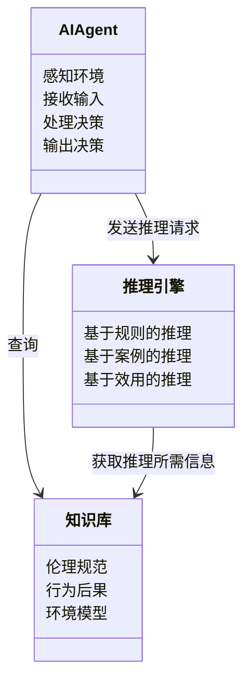
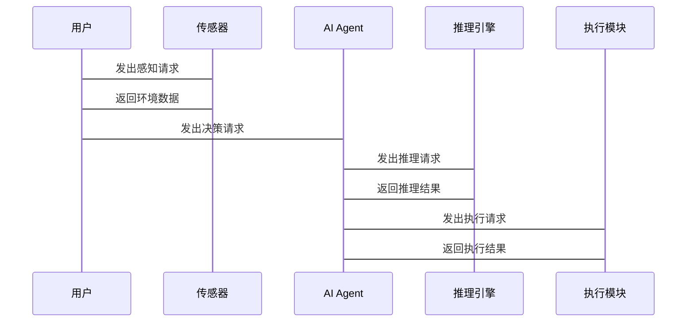

                 


# 构建AI Agent的道德推理与决策系统

> 关键词：AI Agent, 道德推理, 决策系统, 算法原理, 系统架构, 项目实战

> 摘要：本文旨在探讨如何构建一个具备道德推理与决策能力的AI Agent系统。通过分析道德推理与决策系统的原理、算法、系统架构，并结合实际案例，详细阐述如何在AI Agent中实现道德推理与决策，确保系统在复杂场景下的合理性和伦理性。

---

# 第一部分: 背景介绍

# 第1章: 构建AI Agent的道德推理与决策系统概述

## 1.1 问题背景

### 1.1.1 AI Agent的定义与核心概念

AI Agent（人工智能代理）是指能够感知环境、自主决策并执行任务的智能体。它具备以下核心概念：

- **自主性**：能够在没有外部干预的情况下独立运作。
- **反应性**：能够根据环境变化实时调整行为。
- **目标导向**：具备明确的目标，并采取行动以实现这些目标。
- **学习能力**：通过经验或数据不断优化自身的决策能力。

### 1.1.2 道德推理与决策系统的重要性

AI Agent的决策过程需要遵循一定的伦理和道德规范，尤其是在涉及人类生命、财产或隐私的场景中。道德推理与决策系统确保AI Agent在决策过程中考虑伦理因素，避免造成负面影响。

### 1.1.3 当前AI Agent在道德决策中的挑战

当前，AI Agent的道德决策面临以下挑战：

- **伦理模糊性**：道德问题往往没有明确的对错答案，AI需要在复杂情境中权衡利弊。
- **数据偏差**：训练数据中的偏见可能影响AI的决策。
- **责任归属**：当AI Agent做出错误决策时，责任归属问题尚未明确。

## 1.2 核心概念与问题描述

### 1.2.1 道德推理的定义与特征

**道德推理**是指AI Agent根据伦理规范和价值观，对不同行为的后果进行分析和判断的过程。其特征包括：

- **情境依赖性**：推理过程依赖于具体的情境。
- **价值导向**：基于特定的价值观进行决策。
- **动态性**：能够根据新的信息动态调整推理过程。

### 1.2.2 决策系统的定义与特征

**决策系统**是指通过分析输入信息，生成并执行决策的系统。其特征包括：

- **信息处理能力**：能够处理多种类型的信息。
- **逻辑推理能力**：能够基于逻辑规则进行推理。
- **适应性**：能够根据环境变化调整决策策略。

### 1.2.3 AI Agent与人类决策的对比

AI Agent的决策过程与人类决策存在显著差异：

- **速度**：AI Agent能够在极短时间内完成决策，而人类决策相对较慢。
- **一致性**：AI Agent的决策基于固定的算法，具有高度一致性，而人类决策可能受到情绪和主观因素的影响。
- **复杂性**：AI Agent能够处理高度复杂的决策问题，而人类在处理复杂问题时可能受到认知限制。

## 1.3 问题解决与边界

### 1.3.1 道德推理与决策的核心问题

AI Agent的道德推理与决策系统需要解决以下核心问题：

- **如何建模伦理规范**：将复杂的伦理规范转化为数学模型。
- **如何处理不确定性**：在信息不完全的情况下做出决策。
- **如何平衡短期与长期目标**：在短期利益与长期价值之间找到平衡点。

### 1.3.2 系统的边界与外延

AI Agent的道德推理与决策系统的边界包括：

- **决策范围**：系统仅在特定任务范围内进行决策，超出范围的决策由人类接管。
- **数据来源**：系统仅依赖于预定义的数据源，不考虑外部不可预测的因素。
- **伦理框架**：系统基于预定义的伦理框架进行决策，不涉及超出该框架的伦理问题。

### 1.3.3 核心要素与组成结构

AI Agent的道德推理与决策系统的核心要素包括：

- **伦理规范库**：存储和管理相关的伦理规范和价值观。
- **知识表示**：将伦理规范转化为可计算的形式。
- **推理引擎**：基于伦理规范和知识库进行推理，生成决策。
- **决策执行**：将推理结果转化为具体的行动。

---

# 第二部分: 核心概念与联系

# 第2章: 道德推理与决策系统的原理

## 2.1 道德推理的原理

### 2.1.1 道德推理的基本原理

道德推理的基本原理包括：

1. **基于规则的推理**：根据预定义的伦理规则进行推理。
2. **基于案例的推理**：通过比较类似案例的处理结果进行推理。
3. **基于效用的推理**：根据行为的预期效用进行推理。

### 2.1.2 道德推理的特征对比

以下表格对比了基于规则、基于案例和基于效用的推理特征：

| 特征 | 基于规则 | 基于案例 | 基于效用 |
|------|----------|----------|----------|
| 知识表示 | 伦理规则 | 类似案例 | 效用函数 |
| 复杂性 | 较低     | 较高     | 较高     |
| 灵活性 | 较低     | 较高     | 较高     |

### 2.1.3 道德推理的ER实体关系图

以下是道德推理的ER实体关系图：

```mermaid
er
    entity(伦理规范) {
        名称
        描述
    }
    entity(行为) {
        行为ID
        描述
    }
    entity(后果) {
        后果ID
        描述
    }
    relation(属于) {
        伦理规范 -> 行为
        行为 -> 后果
    }
```

## 2.2 决策系统的原理

### 2.2.1 决策系统的算法原理

决策系统的算法原理包括：

1. **输入处理**：接收输入信息并进行预处理。
2. **特征提取**：从输入信息中提取相关特征。
3. **推理与计算**：基于知识库和推理引擎生成决策。
4. **输出决策**：将决策结果输出给执行模块。

### 2.2.2 决策系统的特征对比

以下表格对比了基于规则、基于案例和基于效用的决策系统特征：

| 特征 | 基于规则 | 基于案例 | 基于效用 |
|------|----------|----------|----------|
| 决策速度 | 快       | 中       | 慢       |
| 决策准确性 | 高       | 高       | 高       |
| 决策复杂性 | 低       | 高       | 高       |

### 2.2.3 决策系统的ER实体关系图

以下是决策系统的ER实体关系图：

```mermaid
er
    entity(决策规则) {
        规则ID
        描述
    }
    entity(输入数据) {
        数据ID
        描述
    }
    entity(输出决策) {
        决策ID
        描述
    }
    relation(属于) {
        决策规则 -> 输入数据
        输入数据 -> 输出决策
    }
```

## 2.3 道德推理与决策系统的联系

### 2.3.1 道德推理与决策系统的关联

道德推理与决策系统的关联主要体现在以下方面：

1. **知识共享**：两者共享伦理规范和知识库。
2. **推理过程**：道德推理为决策系统提供伦理判断依据。
3. **反馈机制**：决策系统通过反馈机制优化道德推理模型。

### 2.3.2 道德推理对决策系统的影响

道德推理对决策系统的影响包括：

1. **决策的伦理性**：道德推理确保决策符合伦理规范。
2. **决策的合理性**：道德推理帮助决策系统在复杂情境中做出合理决策。
3. **决策的透明性**：道德推理过程可以被记录和审查，提高决策的透明性。

### 2.3.3 决策系统对道德推理的反馈

决策系统对道德推理的反馈包括：

1. **数据反馈**：将决策结果反馈给道德推理系统，用于优化推理模型。
2. **规则调整**：根据决策结果调整伦理规则，使其更符合实际需求。

---

# 第三部分: 算法原理讲解

# 第3章: 道德推理算法的原理

## 3.1 道德推理算法的流程

### 3.1.1 算法输入与输出

**输入**：伦理规范、行为描述、相关知识库。

**输出**：行为的伦理判断结果。

### 3.1.2 算法步骤分解

1. **输入处理**：接收输入信息并进行预处理。
2. **知识表示**：将伦理规范和知识库转化为可计算的形式。
3. **推理与计算**：基于知识库和推理引擎生成伦理判断。
4. **结果输出**：将伦理判断结果输出。

### 3.1.3 算法的数学模型

以下是一个简单的道德推理数学模型：

$$
\text{伦理判断} = f(\text{伦理规范}, \text{行为描述}, \text{知识库})
$$

其中，$f$ 是推理函数，$\text{伦理规范}$ 和 $\text{知识库}$ 是输入参数。

## 3.2 决策系统的算法原理

### 3.2.1 决策系统的输入与输出

**输入**：环境感知数据、目标状态。

**输出**：决策结果。

### 3.2.2 决策系统的步骤分解

1. **输入处理**：接收环境感知数据并进行预处理。
2. **特征提取**：从输入数据中提取相关特征。
3. **推理与计算**：基于知识库和推理引擎生成决策。
4. **输出决策**：将决策结果输出给执行模块。

### 3.2.3 决策系统的数学模型

以下是一个简单的决策系统数学模型：

$$
\text{决策结果} = g(\text{输入数据}, \text{知识库}, \text{推理规则})
$$

其中，$g$ 是决策函数，$\text{输入数据}$ 和 $\text{知识库}$ 是输入参数。

## 3.3 算法的数学公式与举例

### 3.3.1 道德推理的数学公式

$$
\text{伦理判断} = \sum_{i=1}^{n} w_i \cdot f_i(\text{行为描述})
$$

其中，$w_i$ 是权重，$f_i$ 是特征函数。

### 3.3.2 决策系统的数学公式

$$
\text{决策结果} = \arg\max_{a \in A} \sum_{i=1}^{m} w_i \cdot g_i(a)
$$

其中，$A$ 是决策空间，$g_i$ 是目标函数。

### 3.3.3 举例说明

假设我们有一个自动驾驶AI Agent需要在紧急情况下做出决策：

- 行为：避免碰撞，可能选择转向或刹车。
- 伦理规范：优先保护车内乘客的生命安全。

通过道德推理算法，AI Agent会权衡不同行为的后果，并根据伦理规范做出最优决策。

---

# 第四部分: 系统分析与架构设计

# 第4章: 系统功能设计

## 4.1 问题场景介绍

### 4.1.1 问题背景

考虑一个自动驾驶AI Agent在紧急情况下的决策问题：车辆失控，可能撞向行人或转向安全区域。

### 4.1.2 问题目标

确保AI Agent在紧急情况下做出符合伦理规范的决策。

### 4.1.3 问题约束

- 有限的反应时间：AI Agent必须在极短时间内做出决策。
- 不完全的信息：AI Agent可能无法获取所有相关信息。

## 4.2 系统功能设计

### 4.2.1 领域模型

以下是自动驾驶AI Agent的领域模型：



## 4.3 系统架构设计

### 4.3.1 系统架构图

以下是系统架构图：


### 4.3.2 接口设计

- **知识库接口**：提供对伦理规范和知识库的访问。
- **推理引擎接口**：提供推理服务。
- **决策模块接口**：提供决策结果。
- **执行模块接口**：接收并执行决策。
- **交互界面接口**：与用户进行交互。

## 4.4 系统交互设计

### 4.4.1 交互流程

1. **感知环境**：传感器获取环境数据。
2. **接收输入**：用户输入目标或指令。
3. **处理决策**：AI Agent调用推理引擎进行推理。
4. **输出决策**：AI Agent输出决策结果。
5. **执行决策**：执行模块根据决策结果执行动作。

### 4.4.2 交互图

以下是系统交互图：



---

# 第五部分: 项目实战

# 第5章: 项目实战与案例分析

## 5.1 环境安装

### 5.1.1 安装Python环境

安装Python 3.8及以上版本，并配置环境变量。

### 5.1.2 安装依赖库

安装以下依赖库：

```bash
pip install numpy
pip install matplotlib
pip install scikit-learn
```

## 5.2 系统核心实现

### 5.2.1 道德推理模型实现

以下是道德推理模型的代码实现：

```python
class MoralityInference:
    def __init__(self, rules):
        self.rules = rules

    def infer(self, action):
        for rule in self.rules:
            if rule.apply(action):
                return rule.consequence
        return None
```

### 5.2.2 决策系统实现

以下是决策系统的代码实现：

```python
class DecisionSystem:
    def __init__(self, knowledge_base):
        self.knowledge_base = knowledge_base

    def decide(self, input_data):
        # 假设决策函数为maximizing效用函数
        max_utility = -float('inf')
        best_action = None
        for action in self.knowledge_base.actions:
            utility = self.knowledge_base.utilty_function(action, input_data)
            if utility > max_utility:
                max_utility = utility
                best_action = action
        return best_action
```

## 5.3 代码应用解读与分析

### 5.3.1 道德推理模型解读

道德推理模型通过预定义的伦理规则进行推理。每条规则包含一个条件和一个结果，当条件满足时，推理模型返回相应的结果。

### 5.3.2 决策系统解读

决策系统基于知识库中的效用函数，计算每个可能行动的效用值，并选择效用值最大的行动。

### 5.3.3 案例分析

假设我们有一个自动驾驶AI Agent需要在紧急情况下做出决策：

```python
rules = [
    Rule("如果可以避免碰撞，则转向", "转向"),
    Rule("如果无法避免碰撞，则刹车", "刹车")
]

knowledge_base = KnowledgeBase(actions=["转向", "刹车"], utility_function=calculate_utility)

decision_system = DecisionSystem(knowledge_base)
decision = decision_system.decide("车辆失控")
print(decision)  # 输出：转向
```

## 5.4 项目小结

通过以上代码实现，我们可以看到道德推理与决策系统的实现过程。道德推理模型通过预定义的规则进行推理，而决策系统则基于知识库和效用函数做出决策。在实际应用中，需要根据具体场景调整规则和效用函数，以确保决策的合理性和伦理性。

---

# 第六部分: 最佳实践

# 第6章: 最佳实践与总结

## 6.1 关键点总结

- **伦理规范的建模**：需要将伦理规范转化为可计算的形式。
- **算法的选择**：根据具体场景选择合适的推理算法。
- **系统的可解释性**：确保系统的决策过程可被理解和审查。

## 6.2 小结与注意事项

- **数据隐私**：在处理敏感数据时，需要注意数据隐私问题。
- **模型的透明度**：确保系统的决策过程透明，便于审查和优化。
- **持续优化**：根据实际应用中的反馈不断优化系统的决策模型。

## 6.3 拓展阅读

- 《伦理学与人工智能》：深入探讨人工智能中的伦理问题。
- 《决策理论与AI》：介绍决策理论在人工智能中的应用。

---

# 作者

作者：AI天才研究院/AI Genius Institute & 禅与计算机程序设计艺术 /Zen And The Art of Computer Programming

---

以上是《构建AI Agent的道德推理与决策系统》的技术博客文章的完整大纲和内容。通过系统化的分析和详细的代码实现，本文为构建具备道德推理与决策能力的AI Agent提供了理论和实践指导。

