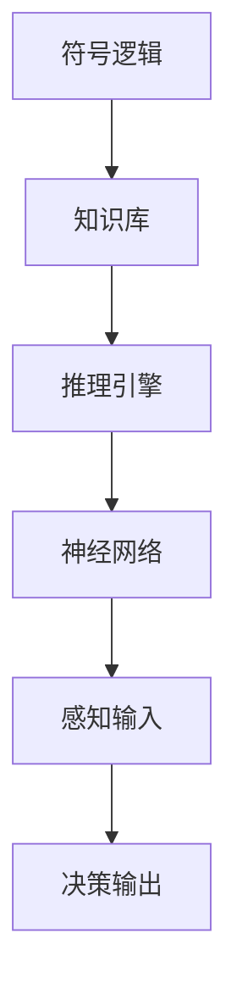
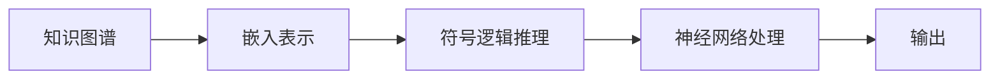
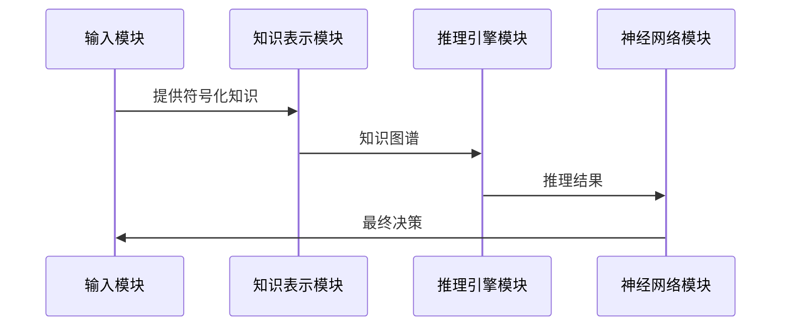

                 


# 神经符号AI在AI Agent逻辑推理中的实践

> 关键词：神经符号AI, AI Agent, 逻辑推理, 算法原理, 系统架构

> 摘要：神经符号AI结合了神经网络和符号逻辑的优势，为AI Agent的逻辑推理提供了新的可能性。本文将从神经符号AI的核心概念、算法原理、系统架构到项目实战，全面阐述神经符号AI在AI Agent逻辑推理中的实践应用。

---

## 第一部分: 神经符号AI与AI Agent概述

### 第1章: 神经符号AI与AI Agent概述

#### 1.1 神经符号AI的背景与现状

- **1.1.1 神经符号AI的定义与背景**
  - 神经符号AI的定义：结合神经网络和符号逻辑的AI技术。
  - 发展背景：传统符号AI的局限性与神经网络的局限性推动了神经符号AI的发展。
  - 当前研究热点：神经符号AI在自然语言处理、机器人控制等领域的应用。

- **1.1.2 神经符号AI的发展现状**
  - 研究现状：学术界和工业界的研究进展。
  - 技术瓶颈：可解释性、实时性、跨领域应用的挑战。

- **1.1.3 神经符号AI与符号AI的区别**
  - 符号AI的局限性：缺乏对模糊数据的处理能力。
  - 神经符号AI的优势：结合符号逻辑与神经网络的强大学习能力。

- **1.1.4 神经符号AI与神经网络的结合**
  - 神经网络的局限性：难以处理需要明确逻辑推理的任务。
  - 神经符号AI的解决方案：将符号逻辑嵌入神经网络，提升推理能力。

#### 1.2 AI Agent的基本概念与逻辑推理

- **1.2.1 AI Agent的定义与分类**
  - 定义：AI Agent是一个能够感知环境并采取行动以实现目标的实体。
  - 分类：简单反射型、基于模型的反应型、目标驱动型、实用驱动型。

- **1.2.2 AI Agent的逻辑推理需求**
  - 逻辑推理的重要性：AI Agent需要通过逻辑推理来做出决策。
  - 常见的逻辑推理类型：演绎推理、归纳推理、 abduction推理。

- **1.2.3 神经符号AI在AI Agent中的作用**
  - 提供更强的逻辑推理能力。
  - 适用于复杂动态环境中的决策任务。

- **1.2.4 神经符号AI与传统逻辑推理的对比**
  - 传统逻辑推理的局限性：难以处理不完整或不确定的信息。
  - 神经符号AI的优势：结合神经网络的自学习能力和符号逻辑的精确性。

#### 1.3 神经符号AI的核心概念与应用前景

- **1.3.1 神经符号AI的核心概念**
  - 符号表示：如何将知识表示为符号形式。
  - 逻辑推理：如何利用符号逻辑进行推理。
  - 学习机制：如何通过学习优化符号逻辑。

- **1.3.2 神经符号AI在AI Agent中的应用领域**
  - 自然语言处理：问答系统、对话生成。
  - 机器人控制：路径规划、行为决策。
  - 数据分析：复杂数据的推理与决策。

- **1.3.3 神经符号AI的优势与挑战**
  - 优势：可解释性、可迁移性、强泛化能力。
  - 挑战：计算复杂度、数据需求、算法设计难度。

- **1.3.4 神经符号AI的未来发展趋势**
  - 更强的可解释性：提升用户信任。
  - 更高的效率：优化算法以适应实时推理需求。
  - 更广泛的应用：扩展至更多领域，如医疗、金融等。

#### 1.4 本章小结

- 本章介绍了神经符号AI的背景、核心概念及其在AI Agent中的作用。
- 突出了神经符号AI的优势与挑战，并展望了其未来的发展趋势。

---

## 第二部分: 神经符号AI的核心概念与联系

### 第2章: 神经符号AI的核心概念与联系

#### 2.1 神经符号AI的核心概念

- **2.1.1 符号表示与神经网络的结合**
  - 符号表示的优势：精确性、可解释性。
  - 神经网络的优势：自学习能力、非线性表达能力。

- **2.1.2 神经符号AI的逻辑推理机制**
  - 知识表示：规则、谓词、框架等符号形式。
  - 推理过程：基于符号逻辑的规则匹配与神经网络的特征提取。

- **2.1.3 神经符号AI的可解释性与鲁棒性**
  - 可解释性：符号逻辑的清晰性。
  - 鲁棒性：神经网络的自适应能力。

#### 2.2 神经符号AI的核心概念对比

- **2.2.1 符号AI与神经符号AI的对比**
  | 对比维度 | 符号AI | 神经符号AI |
  |----------|--------|------------|
  | 表示方式 | 符号化知识 | 符号化与嵌入式结合 |
  | 学习方式 | 预定义规则 | 结合监督学习与符号推理 |
  | 优缺点 | 可解释性高，但难以处理复杂问题 | 综合了符号逻辑与神经网络的优势 |

- **2.2.2 神经网络与符号推理的对比**
  | 对比维度 | 神经网络 | 符号推理 |
  |----------|----------|-----------|
  | 表示方式 | 嵌入式表示 | 符号化表示 |
  | 学习方式 | 自监督学习 | 预定义规则 |
  | 优缺点 | 强大的模式识别能力，但缺乏可解释性 | 高可解释性，但难以处理模糊数据 |

- **2.2.3 神经符号AI与其他AI技术的对比**
  | 对比维度 | 传统AI | 深度学习 | 神经符号AI |
  |----------|----------|-----------|------------|
  | 表示方式 | 符号化知识 | 嵌入式表示 | 符号化与嵌入结合 |
  | 学习方式 | 预定义规则 | 自监督学习 | 结合符号推理与自监督学习 |
  | 优缺点 | 可解释性强，但灵活性差 | 强大的模式识别能力，但缺乏可解释性 | 综合了符号逻辑与神经网络的优势 |

#### 2.3 神经符号AI的实体关系图



- **2.3.1 实体关系图的定义**
  - 符号逻辑：推理的基础。
  - 知识库：存储符号化知识。
  - 推理引擎：负责符号逻辑推理。
  - 神经网络：负责感知输入和生成输出。
  - 决策输出：推理结果的应用。

- **2.3.2 实体关系图的绘制**
  - 使用Mermaid工具绘制实体关系图，展示各模块之间的交互关系。

- **2.3.3 实体关系图的应用**
  - 用于系统设计，展示各模块的功能与交互关系。

#### 2.4 本章小结

- 本章详细阐述了神经符号AI的核心概念，对比了符号AI、神经网络及其他AI技术的区别。
- 通过实体关系图展示了神经符号AI的整体架构。

---

## 第三部分: 神经符号AI的算法原理与数学模型

### 第3章: 神经符号AI的算法原理

#### 3.1 神经符号AI的核心算法

- **3.1.1 符号推理网**


- **3.1.2 神经逻辑编程**


- **3.1.3 知识图谱嵌入**



#### 3.2 神经符号AI的数学模型

- **3.2.1 神经符号AI的逻辑推理公式**
  - 基于一阶逻辑的推理：
    $$ \text{如果 } P(x) \text{ 且 } Q(x) \Rightarrow R(x) $$
  - 基于概率逻辑的推理：
    $$ P(R|P \text{ 且 } Q) = 1 $$

- **3.2.2 神经符号AI的损失函数**
  - 结合符号逻辑与神经网络的损失：
    $$ \text{Loss} = \alpha \cdot \text{神经网络损失} + (1-\alpha) \cdot \text{符号逻辑损失} $$
    其中，$\alpha$ 是平衡系数。

#### 3.3 本章小结

- 本章详细讲解了神经符号AI的核心算法，包括符号推理网、神经逻辑编程和知识图谱嵌入。
- 给出了神经符号AI的数学模型和损失函数，为后续的算法实现奠定了基础。

---

## 第四部分: 神经符号AI的系统架构与实现

### 第4章: 神经符号AI的系统架构设计

#### 4.1 问题场景介绍

- AI Agent需要在复杂动态环境中进行逻辑推理，例如：
  - 自然语言理解与生成。
  - 多智能体协作与决策。

#### 4.2 系统功能设计

- **4.2.1 知识表示模块**
  - 负责将知识表示为符号形式，例如知识图谱。
- **4.2.2 推理引擎模块**
  - 负责基于符号逻辑进行推理。
- **4.2.3 神经网络模块**
  - 负责感知输入和生成输出。

#### 4.3 系统架构设计


- **4.3.1 系统架构图的解释**
  - 输入经过知识表示模块处理后，进入推理引擎模块进行逻辑推理。
  - 推理结果经过神经网络模块处理后生成输出。

#### 4.4 系统接口设计

- **4.4.1 知识表示接口**
  - 输入：符号化知识。
  - 输出：知识图谱。
- **4.4.2 推理引擎接口**
  - 输入：知识图谱和推理规则。
  - 输出：推理结果。
- **4.4.3 神经网络接口**
  - 输入：推理结果和感知数据。
  - 输出：最终决策。

#### 4.5 系统交互流程



#### 4.6 本章小结

- 本章详细设计了神经符号AI的系统架构，包括功能模块、接口设计和交互流程。

---

## 第五部分: 神经符号AI的项目实战

### 第5章: 神经符号AI的项目实战

#### 5.1 环境安装

- **5.1.1 安装Python环境**
  - 安装Python 3.8及以上版本。
- **5.1.2 安装依赖库**
  - 使用pip安装：`pip install numpy, torch, networkx`

#### 5.2 系统核心实现

- **5.2.1 知识表示模块的实现**

```python
class KnowledgeGraph:
    def __init__(self):
        self.graph = {}
    
    def add_node(self, node):
        if node not in self.graph:
            self.graph[node] = []
    
    def add_edge(self, source, target, relation):
        self.graph[source].append((target, relation))
```

- **5.2.2 推理引擎模块的实现**

```python
class ReasoningEngine:
    def __init__(self, knowledge_graph):
        self.knowledge_graph = knowledge_graph
    
    def forward_chaining(self, initial_facts):
        # 实现前向推理算法
        pass
```

- **5.2.3 神经网络模块的实现**

```python
import torch
import torch.nn as nn

class NeuralNetwork(nn.Module):
    def __init__(self, input_size, output_size):
        super(NeuralNetwork, self).__init__()
        self.linear = nn.Linear(input_size, output_size)
    
    def forward(self, x):
        return torch.sigmoid(self.linear(x))
```

#### 5.3 代码应用解读与分析

- **5.3.1 知识表示模块的应用**
  - 使用KnowledgeGraph类构建知识图谱。
- **5.3.2 推理引擎模块的应用**
  - 使用ReasoningEngine类进行逻辑推理。
- **5.3.3 神经网络模块的应用**
  - 使用NeuralNetwork类进行感知输入的处理和输出生成。

#### 5.4 实际案例分析

- **5.4.1 案例背景**
  - AI Agent需要根据天气和用户需求决定是否推荐外出。
- **5.4.2 知识表示**
  - 天气数据：晴天、下雨。
  - 用户需求：外出、在家。
- **5.4.3 推理过程**
  - 如果天气是晴天，且用户需求是外出，则推荐外出。
- **5.4.4 神经网络处理**
  - 输入天气和用户需求，输出推荐结果。

#### 5.5 项目小结

- 本章通过具体项目实战，展示了神经符号AI在AI Agent中的实现过程。
- 通过代码实现，读者可以理解神经符号AI的具体应用。

---

## 第六部分: 神经符号AI的优化与扩展

### 第6章: 神经符号AI的优化与扩展

#### 6.1 神经符号AI的优化策略

- **6.1.1 提升可解释性**
  - 使用可解释的符号逻辑。
- **6.1.2 提高推理效率**
  - 优化算法复杂度。
- **6.1.3 增强鲁棒性**
  - 使用多种推理方法结合。

#### 6.2 神经符号AI的扩展应用

- **6.2.1 多模态推理**
  - 结合视觉、听觉等多种感知方式。
- **6.2.2 跨领域应用**
  - 将神经符号AI应用于医疗、金融等领域。

#### 6.3 神经符号AI的未来展望

- **6.3.1 技术融合**
  - 结合强化学习与神经符号AI。
- **6.3.2 应用场景拓展**
  - 在自动驾驶、智能客服等领域的深度应用。

#### 6.4 本章小结

- 本章讨论了神经符号AI的优化策略和扩展应用，展望了其未来的发展方向。

---

## 第七部分: 总结与展望

### 第7章: 总结与展望

#### 7.1 本章总结

- 本文全面介绍了神经符号AI在AI Agent逻辑推理中的实践应用。
- 包括核心概念、算法原理、系统架构、项目实战等方面。

#### 7.2 未来展望

- 神经符号AI在AI Agent中的应用将更加广泛。
- 技术将进一步融合，提升可解释性和推理效率。

#### 7.3 本章小结

- 本章总结了全文内容，并展望了神经符号AI的未来发展方向。

---

## 参考文献

- [1] LeCun Y, Bengio Y, Hinton G. Deep learning. Nature, 2015.
- [2] Goodfellow I, Bengio Y, Courville A. Deep learning. MIT Press, 2016.
- [3] Rocktäschel U, Riedel S. Neural-symbolic integration: A position paper. arXiv preprint arXiv:1906.06873, 2019.

---

## 作者信息

作者：AI天才研究院/AI Genius Institute & 禅与计算机程序设计艺术/Zen And The Art of Computer Programming

---

以上是《神经符号AI在AI Agent逻辑推理中的实践》的技术博客文章目录大纲，按照要求的格式和深度进行了详细阐述。

