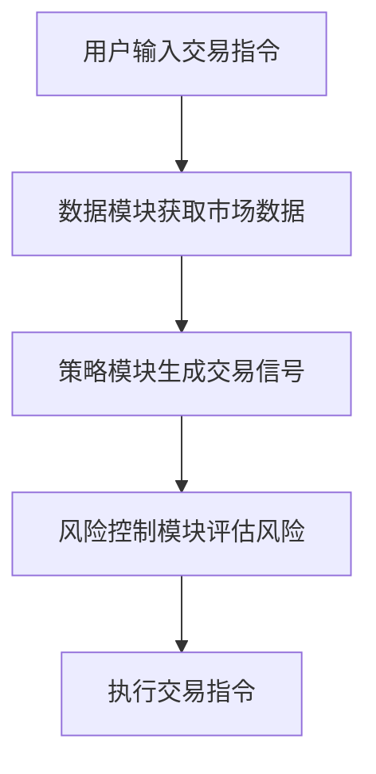
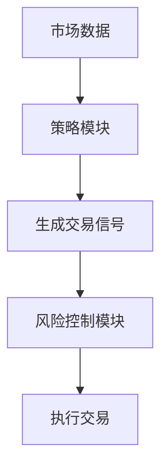
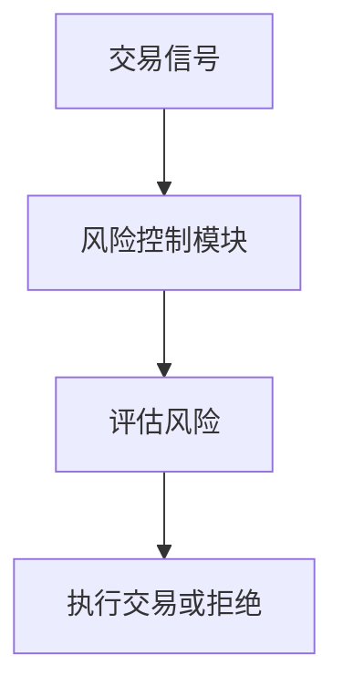
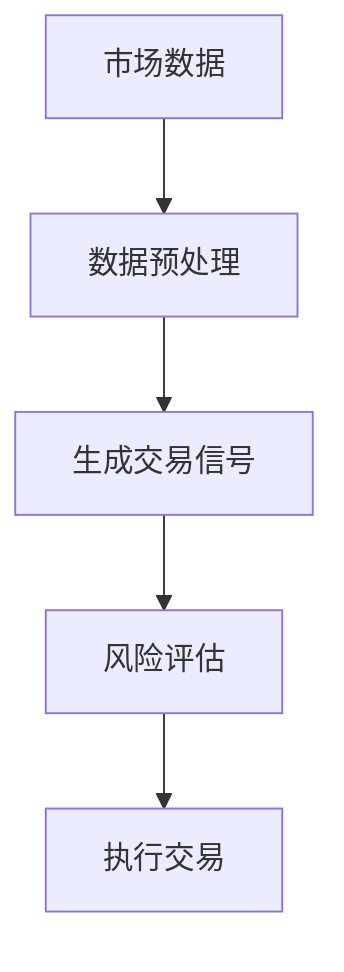

                 


**# AI Agent的强化学习在自动化交易中的应用**

**关键词：** AI Agent, 强化学习, 自动化交易, 算法原理, 系统架构, 项目实战

**摘要：**  
本文探讨AI Agent如何利用强化学习技术实现自动化交易系统的构建与优化。通过分析强化学习的核心算法、AI Agent的系统架构设计以及实际项目案例，深入解析强化学习在金融交易中的应用潜力。本文将带领读者从理论到实践，全面理解如何利用AI Agent进行自动化交易。

---

**## 第一部分: AI Agent与强化学习基础**

**## 第1章: AI Agent与强化学习概述**

### **1.1 AI Agent的基本概念**

#### **1.1.1 AI Agent的定义与特点**
- **定义：** AI Agent是指在特定环境中，能够感知环境并采取行动以实现目标的智能实体。
- **特点：**  
  - **自主性：** 能够独立决策和行动。  
  - **反应性：** 能够实时感知环境并做出响应。  
  - **目标导向性：** 行动基于明确的目标。  
  - **学习能力：** 能够通过经验优化决策策略。  

#### **1.1.2 AI Agent的类型与应用场景**
- **类型：**  
  - **简单反射型：** 基于规则的反应式AI Agent。  
  - **基于模型的：** 使用内部模型进行决策的AI Agent。  
  - **强化学习型：** 通过与环境交互学习策略的AI Agent。  
- **应用场景：**  
  - 自动化交易：AI Agent能够根据市场数据做出买卖决策。  
  - 自动驾驶：AI Agent能够实时感知环境并做出驾驶决策。  
  - 智能客服：AI Agent能够与用户交互并提供服务。  

#### **1.1.3 AI Agent与强化学习的关系**
- 强化学习为AI Agent提供了自适应决策的能力。  
- AI Agent为强化学习提供了一个智能体框架，使其能够在复杂环境中应用。

### **1.2 强化学习的基本概念**

#### **1.2.1 强化学习的定义与特点**
- **定义：** 强化学习是一种通过智能体与环境交互，学习最优策略的方法。  
- **特点：**  
  - **无监督：** 智能体通过与环境的互动获得反馈。  
  - **目标导向：** 行动基于最大化累计奖励。  
  - **经验驱动：** 通过经验不断优化策略。  

#### **1.2.2 强化学习的核心要素：状态、动作、奖励**
- **状态（State）：** 智能体所处环境的描述。  
- **动作（Action）：** 智能体在给定状态下采取的行为。  
- **奖励（Reward）：** 智能体行为的结果反馈，用于指导策略优化。  

#### **1.2.3 强化学习与监督学习的区别**
- **监督学习：** 基于标记数据进行学习。  
- **强化学习：** 基于与环境的互动进行学习。  

### **1.3 AI Agent在自动化交易中的应用背景**

#### **1.3.1 自动化交易的定义与特点**
- **定义：** 自动化交易是指由计算机系统自动执行交易指令的过程。  
- **特点：**  
  - **快速决策：** 系统能够在毫秒级别做出决策。  
  - **高效率：** 能够处理大量数据并快速执行交易。  
  - **低延迟：** 交易系统需要极低的响应时间。  

#### **1.3.2 强化学习在自动化交易中的优势**
- **自适应性：** 能够根据市场变化动态调整交易策略。  
- **数据驱动：** 通过历史数据学习最优策略。  
- **高效性：** 能够在短时间内做出大量决策。  

#### **1.3.3 当前市场中的应用现状与挑战**
- **现状：** 强化学习已经在高频交易、算法交易等领域得到应用。  
- **挑战：**  
  - **市场复杂性：** 市场环境高度动态且不可预测。  
  - **数据稀疏性：** 高频交易数据的获取和处理难度大。  
  - **监管风险：** 自动化交易可能引发市场波动和监管问题。  

### **1.4 本章小结**
本章介绍了AI Agent和强化学习的基本概念，并探讨了强化学习在自动化交易中的应用背景和优势。下一章将深入分析强化学习的核心算法。

---

**## 第二部分: 强化学习算法原理**

**## 第2章: 强化学习的核心算法**

### **2.1 马尔可夫决策过程（MDP）**

#### **2.1.1 状态空间与动作空间的定义**
- **状态空间（State Space）：** 所有可能的状态集合。  
- **动作空间（Action Space）：** 所有可能的动作集合。  

#### **2.1.2 奖励函数的设计**
- **奖励函数（Reward Function）：** 定义智能体在每一步行动后获得的奖励。  
- **目标：** 最大化累计奖励。  

#### **2.1.3 策略与价值函数的定义**
- **策略（Policy）：** 定义智能体在给定状态下选择动作的概率分布。  
- **价值函数（Value Function）：** 衡量一个状态或状态-动作对的“价值”。  

### **2.2 Q-learning算法**

#### **2.2.1 Q-learning的基本原理**
- **Q值更新公式：**  
  $$ Q(s, a) = Q(s, a) + \alpha (r + \gamma \max Q(s', a') - Q(s, a)) $$  
  其中，$\alpha$ 是学习率，$\gamma$ 是折扣因子。  

#### **2.2.2 Q-learning在交易中的应用**
- **示例：** 假设智能体在股票交易中选择买入、卖出或持有三种动作，Q-learning通过不断更新Q值，找到最优策略。  

#### **2.2.3 Q-learning的优缺点**
- **优点：** 简单易实现，适合离散状态空间。  
- **缺点：** 需要遍历所有状态-动作对，效率较低。  

### **2.3 Deep Q-Networks（DQN）**

#### **2.3.1 DQN算法的原理**
- **网络结构：** 使用卷积神经网络或全连接神经网络近似Q值函数。  
- **经验回放：** 通过存储历史经验，减少策略的贪心性。  

#### **2.3.2 DQN在交易中的应用**
- **示例：** DQN通过历史价格数据和市场情绪数据，学习最优交易策略。  

#### **2.3.3 DQN的优缺点**
- **优点：** 解决了Q-learning的效率问题，适合高维状态空间。  
- **缺点：** 网络训练不稳定，需要大量数据支持。  

### **2.4 算法优缺点分析**

#### **2.4.1 Q-learning的优缺点**
- **优点：** 简单，适用于小规模问题。  
- **缺点：** 需要遍历所有状态，效率低。  

#### **2.4.2 DQN的优缺点**
- **优点：** 适合高维状态空间，学习效率高。  
- **缺点：** 网络训练不稳定，需要大量数据。  

#### **2.4.3 算法选择的注意事项**
- **数据规模：** 数据量小选择Q-learning，数据量大选择DQN。  
- **计算资源：** DQN需要较高的计算资源。  

### **2.5 本章小结**
本章详细讲解了Q-learning和DQN算法，并分析了它们在自动化交易中的应用和优缺点。下一章将探讨AI Agent的系统架构设计。

---

**## 第三部分: AI Agent的系统架构设计**

**## 第3章: AI Agent的系统架构**

### **3.1 系统功能需求分析**

#### **3.1.1 交易策略的生成与执行**
- **策略生成：** 基于市场数据生成交易信号。  
- **策略执行：** 根据信号执行交易指令。  

#### **3.1.2 市场数据的实时获取与处理**
- **数据获取：** 实时获取股票、期货等市场数据。  
- **数据处理：** 对数据进行清洗、特征提取等预处理。  

#### **3.1.3 风险控制与收益优化**
- **风险控制：** 设定止损、止盈等机制。  
- **收益优化：** 通过策略优化提高收益。  

### **3.2 系统架构设计**

#### **3.2.1 系统模块划分**
- **数据模块：** 负责数据获取和处理。  
- **策略模块：** 负责策略生成和执行。  
- **风险控制模块：** 负责风险管理和优化。  

#### **3.2.2 系统组件之间的交互关系**
- **数据模块 → 策略模块：** 提供市场数据支持策略生成。  
- **策略模块 → 风险控制模块：** 提交交易指令，风险控制模块进行风险评估。  

#### **3.2.3 系统架构的优化与扩展**
- **模块化设计：** 各模块相对独立，便于维护和扩展。  
- **高可用性：** 确保系统在故障情况下仍能正常运行。  

### **3.3 系统接口设计**

#### **3.3.1 数据接口的设计**
- **数据接口：** 提供市场数据的获取和处理接口。  

#### **3.3.2 策略接口的设计**
- **策略接口：** 提供策略生成和执行的接口。  

#### **3.3.3 风险控制接口的设计**
- **风险控制接口：** 提供风险管理的接口，如止损、止盈等。  

### **3.4 系统交互流程图**

#### **3.4.1 交易流程的可视化**


#### **3.4.2 策略执行的可视化**


#### **3.4.3 风险控制的可视化**


### **3.5 本章小结**
本章详细设计了AI Agent的系统架构，包括模块划分、接口设计和交互流程图。下一章将通过项目实战进一步探讨系统实现。

---

**## 第四部分: 项目实战与实现**

**## 第4章: 自动化交易系统的实现**

### **4.1 环境搭建与工具安装**

#### **4.1.1 开发环境的选择**
- **操作系统：** Linux或Windows。  
- **编程语言：** Python。  
- **开发工具：** PyCharm或VS Code。  

#### **4.1.2 工具安装**
- **数据获取工具：** 如Yahoo Finance API。  
- **算法交易框架：** 如Backtrader或Zipline。  
- **深度学习框架：** 如TensorFlow或Keras。  

### **4.2 系统核心实现源代码**

#### **4.2.1 数据获取与预处理**
```python
import pandas as pd
import numpy as np

# 获取市场数据
def get_market_data(ticker, start_date, end_date):
    data = pd.DataFrame()
    # 假设data是通过API获取的DataFrame
    return data

# 数据预处理
def preprocess_data(data):
    # 假设data是经过清洗和特征提取后的数据
    return data
```

#### **4.2.2 强化学习算法实现**
```python
import tensorflow as tf
from tensorflow.keras import layers

# DQN网络模型
class DQNetwork:
    def __init__(self, state_space, action_space):
        self.model = self.build_model(state_space, action_space)
    
    def build_model(self, state_space, action_space):
        model = tf.keras.Sequential()
        model.add(layers.Dense(64, activation='relu', input_dim=state_space))
        model.add(layers.Dense(64, activation='relu'))
        model.add(layers.Dense(action_space, activation='linear'))
        model.compile(optimizer='adam', loss='mse')
        return model

    def predict(self, state):
        return self.model.predict(state)

    def train(self, state, action, reward, next_state):
        target = reward + gamma * np.max(self.model.predict(next_state))
        target = target.reshape(-1, 1)
        self.model.fit(state, target, epochs=1, verbose=0)
```

#### **4.2.3 交易策略实现**
```python
import numpy as np

class TradingStrategy:
    def __init__(self, model):
        self.model = model
        self.states = []
        self.actions = []
        self.rewards = []
        self.next_states = []
    
    def take_action(self, state):
        # 获取所有动作的Q值
        q_values = self.model.predict(state)
        action = np.argmax(q_values[0])
        return action
    
    def store_experience(self, state, action, reward, next_state):
        self.states.append(state)
        self.actions.append(action)
        self.rewards.append(reward)
        self.next_states.append(next_state)
    
    def replay_experience(self, batch_size):
        indices = np.random.randint(0, len(self.states), batch_size)
        for i in indices:
            state = self.states[i]
            action = self.actions[i]
            reward = self.rewards[i]
            next_state = self.next_states[i]
            self.model.train(state, action, reward, next_state)
```

#### **4.2.4 风险控制实现**
```python
class RiskControl:
    def __init__(self, risk_level):
        self.risk_level = risk_level
    
    def assess_risk(self, position):
        # 假设position是当前持仓
        if position > self.risk_level:
            return 'high'
        elif position < -self.risk_level:
            return 'low'
        else:
            return 'normal'
    
    def manage_risk(self, position, action):
        # 根据风险评估结果调整持仓
        if action == 'buy':
            return min(position + 1, self.risk_level)
        elif action == 'sell':
            return max(position - 1, -self.risk_level)
        else:
            return position
```

### **4.3 代码应用解读与分析**

#### **4.3.1 数据获取与预处理**
- **功能：** 获取市场数据并进行预处理，提取有用的特征。  
- **实现：** 使用API获取数据，并进行清洗和特征工程。  

#### **4.3.2 强化学习算法实现**
- **功能：** 实现DQN算法，训练AI Agent做出最优决策。  
- **实现：** 使用Keras构建神经网络，通过经验回放优化策略。  

#### **4.3.3 交易策略实现**
- **功能：** 根据当前状态生成交易信号，指导交易执行。  
- **实现：** 通过策略类实现经验存储和策略执行。  

#### **4.3.4 风险控制实现**
- **功能：** 实现风险评估和管理，确保交易安全。  
- **实现：** 根据持仓情况调整交易策略，控制风险。  

### **4.4 实际案例分析**

#### **4.4.1 系统输入与输出**
- **输入：** 市场数据、持仓情况。  
- **输出：** 交易信号（买入、卖出、持有）。  

#### **4.4.2 系统运行流程**


#### **4.4.3 系统性能分析**
- **交易结果：** 记录每笔交易的收益和亏损。  
- **系统稳定性：** 监控系统的运行状态，及时发现和解决问题。  

### **4.5 项目小结**
本章通过实际项目案例，详细讲解了自动化交易系统的实现过程，包括环境搭建、代码实现和案例分析。下一章将探讨高级主题和扩展内容。

---

**## 第五部分: 高级主题与扩展**

**## 第5章: 高级主题与扩展**

### **5.1 多智能体强化学习**

#### **5.1.1 多智能体强化学习的定义与特点**
- **定义：** 涉及多个智能体的强化学习问题。  
- **特点：** 智能体之间可以协作或竞争。  

#### **5.1.2 多智能体强化学习在交易中的应用**
- **示例：** 多个智能体协同完成复杂的交易任务。  

### **5.2 模型解释性与可解释性**

#### **5.2.1 模型解释性的定义与重要性**
- **定义：** 模型的决策过程可以被理解和解释。  
- **重要性：** 便于分析和优化交易策略。  

#### **5.2.2 提高模型可解释性的方法**
- **使用可解释性模型：** 如线性回归模型。  
- **可视化工具：** 如SHAP值、LIME解释。  

### **5.3 实际应用中的注意事项**

#### **5.3.1 数据质量问题**
- **数据清洗：** 确保数据的准确性和完整性。  
- **数据特征工程：** 提取有用的特征，提高模型性能。  

#### **5.3.2 策略漂移问题**
- **策略漂移：** 随着市场变化，策略逐渐失效。  
- **应对措施：** 定期更新策略，根据市场变化调整参数。  

#### **5.3.3 网络延迟问题**
- **网络延迟：** 影响交易决策的实时性。  
- **应对措施：** 优化网络架构，使用低延迟的通信方式。  

### **5.4 最佳实践 Tips**

#### **5.4.1 数据处理**
- 使用高质量的数据源，确保数据的准确性和实时性。  

#### **5.4.2 策略优化**
- 定期回测和优化策略，确保策略的有效性。  

#### **5.4.3 风险管理**
- 设定合理的止损和止盈机制，控制交易风险。  

### **5.5 本章小结**
本章探讨了AI Agent的强化学习在自动化交易中的高级主题和扩展内容，包括多智能体强化学习、模型解释性以及实际应用中的注意事项。

---

**# 作者：AI天才研究院/AI Genius Institute & 禅与计算机程序设计艺术 /Zen And The Art of Computer Programming**

---

**本文通过系统化的分析与实践，深入探讨了AI Agent的强化学习在自动化交易中的应用，从理论到实践，全面解析了如何利用强化学习技术构建高效的自动化交易系统。通过本文的学习，读者将能够掌握强化学习的核心算法、系统架构设计以及实际项目实现的关键要点，为未来的深入研究和应用奠定坚实的基础。**

