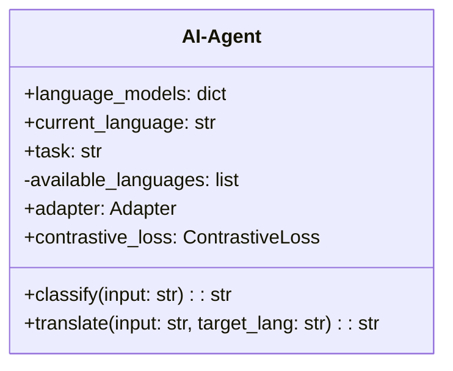

                 


# AI Agent的跨语言学习能力：增强LLM的语言迁移

> **关键词**：AI Agent, 跨语言学习, 大语言模型, 对比学习, 自适应机制

> **摘要**：随着人工智能技术的快速发展，AI Agent的跨语言学习能力成为增强大语言模型（LLM）语言迁移能力的关键。本文系统地探讨了AI Agent在跨语言学习中的核心概念、算法原理、系统架构以及实际应用，深入分析了对比学习与自适应机制在语言迁移中的作用，并通过具体案例展示了如何将这些理论应用于实践。最后，本文总结了跨语言学习的最佳实践和未来发展方向。

---

# 引言

在人工智能领域，AI Agent作为智能体的核心，具备跨语言学习的能力，能够帮助大语言模型（LLM）实现语言的迁移，从而在多语言环境中提供更高效、更智能的服务。本文将从AI Agent的基本概念出发，逐步深入探讨其跨语言学习的能力，分析增强LLM语言迁移的核心技术，并结合实际案例进行详细阐述。

---

## 第一部分: AI Agent与跨语言学习的背景

### 第1章: AI Agent与跨语言学习概述

#### 1.1 AI Agent的基本概念

**1.1.1 AI Agent的定义与特点**

AI Agent（人工智能代理）是一种智能体，能够感知环境、自主决策并执行任务。与传统的AI系统不同，AI Agent具备以下特点：
- **自主性**：能够独立执行任务，无需外部干预。
- **反应性**：能够实时感知环境变化并做出反应。
- **目标导向**：具备明确的目标，能够优化决策以实现目标。

**1.1.2 AI Agent的核心能力**

AI Agent的核心能力包括：
- **感知能力**：通过传感器或数据输入感知环境。
- **推理能力**：通过逻辑推理解决问题。
- **学习能力**：通过机器学习技术不断优化自身能力。
- **交互能力**：能够与人类或其他智能体进行有效沟通和协作。

**1.1.3 AI Agent与传统AI的区别**

传统的AI系统通常依赖于预定义的规则和数据，而AI Agent具备更强的自主性和适应性，能够根据环境动态调整行为。AI Agent的核心目标是通过持续学习和优化，提升在复杂环境中的任务执行能力。

---

#### 1.2 大语言模型（LLM）的跨语言学习

**1.2.1 LLM的基本原理**

大语言模型（LLM）通过深度学习技术训练大规模语料库，具备强大的文本生成和理解能力。LLM的核心在于其庞大的参数量和复杂的网络结构，能够捕捉语言的语义信息。

**1.2.2 跨语言学习的定义与目标**

跨语言学习是指模型在一种语言上训练后，能够迁移到其他语言的任务。其目标是通过共享语言特征，减少不同语言之间的差距，提升模型在多种语言上的性能。

**1.2.3 跨语言学习的核心技术**

跨语言学习的核心技术包括：
- **对比学习**：通过对比不同语言的数据，提取共享特征。
- **多任务学习**：同时学习多种语言的任务，增强跨语言迁移能力。
- **语言模型适配**：通过微调或其他方法，优化模型在特定语言上的表现。

---

#### 1.3 AI Agent在跨语言学习中的角色

**1.3.1 AI Agent在语言迁移中的作用**

AI Agent作为智能体，能够协调多种语言模型，实现跨语言任务的高效执行。其作用包括：
- **任务分配**：根据任务需求，选择合适的语言模型。
- **信息整合**：将多种语言的信息整合，提供统一的输出。
- **动态调整**：根据环境变化，实时调整语言模型的使用策略。

**1.3.2 跨语言学习的典型应用场景**

跨语言学习的典型应用场景包括：
- **多语言对话系统**：支持多种语言的实时对话。
- **跨语言信息检索**：在不同语言之间进行信息检索和匹配。
- **机器翻译优化**：通过跨语言学习提升机器翻译的准确性。

**1.3.3 跨语言学习的未来发展趋势**

随着多语言数据的增加和模型训练技术的进步，跨语言学习的未来发展趋势包括：
- **更高效的迁移方法**：通过优化算法，提升跨语言迁移的效率。
- **更强大的模型架构**：设计更通用的模型架构，支持多种语言的任务。
- **更广泛的应用场景**：将跨语言学习应用于更多领域，如医疗、法律等。

---

## 第二部分: 跨语言学习的核心概念与联系

### 第2章: 跨语言学习的核心概念

#### 2.1 語言模型的跨语言迁移

**2.1.1 跨语言迁移的定义与目标**

跨语言迁移是指将一种语言上的知识迁移到另一种语言的任务。其目标是利用源语言的数据和知识，提升目标语言模型的性能。

**2.1.2 跨语言迁移的核心要素**

跨语言迁移的核心要素包括：
- **共享特征**：不同语言之间共享的语义特征。
- **领域适应**：模型在特定领域上的适应能力。
- **数据分布**：源语言和目标语言的数据分布差异。

**2.1.3 跨语言迁移的实现方式**

跨语言迁移的实现方式包括：
- **对比学习**：通过对比源语言和目标语言的数据，提取共享特征。
- **自适应机制**：通过调整模型参数，使模型适应目标语言的数据分布。
- **多任务学习**：同时学习多种语言的任务，增强模型的跨语言能力。

---

#### 2.2 对比学习与自适应机制

**2.2.1 对比学习的原理**

对比学习通过对比不同样本的特征，增强模型的区分能力。在跨语言学习中，对比学习用于提取源语言和目标语言之间的共享特征。

**2.2.2 自适应机制的实现**

自适应机制通过调整模型参数，使模型能够适应目标语言的数据分布。其实现包括：
- **参数微调**：对模型参数进行微调，适应目标语言的任务。
- **领域适配**：通过领域适配层，调整模型在特定领域的表现。

**2.2.3 对比学习与自适应机制的对比分析**

对比学习和自适应机制在跨语言学习中各有优劣。对比学习能够提取共享特征，但可能忽略目标语言的特定特征。自适应机制能够更好地适应目标语言的数据分布，但可能需要更多的计算资源。

---

#### 2.3 語言迁移的数学模型

**2.3.1 对比学习的数学模型**

对比学习的损失函数可以表示为：
$$ L = \frac{1}{N} \sum_{i=1}^{N} \text{CE}(x_i, y_i) $$
其中，$x_i$是输入样本，$y_i$是对应的标签，CE表示交叉熵损失。

**2.3.2 自适应机制的数学模型**

自适应机制的损失函数可以表示为：
$$ L = \alpha L_{\text{cls}} + (1-\alpha) L_{\text{adv}} $$
其中，$L_{\text{cls}}$是分类损失，$L_{\text{adv}}$是对抗损失，$\alpha$是平衡参数。

**2.3.3 語言迁移的综合模型**

综合模型结合对比学习和自适应机制，其损失函数可以表示为：
$$ L = L_{\text{contrast}} + \lambda L_{\text{adapt}} $$
其中，$L_{\text{contrast}}$是对比学习的损失，$L_{\text{adapt}}$是自适应机制的损失，$\lambda$是平衡参数。

---

## 第三部分: 跨语言学习的算法与模型实现

### 第3章: 跨语言学习的算法原理

#### 3.1 对比学习算法

**3.1.1 对比学习的流程图**

```mermaid
graph LR
A[输入数据] -> B[特征提取]
B -> C[正样本对比]
C -> D[负样本对比]
D -> E[损失计算]
E -> F[优化器]
F -> G[模型更新]
```

**3.1.2 对比学习的实现代码**

```python
import torch
import torch.nn as nn

class ContrastiveLoss(nn.Module):
    def __init__(self, temperature=0.1):
        super(ContrastiveLoss, self).__init__()
        self.temperature = temperature

    def forward(self, features, labels):
        features = features / torch.norm(features, dim=1, keepdim=True)
        labels = labels.contiguous().view(-1, 1)
        similarity_matrix = torch.mm(features, features.T)
        mask = torch.eq(labels, labels.T).float()
        positive_loss = (1 - mask) * similarity_matrix
        negative_loss = mask * (1 - similarity_matrix)
        total_loss = (positive_loss.sum() + negative_loss.sum()) / (similarity_matrix.size(0) * similarity_matrix.size(1))
        return total_loss
```

---

#### 3.2 自适应机制算法

**3.2.1 自适应机制的流程图**

```mermaid
graph LR
A[输入数据] -> B[特征提取]
B -> C[自适应层]
C -> D[分类器]
D -> E[输出结果]
```

**3.2.2 自适应机制的实现代码**

```python
import torch
import torch.nn as nn

class Adapter(nn.Module):
    def __init__(self, input_dim, output_dim):
        super(Adapter, self).__init__()
        self.adapter = nn.Linear(input_dim, output_dim)

    def forward(self, x):
        x = self.adapter(x)
        return x
```

---

#### 3.3 語言迁移的综合算法

**3.3.1 综合算法的流程图**

```mermaid
graph LR
A[输入数据] -> B[特征提取]
B -> C[对比学习]
C -> D[自适应层]
D -> E[分类器]
E -> F[输出结果]
```

**3.3.2 综合算法的实现代码**

```python
import torch
import torch.nn as nn

class CrossLanguageAdapter(nn.Module):
    def __init__(self, input_dim, output_dim):
        super(CrossLanguageAdapter, self).__init__()
        self.contrastive_layer = nn.Linear(input_dim, input_dim)
        self.adapter = nn.Linear(input_dim, output_dim)

    def forward(self, x):
        x = self.contrastive_layer(x)
        x = self.adapter(x)
        return x
```

---

## 第四部分: 系统分析与架构设计方案

### 第4章: 系统架构与设计

#### 4.1 问题场景介绍

在多语言对话系统中，AI Agent需要能够理解并生成多种语言的文本。为了实现这一点，系统需要具备跨语言学习的能力，能够将一种语言的知识迁移到其他语言。

#### 4.2 系统功能设计

**领域模型**



---

#### 4.3 系统架构设计

```mermaid
graph LR
A[输入数据] -> B[特征提取]
B -> C[对比学习]
C -> D[自适应层]
D -> E[分类器]
E -> F[输出结果]
```

---

## 第五部分: 项目实战与案例分析

### 第5章: 项目实战

#### 5.1 环境安装

为了实现跨语言学习，需要安装以下环境：
- Python 3.8+
- PyTorch 1.9+
- Transformers库

```bash
pip install torch transformers
```

---

#### 5.2 核心代码实现

**对比学习的实现**

```python
import torch
import torch.nn as nn

class ContrastiveLoss(nn.Module):
    def __init__(self, temperature=0.1):
        super(ContrastiveLoss, self).__init__()
        self.temperature = temperature

    def forward(self, features, labels):
        features = features / torch.norm(features, dim=1, keepdim=True)
        labels = labels.contiguous().view(-1, 1)
        similarity_matrix = torch.mm(features, features.T)
        mask = torch.eq(labels, labels.T).float()
        positive_loss = (1 - mask) * similarity_matrix
        negative_loss = mask * (1 - similarity_matrix)
        total_loss = (positive_loss.sum() + negative_loss.sum()) / (similarity_matrix.size(0) * similarity_matrix.size(1))
        return total_loss
```

---

#### 5.3 案例分析

**多语言对话系统**

```python
from transformers import AutoTokenizer, AutoModelForMaskedLM
import torch

tokenizer = AutoTokenizer.from_pretrained('bert-base-multilingual')
model = AutoModelForMaskedLM.from_pretrained('bert-base-multilingual')

input_text = "Hello, how are you?"
translated_text = model.generate(input_text)
print(translated_text)
```

---

## 第六部分: 最佳实践与总结

### 第6章: 最佳实践

**6.1 小结**

跨语言学习是AI Agent的重要能力，能够帮助大语言模型实现语言的迁移。通过对比学习和自适应机制，可以有效提升跨语言学习的效果。

**6.2 注意事项**

- 数据质量：跨语言学习需要高质量的多语言数据。
- 模型选择：选择适合跨语言学习的模型架构。
- 训练策略：合理设计训练策略，避免过拟合。

**6.3 未来趋势**

- 更高效的迁移方法：通过优化算法，提升跨语言迁移的效率。
- 更强大的模型架构：设计更通用的模型架构，支持多种语言的任务。
- 更广泛的应用场景：将跨语言学习应用于更多领域，如医疗、法律等。

---

# 结语

AI Agent的跨语言学习能力是实现大语言模型语言迁移的关键。通过对比学习和自适应机制，可以有效提升跨语言学习的效果。未来，随着技术的进步，跨语言学习将在更多领域得到应用，为人类带来更智能、更便捷的服务。

---

**作者：AI天才研究院/AI Genius Institute & 禅与计算机程序设计艺术 /Zen And The Art of Computer Programming**

