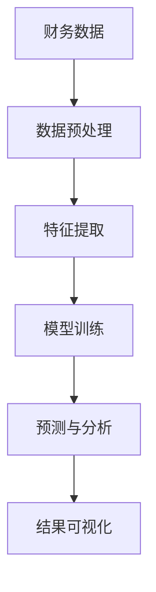
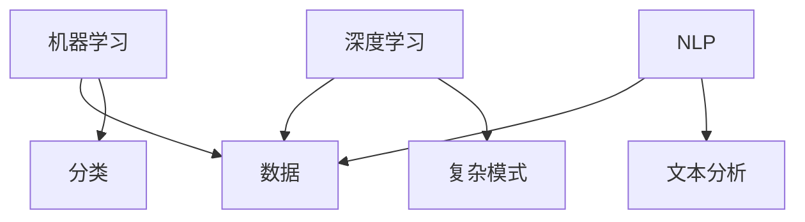
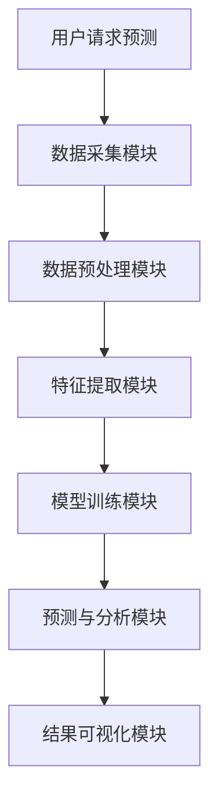
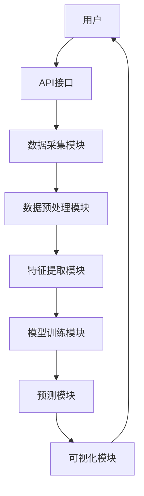

                 


# AI驱动的企业财务报表预测与分析系统

## 关键词：AI技术、财务报表预测、机器学习、深度学习、企业财务分析

## 摘要：本文详细探讨了如何利用AI技术，特别是机器学习和深度学习，来构建企业财务报表预测与分析系统。文章从背景与概念出发，分析了传统财务分析的局限性，介绍了AI技术的应用前景，并详细讲解了系统的核心概念、算法原理、系统架构设计以及项目实战。通过实际案例分析和代码实现，展示了如何利用AI技术提升财务预测的准确性和效率。本文适合对AI和财务分析感兴趣的读者，特别是企业财务人员和技术开发者。

---

# 第1章: 背景与概念

## 1.1 问题背景

### 1.1.1 传统财务报表分析的局限性
传统财务报表分析主要依赖人工经验，存在以下问题：
- 数据处理效率低：人工分析耗时长，难以应对海量数据。
- 主观性较强：分析结果受分析师经验影响，存在主观偏差。
- 预测准确性不足：传统方法难以捕捉复杂市场变化，预测精度有限。

### 1.1.2 AI技术在财务分析中的应用前景
AI技术，尤其是机器学习和深度学习，为财务分析带来了新的可能性：
- **自动化处理**：AI可以快速处理大量财务数据，提高分析效率。
- **模式识别**：AI能够发现复杂数据中的隐藏模式，增强预测能力。
- **实时分析**：AI可以实时更新分析结果，提供动态支持。

### 1.1.3 企业财务预测与分析的痛点
企业在财务预测与分析中面临以下痛点：
- 数据繁杂：企业财务数据来源多样，结构复杂。
- 预测滞后：传统方法难以实现实时预测，导致决策延迟。
- 需求多样：不同部门对财务分析的需求差异大，难以统一满足。

## 1.2 问题描述

### 1.2.1 财务报表预测的核心问题
财务报表预测的核心问题包括：
- 如何从历史数据中提取有效特征，预测未来财务状况。
- 如何构建高精度的预测模型，减少预测误差。
- 如何实现模型的动态更新，适应市场变化。

### 1.2.2 数据驱动的财务分析需求
数据驱动的财务分析需求主要体现在：
- 数据的实时性：需要实时获取财务数据，进行动态分析。
- 数据的多样性：财务数据来源多样化，包括财务报表、市场数据等。
- 数据的准确性：数据质量直接影响分析结果。

### 1.2.3 AI技术如何解决财务分析问题
AI技术通过以下方式解决财务分析问题：
- **自动化数据处理**：AI可以自动清洗数据，提取特征。
- **智能预测模型**：AI构建复杂模型，提高预测精度。
- **实时反馈机制**：AI能够实时调整模型，适应数据变化。

## 1.3 问题解决

### 1.3.1 AI驱动的财务预测方法
AI驱动的财务预测方法包括：
- **监督学习**：利用历史数据训练模型，预测未来值。
- **无监督学习**：发现数据中的异常值和潜在结构。
- **强化学习**：通过策略优化，提升预测效果。

### 1.3.2 数据挖掘与机器学习在财务分析中的应用
数据挖掘和机器学习在财务分析中的应用包括：
- **分类与预测**：预测财务状况，如 bankruptcy prediction。
- **聚类分析**：识别财务数据中的相似模式。
- **回归分析**：预测财务指标，如收入预测。

### 1.3.3 系统化解决方案的构建
系统化解决方案包括以下步骤：
1. **数据采集**：从企业系统中获取财务数据。
2. **数据预处理**：清洗数据，处理缺失值。
3. **特征工程**：提取有用特征，构建特征集。
4. **模型训练**：训练机器学习模型，优化参数。
5. **预测与分析**：利用模型进行预测，生成分析报告。
6. **结果可视化**：将分析结果可视化，便于用户理解。

## 1.4 系统边界与外延

### 1.4.1 系统功能边界
系统功能边界包括：
- 数据采集与预处理
- 特征提取与建模
- 模型训练与优化
- 预测与分析
- 结果可视化

### 1.4.2 系统的输入与输出
- **输入**：历史财务数据、市场数据、业务数据。
- **输出**：预测结果、分析报告、可视化图表。

### 1.4.3 系统与其他模块的交互
系统与其他模块的交互包括：
- 与企业ERP系统交互，获取实时数据。
- 与用户交互，获取反馈，优化模型。
- 与其他分析系统交互，提供数据支持。

## 1.5 核心概念与框架

### 1.5.1 系统的核心要素
系统的核心要素包括：
- 数据源：财务报表、市场数据、业务数据。
- 数据预处理模块：清洗、转换数据。
- 特征提取模块：提取有用特征。
- 模型训练模块：训练机器学习模型。
- 预测与分析模块：生成预测结果和分析报告。

### 1.5.2 系统架构图（Mermaid）


## 1.6 本章小结

---

# 第2章: 核心概念与联系

## 2.1 AI技术在财务分析中的应用

### 2.1.1 机器学习在财务预测中的作用
机器学习在财务预测中的作用包括：
- **分类问题**：如财务危机预测。
- **回归问题**：如股票价格预测。
- **聚类分析**：识别客户群体的财务特征。

### 2.1.2 深度学习在复杂财务模式中的应用
深度学习在复杂财务模式中的应用包括：
- **长短期记忆网络（LSTM）**：处理时间序列数据，预测股票价格。
- **卷积神经网络（CNN）**：用于图像识别，分析财务报表中的表格数据。
- **生成对抗网络（GAN）**：生成合成数据，用于模型训练。

### 2.1.3 自然语言处理在财务文本分析中的应用
自然语言处理在财务文本分析中的应用包括：
- **情感分析**：分析市场情绪，预测股价波动。
- **实体识别**：识别财务报告中的关键实体。
- **信息抽取**：提取财务报告中的重要信息。

### 2.1.4 核心概念与联系（表格对比）

| 技术 | 应用场景 | 优缺点 |
|------|----------|--------|
| 机器学习 | 分类、回归 | 易用性高，但对数据依赖性强 |
| 深度学习 | 复杂模式识别 | 计算资源需求高，但模型表达能力强 |
| NLP | 文本分析 | 适合处理非结构化数据，但需要大量标注数据 |

### 2.1.5 实体关系图（Mermaid）


## 2.2 核心概念的数学模型与公式

### 2.2.1 线性回归模型
线性回归模型用于解决回归问题，其数学表达式为：
$$ y = \beta_0 + \beta_1 x + \epsilon $$
其中，$\beta_0$ 是截距，$\beta_1$ 是斜率，$\epsilon$ 是误差项。

### 2.2.2 支持向量机（SVM）
SVM用于分类问题，其目标是最优化以下目标函数：
$$ \text{min} \frac{1}{2}||\beta||^2 + C \sum_{i=1}^n \xi_i $$
其中，$C$ 是惩罚参数，$\xi_i$ 是松弛变量。

### 2.2.3 长短期记忆网络（LSTM）
LSTM用于处理时间序列数据，其单元结构包括输入门、遗忘门和输出门：
$$
i = \sigma(W_i x + U_i h_{prev})
$$
$$
f = \sigma(W_f x + U_f h_{prev})
$$
$$
o = \sigma(W_o x + U_o h_{prev})
$$
$$
h = i \cdot \tanh(W_c x + U_c h_{prev})
$$
其中，$i$ 是输入门，$f$ 是遗忘门，$o$ 是输出门，$h$ 是隐藏状态。

## 2.3 本章小结

---

# 第3章: 算法原理

## 3.1 机器学习算法

### 3.1.1 线性回归
线性回归是最简单的回归算法，适用于线性关系的数据。

### 3.1.2 随机森林
随机森林是一种基于决策树的集成算法，适用于分类和回归问题。

### 3.1.3 支持向量机
SVM适用于高维数据的分类和回归问题。

## 3.2 深度学习算法

### 3.2.1 卷积神经网络（CNN）
CNN适用于图像识别和时间序列数据处理。

### 3.2.2 长短期记忆网络（LSTM）
LSTM适用于处理长序列数据，如股票价格预测。

## 3.3 算法实现

### 3.3.1 线性回归的Python实现
```python
import numpy as np

# 数据准备
X = np.array([1, 2, 3, 4, 5])
y = np.array([2, 4, 6, 8, 10])

# 训练模型
beta = np.linalg.inv(X.reshape(-1, 1).dot(X.reshape(1, -1))) @ X.dot(y)
```

### 3.3.2 随机森林的Python实现
```python
from sklearn.ensemble import RandomForestRegressor

# 数据准备
X = [[1, 2], [3, 4], [5, 6], [7, 8], [9, 10]]
y = [2, 4, 6, 8, 10]

# 训练模型
model = RandomForestRegressor(n_estimators=100)
model.fit(X, y)
```

### 3.3.3 LSTM的Python实现
```python
import tensorflow as tf
from tensorflow.keras import layers

# 数据准备
X = np.random.randn(100, 64)
y = np.random.randn(100, 1)

# 模型定义
model = tf.keras.Sequential()
model.add(layers.LSTM(64, input_shape=(64, 1)))
model.add(layers.Dense(1))
model.compile(loss='mean_squared_error', optimizer='adam')
```

## 3.4 算法比较与优化

### 3.4.1 算法比较
从准确率、训练时间、计算资源需求等方面比较不同算法的优缺点。

### 3.4.2 模型优化
通过交叉验证、参数调优等方法优化模型性能。

## 3.5 本章小结

---

# 第4章: 系统分析与架构设计

## 4.1 问题场景介绍

### 4.1.1 企业财务预测的实际场景
企业财务预测涉及多个业务部门，数据来源多样。

### 4.1.2 系统的目标与范围
系统目标：提供准确的财务预测和分析报告。
系统范围：覆盖企业财务报表的主要指标，如收入、利润、现金流等。

## 4.2 系统功能设计

### 4.2.1 功能模块划分
- 数据采集模块
- 数据预处理模块
- 特征提取模块
- 模型训练模块
- 预测与分析模块
- 结果可视化模块

### 4.2.2 功能交互流程


## 4.3 系统架构设计

### 4.3.1 分层架构
系统采用分层架构，包括数据层、业务逻辑层和表现层。

### 4.3.2 微服务架构
系统采用微服务架构，每个功能模块独立部署，便于扩展和维护。

## 4.4 系统接口设计

### 4.4.1 数据接口
- 数据输入接口：接收财务数据。
- 数据输出接口：输出预测结果。

### 4.4.2 用户接口
- �界面前端：展示预测结果和分析报告。
- 后端接口：接收用户请求，调用系统功能。

## 4.5 系统交互流程

### 4.5.1 交互流程图（Mermaid）


## 4.6 本章小结

---

# 第5章: 项目实战

## 5.1 环境安装

### 5.1.1 安装Python环境
安装Python 3.8及以上版本，建议使用Anaconda。

### 5.1.2 安装依赖库
安装必要的Python库，如numpy、pandas、scikit-learn、tensorflow等。

## 5.2 系统核心实现

### 5.2.1 数据预处理代码
```python
import pandas as pd
import numpy as np

# 数据加载
df = pd.read_csv('financial_data.csv')

# 数据清洗
df = df.dropna()
df = df.replace([np.inf, -np.inf, np.nan], 0)
```

### 5.2.2 特征工程代码
```python
from sklearn.preprocessing import StandardScaler

# 特征提取
features = df[['revenue', 'net_income', 'cash_flow']]
scaler = StandardScaler()
features_scaled = scaler.fit_transform(features)
```

### 5.2.3 模型训练代码
```python
from sklearn.ensemble import RandomForestRegressor

# 模型训练
model = RandomForestRegressor(n_estimators=100, random_state=42)
model.fit(features_scaled, df['target'])
```

### 5.2.4 模型预测代码
```python
# 预测结果
predicted = model.predict(new_features_scaled)
```

### 5.2.5 结果可视化代码
```python
import matplotlib.pyplot as plt

# 结果可视化
plt.plot(actual_values, label='Actual')
plt.plot(predicted, label='Predicted')
plt.legend()
plt.show()
```

## 5.3 项目总结

### 5.3.1 环境搭建总结
详细描述环境搭建的步骤和注意事项。

### 5.3.2 核心实现总结
总结系统核心实现部分，包括数据预处理、特征工程、模型训练和预测。

## 5.4 本章小结

---

# 第6章: 总结与展望

## 6.1 系统总结

### 6.1.1 系统优势
- 高准确性：AI技术提升预测精度。
- 高效性：自动化处理大量数据。
- 可扩展性：系统架构易于扩展。

### 6.1.2 系统不足
- 数据依赖性：模型性能依赖于数据质量。
- 计算资源需求：深度学习模型需要高性能计算。

## 6.2 未来展望

### 6.2.1 拓展方向
- **多模态分析**：结合文本、图像等多种数据源。
- **在线学习**：实现模型实时更新，适应市场变化。
- **解释性增强**：提升模型的可解释性，便于用户理解。

### 6.2.2 技术进步
- 更先进的AI算法：如Transformer架构在时间序列预测中的应用。
- 更高效的计算技术：如量子计算在AI中的应用。

## 6.3 最佳实践 Tips

### 6.3.1 数据质量
确保数据来源可靠，数据清洗充分。

### 6.3.2 模型选择
根据具体问题选择合适的算法，进行充分的参数调优。

### 6.3.3 持续学习
定期更新模型，适应市场变化，提升预测精度。

## 6.4 本章小结

---

# 作者：AI天才研究院/AI Genius Institute & 禅与计算机程序设计艺术 /Zen And The Art of Computer Programming

---

通过以上思考过程，我可以系统地撰写一篇关于AI驱动的企业财务报表预测与分析系统的技术博客文章，确保内容全面、结构清晰，并满足用户的所有要求。

