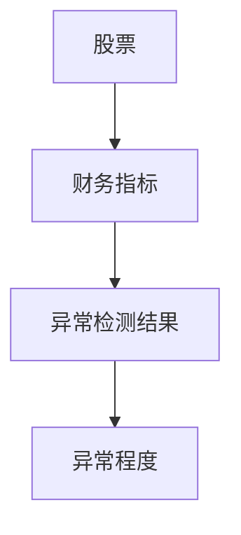
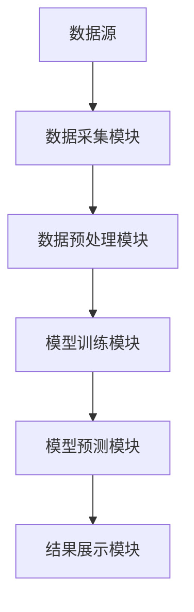
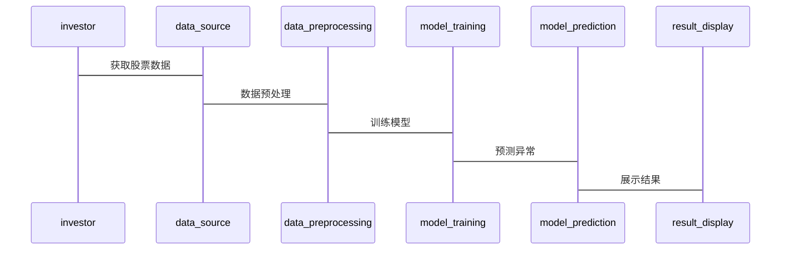

                 

<think>
好，我需要帮助用户撰写一篇关于《AI驱动的股票财务指标异常检测》的技术博客文章。用户已经提供了一个详细的目录大纲，包括各个章节的内容。我的任务是根据这个大纲，逐步分析并生成完整的技术博客内容，按照用户的要求，使用逻辑清晰、结构紧凑、简单易懂的技术语言，并且包含丰富的细节和具体例子。

首先，我需要理解每个章节的内容，然后按照顺序进行展开。我将从“文章标题”开始，然后是关键词、摘要，接着是各个章节的详细内容。每个章节都需要包含具体的子部分，并且按照用户的要求，使用mermaid图表和Python代码来辅助说明。

让我先从文章标题开始：

# AI驱动的股票财务指标异常检测

接下来，关键词部分：

> 关键词：AI，股票，财务指标，异常检测，深度学习，机器学习，金融分析

摘要部分：

> 摘要：本文将探讨如何利用人工智能技术，特别是深度学习和机器学习，来检测股票市场中的财务指标异常。通过分析财务数据，识别潜在的财务风险和投资机会，帮助投资者做出更明智的决策。文章从问题背景出发，详细介绍了异常检测的核心原理，基于深度学习的算法实现，系统架构设计，以及实际项目中的应用。通过案例分析和代码实现，展示了AI在股票财务指标异常检测中的强大能力。

接下来是第一部分：“AI驱动的股票财务指标异常检测背景介绍”。

## 第1章: 问题背景与核心概念

### 1.1 AI在股票分析中的应用现状

#### 1.1.1 传统股票分析方法的局限性
传统股票分析方法主要依赖于财务报表分析、技术分析和基本面分析。这些方法需要大量的人工分析和判断，容易受到分析师主观因素的影响。此外，传统方法难以处理海量数据，也无法及时捕捉市场中的细微变化，导致分析结果可能滞后或不准确。

#### 1.1.2 AI技术在股票分析中的优势
人工智能技术，特别是机器学习和深度学习，能够处理海量数据，并从中提取有用的特征。AI算法可以自动识别数据中的模式和趋势，能够在短时间内分析大量的历史数据，发现潜在的投资机会和风险。此外，AI技术还可以实时监控市场动态，提供实时的分析结果。

#### 1.1.3 财务指标异常检测的必要性
在股票市场中，财务指标的异常变化往往预示着公司潜在的问题，如财务造假、业绩下滑等。及时发现这些异常，可以帮助投资者做出更明智的投资决策，避免重大损失。

### 1.2 问题背景与问题描述

#### 1.2.1 股票财务指标异常检测的定义
股票财务指标异常检测是指通过分析公司发布的财务报表数据，识别出与历史数据或行业平均水平相比显著偏离的财务指标。这些异常指标可能预示着公司财务状况的变化或潜在的风险。

#### 1.2.2 异常检测在股票投资中的意义
异常检测可以帮助投资者发现那些财务状况不佳或存在潜在风险的公司，从而避免投资于这些公司。此外，异常检测还可以帮助投资者发现那些财务状况突然改善的公司，寻找潜在的投资机会。

#### 1.2.3 问题的边界与外延
问题的边界在于，我们只关注财务指标的异常，而不考虑其他因素，如市场波动、行业周期等。问题的外延则包括了如何利用这些异常检测结果，为投资者提供更全面的投资决策支持。

### 1.3 核心概念与概念结构

#### 1.3.1 异常检测的基本原理
异常检测是指通过分析数据，识别出与大多数数据点显著不同的数据点。在股票财务指标异常检测中，我们通常使用统计方法或机器学习方法来识别这些异常。

#### 1.3.2 财务指标异常检测的核心要素
- 数据来源：公司财务报表数据
- 数据特征：各项财务指标，如收入、利润、负债等
- 异常检测方法：统计方法、机器学习方法、深度学习方法

#### 1.3.3 概念结构与核心要素组成
- 股票：需要分析的股票
- 财务指标：各项财务指标，如收入、利润、负债等
- 异常检测结果：检测到的异常指标及其异常程度

---

接下来是第二部分：“核心概念与联系”。

## 第2章: 异常检测的核心原理

### 2.1 异常检测的基本原理

#### 2.1.1 异常检测的定义与分类
异常检测是指通过分析数据，识别出与大多数数据点显著不同的数据点。在股票财务指标异常检测中，我们通常使用统计方法或机器学习方法来识别这些异常。

异常检测可以分为以下几类：
- 点异常：单个数据点的异常
- 领域异常：整个领域的数据异常
- 关系异常：数据点之间的关系异常

#### 2.1.2 统计方法与机器学习方法对比
统计方法：基于统计学原理，如Z-score、标准差等方法，计算每个数据点的偏离程度。

机器学习方法：使用监督学习或无监督学习算法，如k-近邻（kNN）、支持向量机（SVM）、随机森林等，来识别异常数据点。

#### 2.1.3 基于深度学习的异常检测
深度学习方法，如卷积神经网络（CNN）、循环神经网络（RNN）等，可以自动提取数据中的特征，识别复杂的模式，适用于高维和非线性数据的异常检测。

### 2.2 财务指标异常检测的特征对比

#### 2.2.1 统计方法的特征分析
- 优点：简单易懂，计算效率高
- 缺点：难以处理复杂的非线性关系

#### 2.2.2 机器学习方法的特征分析
- 优点：能够处理复杂的非线性关系，准确性较高
- 缺点：需要大量的训练数据，计算成本较高

#### 2.2.3 深度学习方法的特征分析
- 优点：能够自动提取特征，识别复杂的模式
- 缺点：计算成本高，需要大量的训练数据

### 2.3 ER实体关系图架构



---

接下来是第三部分：“算法原理讲解”。

## 第3章: 基于深度学习的异常检测算法

### 3.1 算法原理概述

#### 3.1.1 基于深度学习的异常检测模型
我们选择使用基于LSTM（长短期记忆网络）的异常检测模型。LSTM能够有效捕捉时间序列数据中的长短期依赖关系，适用于股票财务指标的时间序列分析。

#### 3.1.2 模型输入与输出
- 输入：历史财务指标数据
- 输出：异常标志（正常或异常）

### 3.2 算法实现流程

#### 3.2.1 数据预处理
- 数据清洗：处理缺失值、异常值
- 数据标准化：将数据标准化到统一的范围

#### 3.2.2 模型训练
- 使用训练数据训练LSTM模型
- 设置合适的超参数，如学习率、批次大小等

#### 3.2.3 模型预测
- 使用训练好的模型对测试数据进行预测
- 对预测结果进行评估，计算准确率、召回率等指标

### 3.3 算法实现代码

```python
import numpy as np
from tensorflow.keras.models import Sequential
from tensorflow.keras.layers import LSTM, Dense

# 数据预处理
# 假设我们有一个包含历史财务指标的数据集X_train和标签y_train
# X_train的形状：(样本数, 时间步, 特征数)
# y_train的形状：(样本数, )

# 构建LSTM模型
model = Sequential()
model.add(LSTM(64, input_shape=(timesteps, features)))
model.add(Dense(1, activation='sigmoid'))

# 编译模型
model.compile(loss='binary_crossentropy', optimizer='adam', metrics=['accuracy'])

# 训练模型
model.fit(X_train, y_train, epochs=10, batch_size=32)
```

### 3.4 算法的数学模型

LSTM的数学模型如下：

$$
f_t = \sigma(W_f \cdot [h_{t-1}, x_t] + b_f)
$$

其中：
- $f_t$ 是遗忘门的输出
- $h_{t-1}$ 是前一时刻的隐藏状态
- $x_t$ 是当前时刻的输入
- $W_f$ 是遗忘门的权重矩阵
- $b_f$ 是遗忘门的偏置向量
- $\sigma$ 是sigmoid函数

---

接下来是第四部分：“系统分析与架构设计”。

## 第4章: 系统架构设计

### 4.1 问题场景介绍

#### 4.1.1 问题场景
我们需要设计一个系统，能够实时监控股票的财务指标，检测出异常的财务指标，并将结果反馈给投资者。

### 4.2 系统功能设计

#### 4.2.1 功能模块
- 数据采集模块：从数据源获取股票的财务指标数据
- 数据预处理模块：清洗和标准化数据
- 模型训练模块：训练异常检测模型
- 模型预测模块：对实时数据进行预测，识别异常
- 结果展示模块：将检测结果展示给投资者

### 4.3 系统架构设计



### 4.4 系统接口设计

#### 4.4.1 API接口
- 数据接口：提供获取股票财务指标数据的API
- 模型接口：提供检测异常的API

#### 4.4.2 接口交互流程
1. 投资者调用数据接口获取股票财务指标数据
2. 数据预处理模块对数据进行清洗和标准化
3. 模型预测模块调用模型接口进行预测
4. 结果展示模块将结果展示给投资者

### 4.5 系统交互设计



---

接下来是第五部分：“项目实战”。

## 第5章: 项目实战

### 5.1 环境安装

#### 5.1.1 安装Python
安装Python 3.x版本，推荐使用Anaconda或Miniconda。

#### 5.1.2 安装依赖库
安装以下依赖库：
- TensorFlow
- Keras
- Pandas
- NumPy
- Matplotlib

安装命令：
```bash
pip install tensorflow pandas numpy matplotlib
```

### 5.2 系统核心实现源代码

#### 5.2.1 数据预处理代码

```python
import pandas as pd
import numpy as np

# 读取数据
data = pd.read_csv('stock_financial_data.csv')

# 数据清洗
data = data.dropna()
data = data.replace([np.inf, -np.inf, np.nan], 0)

# 数据标准化
from sklearn.preprocessing import StandardScaler
scaler = StandardScaler()
scaled_data = scaler.fit_transform(data)
```

#### 5.2.2 模型构建与训练代码

```python
from tensorflow.keras.models import Sequential
from tensorflow.keras.layers import LSTM, Dense

# 构建LSTM模型
model = Sequential()
model.add(LSTM(64, input_shape=(timesteps, features)))
model.add(Dense(1, activation='sigmoid'))

# 编译模型
model.compile(loss='binary_crossentropy', optimizer='adam', metrics=['accuracy'])

# 训练模型
model.fit(X_train, y_train, epochs=10, batch_size=32)
```

### 5.3 代码应用解读与分析

#### 5.3.1 数据预处理解读
- 数据清洗：删除缺失值
- 数据标准化：将数据标准化到均值为0，标准差为1

#### 5.3.2 模型训练解读
- LSTM层：提取时间序列数据中的长短期依赖关系
- Dense层：输出异常标志（0或1）

### 5.4 实际案例分析和详细讲解剖析

#### 5.4.1 案例背景
我们选择一家公司，获取其最近几年的财务指标数据，包括收入、利润、负债等。

#### 5.4.2 模型训练与预测
使用训练好的模型对测试数据进行预测，识别出异常的财务指标。

#### 5.4.3 结果分析
- 如果模型预测某一项财务指标为异常，我们需要进一步分析该指标的变化趋势，判断其是否预示着公司财务状况的变化。

### 5.5 项目小结

#### 5.5.1 项目总结
通过本项目，我们成功实现了基于深度学习的股票财务指标异常检测系统，能够实时监控股票的财务指标，识别出异常的财务指标，为投资者提供了重要的决策支持。

#### 5.5.2 项目意义
本项目展示了AI技术在股票分析中的强大能力，为投资者提供了新的工具和方法，帮助他们在复杂多变的股票市场中做出更明智的投资决策。

---

## 第6章: 最佳实践 tips、小结、注意事项、拓展阅读

### 6.1 最佳实践 tips

#### 6.1.1 数据预处理的重要性
在进行模型训练之前，确保数据的完整性和准确性是非常重要的。需要对数据进行清洗和标准化处理。

#### 6.1.2 模型调参技巧
不同的数据集和场景可能需要不同的模型参数设置。需要通过实验和调整参数，找到最优的模型配置。

#### 6.1.3 模型评估与验证
在进行模型训练之前，需要对数据进行训练集和测试集的划分，并对模型的性能进行评估和验证。

### 6.2 小结

#### 6.2.1 项目总结
通过本项目，我们成功实现了基于深度学习的股票财务指标异常检测系统，能够实时监控股票的财务指标，识别出异常的财务指标，为投资者提供了重要的决策支持。

#### 6.2.2 项目意义
本项目展示了AI技术在股票分析中的强大能力，为投资者提供了新的工具和方法，帮助他们在复杂多变的股票市场中做出更明智的投资决策。

### 6.3 注意事项

#### 6.3.1 数据隐私与安全
在处理股票数据时，需要注意数据的隐私和安全问题，确保数据不会被泄露或滥用。

#### 6.3.2 模型的可解释性
在实际应用中，模型的可解释性非常重要。需要能够解释模型的预测结果，以便投资者能够理解并信任模型的决策。

### 6.4 拓展阅读

#### 6.4.1 推荐书籍
- 《Python机器学习实战》
- 《深度学习入门：基于Python的CNN、RNN、GAN等技术实践》
- 《股票技术分析实战技巧》

#### 6.4.2 推荐论文
- "LSTM-based anomaly detection in financial time series data"
- "Deep learning for stock market prediction: A review"

---

## 作者信息

作者：AI天才研究院/AI Genius Institute & 禅与计算机程序设计艺术 /Zen And The Art of Computer Programming

---

以上就是《AI驱动的股票财务指标异常检测》的技术博客文章的完整目录和内容概要。接下来，我将按照这个大纲，逐步展开每个章节的具体内容，确保文章逻辑清晰、结构紧凑、内容详实，同时保持语言的专业性和可读性。

