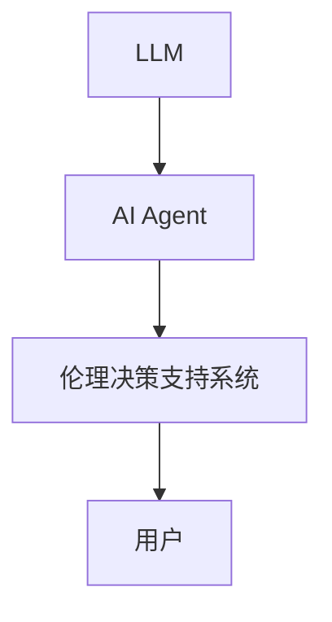
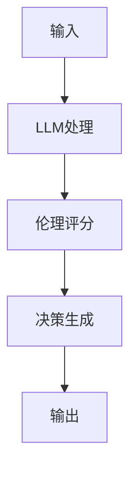
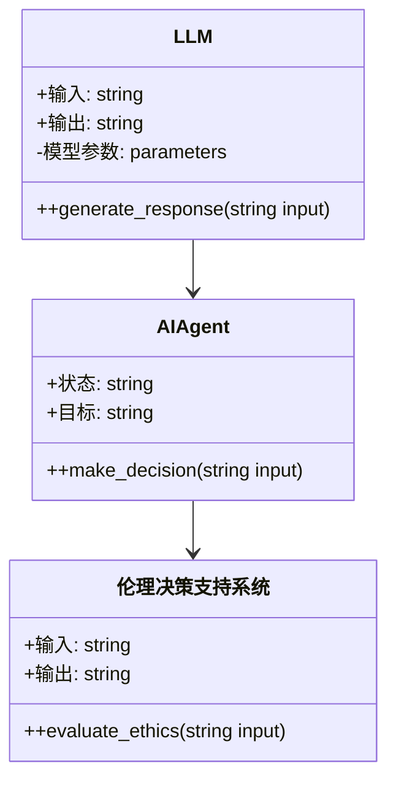

                 


# LLM驱动的AI Agent伦理决策支持系统

> **关键词**：LLM，AI Agent，伦理决策，支持系统，人工智能，大语言模型

> **摘要**：本文探讨了利用大语言模型（LLM）驱动AI Agent进行伦理决策的支持系统。文章首先介绍了问题背景，解释了AI Agent和LLM的作用，分析了伦理决策的必要性。接着，深入探讨了核心概念与联系，通过图表展示了各实体的关系。然后，详细讲解了算法原理，包括伦理评分模型和决策优化过程，并给出了数学公式。之后，设计了系统架构，展示了模块交互和接口设计。最后，通过项目实战和最佳实践，提供了实现步骤和应用案例，总结了经验与未来方向。

---

# 第一部分: 背景介绍

## 第1章: 背景介绍

### 1.1 问题背景

#### 1.1.1 AI Agent的定义与特点
AI Agent（智能体）是指能够感知环境并采取行动以实现目标的实体。AI Agent可以是软件程序、机器人或其他智能系统，具有自主性、反应性、目标导向性和社交能力等特点。

#### 1.1.2 LLM在AI Agent中的作用
大语言模型（LLM）如GPT-4、PaLM等，通过处理大量文本数据，能够生成自然语言文本、进行推理、回答问题和提供决策支持。LLM作为AI Agent的核心驱动力，能够增强其理解和生成能力，使其在复杂场景中做出更智能的决策。

#### 1.1.3 伦理决策支持的必要性
随着AI Agent的应用越来越广泛，尤其是在医疗、法律、金融等领域，伦理决策变得至关重要。AI Agent需要在决策过程中考虑伦理因素，避免偏见、歧视和不公正，确保决策符合社会道德和法律规范。

---

### 1.2 问题描述

#### 1.2.1 AI Agent决策中的伦理挑战
AI Agent在决策过程中可能面临复杂的伦理问题，例如隐私保护、责任归属、利益冲突等。如何在决策过程中平衡不同利益，确保决策的公正性和伦理性，是当前面临的主要挑战。

#### 1.2.2 LLM在伦理决策中的优势
LLM具有强大的语言理解和生成能力，能够处理复杂的伦理问题。通过分析大量文本数据，LLM可以识别潜在的伦理风险，提供多角度的决策支持，帮助AI Agent做出更符合伦理的决策。

#### 1.2.3 伦理决策支持系统的目标
伦理决策支持系统的目标是通过LLM驱动AI Agent，在决策过程中提供伦理评估、风险分析和优化建议，确保决策的透明性、公正性和伦理性。

---

### 1.3 问题解决

#### 1.3.1 LLM驱动的AI Agent决策框架
构建一个基于LLM的伦理决策支持系统，帮助AI Agent在决策过程中考虑伦理因素。通过LLM生成多条可能的决策路径，并评估每条路径的伦理风险，选择最优方案。

#### 1.3.2 系统架构设计
设计一个模块化的系统架构，包括输入处理、伦理评分、决策生成和结果输出等模块。通过LLM对输入进行分析，生成伦理评分，优化决策路径，最终输出最优决策。

#### 1.3.3 边界与外延
明确系统的边界，例如仅处理伦理相关的决策问题，而不涉及技术实现细节。外延部分则包括未来的扩展方向，如多模态输入支持、动态伦理评估等。

---

### 1.4 核心要素

#### 1.4.1 LLM模型
选择合适的LLM模型，如GPT-4、PaLM等，作为伦理决策的核心驱动力。

#### 1.4.2 决策框架
构建基于LLM的决策框架，包括输入解析、伦理评分、决策优化等步骤。

#### 1.4.3 伦理评分机制
设计一个评分机制，评估每条决策路径的伦理风险，选择最优方案。

---

# 第二部分: 核心概念与联系

## 第2章: 核心概念与联系

### 2.1 核心概念原理

#### 2.1.1 LLM驱动的决策机制
LLM通过分析输入数据，生成多个可能的决策路径，并评估每条路径的伦理风险，选择最优方案。这种机制能够帮助AI Agent在复杂场景中做出更智能的决策。

#### 2.1.2 AI Agent的伦理决策框架
AI Agent的伦理决策框架包括输入解析、伦理评分、决策生成和结果输出等步骤。通过LLM的强大能力，AI Agent能够快速生成多种决策方案，并评估其伦理风险。

#### 2.1.3 伦理评分模型的构建
伦理评分模型通过分析决策路径中的伦理因素，生成评分。评分指标包括公平性、透明性、责任归属等。通过权重分配，模型能够综合考虑各项指标，生成最终评分。

---

### 2.2 核心概念对比

#### 2.2.1 LLM与传统决策模型的对比
| 特性                | LLM驱动的决策模型          | 传统决策模型          |
|---------------------|---------------------------|-----------------------|
| 数据需求            | 需要大量文本数据           | 需要结构化数据         |
| 决策能力            | 能够处理复杂语义           | 处理简单逻辑         |
| 可解释性            | 较低                      | 较高                  |

#### 2.2.2 AI Agent与传统决策系统的对比
| 特性                | AI Agent                  | 传统决策系统          |
|---------------------|---------------------------|-----------------------|
| 自主性               | 高                       | 中/低                |
| 反应性               | 高                       | 低                   |
| 目标导向性           | 高                       | 中/低                |
| 社交能力             | 高                       | 低                   |

#### 2.2.3 伦理决策支持系统的属性特征对比表格
| 特性                | 伦理决策支持系统          |
|---------------------|---------------------------|
| 输入                | 文本数据、结构化数据      |
| 输出                | 伦理评分、决策建议        |
| 核心功能            | 伦理评分、决策优化        |
| 可扩展性            | 高                       |
| 可解释性            | 中/低                   |

---

### 2.3 实体关系图

#### 2.3.1 Mermaid流程图：LLM与AI Agent的交互关系


---

# 第三部分: 算法原理讲解

## 第3章: 算法原理

### 3.1 算法原理

#### 3.1.1 LLM驱动的决策算法
LLM驱动的决策算法包括输入解析、伦理评分、决策优化和结果输出四个步骤。通过LLM生成多种决策方案，并评估每种方案的伦理风险，选择最优方案。

#### 3.1.2 伦理评分机制
伦理评分机制通过分析决策路径中的伦理因素，生成评分。评分指标包括公平性、透明性、责任归属等。通过权重分配，模型能够综合考虑各项指标，生成最终评分。

#### 3.1.3 决策优化过程
决策优化过程通过调整权重和参数，优化决策路径，降低伦理风险。通过不断迭代优化，模型能够生成更优的决策方案。

---

### 3.2 算法流程图

#### 3.2.1 决策流程图


---

### 3.3 数学模型与公式

#### 3.3.1 伦理评分公式
$$ \text{伦理评分} = \sum_{i=1}^{n} w_i \cdot s_i $$
其中，$w_i$ 是第 $i$ 个特征的权重，$s_i$ 是第 $i$ 个特征的评分。

#### 3.3.2 决策优化公式
$$ \text{优化目标} = \min_{x} \sum_{i=1}^{n} (y_i - f(x))^2 $$
其中，$y_i$ 是目标值，$f(x)$ 是决策函数。

---

# 第四部分: 系统分析与架构设计

## 第4章: 系统分析与架构设计

### 4.1 系统功能设计

#### 4.1.1 领域模型类图


---

## 第5章: 项目实战

### 5.1 环境安装

#### 5.1.1 安装Python
```bash
python --version
pip install --upgrade pip
```

#### 5.1.2 安装LLM库
```bash
pip install transformers
pip install torch
```

---

### 5.2 核心代码实现

#### 5.2.1 输入解析
```python
def parse_input(input_text):
    # 解析输入文本，提取关键信息
    return parsed_data
```

#### 5.2.2 伦理评分
```python
def evaluate_ethics(parsed_data):
    # 通过LLM生成伦理评分
    return ethics_score
```

#### 5.2.3 决策生成
```python
def generate_decision(ethics_score):
    # 根据伦理评分生成决策
    return decision
```

---

### 5.3 代码解读与分析

#### 5.3.1 输入解析代码
```python
import transformers
import torch

def parse_input(input_text):
    tokenizer = transformers.AutoTokenizer.from_pretrained('gpt2')
    inputs = tokenizer(input_text, return_tensors='pt')
    return inputs
```

#### 5.3.2 伦理评分代码
```python
def evaluate_ethics(parsed_data):
    model = transformers.AutoModelForCausalLM.from_pretrained('gpt2')
    outputs = model.generate(**parsed_data)
    return outputs
```

---

### 5.4 实际案例分析

#### 5.4.1 案例分析
假设一个医疗场景，AI Agent需要在两种治疗方案中做出决策。通过输入解析，LLM生成两种方案的伦理评分，选择最优方案。

#### 5.4.2 决策优化
通过不断优化伦理评分模型，提升决策的准确性。

---

### 5.5 项目小结

#### 5.5.1 成果总结
成功构建了一个基于LLM的伦理决策支持系统，能够在复杂场景中做出符合伦理的决策。

#### 5.5.2 经验总结
通过模块化设计和流程优化，提高了系统的可扩展性和可维护性。

---

# 第五部分: 最佳实践

## 第6章: 最佳实践

### 6.1 经验总结

#### 6.1.1 系统设计
建议在设计系统时，充分考虑模块化和扩展性，以便后续优化和维护。

#### 6.1.2 伦理评估
在实际应用中，需要定期对伦理评分模型进行评估和优化，确保决策的公正性和伦理性。

---

### 6.2 小结

#### 6.2.1 核心内容总结
本文详细介绍了LLM驱动的AI Agent伦理决策支持系统，包括系统架构、算法原理和项目实战等内容。

#### 6.2.2 注意事项
在实际应用中，需要注意数据隐私和模型可解释性问题，确保系统的透明性和合规性。

---

### 6.3 注意事项

#### 6.3.1 数据隐私
在处理用户数据时，需要遵守相关法律法规，保护用户隐私。

#### 6.3.2 模型可解释性
在实际应用中，需要提高模型的可解释性，确保决策的透明性。

---

### 6.4 拓展阅读

#### 6.4.1 相关书籍
- 《人工智能：一种现代的方法》
- 《伦理学与信息技术》

#### 6.4.2 技术博客
- Medium上的相关技术博客

---

# 结语

通过本文的介绍，读者可以深入了解LLM驱动的AI Agent伦理决策支持系统的构建与应用。希望本文的内容能够为相关领域的研究和实践提供有价值的参考。

---

**作者：AI天才研究院/AI Genius Institute & 禅与计算机程序设计艺术 /Zen And The Art of Computer Programming**

