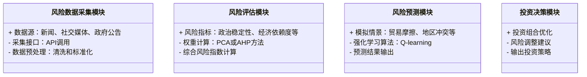
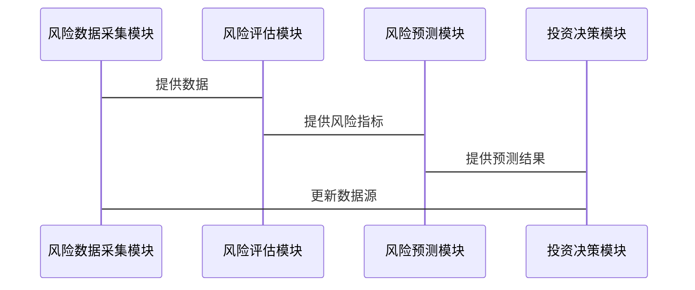

                 


---

# 价值投资中的AI驱动地缘政治风险分析：多智能体系统

## 关键词：价值投资、地缘政治风险、人工智能、多智能体系统、金融分析

## 摘要：  
在当前全球化和数字化的背景下，地缘政治风险对价值投资的影响日益显著。传统的地缘政治风险分析方法难以应对复杂多变的国际局势和金融市场波动。本文通过引入人工智能（AI）和多智能体系统（MAS），提出了一种创新的地缘政治风险分析框架，为价值投资者提供了更精准的决策支持工具。文章详细探讨了多智能体系统在地缘政治风险建模、预测和优化中的应用，结合实际案例分析，展示了如何利用AI技术提升价值投资的效率和准确性。

---

# 第一章：价值投资与地缘政治风险概述

## 1.1 价值投资的核心概念  
### 1.1.1 价值投资的定义与基本原理  
价值投资是一种基于对公司内在价值评估的投资策略，旨在通过识别市场价格与内在价值的偏差来实现超额收益。其核心在于长期持有优质资产，而非短期市场波动。  

### 1.1.2 地缘政治风险在价值投资中的重要性  
地缘政治风险是指由政治、军事、经济和社会因素引发的不确定性，可能对资产价格产生重大影响。例如，贸易摩擦、地区冲突或政策变化都可能影响企业的盈利能力和市场估值。  

### 1.1.3 多智能体系统在金融分析中的应用前景  
多智能体系统（MAS）通过模拟多个交互主体的行为，能够更真实地反映复杂金融环境中的动态关系。在地缘政治风险分析中，MAS可以模拟不同国家、企业和社会组织之间的互动，提供更全面的风险评估。

## 1.2 地缘政治风险的定义与分类  
### 1.2.1 地缘政治风险的定义  
地缘政治风险是指由于地理位置、政治制度、国际关系等因素引发的不确定性，可能对资产价格、市场稳定性或经济活动产生负面影响。  

### 1.2.2 地缘政治风险的主要类型  
- **经济制裁风险**：如贸易禁令、关税调整等。  
- **政治动荡风险**：如政权更迭、社会动荡等。  
- **军事冲突风险**：如地区战争、边境争端等。  
- **政策变化风险**：如法律法规的突然调整。  

### 1.2.3 地缘政治风险对价值投资的影响  
地缘政治风险可能引发市场恐慌、资产价格波动或企业盈利下降，从而影响价值投资的收益。然而，通过提前识别和评估风险，投资者可以制定更稳健的投资策略。

## 1.3 人工智能在金融领域的应用现状  
### 1.3.1 人工智能在金融分析中的优势  
AI技术能够快速处理海量数据，发现传统方法难以察觉的模式和趋势。例如，自然语言处理（NLP）可以分析新闻、社交媒体和政策文件，提取潜在的地缘政治风险信号。  

### 1.3.2 多智能体系统在金融中的应用案例  
- **股票价格预测**：通过模拟市场参与者的互动，预测股票价格波动。  
- **风险管理**：利用MAS识别和评估潜在的系统性风险。  

### 1.3.3 当前地缘政治风险分析的挑战与机遇  
传统地缘政治风险分析依赖于专家经验和定性方法，难以量化和预测。AI和MAS的引入为风险分析提供了新的工具和方法，但同时也带来了数据依赖性和模型复杂性等挑战。

## 1.4 本章小结  
本章介绍了价值投资和地缘政治风险的基本概念，并探讨了AI和多智能体系统在金融分析中的应用前景。通过结合AI技术，投资者可以更精准地识别和评估地缘政治风险，从而制定更科学的投资策略。

---

# 第二章：多智能体系统与地缘政治风险分析

## 2.1 多智能体系统的基本概念  
### 2.1.1 多智能体系统的定义  
多智能体系统（MAS）是由多个具有自主性、反应性和协作性的智能体组成的系统，能够通过交互完成复杂任务。  

### 2.1.2 多智能体系统的特征与优势  
- **自主性**：智能体能够独立决策。  
- **反应性**：智能体能够实时感知环境并做出反应。  
- **协作性**：智能体之间可以共享信息和协同工作。  
- **分布式计算**：任务分布在多个智能体之间，提高了系统的鲁棒性。  

### 2.1.3 多智能体系统与传统单智能体系统的区别  
传统单智能体系统依赖中心化决策，而MAS通过分布式计算和协作实现更复杂的任务。MAS能够模拟多个主体的互动，更贴近现实世界的复杂性。

## 2.2 多智能体系统在地缘政治风险分析中的应用  
### 2.2.1 地缘政治风险分析的复杂性  
地缘政治风险涉及多个国家、企业和非政府组织的互动，具有高度的不确定性和复杂性。  

### 2.2.2 多智能体系统在风险建模中的作用  
MAS可以模拟不同主体的行为和互动，帮助分析潜在的地缘政治冲突和风险传导机制。例如，可以模拟贸易摩擦对企业利润和股价的影响。  

### 2.2.3 多智能体系统的动态交互与风险预测  
通过模拟不同智能体的互动，MAS可以预测地缘政治风险的变化趋势，为投资者提供前瞻性洞察。

## 2.3 地缘政治风险分析的核心要素  
### 2.3.1 政治因素  
- 国家间的政治冲突、政策变化等。  

### 2.3.2 经济因素  
- 经济制裁、贸易平衡等。  

### 2.3.3 社会因素  
- 社会动荡、公众情绪等。  

### 2.3.4 技术因素  
- 网络战、技术依赖等。  

## 2.4 本章小结  
本章详细介绍了多智能体系统的基本概念和其在地缘政治风险分析中的应用。通过MAS，投资者可以更全面地理解和预测地缘政治风险，从而优化投资决策。

---

# 第三章：地缘政治风险分析的数学模型与算法原理

## 3.1 地缘政治风险分析的数学模型  
### 3.1.1 风险评估模型的构建  
地缘政治风险评估模型通常包括多个指标，如政治稳定性、经济依赖度和社会凝聚力等。  

### 3.1.2 风险权重的确定方法  
通过主成分分析（PCA）或层次分析法（AHP）确定各指标的权重。  

### 3.1.3 风险综合评估公式  
综合风险指数（CRI）= Σ（权重_i × 指标_i）  

$$ CRI = \sum_{i=1}^{n} (w_i \times x_i) $$  

其中，$w_i$ 是指标 $i$ 的权重，$x_i$ 是指标 $i$ 的得分。  

## 3.2 多智能体系统的算法原理  
### 3.2.1 多智能体系统中的博弈论模型  
博弈论模型通过模拟不同主体的策略选择，分析地缘政治风险的变化。例如，纳什均衡模型可以用于预测各方的最优策略。  

### 3.2.2 基于强化学习的决策算法  
强化学习（RL）通过智能体与环境的交互，学习最优策略。例如，可以使用Q-learning算法模拟智能体在地缘政治风险中的决策过程。  

### 3.2.3 多智能体系统中的通信与协作机制  
通过分布式计算和消息传递，智能体之间可以共享信息并协作完成任务。  

## 3.3 算法实现的数学推导  
### 3.3.1 基于博弈论的纳什均衡分析  
纳什均衡是博弈论中的一个关键概念，表示在给定其他参与者策略的情况下，参与者无法通过单方面改变策略而获得更好结果的状态。  

### 3.3.2 强化学习中的Q-learning算法  
Q-learning算法通过更新Q值表来学习最优策略：  

$$ Q(s, a) = Q(s, a) + \alpha \left( r + \gamma \max Q(s', a') - Q(s, a) \right) $$  

其中，$\alpha$ 是学习率，$\gamma$ 是折扣因子，$s$ 是当前状态，$a$ 是动作，$s'$ 是下一个状态。  

### 3.3.3 多智能体系统中的分布式计算模型  
通过分布式计算，多个智能体可以并行处理任务，提高计算效率。  

## 3.4 本章小结  
本章介绍了地缘政治风险分析的数学模型和多智能体系统的算法原理，特别是强化学习和博弈论在风险预测中的应用。

---

# 第四章：系统分析与架构设计

## 4.1 系统功能设计  
### 4.1.1 风险数据采集模块  
从新闻、社交媒体和政府公告中采集地缘政治风险相关的数据。  

### 4.1.2 风险评估模块  
基于数学模型计算综合风险指数。  

### 4.1.3 风险预测模块  
利用多智能体系统模拟不同情景下的风险变化。  

### 4.1.4 投资决策模块  
根据风险评估结果，为投资者提供投资建议。  

## 4.2 系统架构设计  
### 4.2.1 系统功能模块的类图  


### 4.2.2 系统架构的组件交互  


## 4.3 接口设计与实现  
### 4.3.1 数据接口  
- 数据采集接口：用于从外部数据源获取地缘政治风险相关的数据。  
- 数据预处理接口：对采集的数据进行清洗和标准化处理。  

### 4.3.2 模型接口  
- 风险评估接口：接受输入数据，返回综合风险指数。  
- 风险预测接口：模拟不同情景下的风险变化，返回预测结果。  

## 4.4 本章小结  
本章详细设计了基于多智能体系统的地缘政治风险分析系统的功能模块、架构和接口。通过模块化设计，系统能够高效地进行数据采集、风险评估和预测，并为投资者提供个性化的投资建议。

---

# 第五章：项目实战——基于多智能体的地缘政治风险分析系统

## 5.1 项目背景与目标  
本项目旨在开发一个基于多智能体的地缘政治风险分析系统，帮助投资者识别和评估地缘政治风险，优化投资决策。  

## 5.2 环境安装与配置  
### 5.2.1 系统需求  
- Python 3.8 或更高版本  
- NumPy、Pandas、Scikit-learn、TensorFlow等库  
- Mermaid图表工具（可选）  

### 5.2.2 安装步骤  
```bash
pip install numpy pandas scikit-learn tensorflow
```

## 5.3 系统核心实现  
### 5.3.1 风险数据采集模块  
```python
import requests
from bs4 import BeautifulSoup

def fetch_data(url):
    response = requests.get(url)
    soup = BeautifulSoup(response.text, 'html.parser')
    # 提取新闻标题和内容
    title = soup.find('h1').text
    content = soup.find('div', class_='article').text
    return title, content
```

### 5.3.2 风险评估模块  
```python
from sklearn.decomposition import PCA

def calculate_weights(features):
    # 使用主成分分析计算权重
    pca = PCA(n_components=1)
    weights = pca.fit_transform(features)
    return weights
```

### 5.3.3 风险预测模块  
```python
from tensorflow.keras.models import Sequential
from tensorflow.keras.layers import Dense

def build_model(input_dim):
    model = Sequential()
    model.add(Dense(64, activation='relu', input_dim=input_dim))
    model.add(Dense(1, activation='sigmoid'))
    model.compile(optimizer='adam', loss='binary_crossentropy', metrics=['accuracy'])
    return model
```

## 5.4 实际案例分析  
以中美贸易摩擦为例，分析其对美国股市的影响。通过系统模拟不同情景，预测贸易摩擦对企业利润和股价的潜在影响。  

## 5.5 系统实现与结果分析  
### 5.5.1 数据采集与预处理  
从新闻网站和政府公告中采集中美贸易摩擦相关的数据，清洗和标准化后输入模型。  

### 5.5.2 风险评估与预测  
通过PCA计算各风险指标的权重，构建综合风险指数。利用强化学习模型模拟不同情景下的风险变化，预测潜在的市场反应。  

### 5.5.3 投资决策建议  
根据预测结果，系统为投资者提供投资组合优化建议，如增加防御性资产的配置比例。  

## 5.6 本章小结  
本章通过实际案例展示了基于多智能体的地缘政治风险分析系统的实现过程和应用效果。通过系统模拟和预测，投资者可以更科学地制定投资策略。

---

# 第六章：总结与展望

## 6.1 全文总结  
本文探讨了AI驱动的地缘政治风险分析在价值投资中的应用，提出了基于多智能体系统的分析框架。通过数学模型和算法的结合，系统能够高效地识别和评估地缘政治风险，并为投资者提供前瞻性洞察。

## 6.2 当前研究的不足  
- 数据依赖性较强，模型的鲁棒性有待提高。  
- 多智能体系统的复杂性可能增加计算成本。  

## 6.3 未来研究方向  
- 开发更智能的地缘政治风险预测模型，如基于深度学习的模型。  
- 探讨多智能体系统在跨国投资中的应用。  
- 结合自然语言处理技术，提高风险信号的识别能力。  

## 6.4 最佳实践 tips  
- 投资者应结合AI工具和传统分析方法，制定综合的投资策略。  
- 定期更新模型参数和数据源，保持系统的实时性和准确性。  

## 6.5 注意事项  
- 数据质量和完整性直接影响模型的准确性，需谨慎处理数据。  
- 模型的解释性是投资者信任的关键，需确保结果的透明性和可解释性。  

## 6.6 拓展阅读  
- 《博弈论与经济行为》（《The Theory of Games and Economic Behavior》）  
- 《深度学习》（《Deep Learning》）  

## 6.7 本章小结  
本文总结了研究的主要成果，并展望了未来的研究方向和应用前景。通过不断优化模型和算法，AI驱动的地缘政治风险分析将为价值投资提供更强大的支持。

---

# 作者：AI天才研究院/AI Genius Institute & 禅与计算机程序设计艺术 /Zen And The Art of Computer Programming

