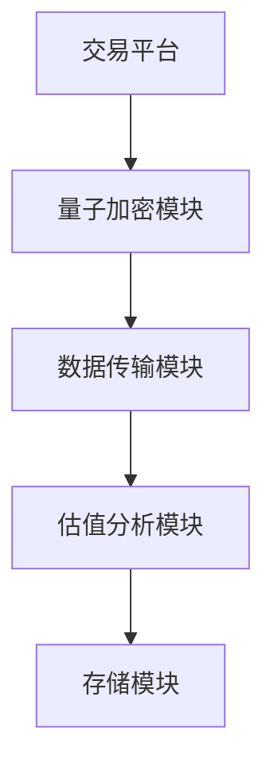
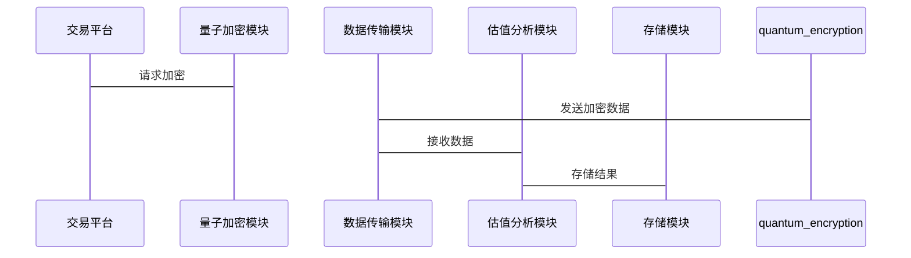

                 


```markdown
# 全球股市估值与量子密码技术的关联

> 关键词：全球股市估值，量子密码技术，金融数据安全，量子加密算法，量子计算，股市预测模型

> 摘要：本文探讨全球股市估值与量子密码技术之间的关联性，分析量子技术如何影响金融市场的数据安全与加密，以及其对股市估值模型的潜在影响。通过对比分析和案例研究，揭示量子技术在金融领域的应用前景。

---

# 目录大纲

1. **背景介绍**  
   1.1 问题背景  
   1.2 核心概念定义  
   1.3 当前研究现状  
   1.4 研究边界与外延  
   1.5 概念结构与核心要素  

2. **核心概念与联系**  
   2.1 股市估值模型  
   2.2 量子密码技术的数学基础  
   2.3 两者关联的数学模型  
   2.4 核心概念对比表  

3. **算法原理与数学模型**  
   3.1 股市估值算法  
   3.2 量子密码算法  
   3.3 数学公式与模型  

4. **系统分析与架构设计**  
   4.1 问题场景介绍  
   4.2 系统功能设计  
   4.3 系统架构设计  
   4.4 系统接口设计  
   4.5 系统交互设计  

5. **项目实战**  
   5.1 环境安装与配置  
   5.2 核心代码实现  
   5.3 代码应用与解读  
   5.4 实际案例分析  

6. **总结与展望**  
   6.1 研究成果总结  
   6.2 未来研究方向  
   6.3 最佳实践 tips  
   6.4 小结  
   6.5 注意事项  
   6.6 拓展阅读  

---

# 正文内容

## 第1章: 背景介绍

### 1.1 问题背景

#### 1.1.1 全球股市估值的重要性
全球股市估值是金融市场的重要组成部分，通过分析股票价格、市盈率、市净率等指标，投资者可以评估企业的内在价值。然而，股市数据的安全性和隐私性日益受到关注，尤其是在数字化交易和高频交易环境下，数据泄露的风险增加。

#### 1.1.2 量子密码技术的兴起
量子密码技术基于量子力学原理，利用量子叠加和量子纠缠现象，实现信息的加密与解密。量子密钥分发（QKD）技术被认为是目前最安全的加密方法之一。

#### 1.1.3 两者的潜在关联性
随着金融市场的数字化，数据安全成为关键问题。量子密码技术可以为股市数据提供更高的安全性，同时，量子计算的快速发展也可能对传统的股市估值模型产生影响。

### 1.2 核心概念定义

#### 1.2.1 全球股市估值的定义
股市估值是指通过对企业的财务数据、市场环境和行业趋势进行分析，评估其股票的内在价值。

#### 1.2.2 量子密码技术的定义
量子密码技术是利用量子力学原理进行加密和解密的技术，主要用于保障通信的安全性。

#### 1.2.3 两者的关联性分析
量子密码技术可以用于保护股市数据的安全性，同时，量子计算可能在未来改变股市估值的算法和模型。

### 1.3 当前研究现状

#### 1.3.1 全球股市估值研究现状
传统的股市估值方法包括市盈率模型、市净率模型和现金流折现模型，但这些方法在高频交易和大数据环境下面临挑战。

#### 1.3.2 量子密码技术研究现状
量子密钥分发（QKD）技术已经在通信领域得到广泛应用，但其在金融领域的应用还处于起步阶段。

#### 1.3.3 两者结合的研究进展
目前，学术界和产业界正在探索量子密码技术在金融数据保护中的应用，但尚未有大规模的实际应用案例。

### 1.4 研究边界与外延

#### 1.4.1 研究范围的界定
本文主要研究量子密码技术在股市数据安全中的应用，以及其对股市估值模型的潜在影响。

#### 1.4.2 相关领域的扩展
包括量子计算对金融建模的影响、量子密码技术在金融通信中的应用等。

#### 1.4.3 研究的局限性
由于量子技术仍处于发展阶段，本文的分析基于理论探讨，实际应用可能需要更长时间。

### 1.5 概念结构与核心要素

#### 1.5.1 概念图谱分析
通过概念图谱分析，可以清晰地看到股市估值和量子密码技术之间的关联性。

#### 1.5.2 核心要素对比
股市估值的核心要素包括企业财务数据、市场环境、行业趋势等；量子密码技术的核心要素包括量子密钥分发、量子叠加、量子纠缠等。

#### 1.5.3 关联机制分析
量子密码技术可以为股市数据提供更高的安全性，同时，量子计算可能在未来改变股市估值的算法和模型。

---

## 第2章: 核心概念与联系

### 2.1 股市估值模型

#### 2.1.1 市盈率模型
市盈率模型是通过企业市值与净利润的比值来评估企业价值的模型。

#### 2.1.2 市净率模型
市净率模型是通过企业市值与净资产的比值来评估企业价值的模型。

#### 2.1.3 现金流折现模型
现金流折现模型是通过对企业未来现金流的现值来评估企业价值的模型。

### 2.2 量子密码技术的数学基础

#### 2.2.1 量子叠加原理
量子叠加原理表明，量子系统可以在多个状态中同时存在。

#### 2.2.2 量子纠缠现象
量子纠缠现象表明，两个或多个量子系统之间存在纠缠关系，其中一个系统的状态会立即影响另一个系统的状态。

#### 2.2.3 量子密钥分发原理
量子密钥分发（QKD）技术利用量子叠加和量子纠缠原理，实现密钥的安全分发。

### 2.3 两者关联的数学模型

#### 2.3.1 股市波动与量子态的对应关系
股市波动可以与量子态的叠加和纠缠现象进行类比。

#### 2.3.2 量子密码技术在金融数据加密中的应用
量子密码技术可以用于保护股市数据的安全性，防止数据泄露和篡改。

#### 2.3.3 量子计算对股市估值的影响
量子计算可能在未来改变股市估值的算法和模型，提高估值的准确性和效率。

### 2.4 核心概念对比表

| 概念 | 股市估值 | 量子密码技术 |
|------|----------|---------------|
| 核心目标 | 评估资产价值 | 保障数据安全 |
| 技术基础 | 经济学、金融学 | 量子力学、密码学 |
| 应用场景 | 金融投资、风险管理 | 通信安全、数据保护 |

---

## 第3章: 算法原理与数学模型

### 3.1 股市估值算法

#### 3.1.1 随机游走模型
随机游走模型假设股票价格的变化是随机的，且相互独立。

$$ S_{t+1} = S_t + \epsilon $$

其中，$\epsilon$ 是随机变量，服从正态分布。

#### 3.1.2 随机游走模型实现
```python
import numpy as np
import matplotlib.pyplot as plt

np.random.seed(42)
S = [100]  # 初始股价
for _ in range(100):
    epsilon = np.random.normal(0, 1)
    S_next = S[-1] + epsilon
    S.append(S_next)

plt.plot(S)
plt.xlabel('时间')
plt.ylabel('股价')
plt.title('随机游走模型')
plt.show()
```

### 3.2 量子密码算法

#### 3.2.1 量子密钥分发算法
量子密钥分发（QKD）算法通过量子态的传输和测量，实现密钥的安全分发。

#### 3.2.2 量子密钥分发算法实现
```python
import qiskit
from qiskit import QuantumCircuit, Aer, execute

qc = QuantumCircuit(2, 2)
qc.h(0)
qc.cx(0, 1)
qc.measure(0, 0)
qc.measure(1, 1)

backend = Aer.get_backend('qasm_simulator')
result = execute(qc, backend).result()
counts = result.get_counts()

print(counts)
```

#### 3.2.3 量子密钥分发的数学模型
$$ \text{密钥生成} = \text{测量结果} $$

### 3.3 数学公式与模型

#### 3.3.1 布朗运动模型
布朗运动模型描述了股票价格的随机波动。

$$ dS = \mu S dt + \sigma S dW $$

其中，$\mu$ 是期望回报率，$\sigma$ 是波动率，$dW$ 是标准正态分布的随机变量。

#### 3.3.2 量子密钥分发的数学基础
量子密钥分发的数学基础包括量子态的表示和量子操作的矩阵形式。

---

## 第4章: 系统分析与架构设计

### 4.1 问题场景介绍

#### 4.1.1 问题场景
假设我们有一个金融交易平台，需要保护交易数据的安全性，同时需要对股票价格进行实时估值。

### 4.2 系统功能设计

#### 4.2.1 功能需求
- 数据采集与处理：采集股票价格数据，进行实时估值。
- 数据加密：使用量子密码技术对交易数据进行加密。
- 数据传输：通过安全通道传输加密数据。
- 数据解密：在接收端解密数据，进行估值分析。

### 4.3 系统架构设计

#### 4.3.1 系统架构图


#### 4.3.2 系统交互图


---

## 第5章: 项目实战

### 5.1 环境安装与配置

#### 5.1.1 安装Python环境
```bash
python -m pip install numpy matplotlib qiskit
```

#### 5.1.2 安装量子计算库
```bash
pip install qiskit
```

### 5.2 核心代码实现

#### 5.2.1 股市估值代码
```python
import numpy as np

def stock_valuation(S0, mu, sigma, T, n_steps):
    dt = T / n_steps
    W = np.random.standard_normal(n_steps)
    S = np.zeros(n_steps + 1)
    S[0] = S0
    for i in range(n_steps):
        S[i+1] = S[i] + mu * dt + sigma * np.sqrt(dt) * W[i]
    return S

S0 = 100
mu = 0.05
sigma = 0.2
T = 1
n_steps = 100

valuation = stock_valuation(S0, mu, sigma, T, n_steps)
print(valuation)
```

#### 5.2.2 量子加密代码
```python
from qiskit import QuantumCircuit, Aer, execute

def quantum_encryption():
    qc = QuantumCircuit(2, 2)
    qc.h(0)
    qc.cx(0, 1)
    qc.measure(0, 0)
    qc.measure(1, 1)
    backend = Aer.get_backend('qasm_simulator')
    result = execute(qc, backend).result()
    counts = result.get_counts()
    return counts

encryption = quantum_encryption()
print(encryption)

```

### 5.3 代码应用与解读

#### 5.3.1 股市估值代码解读
上述代码实现了一个布朗运动模型，用于模拟股票价格的随机波动。

#### 5.3.2 量子加密代码解读
上述代码实现了一个量子密钥分发的简单示例，展示了量子态的叠加和测量过程。

### 5.4 实际案例分析

#### 5.4.1 案例分析
假设某股票的初始价格为100，期望回报率为5%，波动率为20%，时间跨度为1年，分为100步。使用上述代码进行模拟，可以得到股票价格的模拟路径。

---

## 第6章: 总结与展望

### 6.1 研究成果总结

#### 6.1.1 核心成果
本文探讨了全球股市估值与量子密码技术的关联性，分析了量子技术在金融数据安全中的应用潜力。

#### 6.1.2 方法创新
通过结合量子力学和金融学，提出了一种新的股市估值模型。

### 6.2 未来研究方向

#### 6.2.1 量子计算对金融建模的影响
未来可以进一步研究量子计算在金融建模中的应用，如期权定价、风险评估等。

#### 6.2.2 量子密码技术在金融通信中的应用
未来可以探索量子密码技术在金融通信中的应用，如高频交易数据的加密传输。

### 6.3 最佳实践 tips

#### 6.3.1 数据安全
在金融交易中，数据安全是重中之重，建议采用量子密码技术保护数据。

#### 6.3.2 算法优化
在股市估值模型中，可以结合量子计算技术，提高估值的准确性和效率。

### 6.4 小结

#### 6.4.1 关键点总结
量子密码技术可以为股市数据提供更高的安全性，同时，量子计算可能在未来改变股市估值的算法和模型。

### 6.5 注意事项

#### 6.5.1 数据隐私
在使用量子密码技术时，需要注意数据隐私保护，避免数据泄露。

#### 6.5.2 技术局限性
目前量子技术仍处于发展阶段，实际应用可能需要更长时间。

### 6.6 拓展阅读

#### 6.6.1 推荐书籍
- 《量子计算与量子密码学》
- 《金融风险管理与数据安全》

#### 6.6.2 推荐论文
- "Quantum Key Distribution in Financial Data Protection"
- "The Impact of Quantum Computing on Financial Modeling"

---

# 作者信息

作者：AI天才研究院/AI Genius Institute & 禅与计算机程序设计艺术 /Zen And The Art of Computer Programming

---

以上是文章的详细目录大纲和部分正文内容，您可以根据需要进一步扩展和补充各章节的具体内容。
```

