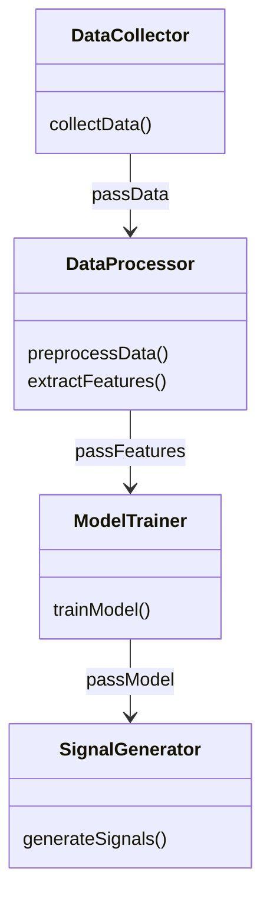
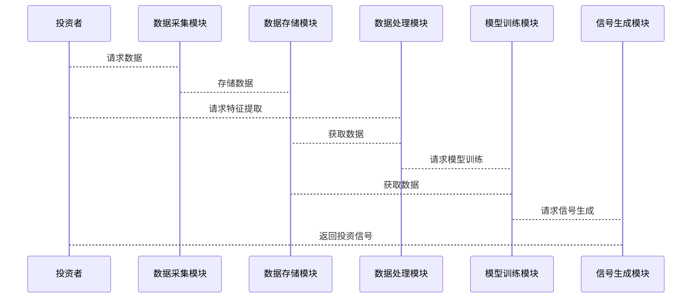

                 


# 利用AI agents分析替代数据：挖掘非传统投资信号

## 关键词：AI agents，替代数据，投资信号，生成式模型，强化学习，时间序列分析

## 摘要：  
随着金融市场的日益复杂化，传统金融数据的局限性逐渐显现，替代数据的引入为投资分析提供了新的视角。本文探讨了如何利用AI agents（人工智能代理）分析替代数据，挖掘非传统的投资信号。通过结合生成式模型和强化学习，AI agents能够从海量的非结构化数据中提取有价值的信息，为投资决策提供支持。本文详细介绍了AI agents的核心原理、替代数据的特征提取与处理、系统架构设计以及实际应用案例，为读者提供了从理论到实践的全面指导。

---

# 第一部分: 利用AI agents分析替代数据的背景与概念

## 第1章: 替代数据与AI agents概述

### 1.1 替代数据的定义与特点

替代数据是指传统金融数据之外的其他数据源，包括社交媒体、卫星图像、物流数据、供应链信息、专利申请、法律文件等。这些数据通常是非结构化或半结构化的，具有以下特点：

#### 1.1.1 传统金融数据的局限性
- **局限性**：
  - 传统金融数据（如股价、成交量、财务报表）虽然重要，但无法反映市场的全貌。
  - 数据滞后性强，无法捕捉实时市场动态。
  - 难以预测市场情绪和突发事件。

#### 1.1.2 替代数据的定义与分类
- **定义**：
  - 替代数据是指非传统的数据源，用于补充或替代传统金融数据，提供更丰富的市场信息。
- **分类**：
  1. **文本数据**：社交媒体、新闻、公司财报。
  2. **图像数据**：卫星图像、公司Logo。
  3. **结构化数据**：供应链数据、物流数据。
  4. **语音数据**：电话会议录音。

#### 1.1.3 替代数据在投资中的价值
- **优势**：
  - 提供实时市场情绪和行业趋势。
  - 识别潜在的市场机会和风险。
  - 通过非结构化数据挖掘发现隐藏的关联性。

### 1.2 AI agents的基本概念

#### 1.2.1 AI agents的定义
AI agents（人工智能代理）是指能够感知环境、执行任务、并做出决策的智能体。AI agents可以是软件程序，也可以是机器人，其核心目标是通过数据驱动的方式优化决策过程。

#### 1.2.2 AI agents的核心特征
1. **自主性**：能够在没有人工干预的情况下独立运行。
2. **反应性**：能够实时感知环境并做出反应。
3. **学习能力**：通过机器学习算法不断优化决策模型。
4. **目标导向**：具有明确的目标，如最大化投资收益。

#### 1.2.3 AI agents与传统数据分析的区别
- **区别**：
  - **传统数据分析**：基于统计方法，依赖人工设定规则。
  - **AI agents**：基于机器学习模型，能够自适应和优化决策。

### 1.3 替代数据与AI agents的结合

#### 1.3.1 替代数据驱动的AI agents
- AI agents通过处理替代数据，提取隐藏的市场信号，为投资决策提供支持。

#### 1.3.2 AI agents在投资信号中的应用
- **场景**：
  - 社交媒体情绪分析：通过社交媒体数据预测市场情绪。
  - 卫星图像分析：通过卫星图像监测供应链变化。
  - 专利数据分析：通过专利数据预测技术创新。

#### 1.3.3 本章小结
替代数据为AI agents提供了丰富的信息源，而AI agents则通过智能化的处理能力，将这些数据转化为有价值的市场信号。

---

# 第二部分: AI agents的核心原理与算法

## 第2章: 替代数据的特征提取与处理

### 2.1 替代数据的预处理

#### 2.1.1 数据清洗与标准化
- **步骤**：
  1. **去重**：去除重复数据。
  2. **填充缺失值**：使用均值、中位数或插值方法填充缺失数据。
  3. **标准化**：将数据标准化到统一的范围，例如0-1范围。

#### 2.1.2 数据特征提取方法
- **文本数据**：使用TF-IDF、Word2Vec提取关键词向量。
- **图像数据**：使用CNN提取图像特征。
- **结构化数据**：使用PCA进行降维。

#### 2.1.3 数据降维技术
- **常用方法**：
  - 主成分分析（PCA）。
  - 线性判别分析（LDA）。

### 2.2 基于替代数据的特征工程

#### 2.2.1 时间序列特征分析
- **步骤**：
  1. **趋势分析**：计算趋势线和趋势强度。
  2. **周期性分析**：识别数据的周期性特征。
  3. **异常值检测**：识别异常值并进行处理。

#### 2.2.2 文本数据特征提取
- **方法**：
  - 使用BERT模型提取文本语义向量。
  - 使用情感分析模型提取文本情感特征。

#### 2.2.3 图结构数据特征提取
- **方法**：
  - 使用图神经网络提取图结构特征。
  - 计算节点之间的相似性度量。

### 2.3 替代数据的融合与分析

#### 2.3.1 数据融合方法
- **方法**：
  - 线性融合：将不同数据源的特征线性组合。
  - 非线性融合：使用深度学习模型进行非线性融合。

#### 2.3.2 数据关联性分析
- **方法**：
  - 使用相关系数矩阵分析数据之间的相关性。
  - 使用Granger因果检验分析变量之间的因果关系。

#### 2.3.3 数据异常检测
- **方法**：
  - 使用Isolation Forest检测异常值。
  - 使用自动编码器（AE）进行异常检测。

---

## 第3章: AI agents的算法原理

### 3.1 生成式模型在替代数据中的应用

#### 3.1.1 大语言模型的文本生成
- **应用场景**：
  - 自动生成投资报告。
  - 自动生成新闻摘要。

#### 3.1.2 图神经网络的应用
- **应用场景**：
  - 分析供应链网络。
  - 分析社交网络关系。

#### 3.1.3 时间序列模型的预测
- **模型**：
  - LSTM（长短期记忆网络）。
  - Transformer。

### 3.2 强化学习在AI agents中的应用

#### 3.2.1 强化学习的基本原理
- **基本原理**：
  - 通过与环境交互，学习最优策略。
  - 使用Q-learning或Deep Q-learning进行决策。

#### 3.2.2 状态空间与动作空间的定义
- **状态空间**：
  - 例如，在股票交易中，状态可以是当前股价、市场情绪、技术指标等。
- **动作空间**：
  - 例如，在股票交易中，动作可以是买入、卖出、持有。

#### 3.2.3 奖励机制的设计
- **设计原则**：
  - 奖励应与投资目标直接相关。
  - 例如，投资收益增加时给予正奖励，投资亏损时给予负奖励。

### 3.3 AI agents的决策机制

#### 3.3.1 多目标优化策略
- **方法**：
  - 使用帕累托前沿方法进行多目标优化。
  - 使用加权和方法将多个目标转化为单个目标。

#### 3.3.2 风险-收益平衡模型
- **方法**：
  - 使用风险中性定价模型。
  - 使用VaR（在险价值）或CVaR（条件在险价值）进行风险控制。

#### 3.3.3 动态调整策略
- **方法**：
  - 根据市场变化动态调整投资组合。
  - 使用滚动窗口方法进行实时优化。

---

# 第三部分: 系统分析与架构设计

## 第4章: 系统功能设计

### 4.1 问题场景介绍

#### 4.1.1 投资信号分析的挑战
- **挑战**：
  - 数据量大，数据类型多样。
  - 市场动态变化快，需要实时分析。
  - 数据噪声大，需要精确的特征提取。

#### 4.1.2 替代数据的应用场景
- **场景**：
  - 社交媒体情绪分析。
  - 卫星图像供应链监控。
  - 专利数据分析技术趋势。

#### 4.1.3 AI agents的目标设定
- **目标**：
  - 提供实时市场信号。
  - 辅助投资决策。
  - 自动化投资策略执行。

### 4.2 系统功能模块划分

#### 4.2.1 数据采集模块
- **功能**：
  - 采集社交媒体、新闻、卫星图像等数据。
  - 数据源包括API接口、网络爬取等。

#### 4.2.2 数据处理模块
- **功能**：
  - 数据清洗、标准化、特征提取。
  - 数据融合、关联性分析、异常检测。

#### 4.2.3 模型训练模块
- **功能**：
  - 训练生成式模型和强化学习模型。
  - 超参数优化和模型评估。

#### 4.2.4 信号生成模块
- **功能**：
  - 根据模型输出生成投资信号。
  - 信号类型包括买入信号、卖出信号、预警信号等。

### 4.3 系统功能流程设计

#### 4.3.1 数据流分析
- **流程**：
  1. 数据采集模块从多个数据源获取数据。
  2. 数据处理模块对数据进行清洗和特征提取。
  3. 模型训练模块基于特征数据训练AI agents模型。
  4. 信号生成模块根据模型输出生成投资信号。

#### 4.3.2 功能模块交互设计
- **交互**：
  - 数据采集模块与数据处理模块交互。
  - 数据处理模块与模型训练模块交互。
  - 模型训练模块与信号生成模块交互。

---

## 第5章: 系统架构设计

### 5.1 问题场景介绍

#### 5.1.1 项目介绍
- **项目目标**：
  - 构建一个基于AI agents的替代数据分析系统。
  - 实现从数据采集到投资信号生成的完整流程。

### 5.2 系统架构设计

#### 5.2.1 领域模型类图


#### 5.2.2 系统架构图


#### 5.2.3 系统接口设计
- **接口**：
  - 数据采集接口：提供API用于数据采集。
  - 数据处理接口：提供API用于数据预处理。
  - 模型训练接口：提供API用于模型训练。
  - 信号生成接口：提供API用于信号生成。

#### 5.2.4 系统交互流程图


---

## 第6章: 项目实战

### 6.1 环境安装

#### 6.1.1 安装Python环境
- **命令**：
  ```bash
  python --version
  pip install --upgrade pip
  ```

#### 6.1.2 安装依赖库
- **命令**：
  ```bash
  pip install numpy pandas scikit-learn transformers tensorflow
  ```

### 6.2 系统核心实现源代码

#### 6.2.1 数据采集模块

```python
import requests

def collect_data(api_key):
    url = "https://api.example.com/data"
    headers = {"Authorization": f"Bearer {api_key}"}
    response = requests.get(url, headers=headers)
    return response.json()
```

#### 6.2.2 数据处理模块

```python
import pandas as pd
from sklearn.preprocessing import StandardScaler

def preprocess_data(data):
    df = pd.DataFrame(data)
    scaler = StandardScaler()
    df_scaled = scaler.fit_transform(df)
    return df_scaled
```

#### 6.2.3 模型训练模块

```python
import tensorflow as tf
from tensorflow.keras import layers

def train_model(train_data):
    model = tf.keras.Sequential([
        layers.Dense(64, activation='relu'),
        layers.Dense(1, activation='sigmoid')
    ])
    model.compile(optimizer='adam', loss='binary_crossentropy')
    model.fit(train_data, epochs=10, batch_size=32)
    return model
```

#### 6.2.4 信号生成模块

```python
def generate_signal(model, test_data):
    prediction = model.predict(test_data)
    signal = "BUY" if prediction > 0.5 else "SELL"
    return signal
```

### 6.3 案例分析与应用解读

#### 6.3.1 案例分析
- **案例**：社交媒体情绪分析。
- **数据源**：Twitter、Reddit等社交媒体平台。
- **分析过程**：
  1. 数据采集：获取社交媒体上的文本数据。
  2. 数据处理：清洗数据并提取情感特征。
  3. 模型训练：训练情感分析模型。
  4. 信号生成：根据模型输出生成投资信号。

#### 6.3.2 代码应用解读
- **解读**：
  - 数据采集模块：从社交媒体API获取数据。
  - 数据处理模块：清洗数据并提取情感特征。
  - 模型训练模块：训练情感分析模型。
  - 信号生成模块：根据模型输出生成买入或卖出信号。

### 6.4 项目小结

---

## 第7章: 最佳实践与扩展阅读

### 7.1 最佳实践Tips
1. 在处理替代数据时，注意数据的实时性和准确性。
2. 在设计AI agents时，确保模型的可解释性和可调性。
3. 在实现系统时，注意系统的可扩展性和可维护性。

### 7.2 小结
本文详细介绍了利用AI agents分析替代数据的背景、核心原理、系统设计和实际应用。通过结合生成式模型和强化学习，AI agents能够从替代数据中提取有价值的信息，为投资决策提供支持。

### 7.3 注意事项
- 数据隐私和合规性：处理替代数据时，需遵守相关法律法规。
- 模型鲁棒性：确保模型具有较强的抗干扰能力和适应性。
- 系统稳定性：确保系统的高可用性和稳定性。

### 7.4 拓展阅读
- 《深度学习》——Ian Goodfellow
- 《强化学习》——Richard S. Sutton
- 《时间序列分析》——George E. P. Box

---

# 结语

利用AI agents分析替代数据，为投资分析提供了全新的视角。通过本文的介绍，读者可以深入了解AI agents的核心原理、系统设计和实际应用。未来，随着技术的进步，AI agents在投资领域的应用将更加广泛和深入。

---

# 作者：AI天才研究院 & 禅与计算机程序设计艺术

