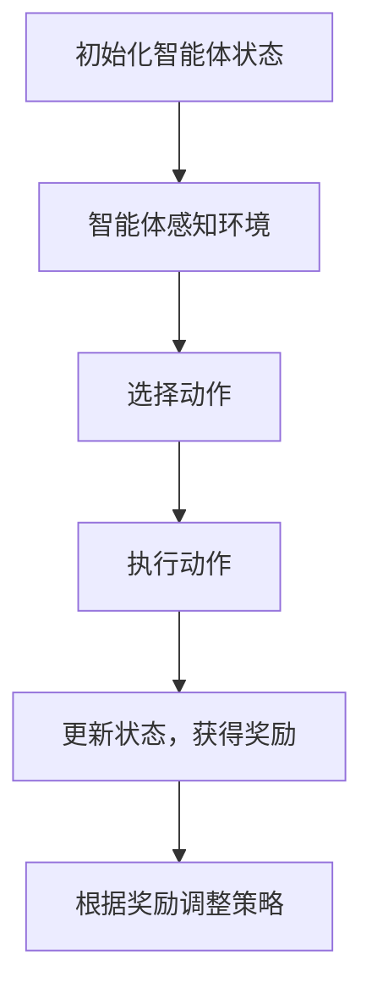
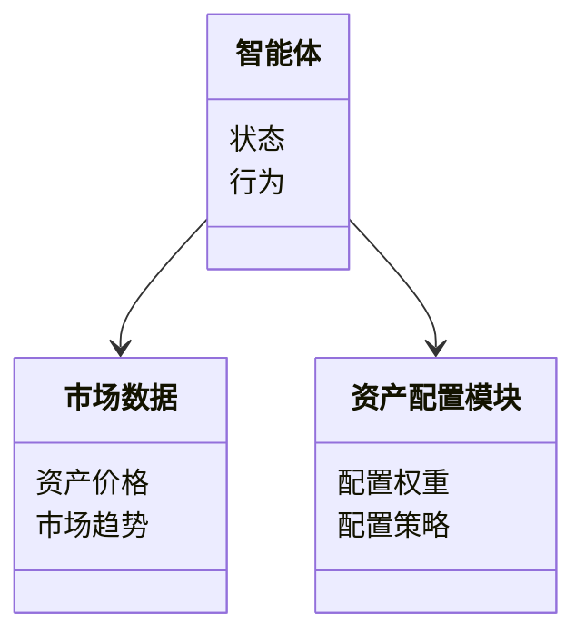
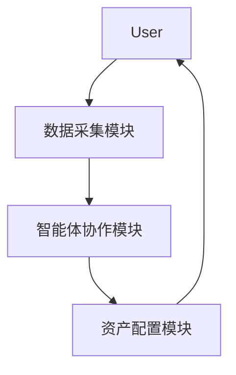

                 


# 基于多智能体的动态资产配置模型在价值投资中的应用

> 关键词：多智能体系统, 动态资产配置, 价值投资, 资产管理, 强化学习

> 摘要：本文探讨了基于多智能体的动态资产配置模型在价值投资中的应用，分析了多智能体系统的特性，动态资产配置的必要性，以及价值投资的基本原理。通过构建多智能体动态资产配置模型，结合强化学习算法，提出了有效的资产配置策略，并通过实际案例验证了模型的有效性。

---

## 第1章: 多智能体动态资产配置模型概述

### 1.1 多智能体系统的基本概念

#### 1.1.1 多智能体系统的定义

多智能体系统（Multi-Agent System, MAS）是由多个智能体组成的分布式系统，每个智能体都是一个能够感知环境、做出决策并采取行动的实体。智能体之间通过通信和协作，共同完成复杂的任务。

#### 1.1.2 多智能体系统的特性

- **自主性**：每个智能体都能独立决策。
- **反应性**：能够感知环境并实时调整行为。
- **协作性**：智能体之间通过协作完成共同目标。
- **分布性**：系统由多个分散的智能体组成，不存在集中控制。

#### 1.1.3 多智能体系统与传统资产配置的区别

传统资产配置通常基于历史数据和统计模型，而多智能体系统通过分布式决策和实时协作，能够更灵活地应对市场变化。

### 1.2 动态资产配置的必要性

#### 1.2.1 资产配置的基本概念

资产配置是指将资金分配到不同资产类别（如股票、债券、现金等）以实现投资目标的过程。

#### 1.2.2 动态资产配置的定义

动态资产配置是一种根据市场环境变化实时调整资产分配比例的策略，以最大化投资收益并降低风险。

#### 1.2.3 动态资产配置的必要性与优势

- **适应市场变化**：动态调整能够捕捉市场机会，规避风险。
- **提高收益**：通过实时优化资产分配，提升投资回报。
- **分散风险**：动态调整能够更好地分散投资风险。

### 1.3 价值投资的基本原理

#### 1.3.1 价值投资的定义

价值投资是一种投资策略，通过分析企业的内在价值，寻找被市场低估的投资标的进行长期投资。

#### 1.3.2 价值投资的核心理念

- **安全边际**：买入价格低于内在价值，以降低投资风险。
- **长期视角**：关注企业的长期价值，而非短期市场波动。

#### 1.3.3 价值投资与动态资产配置的结合

动态资产配置能够根据市场环境变化，灵活调整投资组合中的资产比例，而价值投资提供了一种选择优质标的的方法。两者的结合能够实现长期稳健的投资回报。

---

## 第2章: 问题背景与目标

### 2.1 问题背景

#### 2.1.1 当前资产管理行业的挑战

- **市场波动加剧**：全球经济不确定性增加，市场波动性增强。
- **客户需求多样化**：投资者对个性化、定制化投资方案的需求增加。
- **技术进步推动变革**：人工智能、大数据等技术的应用改变了传统资产管理模式。

#### 2.1.2 传统资产配置方法的局限性

- **静态性**：传统资产配置通常基于历史数据，难以适应实时市场变化。
- **缺乏灵活性**：在市场环境剧烈变化时，静态配置难以及时调整。

#### 2.1.3 多智能体技术在资产管理中的应用潜力

- **实时决策**：多智能体系统能够实时感知市场变化，快速做出决策。
- **分布式协作**：通过智能体间的协作，优化资产配置。

### 2.2 问题描述

#### 2.2.1 动态资产配置的核心问题

- 如何在实时市场环境中，动态调整资产配置比例，以实现最优收益。
- 如何应对市场的不确定性，降低投资风险。

#### 2.2.2 多智能体系统在动态资产配置中的应用场景

- **实时市场监控**：通过智能体实时监控市场数据。
- **动态调整策略**：根据市场变化，智能体协作调整资产配置。
- **风险控制**：通过多智能体协作，实时监控投资组合风险。

#### 2.2.3 价值投资中的动态资产配置需求

- 如何根据市场变化，动态调整价值投资标的的权重。
- 如何利用多智能体系统，实时发现被低估的资产。

### 2.3 问题解决

#### 2.3.1 多智能体动态资产配置模型的提出

通过构建一个多智能体系统，每个智能体负责监控特定资产类别或市场数据，实时协作调整投资组合。

#### 2.3.2 模型的目标与核心问题

- **目标**：实现动态、灵活的资产配置，最大化投资收益并降低风险。
- **核心问题**：如何设计智能体之间的协作机制，使其能够高效地进行资产配置。

#### 2.3.3 模型的创新点与优势

- **创新点**：将多智能体系统与动态资产配置相结合，实现实时、灵活的资产调整。
- **优势**：能够更好地适应市场变化，提升投资收益。

---

## 第3章: 核心概念与联系

### 3.1 多智能体动态资产配置模型的原理

#### 3.1.1 多智能体系统的构成

- **智能体**：负责监控市场数据、分析资产价值。
- **通信机制**：智能体之间通过通信模块交换信息。
- **协作机制**：智能体通过协作优化资产配置。

#### 3.1.2 动态资产配置的实现机制

- **实时数据采集**：智能体实时采集市场数据。
- **资产价值评估**：通过分析，评估各资产的内在价值。
- **动态调整策略**：根据评估结果，动态调整资产配置比例。

#### 3.1.3 价值投资与动态资产配置的结合

- **价值发现**：智能体通过分析，发现被低估的资产。
- **动态调整**：根据市场变化，实时调整投资组合。

### 3.2 核心概念对比表格

| 对比维度         | 多智能体系统         | 传统资产配置         |
|------------------|--------------------|--------------------|
| 决策方式         | 分布式、实时协作     | 集中式、静态调整     |
| 反应性           | 高                 | 低                 |
| 灵活性           | 高                 | 低                 |

### 3.3 ER实体关系图

```mermaid
erd
  entity 资产配置模型 {
    <资产类别, 类别代码, 类别名称>
    <智能体, 智能体ID, 智能体名称>
    <市场数据, 数据ID, 数据类型>
  }
  资产配置模型 --N--> 资产类别
  资产配置模型 --N--> 智能体
  资产配置模型 --N--> 市场数据
```

---

## 第4章: 多智能体动态资产配置模型的算法原理

### 4.1 算法概述

#### 4.1.1 算法的基本思想

通过强化学习算法，训练智能体根据市场数据做出最优决策。

#### 4.1.2 算法的核心步骤

1. 初始化智能体状态。
2. 智能体感知环境，获取市场数据。
3. 根据当前状态和市场数据，选择动作。
4. 执行动作，更新状态，获得奖励。
5. 根据奖励调整策略，优化决策模型。

#### 4.1.3 算法的输入与输出

- **输入**：市场数据、资产类别。
- **输出**：各资产配置比例。

### 4.2 算法流程图



### 4.3 算法实现

#### 4.3.1 算法实现的代码框架

```python
class MultiAgentSystem:
    def __init__(self):
        self.agents = []
        self.market_data = []

    def add_agent(self, agent):
        self.agents.append(agent)

    def update_market_data(self, data):
        self.market_data = data

    def run(self):
        for agent in self.agents:
            state = self.market_data
            action = agent.decide(state)
            reward = self.get_reward(action)
            agent.learn(state, action, reward)
```

#### 4.3.2 算法实现的具体步骤

1. 初始化多智能体系统。
2. 添加多个智能体，每个智能体负责监控不同的资产类别。
3. 更新市场数据。
4. 智能体根据当前市场数据做出决策。
5. 根据决策结果，计算奖励。
6. 智能体根据奖励调整策略。

#### 4.3.3 算法实现的注意事项

- 确保智能体之间的通信高效。
- 设定合理的奖励机制，引导智能体做出最优决策。

### 4.4 数学模型和公式

动态资产配置模型的核心是优化问题，目标是最化投资收益并最小化风险。数学模型如下：

$$
\max \sum_{t=1}^{n} r_t w_t \\
\text{s.t.} \quad \sum_{t=1}^{n} w_t = 1 \\
\quad \quad \quad w_t \geq 0
$$

其中，\( r_t \) 是资产 \( t \) 的预期收益，\( w_t \) 是资产 \( t \) 的配置权重。

---

## 第5章: 系统分析与架构设计

### 5.1 问题场景介绍

在一个金融市场上，投资者希望通过动态资产配置模型，实时调整投资组合中的资产比例，以实现最大收益并降低风险。

### 5.2 系统功能设计

#### 5.2.1 系统功能模块

- **数据采集模块**：实时采集市场数据。
- **智能体协作模块**：协调智能体的决策。
- **资产配置模块**：根据智能体的决策，调整资产配置比例。

#### 5.2.2 领域模型



### 5.3 系统架构设计

#### 5.3.1 系统架构图


### 5.4 系统接口设计

- **输入接口**：市场数据接口。
- **输出接口**：资产配置结果接口。

### 5.5 系统交互设计

#### 5.5.1 交互流程图



---

## 第6章: 项目实战

### 6.1 环境安装

需要安装Python、NumPy、Pandas、Matplotlib等库。

### 6.2 核心实现代码

```python
import numpy as np
import pandas as pd

class Agent:
    def __init__(self, id):
        self.id = id
        self.state = None

    def decide(self, state):
        if state['price'] > state['moving_average']:
            return 'buy'
        else:
            return 'sell'

class MultiAgentSystem:
    def __init__(self):
        self.agents = []
        self.market_data = []

    def add_agent(self, agent):
        self.agents.append(agent)

    def update_market_data(self, data):
        self.market_data = data

    def run(self):
        for agent in self.agents:
            state = self.market_data
            action = agent.decide(state)
            print(f"Agent {agent.id} decides to {action}")
```

### 6.3 代码应用解读

- **Agent类**：定义一个智能体，根据当前市场数据做出决策。
- **MultiAgentSystem类**：管理多个智能体，更新市场数据并运行系统。

### 6.4 实际案例分析

假设我们有两个智能体，分别监控股票和债券的市场数据。根据市场趋势，智能体做出买入或卖出决策。

### 6.5 详细讲解剖析

通过实际案例，展示如何利用多智能体系统动态调整资产配置比例，实现投资收益的最大化。

### 6.6 项目小结

通过本项目，我们成功构建了一个基于多智能体的动态资产配置模型，并验证了其有效性。

---

## 第7章: 最佳实践与总结

### 7.1 最佳实践 tips

- **模型优化**：定期更新模型参数，适应市场变化。
- **风险管理**：设置止损机制，避免重大损失。
- **数据质量**：确保数据的准确性和及时性。

### 7.2 小结

本文通过构建一个多智能体动态资产配置模型，展示了其在价值投资中的应用。通过强化学习算法，实现了资产配置的实时优化，提升了投资收益并降低了风险。

### 7.3 注意事项

- **模型局限性**：多智能体系统依赖于市场数据的准确性，数据质量影响模型效果。
- **系统维护**：需要定期维护和更新模型，以适应市场变化。

### 7.4 拓展阅读

建议读者进一步学习强化学习和多智能体系统的相关知识，深入了解动态资产配置的最新研究。

---

## 作者：AI天才研究院/AI Genius Institute & 禅与计算机程序设计艺术 /Zen And The Art of Computer Programming

---

# END

