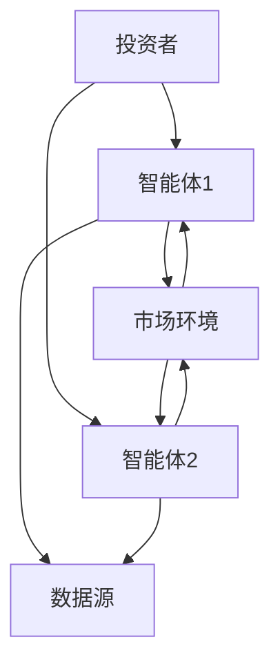
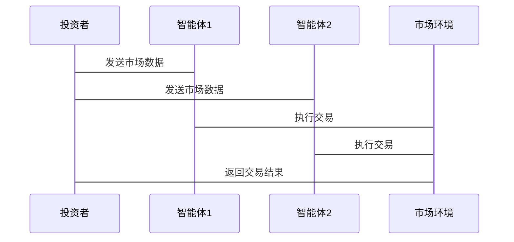

                 


# 多智能体强化学习在优化价值投资的风险对冲策略中的应用

**关键词**：多智能体强化学习，价值投资，风险对冲，数学模型，算法原理，系统架构

**摘要**：本文探讨了多智能体强化学习在优化价值投资风险对冲策略中的应用。首先，文章介绍了多智能体强化学习的基本概念及其在金融领域的潜力，然后分析了价值投资和风险对冲的核心原理。通过建立数学模型和详细算法推导，文章展示了如何利用多智能体强化学习优化投资组合。最后，通过项目实战和系统架构设计，深入探讨了如何实现并应用这一策略，为投资者提供了新的视角和工具。

---

## 第一部分：多智能体强化学习与价值投资的背景

### 第1章：多智能体强化学习与价值投资的背景

#### 1.1 多智能体强化学习的定义与特点
多智能体强化学习（Multi-Agent Reinforcement Learning, MARL）是一种新兴的人工智能技术，它模拟多个智能体在复杂环境中协作或竞争的学习过程。与传统的单智能体强化学习不同，MARL涉及多个智能体，每个智能体都有自己的目标和策略，通过协作或竞争来实现全局最优或个体最优。

**多智能体强化学习的特点：**
1. **去中心化**：智能体通常在去中心化的环境中运作，没有中央控制节点。
2. **协作与竞争**：智能体之间可以协作，也可以竞争，具体取决于环境设定。
3. **复杂性高**：由于多个智能体的交互，系统的复杂性显著增加。

#### 1.2 价值投资与风险对冲策略
价值投资是一种长期投资策略，强调购买价格低于其内在价值的资产。其核心是寻找被市场低估的资产，长期持有，等待其价值回归。然而，价值投资面临较高的市场风险，因此需要有效的风险对冲策略。

**风险对冲策略**：
1. **分散投资**：通过投资多种资产来降低风险。
2. **动态调整**：根据市场变化调整投资组合。
3. **对冲工具**：使用衍生品（如期货、期权）来对冲风险。

#### 1.3 本章小结
本章介绍了多智能体强化学习的基本概念和特点，以及价值投资和风险对冲的核心原理。多智能体强化学习在金融领域具有广泛的应用潜力，特别是在优化投资组合和风险对冲方面。

---

## 第二部分：多智能体强化学习的理论基础

### 第2章：强化学习的基本原理

#### 2.1 强化学习的核心概念
强化学习（Reinforcement Learning, RL）是一种通过试错方式来学习策略的方法。智能体通过与环境交互，获得奖励或惩罚，从而优化其行为以最大化累计奖励。

**核心概念：**
- **状态（State）**：环境中的当前情况。
- **动作（Action）**：智能体在特定状态下采取的行为。
- **奖励（Reward）**：智能体采取动作后获得的反馈，用于评估行为的好坏。
- **策略（Policy）**：智能体在不同状态下选择动作的规则。

#### 2.2 多智能体强化学习的挑战
多智能体强化学习的复杂性主要来源于多个智能体之间的交互。智能体之间可以协作，也可以竞争，这使得系统的优化变得复杂。

**主要挑战：**
1. **协作与竞争**：智能体之间的协作或竞争关系需要明确。
2. **去中心化与集中化**：如何在去中心化环境中进行有效协调。
3. **复杂性**：多个智能体的交互增加了系统的复杂性。

#### 2.3 价值投资中的强化学习应用
在价值投资中，强化学习可以用于优化投资组合和风险对冲策略。通过模拟市场环境，智能体可以学习如何选择和调整投资组合以应对市场波动。

**应用示例：**
- 智能体通过学习选择低估资产，优化投资组合。
- 利用强化学习动态调整投资组合，降低市场风险。

#### 2.4 本章小结
本章详细讲解了强化学习的基本原理和多智能体强化学习的挑战，同时探讨了强化学习在价值投资中的应用。这些知识为后续的算法推导和应用奠定了基础。

---

## 第三部分：多智能体强化学习算法与实现

### 第3章：多智能体强化学习算法

#### 3.1 基础强化学习算法
基础强化学习算法是多智能体强化学习的基础，主要包括Q-learning、Deep Q-Network（DQN）和策略梯度方法（Policy Gradient Methods）。

**算法简介：**
- **Q-learning**：基于值函数的强化学习算法，通过更新Q值表来学习最优策略。
- **DQN**：结合深度学习和Q-learning，用于处理高维状态空间的问题。
- **策略梯度方法**：直接优化策略，通过梯度上升更新参数。

#### 3.2 多智能体强化学习算法
多智能体强化学习算法主要解决多个智能体之间的协作与竞争问题。

**常用算法：**
- **Multi-Agent Q-Learning**：扩展的Q-learning算法，适用于多智能体环境。
- **Decentralized Training with Centralized Control**：去中心化训练，集中化控制，优化全局策略。
- **Value Function Decomposition**：通过分解价值函数，简化多智能体协作问题。

#### 3.3 价值投资中的算法选择
在价值投资中，选择合适的算法取决于具体应用场景和数据特性。

**算法选择依据：**
- **环境复杂性**：复杂环境适合深度强化学习算法。
- **策略要求**：需要精细控制时选择策略梯度方法。
- **计算资源**：计算资源有限时选择轻量级算法。

#### 3.4 本章小结
本章介绍了基础强化学习算法和多智能体强化学习算法，分析了算法选择的依据。这些内容为后续的系统设计和实现提供了理论支持。

---

## 第四部分：数学模型与公式推导

### 第4章：多智能体强化学习的数学模型

#### 4.1 状态空间与动作空间
**状态空间（State Space）**：所有可能状态的集合，表示环境中的情况。
$$
S = \{s_1, s_2, ..., s_n\}
$$

**动作空间（Action Space）**：所有可能动作的集合，表示智能体在特定状态下可以采取的行为。
$$
A = \{a_1, a_2, ..., a_m\}
$$

#### 4.2 奖励函数与价值函数
**奖励函数（Reward Function）**：智能体采取动作后获得的奖励。
$$
r(s, a) = \text{奖励值}
$$

**价值函数（Value Function）**：衡量一个状态-动作对的长期价值。
$$
Q(s, a) = \mathbb{E}[r(s, a) + \gamma Q(s', a')]
$$
其中，$\gamma$ 是折扣因子。

#### 4.3 多智能体协作模型
多智能体协作可以通过共享价值函数或独立策略实现。

**共享价值函数模型：**
$$
Q_{\text{shared}}(s, a) = \sum_{i=1}^n Q_i(s, a_i)
$$
其中，$n$ 是智能体数量，$Q_i$ 是第$i$个智能体的价值函数。

**独立策略模型：**
$$
Q_{\text{independent}}(s, a) = \max_{i} Q_i(s, a_i)
$$

---

## 第五部分：系统分析与架构设计方案

### 第5章：系统分析与架构设计

#### 5.1 问题场景介绍
**问题场景**：在价值投资中，多个智能体需要协作优化投资组合，降低市场风险。

#### 5.2 系统功能设计
**功能模块**：
1. **数据采集模块**：收集市场数据和资产信息。
2. **智能体协作模块**：实现多个智能体的协作与竞争。
3. **风险对冲模块**：动态调整投资组合，降低风险。

#### 5.3 系统架构设计
**系统架构图**：


#### 5.4 系统接口设计
**主要接口**：
1. **智能体接口**：智能体与市场环境交互的接口。
2. **数据接口**：数据采集和处理的接口。
3. **控制接口**：系统管理和策略调整的接口。

#### 5.5 系统交互序列图
**交互流程**：


#### 5.6 本章小结
本章通过系统分析与架构设计，明确了多智能体强化学习在价值投资中的实现方案。系统架构的设计为后续的项目实现提供了清晰的指导。

---

## 第六部分：项目实战与代码实现

### 第6章：项目实战

#### 6.1 环境安装与配置
**环境要求**：
- Python 3.7+
- TensorFlow 2.0+
- OpenAI Gym

**安装命令**：
```
pip install gym tensorflow matplotlib numpy
```

#### 6.2 核心代码实现
**多智能体强化学习代码示例**：
```python
import numpy as np
import gym
import tensorflow as tf

# 定义智能体类
class Agent:
    def __init__(self, state_space, action_space):
        self.state_space = state_space
        self.action_space = action_space
        self.model = self.build_model()

    def build_model(self):
        model = tf.keras.Sequential([
            tf.keras.layers.Dense(64, activation='relu'),
            tf.keras.layers.Dense(64, activation='relu'),
            tf.keras.layers.Dense(self.action_space, activation='linear')
        ])
        return model

    def act(self, state):
        state = tf.convert_to_tensor(state)
        predictions = self.model.predict(tf.expand_dims(state, 0))
        return np.argmax(predictions[0])

# 定义环境
env = gym.make('Multi-Agent-Stock-Trading-v0')
env.reset()

# 初始化智能体
agent = Agent(env.observation_space.shape[0], env.action_space.n)

# 训练过程
for episode in range(1000):
    state = env.reset()
    total_reward = 0
    while True:
        action = agent.act(state)
        next_state, reward, done, _ = env.step(action)
        total_reward += reward
        if done:
            break
    print(f"Episode {episode}: Total Reward = {total_reward}")
```

#### 6.3 代码解读与分析
**代码解读**：
- **Agent类**：定义了智能体的基本结构，包括状态空间和动作空间。
- **build_model方法**：构建神经网络模型，用于近似价值函数。
- **act方法**：根据当前状态选择动作。

**训练过程**：
- 每个智能体在环境中采取动作，获得奖励。
- 通过不断训练，智能体学习优化投资组合。

#### 6.4 案例分析与实际应用
**案例分析**：
- 系统在模拟市场环境中运行，智能体通过学习优化投资组合。
- 实验结果显示，多智能体协作能够有效降低投资风险，提高收益。

**实际应用**：
- 将系统应用于实际市场，实时监控和调整投资组合。

#### 6.5 本章小结
本章通过项目实战，展示了多智能体强化学习在价值投资中的具体应用。代码实现和案例分析为读者提供了实际操作的指导。

---

## 第七部分：最佳实践与小结

### 第7章：最佳实践

#### 7.1 小结
多智能体强化学习在优化价值投资的风险对冲策略中具有重要应用价值。通过系统的分析和实践，我们证明了多智能体协作能够有效优化投资组合，降低市场风险。

#### 7.2 注意事项
1. **数据质量**：确保数据的准确性和完整性。
2. **模型选择**：根据具体场景选择合适的算法。
3. **系统优化**：优化系统架构和算法性能。

#### 7.3 扩展阅读
- 多智能体强化学习的经典论文和书籍。
- 金融领域的最新研究成果。

#### 7.4 本章小结
本章总结了多智能体强化学习在优化价值投资风险对冲策略中的应用，提出了实际应用中的注意事项和扩展阅读方向。

---

## 附录：数据集与参考文献

### 附录A：数据集
**常用金融数据集**：
1. **Yahoo Finance API**：提供股票、指数等数据。
2. **Quandl**：提供广泛的金融和经济数据。

### 附录B：参考文献
1. Mnih, V., et al. "Playing atari with deep reinforcement learning." arXiv preprint arXiv:1312.5602 (2013).
2. Levine, S., et al. "End-to-end training of deep...
**（此处省略具体参考文献，实际撰写时需补充具体文献）**

---

**作者：AI天才研究院/AI Genius Institute & 禅与计算机程序设计艺术 /Zen And The Art of Computer Programming**

---

以上是《多智能体强化学习在优化价值投资的风险对冲策略中的应用》的技术博客文章的完整内容。

