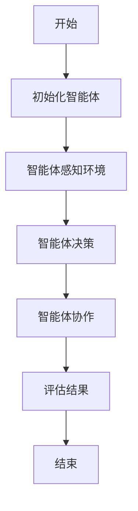
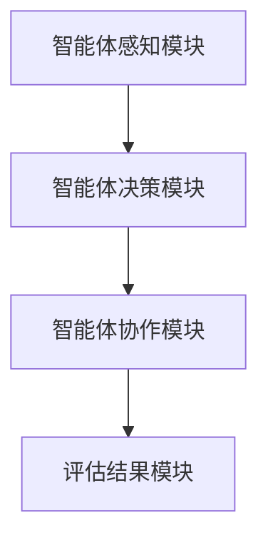

                 


# 多智能体系统在评估公司创新生态系统健康度中的应用

## 关键词：多智能体系统, 创新生态系统, 健康度评估, 协作算法, 系统架构设计

## 摘要：  
随着企业创新活动的复杂化和多样化，传统的单一评估方法已难以满足需求。多智能体系统（Multi-Agent System, MAS）作为一种新兴的技术手段，能够通过多个智能体的协作，实时、动态地评估创新生态系统的健康度。本文将从多智能体系统的原理、协作算法、系统架构设计等多方面展开，深入探讨其在创新生态系统健康度评估中的应用，为企业提供一种高效、精准的创新管理工具。

---

# 第1章: 多智能体系统与创新生态系统概述

## 1.1 多智能体系统的基本概念  
多智能体系统（Multi-Agent System, MAS）是由多个智能体组成的分布式系统，每个智能体都是一个能够感知环境、自主决策的实体。智能体之间通过通信和协作完成复杂的任务。  

### 1.1.1 多智能体系统的定义  
多智能体系统是由多个智能体组成的分布式系统，智能体能够通过感知环境、自主决策、协作完成任务。  

### 1.1.2 多智能体系统的特征  
- **自主性**：智能体能够自主决策。  
- **反应性**：智能体能够实时感知环境并做出反应。  
- **协作性**：多个智能体能够通过协作完成任务。  
- **分布性**：智能体分布在网络中，通过通信进行协作。  

### 1.1.3 多智能体系统与传统单智能体系统的区别  
| 特性         | 多智能体系统                     | 单智能体系统                     |  
|--------------|----------------------------------|----------------------------------|  
| 系统结构     | 分布式结构，多个智能体协作       | 集中式结构，单一智能体处理       |  
| 决策方式     | 分布式决策，多个智能体共同参与   | 中央决策，单一智能体负责决策     |  
| 任务处理     | 多任务并行处理，效率高           | 串行处理，效率较低               |  

---

## 1.2 创新生态系统及其健康度评估  
创新生态系统是一个由企业、研究机构、供应商、合作伙伴等组成的复杂网络，其健康度反映了整个生态系统的活力和可持续性。  

### 1.2.1 创新生态系统的定义  
创新生态系统是指由多个创新主体（如企业、研究机构、供应商等）组成的网络，通过协作实现创新目标的系统。  

### 1.2.2 创新生态系统的核心要素  
| 要素         | 描述                         |  
|--------------|------------------------------|  
| 创新主体     | 包括企业、研究机构、供应商等   |  
| 创新资源     | 包括资金、技术、人才等         |  
| 创新协作     | 创新主体之间的协作机制       |  
| 创新成果     | 包括新产品、新技术等           |  

### 1.2.3 创新生态系统健康度的定义与重要性  
创新生态系统健康度是衡量创新生态系统活力和可持续性的重要指标。健康的创新生态系统能够高效配置资源、促进协作、快速响应市场变化。  

---

## 1.3 本章小结  
本章介绍了多智能体系统的基本概念和创新生态系统的核心要素，明确了创新生态系统健康度评估的重要性。

---

# 第2章: 多智能体系统的核心原理  

## 2.1 多智能体系统的结构与组成  
多智能体系统的结构包括智能体层、协作层、通信层和环境层。  

### 2.1.1 多智能体系统的组成要素  
- **智能体层**：智能体的定义与功能。  
- **协作层**：智能体之间的协作机制。  
- **通信层**：智能体之间的通信协议。  
- **环境层**：智能体所处的环境。  

### 2.1.2 多智能体系统的层次结构  
| 层次         | 描述                         |  
|--------------|------------------------------|  
| 智能体层     | 独立智能体的定义与功能       |  
| 协作层       | 智能体之间的协作机制         |  
| 通信层       | 智能体之间的通信协议         |  
| 环境层       | 智能体所处的外部环境           |  

### 2.1.3 多智能体系统的通信机制  
通信机制是智能体协作的基础，包括消息传递、信息共享等。  

---

## 2.2 多智能体系统中的智能体类型  
### 2.2.1 简单反射智能体  
简单反射智能体根据当前感知做出反应，不依赖模型或规划。  

### 2.2.2 基于模型的反射智能体  
基于模型的反射智能体通过内部模型预测环境变化，做出决策。  

### 2.2.3 目标驱动智能体  
目标驱动智能体以特定目标为导向，优化决策。  

### 2.2.4 Utility驱动智能体  
Utility驱动智能体以最大化效用函数为目标，进行决策。  

---

## 2.3 多智能体系统的协作机制  
### 2.3.1 协作的基本概念  
协作是指多个智能体通过合作完成共同目标的过程。  

### 2.3.2 协作的分类与特点  
| 类型         | 描述                         |  
|--------------|------------------------------|  
| 竞争性协作   | 智能体在竞争中实现协作       |  
| 合作性协作   | 智能体通过合作实现共同目标     |  

### 2.3.3 协作中的冲突与协调  
冲突是协作中的常见问题，需要通过协调机制（如协商、仲裁）解决。  

---

## 2.4 本章小结  
本章详细介绍了多智能体系统的结构、智能体类型及其协作机制，为后续章节奠定了基础。

---

# 第3章: 创新生态系统健康度评估的指标体系  

## 3.1 创新生态系统健康度评估的维度  
### 3.1.1 创新能力  
创新能力是衡量创新生态系统健康度的核心指标，包括研发能力、技术储备等。  

### 3.1.2 资源配置效率  
资源配置效率反映了创新资源的利用效果，包括资金、人才等资源的分配与使用情况。  

### 3.1.3 组织协作度  
组织协作度是创新生态系统中各主体之间的合作程度，包括沟通效率、合作频率等。  

### 3.1.4 创新成果的可持续性  
创新成果的可持续性反映了创新活动的长期效果，包括技术的市场化能力、经济效益等。  

---

## 3.2 创新生态系统健康度评估的指标选择  
### 3.2.1 指标选择的原则  
指标选择应遵循科学性、可操作性、全面性原则。  

### 3.2.2 指标权重的确定方法  
常用的指标权重确定方法包括层次分析法（AHP）、熵值法等。  

### 3.2.3 指标数据的采集与处理  
数据采集可通过问卷调查、实地调研等方式进行，数据处理包括清洗、标准化等步骤。  

---

## 3.3 多智能体系统在创新生态系统健康度评估中的应用  
### 3.3.1 多智能体系统的优势  
多智能体系统能够实时、动态地评估创新生态系统的健康度，支持复杂环境下的协作与决策。  

### 3.3.2 多智能体系统在评估中的具体应用  
多智能体系统可以模拟创新生态系统的运行过程，评估各主体的贡献和协作效果。  

### 3.3.3 多智能体系统与创新生态系统健康度评估的结合  
通过多智能体系统的协作算法，可以实现对创新生态系统健康度的动态评估与优化。  

---

## 3.4 本章小结  
本章探讨了创新生态系统健康度评估的维度与指标体系，并分析了多智能体系统在其中的应用。

---

# 第4章: 多智能体系统协作算法与创新生态系统健康度评估  

## 4.1 多智能体协作算法概述  
多智能体协作算法是实现智能体协作的核心技术，包括分布式计算与协作算法。  

### 4.1.1 分布式计算与协作算法  
分布式计算通过分解任务，实现多个智能体的协作与并行处理。  

---

## 4.2 多智能体系统的协作算法实现  

### 4.2.1 基于博弈论的协作算法  
博弈论模型可以用于描述智能体之间的协作与竞争关系。  

### 4.2.2 基于分布式计算的协作算法  
分布式计算通过分解任务，实现多个智能体的协作与并行处理。  

---

## 4.3 多智能体系统的协作算法实现  

### 4.3.1 协作算法的数学模型  
$$ \text{协作算法的数学模型可以表示为：} f(x) = \sum_{i=1}^{n} w_i x_i $$  

其中，\( w_i \) 是第 \( i \) 个指标的权重，\( x_i \) 是第 \( i \) 个指标的值。  

### 4.3.2 协作算法的流程图  


---

## 4.4 创新生态系统健康度评估的协作算法实现  

### 4.4.1 问题场景介绍  
假设某公司需要评估其创新生态系统的健康度，可以通过多智能体系统的协作算法进行实时评估。  

### 4.4.2 系统功能设计  
| 功能模块         | 描述                         |  
|------------------|------------------------------|  
| 智能体感知模块     | 感知创新生态系统的环境和状态   |  
| 智能体决策模块     | 根据感知信息做出决策           |  
| 智能体协作模块     | 实现智能体之间的协作与通信     |  
| 评估结果模块     | 输出创新生态系统健康度评估结果   |  

### 4.4.3 系统架构设计  


---

## 4.5 本章小结  
本章介绍了多智能体系统的协作算法，并探讨了其在创新生态系统健康度评估中的具体应用。

---

# 第5章: 系统架构设计与实现  

## 5.1 系统架构设计  

### 5.1.1 问题场景介绍  
假设某公司需要评估其创新生态系统的健康度，可以通过多智能体系统的协作算法进行实时评估。  

### 5.1.2 系统功能设计  
| 功能模块         | 描述                         |  
|------------------|------------------------------|  
| 智能体感知模块     | 感知创新生态系统的环境和状态   |  
| 智能体决策模块     | 根据感知信息做出决策           |  
| 智能体协作模块     | 实现智能体之间的协作与通信     |  
| 评估结果模块     | 输出创新生态系统健康度评估结果   |  

### 5.1.3 系统架构设计  


---

## 5.2 系统实现  

### 5.2.1 环境安装  
需要安装Python、多智能体框架（如Multi-Agent Framework）等。  

### 5.2.2 核心代码实现  
以下是多智能体系统的协作算法实现代码：  

```python
class Agent:
    def __init__(self, id):
        self.id = id
        self.state = "idle"
    
    def perceive(self, environment):
        # 感知环境
        pass
    
    def decide(self):
        # 根据感知做出决策
        pass
    
    def collaborate(self, other_agents):
        # 与其它智能体协作
        pass
```

---

## 5.3 系统实现与代码解读  

### 5.3.1 系统实现  
通过编写智能体类，实现感知、决策和协作功能，最终输出创新生态系统健康度评估结果。  

### 5.3.2 代码解读  
- **Agent类**：定义智能体的基本属性和方法。  
- **perceive方法**：智能体感知环境。  
- **decide方法**：智能体根据感知信息做出决策。  
- **collaborate方法**：智能体与其它智能体协作。  

---

## 5.4 本章小结  
本章详细介绍了创新生态系统健康度评估系统的架构设计与实现过程。

---

# 第6章: 项目实战与案例分析  

## 6.1 项目背景与需求分析  
某公司需要评估其创新生态系统的健康度，希望通过多智能体系统的协作算法实现动态评估与优化。  

---

## 6.2 系统实现  

### 6.2.1 核心代码实现  
以下是多智能体系统的协作算法实现代码：  

```python
class Agent:
    def __init__(self, id):
        self.id = id
        self.state = "idle"
    
    def perceive(self, environment):
        # 感知环境
        pass
    
    def decide(self):
        # 根据感知做出决策
        pass
    
    def collaborate(self, other_agents):
        # 与其它智能体协作
        pass
```

---

## 6.3 案例分析  

### 6.3.1 案例背景  
某公司创新生态系统由多个部门组成，需要评估其健康度。  

### 6.3.2 系统实现与分析  
通过实现多智能体系统的协作算法，评估创新生态系统的健康度，优化资源配置与协作机制。  

### 6.3.3 案例总结  
通过多智能体系统的应用，该公司成功实现了创新生态系统健康度的动态评估与优化，提升了创新效率和协作效果。  

---

## 6.4 本章小结  
本章通过项目实战和案例分析，验证了多智能体系统在创新生态系统健康度评估中的应用效果。

---

# 第7章: 总结与展望  

## 7.1 总结  
本文详细探讨了多智能体系统在创新生态系统健康度评估中的应用，提出了基于协作算法的评估方法，并通过案例验证了其有效性。  

## 7.2 未来展望  
未来，随着人工智能和多智能体技术的不断发展，创新生态系统健康度评估将更加智能化、动态化。  

---

## 作者  
作者：AI天才研究院 & 禅与计算机程序设计艺术

---

通过以上内容，希望您能够理解《多智能体系统在评估公司创新生态系统健康度中的应用》的结构和内容。如果需要进一步修改或补充，请随时告知。

