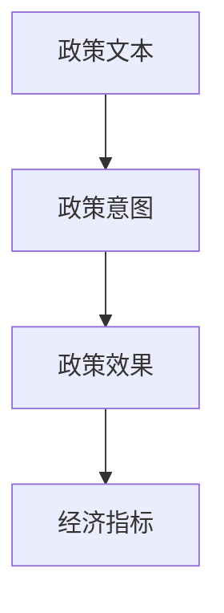
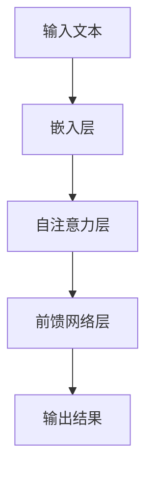
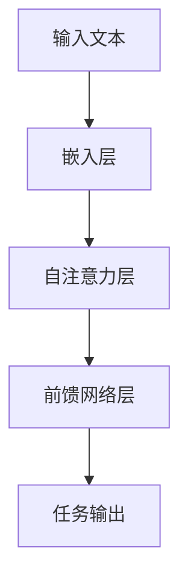
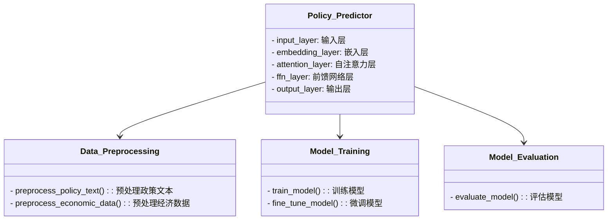
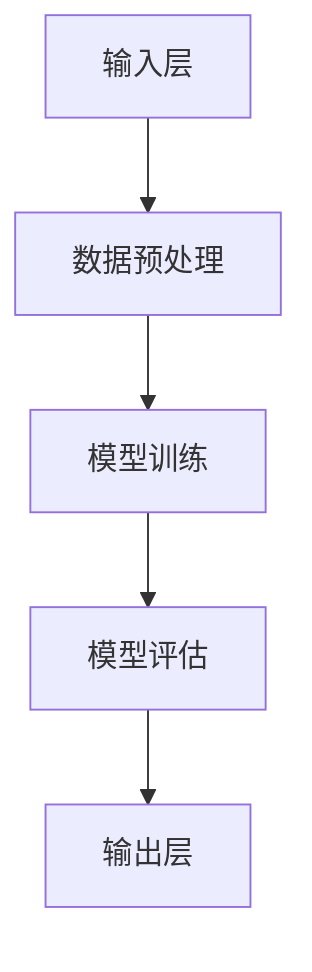
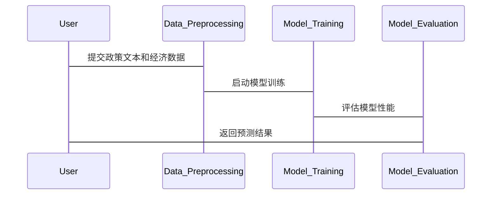

                 


# 开发基于大模型的金融政策执行效果预测器

> 关键词：大模型、金融政策、执行效果预测、自然语言处理、深度学习、政策分析

> 摘要：本文详细探讨了开发基于大模型的金融政策执行效果预测器的背景、核心概念、算法原理、系统架构、项目实战及最佳实践。通过结合自然语言处理和深度学习技术，本文提出了一种创新的解决方案，能够有效预测金融政策的执行效果，为政策制定者和金融机构提供科学依据。

---

# 第一部分: 金融政策执行效果预测器的背景与核心概念

## 第1章: 问题背景与需求分析

### 1.1 问题背景

#### 1.1.1 金融政策执行的复杂性  
金融政策的执行涉及多个因素，包括政策本身的复杂性、执行环境的变化以及政策效果的多维度评估。政策执行的效果往往受到多种外部因素的影响，如经济环境、政策解读的准确性等。

#### 1.1.2 政策执行效果评估的挑战  
传统的政策评估方法通常依赖于人工分析和统计模型，存在效率低、主观性强、覆盖范围有限等问题。随着金融市场的复杂化，政策执行效果的预测需要更高效、更精准的工具。

#### 1.1.3 基于AI的政策预测需求  
人工智能技术，特别是大模型（如GPT系列、BERT系列）的快速发展，为金融政策执行效果的预测提供了新的可能性。通过自然语言处理和深度学习技术，可以更准确地理解政策文本，预测政策效果。

### 1.2 问题描述

#### 1.2.1 金融政策执行的定义  
金融政策执行是指政策制定者将政策目标转化为具体行动的过程，包括政策的制定、实施、监控和评估。

#### 1.2.2 政策执行效果的多维度分析  
政策执行效果可以从多个维度进行评估，包括经济指标（如GDP增长率）、社会指标（如就业率）和政策满意度等。

#### 1.2.3 基于大模型的预测目标  
通过大模型分析政策文本，预测政策执行后的经济和社会效果，为政策制定者提供参考。

### 1.3 问题解决与边界

#### 1.3.1 基于大模型的解决方案  
利用大模型对政策文本进行语义分析，结合历史数据，预测政策执行后的效果。

#### 1.3.2 解决方案的边界与限制  
本方案仅针对政策文本的分析和预测，不涉及政策的实际实施过程。

#### 1.3.3 外延与应用场景  
金融政策执行效果预测器可以应用于政策制定、风险评估、投资决策等领域。

## 第2章: 核心概念与联系

### 2.1 大模型的基本原理

#### 2.1.1 预训练与微调  
大模型通常采用预训练（Pre-training）和微调（Fine-tuning）的两阶段训练方法。预训练阶段通过大规模数据训练模型，微调阶段针对具体任务调整模型参数。

#### 2.1.2 模型的可解释性  
大模型的可解释性是其在金融领域应用的关键。通过分析模型的注意力权重，可以理解模型对政策文本的理解程度。

#### 2.1.3 模型的泛化能力  
大模型在不同任务中的泛化能力使其能够适应金融政策执行效果预测的复杂需求。

### 2.2 金融政策执行效果预测的核心要素

#### 2.2.1 政策文本分析  
通过对政策文本的语义分析，提取政策的关键信息，如政策目标、实施措施等。

#### 2.2.2 经济指标预测  
根据政策文本和历史数据，预测政策执行后的经济指标变化，如GDP增长率、通货膨胀率等。

#### 2.2.3 政策效果评估  
通过多维度指标评估政策执行效果，并提供优化建议。

### 2.3 实体关系图



---

# 第二部分: 基于大模型的预测器算法原理

## 第3章: 大模型的算法原理

### 3.1 预训练阶段

#### 3.1.1 语言模型的训练目标  
预训练阶段的目标是训练一个通用的语言模型，使其能够理解多种语言和文本类型。

#### 3.1.2 自注意力机制  
模型通过自注意力机制捕捉文本中的长距离依赖关系，提高语义理解能力。

#### 3.1.3 梯度下降优化  
使用梯度下降优化算法（如Adam）优化模型参数，降低预测误差。

### 3.2 微调阶段

#### 3.2.1 任务适配  
根据具体任务（如政策效果预测）调整模型的输出层，使其适应特定任务需求。

#### 3.2.2 参数微调  
在预训练的基础上，对模型参数进行微调，提高任务特定的性能。

#### 3.2.3 模型评估  
通过验证集评估模型的性能，调整超参数，优化模型效果。

## 第4章: 算法流程与代码实现

### 4.1 预训练流程



### 4.2 微调流程



### 4.3 代码实现

```python
import torch
import torch.nn as nn
import torch.optim as optim

class PolicyPredictor(nn.Module):
    def __init__(self, vocab_size, embedding_dim, hidden_dim):
        super(PolicyPredictor, self).__init__()
        self.embedding = nn.Embedding(vocab_size, embedding_dim)
        self.attention = nn.MultiheadAttention(embed_dim=hidden_dim, num_heads=8)
        self.ffn = nn.Sequential(
            nn.Linear(hidden_dim, hidden_dim),
            nn.ReLU(),
            nn.Linear(hidden_dim, 1)
        )

    def forward(self, input_ids):
        embed = self.embedding(input_ids)
        attn_output, _ = self.attention(embed, embed, embed)
        output = self.ffn(attn_output.mean(dim=1))
        return output

# 示例用法
vocab_size = 10000
embedding_dim = 512
hidden_dim = 512
model = PolicyPredictor(vocab_size, embedding_dim, hidden_dim)
criterion = nn.MSELoss()
optimizer = optim.Adam(model.parameters(), lr=0.001)

# 假设input_ids是一个batch的输入
input_ids = torch.randint(0, vocab_size, (32, 128))
output = model(input_ids)
loss = criterion(output.squeeze(), target)
loss.backward()
optimizer.step()
```

---

## 第5章: 数学模型与公式

### 5.1 语言模型的概率公式

$$
P(w_1, w_2, \ldots, w_n) = \prod_{i=1}^{n} P(w_i | w_1, w_2, \ldots, w_{i-1})
$$

其中，$P(w_i | w_1, w_2, \ldots, w_{i-1})$ 是条件概率，可以通过自注意力机制和前馈网络计算得到。

### 5.2 损失函数

$$
L = -\sum_{i=1}^{n} \log P(y_i | x)
$$

其中，$x$ 是输入文本，$y_i$ 是预测的输出。

---

# 第三部分: 系统分析与架构设计

## 第6章: 系统分析与架构设计

### 6.1 问题场景介绍

金融政策执行效果预测器需要处理大量的政策文本和经济数据，预测政策执行后的效果。

### 6.2 系统功能设计



### 6.3 系统架构设计



### 6.4 系统接口设计

#### 6.4.1 输入接口
- 政策文本输入：接受结构化的政策文本。
- 经济数据输入：接受历史经济数据。

#### 6.4.2 输出接口
- 预测结果输出：输出政策执行后的效果预测。
- 可视化界面：提供用户友好的操作界面。

### 6.5 系统交互流程



---

# 第四部分: 项目实战

## 第7章: 项目实战

### 7.1 环境安装与数据准备

#### 7.1.1 环境安装
```bash
pip install torch transformers pandas numpy
```

#### 7.1.2 数据准备
- 政策文本数据集：收集历史政策文本和对应的执行效果数据。
- 经济数据集：收集历史经济指标数据。

### 7.2 系统核心实现

#### 7.2.1 数据预处理

```python
import pandas as pd
import numpy as np

def preprocess_policy_text(policy_text):
    # 数据清洗和特征提取
    pass

def preprocess_economic_data(economic_data):
    # 数据标准化和归一化
    pass
```

#### 7.2.2 模型训练

```python
def train_model(model, optimizer, criterion, train_loader, epochs=10):
    for epoch in range(epochs):
        for batch in train_loader:
            outputs = model(batch['input_ids'])
            loss = criterion(outputs.squeeze(), batch['target'])
            loss.backward()
            optimizer.step()
```

#### 7.2.3 模型评估

```python
def evaluate_model(model, val_loader):
    model.eval()
    total_loss = 0
    for batch in val_loader:
        outputs = model(batch['input_ids'])
        loss = criterion(outputs.squeeze(), batch['target'])
        total_loss += loss.item()
    avg_loss = total_loss / len(val_loader)
    return avg_loss
```

### 7.3 应用案例分析

#### 7.3.1 案例背景
假设我们有一个政策文本，目标是预测政策执行后的GDP增长率。

#### 7.3.2 数据输入
```python
policy_text = "This policy aims to increase ..."
```

#### 7.3.3 模型预测
```python
output = model(policy_text)
predicted_growth = output.item()
```

#### 7.3.4 结果分析
根据预测结果，评估政策的可行性和效果。

---

# 第五部分: 最佳实践与拓展

## 第8章: 最佳实践与拓展

### 8.1 注意事项

- **数据隐私**：确保政策文本和经济数据的隐私保护。
- **模型调优**：根据实际需求调整模型参数，优化预测效果。
- **持续学习**：定期更新模型，保持预测的准确性。

### 8.2 小结

本文详细介绍了开发基于大模型的金融政策执行效果预测器的背景、核心概念、算法原理、系统架构和项目实战。通过结合自然语言处理和深度学习技术，本文提出了一种创新的解决方案，能够有效预测政策执行效果。

### 8.3 拓展阅读

- **深度学习与金融**：学习深度学习在金融领域的其他应用，如股票预测、风险评估。
- **大模型优化**：研究如何进一步优化大模型的性能，提高预测的准确性。

---

作者：AI天才研究院/AI Genius Institute & 禅与计算机程序设计艺术 /Zen And The Art of Computer Programming

