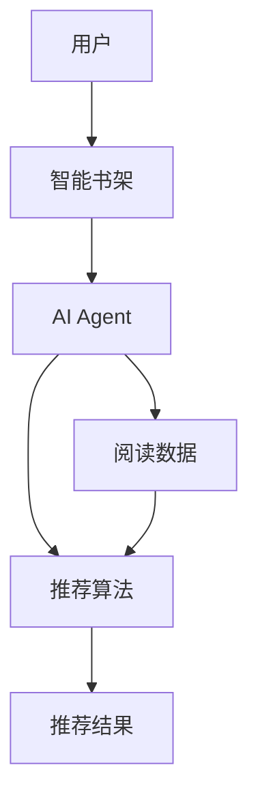
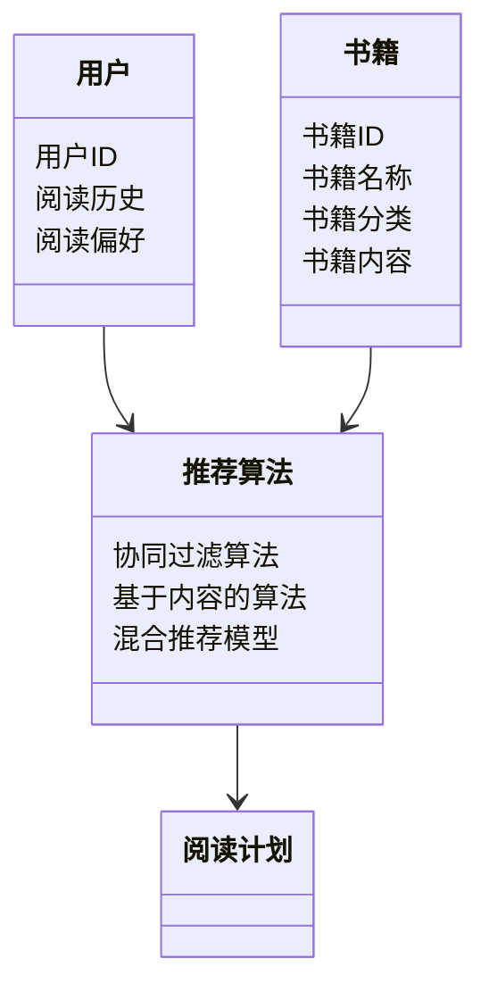
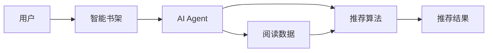

                 


# 智能书架：AI Agent的阅读计划制定助手

## 关键词：AI Agent、智能书架、阅读计划、个性化推荐、机器学习

## 摘要：  
本文探讨了AI Agent在智能书架中的应用，通过分析阅读计划的背景、核心概念与算法原理，结合系统架构设计和项目实战，详细阐述了AI Agent如何助力个性化阅读计划的制定。文章结合理论与实践，展示了如何利用机器学习算法和系统架构设计，打造高效、智能的阅读计划制定工具。

---

# 第一部分: 智能书架与AI Agent的背景介绍

## 第1章: AI Agent与阅读计划的背景

### 1.1 AI Agent的基本概念

#### 1.1.1 AI Agent的定义与特点
AI Agent（人工智能代理）是一种能够感知环境、自主决策并执行任务的智能实体。它具有以下特点：
- **自主性**：能够在没有外部干预的情况下执行任务。
- **反应性**：能够根据环境变化实时调整行为。
- **目标导向**：以明确的目标为导向，优化决策过程。
- **学习能力**：通过数据和反馈不断优化自身性能。

#### 1.1.2 AI Agent的核心功能与应用场景
AI Agent的核心功能包括：
- 数据收集与分析
- 个性化推荐
- 自动决策
- 交互与反馈

AI Agent广泛应用于多个领域，如智能助手（Siri、Alexa）、推荐系统（Netflix、Spotify）等。

#### 1.1.3 AI Agent在阅读计划中的作用
AI Agent在阅读计划中的作用主要体现在：
- 根据用户的阅读习惯和偏好，推荐适合的书籍。
- 帮助用户制定合理的阅读计划，优化阅读效率。
- 提供实时反馈和建议，调整阅读策略。

### 1.2 阅读计划的背景与需求

#### 1.2.1 阅读计划的定义与目标
阅读计划是一种系统性地安排阅读内容和时间的方式，旨在帮助用户高效地完成阅读目标。其目标包括：
- 提高阅读效率
- 深入理解阅读内容
- 培养阅读习惯

#### 1.2.2 当前阅读计划工具的局限性
当前的阅读计划工具主要依赖手动输入和简单的提醒功能，存在以下局限性：
- 缺乏个性化推荐
- 无法实时调整计划
- 数据分析能力有限

#### 1.2.3 AI Agent在阅读计划中的优势
AI Agent通过机器学习和数据分析，能够为阅读计划提供以下优势：
- 个性化推荐：根据用户的阅读历史和偏好，推荐适合的书籍。
- 实时调整：根据用户的反馈和阅读进度，动态调整阅读计划。
- 智能提醒：通过自然语言处理技术，提供个性化的提醒和建议。

### 1.3 智能书架的核心概念

#### 1.3.1 智能书架的定义与功能
智能书架是一种结合了AI技术的电子书架，其核心功能包括：
- 个性化推荐：基于用户的行为和偏好，推荐书籍。
- 智能管理：自动整理和分类书籍。
- 交互式阅读：提供互动式的阅读体验。

#### 1.3.2 智能书架与传统书架的区别
智能书架与传统书架的主要区别在于：
- 智能书架具有智能化推荐和管理功能。
- 传统书架主要依赖人工整理和管理。

#### 1.3.3 智能书架的必要性与应用场景
智能书架的必要性体现在：
- 帮助用户高效管理阅读资源。
- 提供个性化的阅读体验。
- 适用于教育、企业培训、个人阅读等多种场景。

---

## 第2章: AI Agent与智能书架的核心概念

### 2.1 AI Agent与智能书架的关系

#### 2.1.1 AI Agent在智能书架中的角色
AI Agent在智能书架中的角色是实现智能化推荐和管理的核心。它通过数据收集、分析和决策，为用户提供个性化的阅读计划。

#### 2.1.2 智能书架的核心要素与功能模块
智能书架的核心要素包括：
- 用户数据：用户的阅读历史、偏好、进度等。
- 书籍数据：书籍的分类、内容、评价等。
- 推荐算法：协同过滤、基于内容的推荐、混合推荐模型等。
- 交互界面：用户与智能书架的交互界面。

#### 2.1.3 AI Agent与智能书架的交互流程
AI Agent与智能书架的交互流程可以分为以下几个步骤：
1. 用户输入阅读需求。
2. AI Agent收集用户数据。
3. AI Agent分析数据，生成推荐结果。
4. AI Agent与用户交互，优化推荐结果。
5. AI Agent更新用户数据，持续改进推荐策略。

### 2.2 核心概念的属性对比

#### 2.2.1 AI Agent与传统阅读工具的对比分析
| 属性         | AI Agent                      | 传统阅读工具                  |
|--------------|-------------------------------|------------------------------|
| 功能         | 个性化推荐、智能管理          | 基本功能：存储、检索          |
| 技术基础     | 机器学习、自然语言处理      | 简单的数据存储与检索技术      |
| 用户体验     | 高度个性化、智能化            | 单一、缺乏互动                |

#### 2.2.2 智能书架与传统书架的对比分析
| 属性         | 智能书架                      | 传统书架                    |
|--------------|-------------------------------|-----------------------------|
| 核心功能     | 个性化推荐、智能管理          | 存储、检索书籍              |
| 技术基础     | 机器学习、自然语言处理      | 简单的数据存储技术          |
| 用户体验     | 高度互动、智能化            | 单一、缺乏互动              |

#### 2.2.3 阅读计划与个性化推荐的对比分析
| 属性         | 阅读计划                      | 个性化推荐                  |
|--------------|-------------------------------|-----------------------------|
| 核心目标     | 时间安排、内容选择          | 提供适合的书籍              |
| 方法         | 基于规则、目标导向          | 基于数据挖掘、机器学习      |
| 用户体验     | 结构化、可调整              | 高度个性化、实时反馈        |

### 2.3 实体关系图



---

## 第3章: AI Agent的算法原理

### 3.1 推荐算法概述

#### 3.1.1 协同过滤算法
协同过滤是一种基于用户相似性或物品相似性的推荐算法。它分为基于用户的协同过滤和基于物品的协同过滤。

##### 用户协同过滤
用户协同过滤的核心思想是：如果两个用户在过去的行为（如购买、评分）相似，那么他们未来的兴趣也会相似。

公式：
$$\text{相似度} = \frac{\sum_{i=1}^{n} (r_{u,i} - \bar{r}_u)(r_{v,i} - \bar{r}_v)}{\sqrt{\sum_{i=1}^{n} (r_{u,i} - \bar{r}_u)^2} \cdot \sqrt{\sum_{i=1}^{n} (r_{v,i} - \bar{r}_v)^2}}}$$
其中，$r_{u,i}$表示用户u对物品i的评分，$\bar{r}_u$表示用户u的平均评分。

##### 物品协同过滤
物品协同过滤的核心思想是：如果两个物品在过去被同一用户购买或评分的次数较多，那么它们之间的相似性较高。

公式：
$$\text{相似度} = \frac{\sum_{u=1}^{m} (r_{u,i} - \bar{r}_i)(r_{u,j} - \bar{r}_j)}{\sqrt{\sum_{u=1}^{m} (r_{u,i} - \bar{r}_i)^2} \cdot \sqrt{\sum_{u=1}^{m} (r_{u,j} - \bar{r}_j)^2}}}$$
其中，$r_{u,i}$表示用户u对物品i的评分，$\bar{r}_i$表示物品i的平均评分。

#### 3.1.2 基于内容的推荐算法
基于内容的推荐算法是通过分析物品本身的属性（如书籍的内容、分类）来生成推荐结果。

##### 基于内容的推荐步骤
1. **提取特征**：从书籍内容中提取关键词、主题等特征。
2. **计算相似度**：根据特征向量计算书籍之间的相似度。
3. **生成推荐**：根据相似度排序，推荐最相关的书籍。

#### 3.1.3 混合推荐模型
混合推荐模型是将协同过滤和基于内容的推荐算法结合起来，以克服单一算法的局限性。

##### 混合推荐模型的优缺点
- **优点**：结合了协同过滤和基于内容推荐的优势，能够提供更准确的推荐结果。
- **缺点**：实现复杂，需要同时处理用户行为和物品属性的数据。

### 3.2 推荐算法的数学模型

#### 3.2.1 协同过滤的相似度计算
$$\text{相似度} = \frac{\sum_{i=1}^{n} (r_{u,i} - \bar{r}_u)(r_{v,i} - \bar{r}_v)}{\sqrt{\sum_{i=1}^{n} (r_{u,i} - \bar{r}_u)^2} \cdot \sqrt{\sum_{i=1}^{n} (r_{v,i} - \bar{r}_v)^2}}$$

#### 3.2.2 基于内容的推荐模型
$$\text{相似度} = \frac{\sum_{i=1}^{n} w_i \cdot f_i}{\sqrt{\sum_{i=1}^{n} w_i^2} \cdot \sqrt{\sum_{i=1}^{n} f_i^2}}$$
其中，$w_i$是特征$f_i$的权重，$f_i$是特征$f_i$的值。

---

## 第4章: 系统分析与架构设计

### 4.1 系统需求分析

#### 4.1.1 需求背景
智能书架的系统需求来源于用户的阅读习惯和阅读计划的制定需求。

#### 4.1.2 功能需求
- 用户注册与登录
- 书籍的上传与管理
- 阅读计划的制定与调整
- 个性化推荐

#### 4.1.3 性能需求
- 响应时间：用户操作的响应时间不超过2秒。
- 可扩展性：系统能够支持大量用户的并发访问。

### 4.2 系统功能设计

#### 4.2.1 领域模型


#### 4.2.2 系统架构设计


#### 4.2.3 接口设计
- 用户接口：提供用户注册、登录、查看推荐结果等功能。
- 管理接口：提供书籍的上传、删除、修改等功能。
- 推荐接口：提供推荐算法的调用接口。

#### 4.2.4 交互流程
1. 用户登录系统。
2. 系统收集用户的阅读历史和偏好。
3. AI Agent根据收集的数据，运行推荐算法。
4. 推荐结果返回给用户。
5. 用户根据推荐结果调整阅读计划。

---

## 第5章: 项目实战

### 5.1 环境安装

#### 5.1.1 安装Python
```bash
python --version
pip install --upgrade pip
```

#### 5.1.2 安装依赖库
```bash
pip install numpy
pip install scikit-learn
pip install matplotlib
```

### 5.2 核心代码实现

#### 5.2.1 协同过滤算法实现
```python
import numpy as np
from sklearn.metrics.pairwise import cosine_similarity

# 用户评分矩阵
user_ratings = np.array([
    [4, 3, 0, 1],
    [2, 4, 3, 2],
    [3, 1, 4, 1]
])

# 计算用户相似度
similarity = cosine_similarity(user_ratings)
print(similarity)
```

#### 5.2.2 基于内容的推荐算法实现
```python
from sklearn.feature_extraction.text import TfidfVectorizer

# 文本数据
texts = [
    "The quick brown fox jumps over the lazy dog",
    "A slow brown cow jumps over the quick dog",
    "The dog jumps over the fox"
]

# 提取TF-IDF特征
vectorizer = TfidfVectorizer()
tfidf = vectorizer.fit_transform(texts)
print(tfidf)
```

### 5.3 案例分析

#### 5.3.1 协同过滤案例
```python
# 示例数据
user_ratings = np.array([
    [4, 3, 0, 1],
    [2, 4, 3, 2],
    [3, 1, 4, 1]
])

# 计算相似度
similarity = cosine_similarity(user_ratings)
print(similarity)
```

#### 5.3.2 基于内容的推荐案例
```python
# 示例数据
texts = [
    "Math and AI",
    "AI and Computer Vision",
    "Computer Vision and Machine Learning"
]

# 提取TF-IDF特征
vectorizer = TfidfVectorizer()
tfidf = vectorizer.fit_transform(texts)
print(tfidf)
```

### 5.4 项目总结

#### 5.4.1 实验结果
- 协同过滤算法在用户数据充足时表现较好。
- 基于内容的推荐算法在书籍内容丰富时表现较好。

#### 5.4.2 实验分析
- 协同过滤算法需要大量的用户数据支持。
- 基于内容的推荐算法需要高质量的书籍内容。

#### 5.4.3 优化建议
- 结合协同过滤和基于内容的推荐算法，构建混合推荐模型。
- 优化推荐算法的计算效率，提高系统的响应速度。

---

## 第6章: 最佳实践与小结

### 6.1 最佳实践

#### 6.1.1 数据预处理
- 清洗数据：去除噪声数据。
- 标准化数据：统一数据格式。

#### 6.1.2 算法选择
- 根据具体场景选择合适的推荐算法。
- 结合多种算法，构建混合推荐模型。

#### 6.1.3 系统优化
- 优化推荐算法的计算效率。
- 提高系统的可扩展性。

### 6.2 小结

智能书架通过AI Agent的推荐算法，能够为用户提供个性化的阅读计划。本文从背景介绍、核心概念、算法原理、系统设计到项目实战，详细探讨了智能书架的实现过程。通过实践案例的分析，展示了AI Agent在阅读计划中的巨大潜力。

### 6.3 注意事项

- 数据隐私保护：确保用户数据的安全性。
- 算法可解释性：提高推荐算法的透明度。
- 系统稳定性：确保系统的高可用性。

### 6.4 拓展阅读

- 推荐系统：《推荐系统实战》
- 机器学习：《机器学习实战》
- 自然语言处理：《自然语言处理入门》

---

## 作者：AI天才研究院/AI Genius Institute & 禅与计算机程序设计艺术 /Zen And The Art of Computer Programming

---

本文通过详细分析AI Agent在智能书架中的应用，展示了如何利用机器学习算法和系统架构设计，打造高效、智能的阅读计划制定工具。希望本文能够为读者提供有价值的参考和启发。

