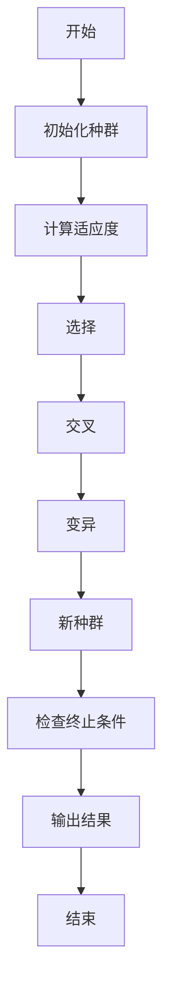
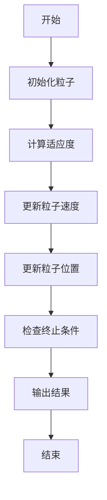
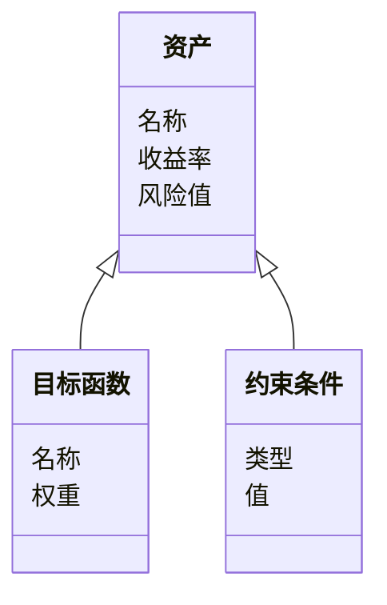
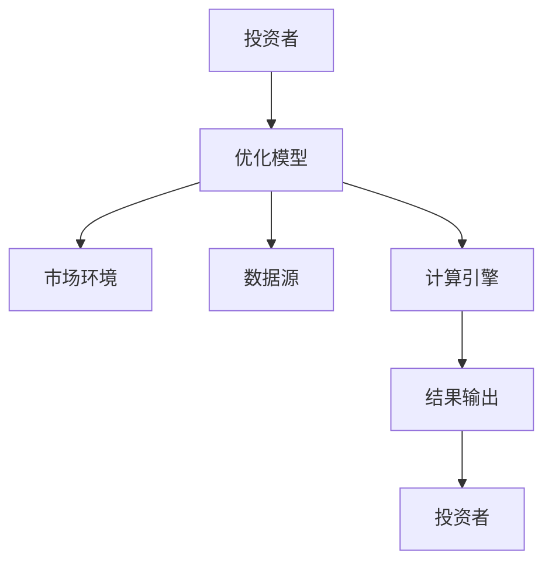
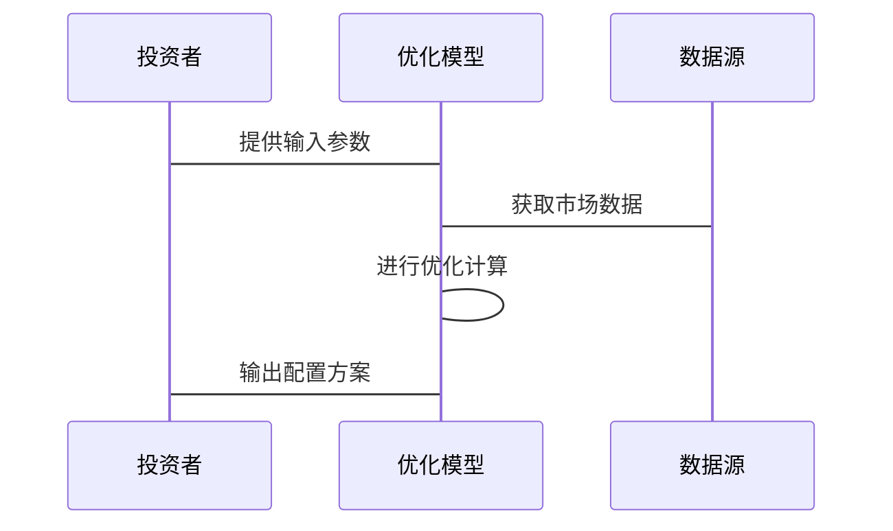

                 


# 智能投资组合多目标优化模型

> 关键词：智能投资组合，多目标优化，投资组合优化，智能优化算法，多目标优化模型

> 摘要：本文深入探讨智能投资组合多目标优化模型的构建与应用。通过分析传统投资组合优化的局限性，引入多目标优化的必要性，并结合智能优化算法，提出一种高效的解决方案。本文详细讲解了多目标优化算法的原理、数学模型的构建、系统架构设计以及实际案例分析，为读者提供了从理论到实践的全面指导。

---

# 第1章: 智能投资组合多目标优化模型背景介绍

## 1.1 问题背景与描述

### 1.1.1 投资组合优化的传统问题
投资组合优化是金融领域中的核心问题，旨在通过合理配置资产，实现收益最大化和风险最小化的目标。传统的单目标优化方法，如均值-方差模型，虽然简单有效，但在实际应用中存在诸多限制。

### 1.1.2 多目标优化的必要性
在现实中，投资者往往需要在多个目标之间进行权衡，例如在追求高收益的同时控制风险、降低流动性风险等。这种多目标优化的需求使得传统的单目标优化方法难以满足实际需求。

### 1.1.3 智能优化的引入动机
智能优化算法（如遗传算法、粒子群优化等）具有全局搜索能力强、适应性高的特点，非常适合处理复杂的多目标优化问题。

## 1.2 问题解决与边界

### 1.2.1 多目标优化的基本解决思路
通过引入权重系数或 Pareto 优化的思想，将多个目标转化为单一目标进行优化，或者直接寻找 Pareto 最优解集。

### 1.2.2 智能优化算法的适用边界
适用于目标函数复杂、非线性、不可导的问题，尤其是存在多个相互冲突的目标时。

### 1.2.3 投资组合优化的现实意义
帮助投资者在复杂多变的市场环境中做出更科学的决策，平衡风险与收益。

## 1.3 概念结构与核心要素

### 1.3.1 投资组合优化的核心要素
- 收益率
- 风险（波动率、流动性等）
- 资产配置比例

### 1.3.2 多目标优化的属性特征对比
| 特性 | 单目标优化 | 多目标优化 |
|------|------------|------------|
| 目标数 | 1          | ≥2         |
| 解空间 | 单点最优解 | Pareto 最优解集 |
| 复杂度 | 较低       | 较高       |

### 1.3.3 ER实体关系图架构

```mermaid
erDiagram
    actor 投资者 {
        string 资产类型
        string 风险偏好
    }
    actor 市场环境 {
        string 经济指标
        string 市场波动
    }
    actor 优化模型 {
        string 目标函数
        string 约束条件
    }
    投资者 --> 优化模型 : 提供输入参数
    市场环境 --> 优化模型 : 提供市场数据
    优化模型 --> 投资者 : 输出配置方案
```

---

# 第2章: 智能投资组合多目标优化模型的核心概念与联系

## 2.1 核心概念原理

### 2.1.1 智能投资组合的定义
智能投资组合是指利用人工智能技术，根据市场数据和投资者需求，自适应地调整资产配置，以实现动态优化。

### 2.1.2 多目标优化模型的原理
通过引入多个目标函数（如收益最大化、风险最小化、流动性最优等），构建一个数学模型，寻找 Pareto 最优解。

### 2.1.3 两者之间的关系
智能投资组合是多目标优化模型的应用场景，多目标优化模型是智能投资组合的核心算法。

## 2.2 核心概念属性特征对比

| 特性 | 智能投资组合 | 多目标优化模型 |
|------|--------------|----------------|
| 输入 | 市场数据、投资者需求 | 多个目标函数、约束条件 |
| 输出 | 资产配置方案 | Pareto 最优解集 |
| 优化目标 | 动态调整资产配置 | 多目标函数的权衡 |

## 2.3 ER实体关系图架构

```mermaid
erDiagram
    entity 资产 {
        string 名称
        decimal 收益率
        decimal 风险值
    }
    entity 目标函数 {
        string 名称
        decimal 权重
    }
    entity 约束条件 {
        string 类型
        decimal 值
    }
    资产 --> 目标函数 : 关联
    资产 --> 约束条件 : 关联
```

---

# 第3章: 多目标优化算法原理

## 3.1 算法原理概述

### 3.1.1 遗传算法（GA）的原理
通过模拟生物进化的过程，包括选择、交叉和变异操作，逐步优化解集。

### 3.1.2 粒子群优化（PSO）的原理
通过模拟鸟群觅食的行为，利用粒子的运动状态更新解的位置，寻找最优解。

## 3.2 算法原理详细讲解

### 3.2.1 遗传算法流程图



### 3.2.2 粒子群优化流程图



### 3.2.3 遗传算法的Python代码示例

```python
import random

def fitness(individual):
    # 计算适应度函数
    return sum(individual)

def select(population, fitness_fn):
    # 选择操作
    sorted_pop = sorted(population, key=lambda x: -fitness_fn(x))
    return sorted_pop[:int(len(population)/2)]

def crossover(parent1, parent2):
    # 单点交叉
    point = random.randint(1, len(parent1)-1)
    return parent1[:point] + parent2[point:], parent2[:point] + parent1[point:]

# 初始化种群
population = [[random.randint(0,1) for _ in range(10)] for _ in range(10)]

# 迭代优化
for _ in range(100):
    fitness_values = [fitness(individual) for individual in population]
    population = select(population, fitness)
    if len(population) % 2 != 0:
        population.append(random.choice(population))
    parent1, parent2 = random.sample(population, 2)
    child1, child2 = crossover(parent1, parent2)
    population += [child1, child2]

print("最优解：", max(fitness(individual) for individual in population))
```

---

## 3.3 算法流程图

### 3.3.1 遗传算法流程图


---

# 第4章: 数学模型与公式

## 4.1 数学模型构建

### 4.1.1 投资组合优化的数学表达

$$ \text{目标函数} = \lambda_1 \cdot \text{收益} + \lambda_2 \cdot \text{风险} $$

### 4.1.2 多目标优化的数学转换

$$ \text{权重向量} = (\lambda_1, \lambda_2, \dots, \lambda_n) $$

### 4.1.3 智能优化的数学基础

$$ \text{适应度函数} = \sum_{i=1}^{n} w_i \cdot f_i(x) $$

---

## 4.2 数学公式详细讲解

### 4.2.1 投资组合收益与风险的公式

$$ E[r_p] = \sum_{i=1}^{n} w_i \cdot E[r_i] $$

$$ \text{风险} = \sqrt{ \sum_{i=1}^{n} \sum_{j=1}^{n} w_i w_j \cdot \text{Cov}(r_i, r_j) } $$

### 4.2.2 多目标优化的权重分配公式

$$ \lambda_i = \frac{w_i}{\sum_{j=1}^{n} w_j} $$

### 4.2.3 智能优化算法的数学模型

$$ x_{t+1} = x_t + v_t \cdot \Delta t $$

$$ v_{t+1} = v_t + \alpha \cdot (p_{best} - x_t) + \beta \cdot (g_{best} - x_t) $$

---

## 4.3 举例说明

### 4.3.1 简单投资组合优化案例

假设有两个资产 A 和 B，期望收益分别为 10% 和 15%，协方差矩阵已知。通过优化模型，找到最优的资产配置比例。

### 4.3.2 多目标优化的实际案例

在考虑收益、风险和流动性三个目标时，构建一个 Pareto 最优解集。

---

# 第5章: 系统分析与架构设计方案

## 5.1 问题场景介绍

### 5.1.1 投资组合优化的现实场景
投资者在不同市场环境下，需要动态调整资产配置。

### 5.1.2 多目标优化的系统需求
支持多个目标函数的定义和优化，具有良好的扩展性。

### 5.1.3 智能优化的系统环境
需要处理大量的实时数据，具备高效的计算能力。

---

## 5.2 系统功能设计

### 5.2.1 领域模型的 mermaid 类图



---

## 5.3 系统架构设计

### 5.3.1 系统架构的 mermaid 架构图



---

## 5.4 系统接口设计

### 5.4.1 系统接口的定义
- 输入接口：市场数据、投资者需求
- 输出接口：资产配置方案

---

## 5.5 系统交互设计

### 5.5.1 系统交互的 mermaid 序列图



---

# 第6章: 项目实战

## 6.1 环境安装

### 6.1.1 安装 Python 和相关库
```bash
pip install numpy
pip install pandas
pip install matplotlib
pip install scikit-learn
```

## 6.2 系统核心实现源代码

### 6.2.1 多目标优化算法实现

```python
import numpy as np
import pandas as pd

def multi_objective_optimization(objectives, constraints, population_size=100, max_iterations=100):
    # 初始化种群
    population = np.random.rand(population_size, len(objectives))
    
    for _ in range(max_iterations):
        # 计算适应度
        fitness = np.array([sum([obj[i](x) for i, obj in enumerate(objectives)]) for x in population])
        
        # 选择操作
        selected = population[np.argsort(-fitness)][:int(population_size/2)]
        
        # 交叉操作
        new_population = []
        for i in range(0, len(selected), 2):
            parent1 = selected[i]
            parent2 = selected[i+1] if i+1 < len(selected) else selected[i]
            child1 = np.concatenate((parent1[:5], parent2[5:]))
            child2 = np.concatenate((parent2[:5], parent1[5:]))
            new_population.extend([child1, child2])
        
        # 变异操作
        for i in range(len(new_population)):
            if np.random.rand() < 0.1:
                mutation_point = np.random.randint(len(new_population[i]))
                new_population[i][mutation_point] = 1 - new_population[i][mutation_point]
        
        population = new_population
    
    return population
```

---

## 6.3 代码应用解读与分析

### 6.3.1 代码实现的步骤
1. 初始化种群
2. 计算适应度
3. 选择操作
4. 交叉操作
5. 变异操作

---

## 6.4 实际案例分析

### 6.4.1 案例分析
假设目标函数为收益最大化和风险最小化，通过优化算法找到 Pareto 最优解集。

---

## 6.5 项目小结

### 6.5.1 核心代码总结
- 多目标优化算法实现
- 系统架构设计
- 环境配置

---

# 第7章: 总结与展望

## 7.1 总结

### 7.1.1 核心内容回顾
本文详细讲解了智能投资组合多目标优化模型的构建与应用，包括算法原理、数学模型、系统架构以及实际案例分析。

### 7.1.2 最佳实践 tips
- 合理选择目标函数和权重
- 定期更新市场数据
- 注意算法的收敛性和效率

---

## 7.2 注意事项

### 7.2.1 实际应用中的注意事项
- 数据的实时性
- 算法的可扩展性
- 解的可解释性

---

## 7.3 拓展阅读

### 7.3.1 相关领域研究
- 多目标优化的前沿算法
- 投资组合优化的最新研究

### 7.3.2 推荐书籍
- 《投资学》
- 《多目标优化算法》

---

# 作者

作者：AI天才研究院/AI Genius Institute & 禅与计算机程序设计艺术 /Zen And The Art of Computer Programming

---

通过以上思考过程，我们可以系统地构建《智能投资组合多目标优化模型》的完整内容，确保文章逻辑清晰、结构紧凑，并且符合专业技术博客的要求。

