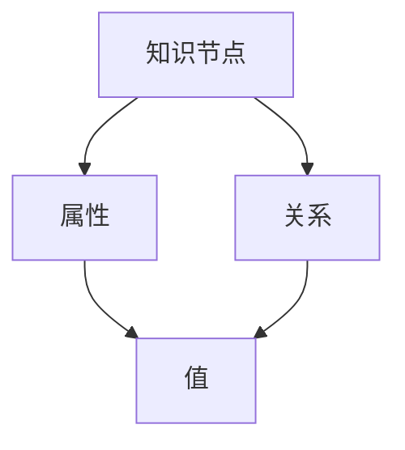
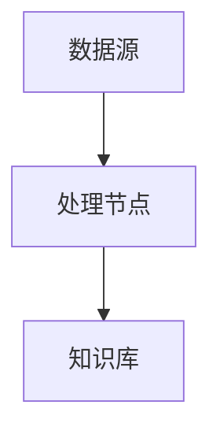
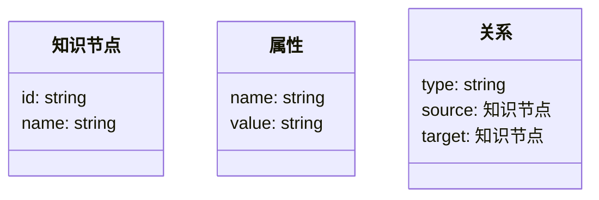
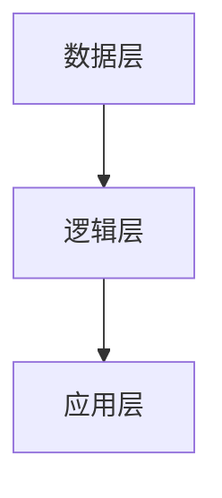

                 


# 设计AI Agent的动态知识库构建与维护

> 关键词：AI Agent，动态知识库，知识表示，动态更新，知识检索

> 摘要：本文系统地探讨了设计AI Agent的动态知识库构建与维护的关键技术。从背景介绍到核心概念，从算法原理到系统架构，从项目实战到最佳实践，全面分析了动态知识库在AI Agent中的重要性及其构建方法。通过详细的理论分析和实际案例，本文为AI Agent的动态知识库设计提供了深入的见解和实用指导。

---

## 第1章: AI Agent的动态知识库概述

### 1.1 问题背景与问题描述

#### 1.1.1 AI Agent的核心需求
AI Agent（人工智能代理）是一种能够感知环境、自主决策并执行任务的智能实体。在现代AI应用中，AI Agent需要具备动态知识库来支持其认知和决策能力。动态知识库是AI Agent的核心组件之一，负责存储、更新和检索知识，以支持其在复杂环境中的实时任务执行。

#### 1.1.2 动态知识库的必要性
AI Agent在实际应用中面临动态变化的环境，例如用户需求的实时变化、数据的不断更新、任务的动态分配等。静态的知识库无法满足这些动态需求，因此动态知识库的构建与维护成为AI Agent设计中的关键问题。

#### 1.1.3 问题解决路径与方法
动态知识库的设计需要结合知识表示、动态更新机制和高效检索算法。通过实时数据流处理、事件驱动更新和自适应学习等方法，动态知识库能够保持知识的 актуality 和准确性。

### 1.2 动态知识库的核心概念

#### 1.2.1 知识表示与存储
知识表示是动态知识库的基础，常用的表示方法包括符号表示、语义网络和知识图谱。符号表示通过符号和规则表示知识，语义网络通过节点和边表示语义关系，知识图谱则通过实体和关系构建语义网络。

#### 1.2.2 动态更新机制
动态知识库的更新机制需要考虑数据源的多样性、更新频率和更新策略。实时数据流处理、事件驱动更新和基于规则的自动更新是常见的更新方法。这些机制能够确保知识库的实时性和准确性。

#### 1.2.3 知识检索与推理
动态知识库的检索与推理能力是其价值的体现。基于关键词检索、基于语义检索和基于上下文的推理是常见的检索方法。这些方法能够支持AI Agent在复杂场景中的智能决策。

### 1.3 动态知识库的边界与外延

#### 1.3.1 知识库的范围界定
动态知识库的范围包括知识的存储、更新和检索。知识库的边界需要明确，以避免与相关系统（如数据库、知识图谱）的混淆。动态知识库的外延包括与AI Agent的其他组件（如感知模块、决策模块）的集成。

#### 1.3.2 相关概念的对比分析
动态知识库与其他概念（如数据库、知识图谱）有明显的区别。数据库主要用于结构化数据的存储和检索，知识图谱用于语义知识的表示，而动态知识库则是动态变化环境中的知识管理解决方案。

#### 1.3.3 动态知识库的未来发展
随着AI技术的发展，动态知识库将更加智能化和自适应。未来的动态知识库将具备更强的自学习能力、更高的实时性和更广泛的应用场景。

### 1.4 核心概念与联系

#### 1.4.1 核心概念原理
动态知识库的核心原理包括知识表示、动态更新和知识检索。这些核心概念相互关联，共同支持AI Agent的智能决策。

#### 1.4.2 概念属性特征对比表
| 概念       | 属性       | 特征                           |
|------------|------------|--------------------------------|
| 知识表示     | 表达方式     | 符号、语义网络、知识图谱         |
| 动态更新     | 更新频率     | 实时、周期性                     |
| 知识检索     | 检索方式     | 基于关键词、基于语义、基于上下文 |

#### 1.4.3 ER实体关系图
动态知识库的ER实体关系图展示了知识节点、属性、关系和值之间的关系。


### 1.5 本章小结
本章从背景介绍、核心概念和边界分析三个方面详细介绍了动态知识库在AI Agent中的重要性。通过对比分析和ER实体关系图，明确了动态知识库的核心要素及其相互关系。

---

## 第2章: 动态知识库的核心原理

### 2.1 知识表示与存储

#### 2.1.1 向量空间模型
向量空间模型是一种常用的知识表示方法。通过将知识表示为向量，可以在高维空间中进行相似性计算。
$$
\text{余弦相似度} = \frac{\vec{A} \cdot \vec{B}}{|\vec{A}| |\vec{B}|}
$$

#### 2.1.2 知识图谱表示
知识图谱通过实体和关系构建语义网络，支持复杂的语义推理。

#### 2.1.3 知识存储的实现
动态知识库可以采用分布式存储技术，如图数据库和键值存储，以支持高效的查询和更新。

### 2.2 动态更新机制

#### 2.2.1 数据流处理
实时数据流处理是动态知识库更新的重要方式。通过流处理框架（如Apache Kafka、Apache Flink）实现数据的实时更新。


#### 2.2.2 基于规则的更新
基于规则的更新通过预定义的规则自动触发知识库的更新。例如，当检测到特定事件时，触发知识库的更新。

#### 2.2.3 自适应学习
自适应学习通过机器学习算法实现知识库的自适应更新。例如，使用在线学习算法实时更新知识表示。

### 2.3 知识检索与推理

#### 2.3.1 基于关键词的检索
基于关键词的检索通过匹配关键词实现快速查询。例如，使用倒排索引实现高效的关键词检索。

#### 2.3.2 基于语义的检索
基于语义的检索通过语义分析技术实现相似性检索。例如，使用向量检索技术实现语义相似的知识检索。

#### 2.3.3 基于上下文的推理
基于上下文的推理通过推理引擎实现复杂的逻辑推理。例如，使用规则引擎或逻辑推理引擎实现基于上下文的推理。

### 2.4 本章小结
本章详细介绍了动态知识库的核心原理，包括知识表示与存储、动态更新机制和知识检索与推理。通过向量空间模型、知识图谱表示、数据流处理和自适应学习等方法，动态知识库能够支持AI Agent在动态环境中的智能决策。

---

## 第3章: 动态知识库的算法原理

### 3.1 向量空间模型的实现

#### 3.1.1 向量表示方法
向量表示方法包括独热编码和词嵌入。词嵌入（如Word2Vec）通过上下文信息生成词向量。
$$
\text{Word2Vec} = \argmin_{\vec{w}} \sum_{j=1}^{n} \log P(w_j | w_{j-n}, ..., w_{j-1})
$$

#### 3.1.2 余弦相似度计算
余弦相似度用于计算两个向量之间的相似性。
$$
\text{余弦相似度} = \frac{\vec{A} \cdot \vec{B}}{|\vec{A}| |\vec{B}|}
$$

#### 3.1.3 算法实现
使用Python实现向量空间模型的计算。
```python
import numpy as np

def cosine_similarity(a, b):
    return np.dot(a, b) / (np.linalg.norm(a) * np.linalg.norm(b))
```

### 3.2 知识图谱构建

#### 3.2.1 实体识别与抽取
实体识别通过NLP技术从文本中抽取实体。
```python
from spacy.lang.zh import Chinese
import spacy

nlp = spacy.load("zh_core_web_sm")
doc = nlp("北京是中国的首都。")
for ent in doc.ents:
    print(ent.text, ent.label_)
```

#### 3.2.2 关系抽取
关系抽取通过模式匹配或深度学习模型识别实体之间的关系。
```python
import stanza

nlp = stanza.Pipeline("zh")
doc = nlp("张三的妻子是李四。")
for sentence in doc.sentences:
    for word in sentence.words:
        print(word.text, word.deprel)
```

#### 3.2.3 知识图谱构建
使用图数据库（如Neo4j）构建知识图谱。
```python
from neo4j import GraphDatabase

driver = GraphDatabase.driver("bolt://localhost:7687")
session = driver.session()

# 创建节点
session.run("CREATE (:Person {name: '张三'})")
session.run("CREATE (:Person {name: '李四'})")
session.run("CREATE (:Relationship {type: '妻子', from: '张三', to: '李四'})")
```

### 3.3 动态更新算法

#### 3.3.1 实时数据流处理
使用Apache Flink进行实时数据流处理。
```python
from pyflink.datastream import StreamExecutionEnvironment
from pyflink.table import *

env = StreamExecutionEnvironment.get_execution_environment()
t_env = TableEnvironment.get_global_tableEnvironment(env)

# 定义数据流处理逻辑
t_env.execute_sql("CREATE TABLE source_table (id INT, name STRING) WITH (type='kafka')")
t_env.execute_sql("CREATE TABLE target_table (id INT, name STRING) WITH (type='file_system')")
t_env.execute_sql("INSERT INTO target_table SELECT id, name FROM source_table")
```

#### 3.3.2 基于规则的更新
通过预定义的规则实现知识库的自动更新。
```python
# 示例规则：检测到新实体，自动添加到知识库
def update_rule(new_entity):
    session.run(f"CREATE (:Entity {{id: '{new_entity.id}', name: '{new_entity.name}'}})")
```

#### 3.3.3 自适应学习
使用在线学习算法实现知识库的自适应更新。
```python
# 示例：在线学习更新实体关系
def update_relation(old_rel, new_rel):
    session.run(f"MATCH (a:{old_rel.from_type} {{name: '{old_rel.from_entity}'}})-[r:{old_rel.relation}]->(b:{old_rel.to_type} {{name: '{old_rel.to_entity}'}})
    DELETE r
    CREATE (a)-[new_r:{new_rel.relation} {{weight: {new_rel.weight}}}]->(b)")
```

### 3.4 本章小结
本章详细介绍了动态知识库的算法原理，包括向量空间模型、知识图谱构建和动态更新算法。通过Python代码示例和数学公式，深入分析了这些算法的实现细节和应用场景。

---

## 第4章: 系统分析与架构设计

### 4.1 系统分析

#### 4.1.1 问题场景介绍
动态知识库的设计需要考虑实时性、可扩展性和准确性。例如，在智能客服系统中，知识库需要实时更新用户信息和FAQ。

#### 4.1.2 项目介绍
本项目旨在设计一个支持AI Agent的动态知识库，实现知识的动态存储、更新和检索。

### 4.2 系统功能设计

#### 4.2.1 领域模型
动态知识库的领域模型包括知识节点、属性、关系和值。


#### 4.2.2 功能模块
动态知识库的主要功能模块包括知识存储、动态更新、知识检索和推理引擎。

### 4.3 系统架构设计

#### 4.3.1 分层架构
动态知识库采用分层架构，包括数据层、逻辑层和应用层。


#### 4.3.2 接口设计
动态知识库提供RESTful API接口，支持知识的存储、更新和检索。
```mermaid
sequenceDiagram
client ->+> server: POST /api/knowledge
server -->+> database: 存储知识
database -->- server: 200 OK
server -->- client: 200 OK
```

### 4.4 本章小结
本章从系统分析到架构设计，详细介绍了动态知识库的设计过程。通过领域模型、功能模块和分层架构的设计，确保了系统的可扩展性和可维护性。

---

## 第5章: 项目实战

### 5.1 环境安装

#### 5.1.1 Python环境
安装Python和相关库（如Neo4j、Flink、Stanza）。

#### 5.1.2 数据库安装
安装Neo4j图数据库。

### 5.2 核心代码实现

#### 5.2.1 知识存储模块
```python
# 知识存储模块
from neo4j import GraphDatabase

class KnowledgeStore:
    def __init__(self, uri, user, password):
        self.driver = GraphDatabase.driver(uri, user, password)
    
    def store_entity(self, entity):
        with self.driver.session() as session:
            session.run("CREATE (:Entity {name: $name})", {"name": entity})
```

#### 5.2.2 动态更新模块
```python
# 动态更新模块
from pyflink.datastream import StreamExecutionEnvironment
from pyflink.table import *

class KnowledgeUpdater:
    def __init__(self, env):
        self.env = env
    
    def update_knowledge(self, new_entity):
        # 示例：实时数据流处理
        pass
```

#### 5.2.3 知识检索模块
```python
# 知识检索模块
from neo4j import GraphDatabase

class KnowledgeRetriever:
    def __init__(self, uri, user, password):
        self.driver = GraphDatabase.driver(uri, user, password)
    
    def retrieve_entity(self, name):
        with self.driver.session() as session:
            result = session.run("MATCH (e:Entity {name: $name}) RETURN e", {"name": name})
            return [record["e"] for record in result]
```

### 5.3 代码解读与分析

#### 5.3.1 知识存储模块
知识存储模块使用Neo4j图数据库存储知识节点。通过`store_entity`方法将新实体存储到数据库中。

#### 5.3.2 动态更新模块
动态更新模块通过Apache Flink处理实时数据流，实现知识库的动态更新。`update_knowledge`方法负责处理实时数据流中的新实体。

#### 5.3.3 知识检索模块
知识检索模块通过Neo4j数据库查询知识节点。`retrieve_entity`方法根据实体名称检索相关知识。

### 5.4 实际案例分析

#### 5.4.1 应用场景
以智能客服系统为例，动态知识库用于存储和更新客户信息和FAQ。

#### 5.4.2 实施步骤
1. 实时收集客户信息和FAQ。
2. 使用动态知识库存储和更新知识。
3. 通过知识检索模块快速检索相关信息，支持智能客服的响应。

### 5.5 本章小结
本章通过实际案例分析，详细介绍了动态知识库的项目实战。通过核心代码实现和案例分析，展示了动态知识库在AI Agent中的实际应用。

---

## 第6章: 最佳实践、小结、注意事项、拓展阅读

### 6.1 最佳实践

#### 6.1.1 知识表示
选择合适的知识表示方法，如符号表示、语义网络或知识图谱，根据具体场景选择最优方案。

#### 6.1.2 动态更新
设计高效的动态更新机制，确保知识库的实时性和准确性。例如，实时数据流处理和基于规则的更新。

#### 6.1.3 知识检索
优化知识检索算法，提高检索效率和准确性。例如，使用向量检索和语义检索技术。

### 6.2 小结
本文从动态知识库的背景介绍到算法原理，从系统设计到项目实战，全面分析了动态知识库在AI Agent中的设计与实现。通过理论分析和实际案例，为读者提供了深入的见解和实用指导。

### 6.3 注意事项

#### 6.3.1 数据一致性
动态知识库的设计需要考虑数据一致性，避免数据冲突和不一致。

#### 6.3.2 系统性能
动态知识库的性能优化是设计中的关键问题，需要考虑存储效率、查询效率和更新效率。

#### 6.3.3 安全性
动态知识库的安全性设计需要考虑数据隐私和访问控制，确保知识库的安全性和合规性。

### 6.4 拓展阅读

#### 6.4.1 动态知识库的相关技术
推荐阅读关于知识图谱、实时数据流处理和自适应学习的相关文献。

#### 6.4.2 相关工具与框架
推荐学习使用Neo4j、Apache Flink、Stanza等工具和技术。

#### 6.4.3 未来研究方向
未来的研究方向包括动态知识库的自适应学习、多模态知识表示和分布式知识库的协同更新。

---

## 作者：AI天才研究院/AI Genius Institute & 禅与计算机程序设计艺术 /Zen And The Art of Computer Programming

---

以上是《设计AI Agent的动态知识库构建与维护》的完整目录和内容概述，涵盖了从背景介绍到项目实战的各个方面，结合理论分析和实际案例，为读者提供了全面的指导。

