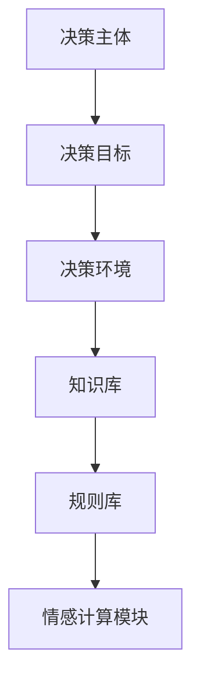
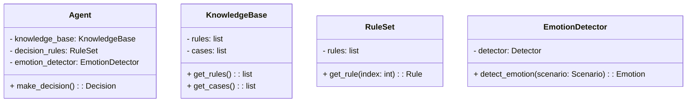
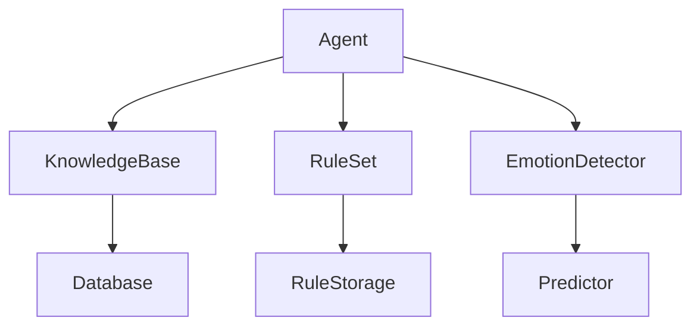
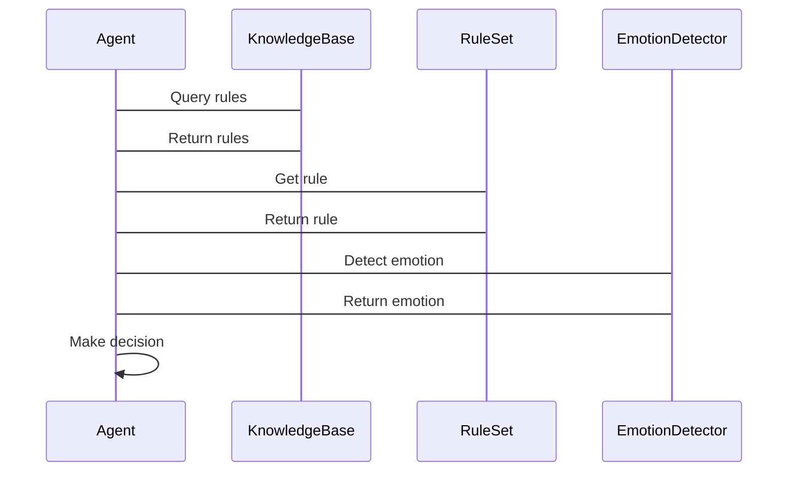

                 


# AI Agent的伦理决策框架：实现LLM的道德推理能力

---

## 关键词：
- AI Agent
- 伦理决策
- LLM
- 道德推理
- 伦理框架
- 决策算法
- 系统架构

---

## 摘要：
本文旨在探讨AI Agent在伦理决策领域的核心框架与实现方法，重点分析如何通过大型语言模型（LLM）构建道德推理能力。文章从背景介绍、核心概念、算法原理、系统架构到项目实战，逐步解析伦理决策框架的设计与实现。通过详细阐述基于规则、案例和情感的伦理推理算法，结合实际案例分析，本文为读者提供一套完整的伦理决策框架设计方法，并探讨其在不同场景中的应用与挑战。

---

# 第一部分: AI Agent的伦理决策框架背景与概述

## 第1章: AI Agent与伦理决策概述

### 1.1 AI Agent的基本概念
#### 1.1.1 AI Agent的定义与特点
AI Agent（人工智能代理）是指能够感知环境并采取行动以实现特定目标的智能体。其核心特点包括自主性、反应性、目标导向性和社交能力。

- 自主性：AI Agent能够独立决策，无需外部干预。
- 反应性：能够实时感知环境变化并做出响应。
- 目标导向性：通过目标驱动行为，优化决策结果。
- 社交能力：能够与其他Agent或人类进行交互与协作。

#### 1.1.2 AI Agent的分类与应用场景
AI Agent可以分为简单反射型、基于模型的反应型、目标驱动型和实用驱动型。其应用场景包括自动驾驶、智能助手、医疗诊断、金融交易等领域。

#### 1.1.3 伦理决策在AI Agent中的重要性
伦理决策是AI Agent在复杂场景中做出符合道德规范的选择的能力。随着AI技术的广泛应用，伦理决策的重要性日益凸显，尤其是在涉及人类生命安全和利益的领域。

### 1.2 伦理决策的定义与特征
#### 1.2.1 伦理决策的核心概念
伦理决策是指在遵循伦理规范的前提下，选择最优行动方案的过程。其核心在于平衡利益冲突，确保决策的公平性、透明性和可解释性。

#### 1.2.2 伦理决策的属性特征对比
通过对比分析伦理决策与其他类型决策（如经济决策、法律决策）的特征，可以更好地理解其独特性。

| 决策类型 | 目标导向性 | 利益冲突处理 | 道德规范约束 |
|----------|------------|--------------|--------------|
| 经济决策 | 高          | 高            | 低            |
| 法律决策 | 中          | 中            | 高            |
| 伦理决策 | 高          | 高            | 高            |

#### 1.2.3 伦理决策的边界与外延
伦理决策的边界在于其适用范围和决策主体的限制。其外延则涉及文化差异、技术进步和人类价值观的变化。

### 1.3 AI Agent伦理决策的背景与挑战
#### 1.3.1 当前AI技术的快速发展
AI技术的快速发展使得AI Agent能够处理越来越复杂的任务，但也带来了伦理决策的挑战。

#### 1.3.2 伦理决策在AI Agent中的必要性
伦理决策是确保AI Agent行为符合人类社会价值观的关键。尤其是在自动驾驶、医疗诊断等领域，伦理决策直接影响人类生命安全和利益。

#### 1.3.3 伦理决策面临的挑战与争议
伦理决策的实现面临技术局限性、伦理规范的多样性以及决策结果的可解释性等挑战。例如，在自动驾驶中，如何在紧急情况下优先保护谁的利益？

## 第2章: 伦理决策框架的核心要素

### 2.1 伦理决策框架的组成
#### 2.1.1 决策主体
决策主体是AI Agent的核心，负责感知环境、分析信息并做出决策。

#### 2.1.2 决策目标
决策目标是AI Agent行动的驱动力，通常包括最大化利益、最小化损失等。

#### 2.1.3 决策环境
决策环境是AI Agent所处的外部条件，包括物理环境、社会环境和信息环境。

### 2.2 伦理决策框架的属性特征
#### 2.2.1 知识表示
知识表示是AI Agent理解环境和决策的基础，包括事实、规则、案例等。

#### 2.2.2 规则推理
规则推理是AI Agent基于预设规则进行决策的过程，包括逻辑推理和情境推理。

#### 2.2.3 情感计算
情感计算是AI Agent通过理解情感和情绪来辅助决策的能力，是伦理决策的重要组成部分。

### 2.3 伦理决策框架的实体关系图


---

# 第二部分: 伦理决策框架的核心原理与算法

## 第3章: 基于规则的伦理推理算法

### 3.1 基于规则的伦理推

---

### 3.2 基于规则的伦理推理算法
#### 3.2.1 算法流程
1. **知识获取**：从知识库中获取相关规则。
2. **规则匹配**：将当前场景与规则进行匹配。
3. **决策生成**：基于匹配规则生成决策方案。
4. **结果验证**：验证决策方案的可行性与伦理合规性。

#### 3.2.2 算法实现
```python
def ethical_rule_based_decision-making(knowledge_base, current_scenario):
    # 知识获取
    rules = knowledge_base.get_rules()
    # 规则匹配
    matched_rules = []
    for rule in rules:
        if rule.apply(current_scenario):
            matched_rules.append(rule)
    # 决策生成
    decision = None
    for rule in matched_rules:
        if rule.is_high_priority():
            decision = rule.generate_decision()
            break
    # 结果验证
    if decision is None:
        return "无法生成有效决策"
    return decision
```

#### 3.2.3 数学模型与公式
基于规则的伦理推理算法可以用以下公式表示：
$$
D = \sum_{i=1}^{n} w_i \cdot R_i
$$
其中，$D$ 是最终决策，$w_i$ 是规则 $R_i$ 的权重。

---

## 第4章: 基于案例的伦理推理算法

### 4.1 基于案例的伦理推理算法
#### 4.1.1 算法流程
1. **案例库构建**：收集历史伦理决策案例。
2. **案例匹配**：将当前场景与案例库中的案例进行匹配。
3. **决策生成**：基于匹配案例生成决策方案。
4. **结果验证**：验证决策方案的可行性与伦理合规性。

#### 4.1.2 算法实现
```python
def ethical_case_based_decision-making(case_base, current_scenario):
    # 案例匹配
    matched_cases = []
    for case in case_base:
        if case.similarity(current_scenario) > 0.7:
            matched_cases.append(case)
    # 决策生成
    if matched_cases:
        decision = matched_cases[0].generate_decision()
        return decision
    return "无法生成有效决策"
```

---

## 第5章: 基于情感的伦理推理算法

### 5.1 基于情感的伦理推理算法
#### 5.1.1 算法流程
1. **情感识别**：识别当前场景中的情感信息。
2. **情感分析**：分析情感的强度和类型。
3. **决策生成**：基于情感信息生成决策方案。
4. **结果验证**：验证决策方案的可行性与伦理合规性。

#### 5.1.2 算法实现
```python
def ethical_emotion_based_decision-making(emotion_detector, current_scenario):
    # 情感识别
    emotion = emotion_detector.detect_emotion(current_scenario)
    # 情感分析
    intensity = emotion_detector.get_intensity(emotion)
    # 决策生成
    if intensity > 0.5:
        return "需要优先处理情感因素"
    else:
        return "基于规则的决策"
```

---

# 第三部分: 伦理决策框架的系统分析与架构设计

## 第6章: 伦理决策框架的系统分析

### 6.1 问题场景介绍
#### 6.1.1 自动驾驶中的伦理决策
在自动驾驶中，AI Agent需要在紧急情况下做出伦理决策，例如在发生碰撞时优先保护谁。

#### 6.1.2 医疗诊断中的伦理决策
在医疗诊断中，AI Agent需要在有限资源下优先治疗哪些患者。

### 6.2 系统功能设计
#### 6.2.1 领域模型设计


#### 6.2.2 系统架构设计


#### 6.2.3 系统交互设计


---

## 第7章: 伦理决策框架的项目实战

### 7.1 环境安装与配置
#### 7.1.1 Python环境安装
安装Python和相关库，如`numpy`, `pandas`, `scikit-learn`。

#### 7.1.2 项目依赖管理
使用`pip`安装项目依赖，如`mermaid`, `graphviz`。

### 7.2 系统核心实现
#### 7.2.1 伦理决策框架实现
```python
class EthicalDecisionFramework:
    def __init__(self, knowledge_base, rule_set, emotion_detector):
        self.knowledge_base = knowledge_base
        self.rule_set = rule_set
        self.emotion_detector = emotion_detector

    def make_decision(self, scenario):
        # 基于规则的决策
        rules = self.knowledge_base.get_rules()
        matched_rules = []
        for rule in rules:
            if rule.apply(scenario):
                matched_rules.append(rule)
        if matched_rules:
            return matched_rules[0].generate_decision()
        # 基于案例的决策
        cases = self.knowledge_base.get_cases()
        matched_cases = []
        for case in cases:
            if case.similarity(scenario) > 0.7:
                matched_cases.append(case)
        if matched_cases:
            return matched_cases[0].generate_decision()
        # 基于情感的决策
        emotion = self.emotion_detector.detect_emotion(scenario)
        if emotion.intensity > 0.5:
            return "需要优先处理情感因素"
        else:
            return "无法生成有效决策"
```

#### 7.2.2 代码解读与分析
- **知识库**：存储规则和案例。
- **规则集**：管理规则的存储和检索。
- **情感检测器**：检测场景中的情感信息。

### 7.3 实际案例分析
#### 7.3.1 自动驾驶中的伦理决策
在自动驾驶中，AI Agent需要在紧急情况下做出伦理决策，例如在发生碰撞时优先保护谁。

#### 7.3.2 医疗诊断中的伦理决策
在医疗诊断中，AI Agent需要在有限资源下优先治疗哪些患者。

---

# 第四部分: 伦理决策框架的优化与拓展

## 第8章: 伦理决策框架的优化与拓展

### 8.1 算法优化
#### 8.1.1 增量学习
通过增量学习不断优化伦理决策框架的性能。

#### 8.1.2 迁移学习
利用迁移学习技术，将其他领域的知识迁移到伦理决策领域。

### 8.2 系统架构优化
#### 8.2.1 微服务架构
采用微服务架构，提高系统的扩展性和灵活性。

#### 8.2.2 分布式架构
通过分布式架构，实现大规模数据处理和实时决策。

---

## 第9章: 伦理决策框架的挑战与未来方向

### 9.1 当前伦理决策框架的局限性
#### 9.1.1 技术局限性
伦理决策框架的实现面临技术挑战，例如复杂场景下的决策能力不足。

#### 9.1.2 伦理规范的多样性
不同文化和社会背景下，伦理规范存在差异，导致决策的不一致。

### 9.2 未来发展方向
#### 9.2.1 多模态决策
结合视觉、听觉等多种模态信息，提高决策的准确性和全面性。

#### 9.2.2 人机协作
加强人机协作，实现更加智能化和人性化的伦理决策。

---

## 第10章: 总结与展望

### 10.1 总结
本文详细探讨了AI Agent的伦理决策框架，从核心概念到算法实现，再到系统设计，为读者提供了一套完整的伦理决策框架设计方法。

### 10.2 展望
未来，随着技术的进步，伦理决策框架将更加智能化和人性化，为人类社会的发展带来更多的可能性。

---

## 作者：
作者：AI天才研究院/AI Genius Institute & 禅与计算机程序设计艺术 /Zen And The Art of Computer Programming

