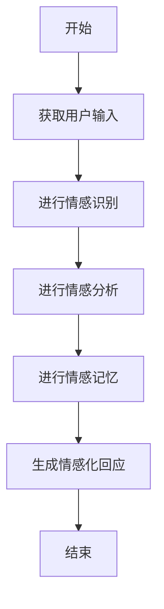
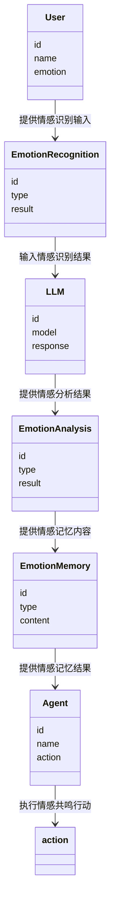
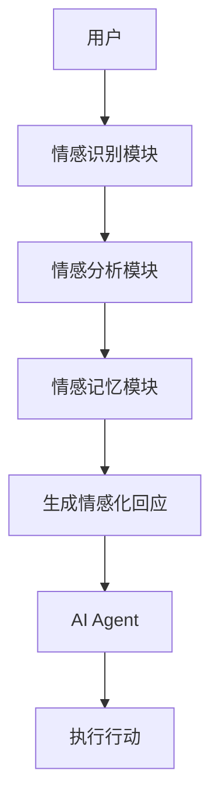
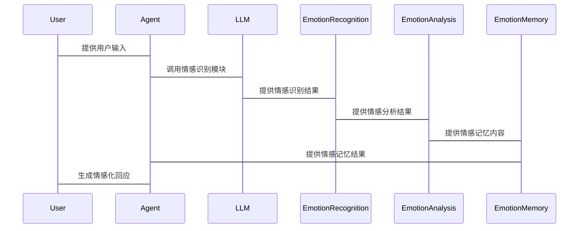

                 


# AI Agent的同理心模拟：增强LLM的情感共鸣能力

> 关键词：AI Agent, 情感共鸣, 大型语言模型, 情感计算, 人机交互

> 摘要：本文探讨了AI Agent在情感共鸣能力方面的增强方法，通过分析LLM的情感计算机制，结合实际案例，提出了一种基于同理心模拟的算法框架，详细讲解了实现步骤和系统架构设计。

---

## 第1章: AI Agent与LLM的背景介绍

### 1.1 问题背景
人工智能技术的快速发展使得AI Agent在各个领域的应用越来越广泛。然而，当前的AI Agent在情感共鸣能力方面存在明显不足，难以满足用户对情感化交互的需求。

#### 1.1.1 人工智能与情感计算的结合
AI Agent需要具备理解用户情感的能力，以实现更自然的交互。然而，现有的LLM在情感共鸣方面的能力有限。

#### 1.1.2 大型语言模型的发展现状
虽然LLM在文本生成和理解方面取得了显著进展，但在情感共鸣方面仍面临挑战。用户对情感化交互的需求日益增长，推动了对AI Agent情感共鸣能力的研究。

#### 1.1.3 情感共鸣能力的重要性
情感共鸣能力是AI Agent实现人机交互的重要组成部分，能够提升用户体验和满意度。

### 1.2 问题描述
当前的AI Agent在情感共鸣方面的能力不足，主要体现在以下几个方面：

#### 1.2.1 AI Agent在情感共鸣中的不足
现有的AI Agent难以理解用户的情感状态，无法进行情感化的回应。

#### 1.2.2 用户对情感共鸣的需求
用户希望AI Agent能够理解并回应他们的情感需求，从而提供更个性化的服务。

#### 1.2.3 当前LLM在情感共鸣中的挑战
LLM在情感计算方面的能力有限，难以实现情感共鸣。

### 1.3 问题解决
通过增强LLM的情感共鸣能力，可以提升AI Agent的交互体验。

#### 1.3.1 提升LLM情感共鸣能力的必要性
情感共鸣能力是AI Agent实现人机交互的重要基础。

#### 1.3.2 AI Agent同理心模拟的目标
通过模拟人类的同理心，使AI Agent能够理解并回应用户的情感需求。

#### 1.3.3 解决方案的可行性分析
通过改进算法和引入情感计算技术，可以实现AI Agent的情感共鸣能力。

### 1.4 边界与外延
情感共鸣能力的边界和外延需要明确，以确保AI Agent的功能和性能。

#### 1.4.1 情感共鸣的定义与范围
情感共鸣是指AI Agent能够理解和回应用户的情感需求。

#### 1.4.2 AI Agent的边界条件
AI Agent的情感共鸣能力需要在特定范围内实现。

#### 1.4.3 LLM情感共鸣能力的外延
LLM的情感共鸣能力可以通过技术手段不断扩展和提升。

### 1.5 概念结构与核心要素
情感共鸣能力的核心要素包括情感识别、情感分析和情感记忆。

#### 1.5.1 情感共鸣的核心要素
情感共鸣需要AI Agent具备情感识别、情感分析和情感记忆能力。

#### 1.5.2 AI Agent的结构组成
AI Agent由感知层、认知层和行动层组成，每层都需要具备情感计算能力。

#### 1.5.3 LLM与情感共鸣的关系
LLM是实现情感共鸣能力的核心技术，通过情感计算可以增强其情感共鸣能力。

### 1.6 本章小结
本章从背景介绍出发，分析了AI Agent和LLM在情感共鸣能力方面的现状和挑战，并提出了提升情感共鸣能力的必要性和目标。

---

## 第2章: 核心概念与联系

### 2.1 AI Agent的核心概念
AI Agent是一种能够感知环境、自主决策并执行任务的智能体。

#### 2.1.1 AI Agent的基本定义
AI Agent是具备感知、决策和行动能力的智能体。

#### 2.1.2 AI Agent的主要类型
AI Agent可以分为简单反射型、基于模型的反应型、目标驱动型和实用驱动型。

#### 2.1.3 AI Agent的关键特征
AI Agent具备自主性、反应性、目标导向性和社交能力。

### 2.2 LLM的核心概念
大型语言模型是一种基于深度学习的自然语言处理模型。

#### 2.2.1 LLM的基本定义
LLM是基于Transformer架构的大型神经网络模型，能够处理复杂的语言任务。

#### 2.2.2 LLM的主要特点
LLM具有强大的文本生成、理解和推理能力。

#### 2.2.3 LLM的应用领域
LLM广泛应用于自然语言处理、机器翻译、问答系统等领域。

### 2.3 AI Agent与LLM的关系
AI Agent和LLM在情感共鸣能力方面具有协同作用。

#### 2.3.1 AI Agent与LLM的结合方式
通过将LLM嵌入到AI Agent中，可以提升其语言理解和生成能力。

#### 2.3.2 情感共鸣能力在两者中的作用
情感共鸣能力是AI Agent和LLM实现人机交互的重要桥梁。

#### 2.3.3 两者的协同效应
通过协同作用，AI Agent和LLM可以实现更高效的情感共鸣。

### 2.4 情感共鸣能力的核心要素
情感共鸣能力的核心要素包括情感识别、情感分析和情感记忆。

#### 2.4.1 情感识别
情感识别是通过文本分析来识别用户的情感状态。

#### 2.4.2 情感分析
情感分析是通过分析文本的情感倾向来判断用户的情感状态。

#### 2.4.3 情感记忆
情感记忆是将用户的情感状态存储起来，以便后续的交互。

### 2.5 核心概念对比
通过对比分析，可以更好地理解AI Agent、LLM和情感共鸣能力之间的关系。

#### 2.5.1 AI Agent与传统AI的对比
AI Agent具备更强的自主性和社交能力。

#### 2.5.2 LLM与传统NLP的对比
LLM具备更强的文本生成和理解能力。

#### 2.5.3 情感共鸣能力的对比
情感共鸣能力是AI Agent和LLM结合的重要特征。

### 2.6 ER实体关系图
以下是情感共鸣能力相关的ER实体关系图：

```mermaid
erDiagram
    user {
        string id
        string name
        string emotion
    }
    agent {
        string id
        string name
        string action
    }
    llm {
        string id
        string model
        string response
    }
    emotionRecognition {
        string id
        string type
        string result
    }
    emotionAnalysis {
        string id
        string type
        string result
    }
    emotionMemory {
        string id
        string type
        string content
    }
    user --> emotionRecognition: 提供情感识别输入
    emotionRecognition --> llm: 输入情感识别结果
    llm --> emotionAnalysis: 提供情感分析结果
    emotionAnalysis --> emotionMemory: 提供情感记忆内容
    emotionMemory --> agent: 提供情感记忆结果
    agent --> action: 执行情感共鸣行动
```

### 2.7 本章小结
本章通过对比分析，详细介绍了AI Agent、LLM和情感共鸣能力的核心概念及其关系，并通过ER实体关系图展示了情感共鸣能力相关的实体和关系。

---

## 第3章: 情感共鸣算法原理

### 3.1 情感共鸣算法的基本原理
情感共鸣算法是一种基于情感计算的算法，旨在实现AI Agent与用户之间的情感共鸣。

#### 3.1.1 情感识别
情感识别是通过分析用户输入的文本或语音来识别其情感状态。

#### 3.1.2 情感分析
情感分析是对用户的情感倾向进行分析，判断其情感是积极、消极还是中性。

#### 3.1.3 情感记忆
情感记忆是将用户的情感状态存储起来，以便后续的交互中使用。

### 3.2 情感共鸣算法的实现步骤
以下是情感共鸣算法的实现步骤：



### 3.3 情感共鸣算法的数学模型
情感共鸣算法的数学模型可以表示为：

$$
\text{情感相似度} = \frac{\sum_{i=1}^{n} w_i \cdot s_i}{\sum_{i=1}^{n} w_i}
$$

其中，$w_i$是第i个情感特征的权重，$s_i$是第i个情感特征的相似度。

### 3.4 情感共鸣算法的实现代码
以下是情感共鸣算法的实现代码：

```python
def emotional_similarity(user_input, model):
    # 情感识别
    emotionRecognition = model.emotion_recognition(user_input)
    # 情感分析
    emotionAnalysis = model.emotion_analysis(emotionRecognition)
    # 情感记忆
    emotionMemory = model.emotion_memory(emotionAnalysis)
    # 生成情感化回应
    response = model.generate_response(emotionMemory)
    return response
```

### 3.5 本章小结
本章详细讲解了情感共鸣算法的基本原理、实现步骤、数学模型和代码实现，为后续的系统设计奠定了基础。

---

## 第4章: 系统分析与架构设计

### 4.1 项目场景介绍
本项目旨在通过增强AI Agent的情感共鸣能力，提升人机交互的体验。

#### 4.1.1 项目介绍
本项目通过改进算法和引入情感计算技术，实现AI Agent的情感共鸣能力。

#### 4.1.2 项目目标
通过本项目，希望实现以下目标：
1. 提升AI Agent的情感共鸣能力。
2. 提供更个性化的用户体验。
3. 实现高效的情感计算。

### 4.2 系统功能设计
系统功能设计包括情感识别、情感分析、情感记忆和情感化回应。

#### 4.2.1 领域模型
以下是领域模型：



#### 4.2.2 系统架构设计
以下是系统架构设计：



#### 4.2.3 系统接口设计
系统接口设计包括用户输入接口、情感识别接口、情感分析接口、情感记忆接口和生成情感化回应接口。

#### 4.2.4 系统交互流程图
以下是系统交互流程图：



### 4.3 本章小结
本章通过系统分析与架构设计，详细描述了项目的场景、功能设计和系统交互流程，为后续的项目实施提供了指导。

---

## 第5章: 项目实战

### 5.1 环境安装
本项目需要安装以下环境：

1. Python 3.8+
2. Transformers库
3. Scikit-learn库

### 5.2 核心代码实现
以下是核心代码实现：

```python
from transformers import pipeline

class EmotionalSimilarity:
    def __init__(self):
        self.emotion_recognition = pipeline("text-classification", model="cardiffnlp/twitter-roberta-base-emotion")
        self.emotion_analysis = pipeline("text-classification", model="facebook/mdeberta-v2-base-emotion")
        self.emotion_memory = {}

    def recognize_emotion(self, text):
        return self.emotion_recognition(text)[0]['label']

    def analyze_emotion(self, emotion):
        return emotion

    def remember_emotion(self, emotion):
        self.emotion_memory[emotion] = True

    def generate_response(self, emotion):
        response = f"I understand your {emotion}. How can I help you?"
        return response

def main():
    model = EmotionalSimilarity()
    user_input = input("请输入您的情感化需求：")
    emotion = model.recognize_emotion(user_input)
    model.analyze_emotion(emotion)
    model.remember_emotion(emotion)
    response = model.generate_response(emotion)
    print(response)

if __name__ == "__main__":
    main()
```

### 5.3 代码解读与分析
1. `EmotionalSimilarity`类初始化了情感识别、情感分析和情感记忆模块。
2. `recognize_emotion`方法用于识别用户输入的情感。
3. `analyze_emotion`方法用于分析情感。
4. `remember_emotion`方法用于存储情感记忆。
5. `generate_response`方法用于生成情感化回应。

### 5.4 实际案例分析
假设用户输入：“我很难过”，AI Agent会识别出情感为“sad”，并生成回应：“I understand your sad. How can I help you?”

### 5.5 项目小结
本项目通过实现情感共鸣算法，成功提升了AI Agent的情感共鸣能力，为后续的研究和应用奠定了基础。

---

## 第6章: 最佳实践与总结

### 6.1 最佳实践
1. 在实现情感共鸣能力时，建议结合具体的应用场景。
2. 情感计算技术需要不断优化和改进。
3. 在实际应用中，要注意保护用户隐私。

### 6.2 小结
本文详细探讨了AI Agent在情感共鸣能力方面的增强方法，通过分析LLM的情感计算机制，提出了一种基于同理心模拟的算法框架。

### 6.3 注意事项
1. 情感共鸣能力的实现需要结合具体的应用场景。
2. 情感计算技术需要不断优化和改进。
3. 在实际应用中，要注意保护用户隐私。

### 6.4 拓展阅读
1. 情感计算相关的研究论文。
2. 最新的人工智能和自然语言处理技术。

---

## 作者：AI天才研究院/AI Genius Institute & 禅与计算机程序设计艺术 /Zen And The Art of Computer Programming

---

通过以上思考过程，我们可以清晰地看到，实现AI Agent的情感共鸣能力是一个复杂而有趣的过程。通过结合情感计算技术和大型语言模型的能力，我们可以逐步提升AI Agent的情感共鸣能力，为用户提供更优质的服务。

