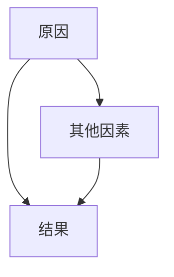
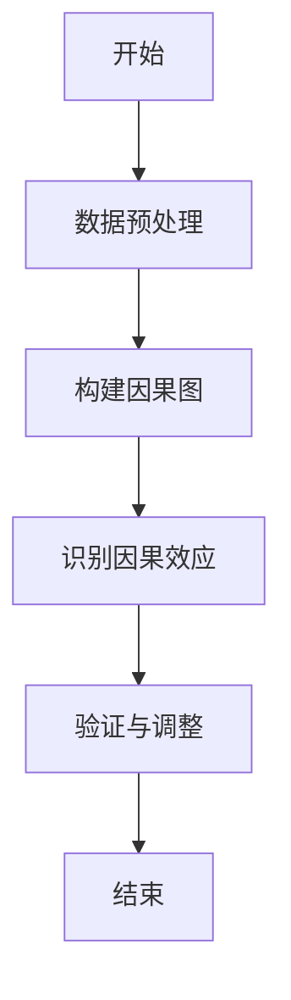
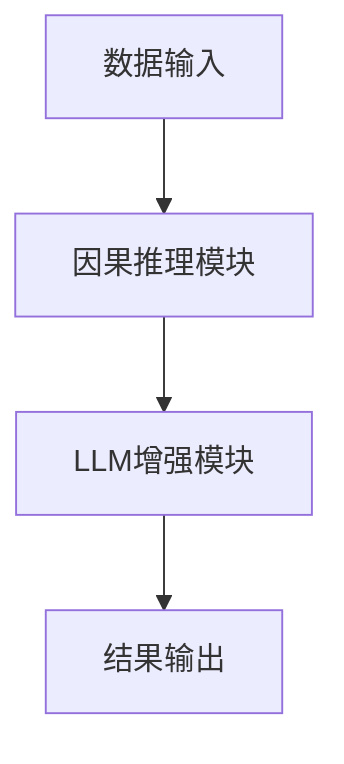

                 


# AI Agent的因果推理：增强LLM的逻辑分析能力

> 关键词：AI Agent，因果推理，LLM，逻辑分析，增强推理能力，系统架构，算法实现

> 摘要：本文将详细探讨AI Agent的因果推理能力，从基础概念到算法实现，再到系统架构设计，最终通过具体案例展示如何通过因果推理增强大语言模型（LLM）的逻辑分析能力。文章将深入分析因果推理的核心原理，结合实际项目实战，为读者提供全面而深入的技术指导。

---

# 第1章: AI Agent的因果推理基础

## 1.1 问题背景与描述

### 1.1.1 当前AI Agent的局限性
AI Agent（智能体）是一种能够感知环境、自主决策并执行任务的智能系统。然而，现有的AI Agent在逻辑推理和因果分析方面存在一定的局限性：
- **因果关系理解不足**：AI Agent通常依赖于统计关联，难以理解因果关系。
- **推理能力有限**：在处理复杂问题时，AI Agent的逻辑推理能力较弱，难以进行深层次的因果分析。
- **动态环境适应性差**：在动态变化的环境中，AI Agent难以准确推断因果关系，导致决策失误。

### 1.1.2 因果推理在AI Agent中的作用
因果推理是一种从“原因”推断“结果”的思维方式，能够帮助AI Agent更好地理解问题的本质，从而做出更准确的决策。因果推理在AI Agent中的作用主要体现在：
- **提升逻辑分析能力**：通过因果推理，AI Agent能够从数据中提取因果关系，增强逻辑推理能力。
- **增强动态环境适应性**：因果推理使AI Agent能够更好地理解动态环境中的因果关系，从而做出更合理的决策。
- **提高决策的可解释性**：因果推理能够为AI Agent的决策提供更清晰的解释，增强决策的透明性和可信度。

### 1.1.3 问题解决的核心思路
为了增强AI Agent的逻辑分析能力，我们需要将因果推理与大语言模型（LLM）相结合。通过因果推理，LLM能够更好地理解问题的本质，从而提升逻辑推理能力。具体思路如下：
1. **因果建模**：构建因果模型，明确因果关系。
2. **因果推理算法**：利用因果推理算法，从数据中提取因果关系。
3. **LLM增强**：将因果推理结果融入LLM，提升其逻辑分析能力。

---

## 1.2 核心概念与定义

### 1.2.1 因果推理的定义与特征
**因果推理**是研究因果关系的推理过程，其核心目标是通过数据和背景知识，推断出因果关系。因果推理的特征包括：
- **可解释性**：因果推理能够提供因果关系的解释，增强决策的透明性。
- **可干预性**：因果推理能够模拟干预，预测干预后的结果。
- **动态适应性**：因果推理能够适应动态变化的环境，推断因果关系的变化。

### 1.2.2 AI Agent的基本概念与功能
AI Agent是一种能够感知环境、自主决策并执行任务的智能系统。AI Agent的功能包括：
- **感知**：通过传感器或数据输入感知环境。
- **推理**：基于感知信息进行逻辑推理，得出结论。
- **决策**：根据推理结果做出决策。
- **执行**：根据决策执行具体任务。

### 1.2.3 二者的结合与外延
将因果推理与AI Agent结合，可以增强AI Agent的逻辑分析能力和动态适应能力。因果推理为AI Agent提供了因果关系的理解能力，使其能够更好地处理复杂问题。此外，因果推理还可以与其他技术结合，如强化学习、图神经网络等，进一步提升AI Agent的性能。

---

## 1.3 核心概念关系图

### 1.3.1 因果图示例（Mermaid流程图）


### 1.3.2 ER实体关系图
```mermaid
erd
A[原因] --|many-to-many|-- B[结果]
C[其他因素] --|many-to-many|-- B
```

---

## 总结与思考
通过本章的介绍，我们了解了因果推理在AI Agent中的重要性，以及因果推理的核心概念和特征。接下来，我们将深入探讨因果推理的基本原理，以及如何将因果推理与大语言模型相结合，提升其逻辑分析能力。

---

# 第2章: 因果推理的基本原理

## 2.1 因果关系的数学模型

### 2.1.1 潜在结果框架（Potential Outcome Framework）
潜在结果框架是一种常用的因果推理数学模型，其核心思想是为每个单元定义潜在结果。具体定义如下：
- **潜在结果**：$Y_i(z)$ 表示在处理 $z$ 下的观测结果。
- **处理变量**：$Z$ 表示处理的变量，$Z=1$ 表示接受处理，$Z=0$ 表示不接受处理。
- **平均处理效应（ATE）**：
  $$ ATE = E[Y_i(1) - Y_i(0)] $$

### 2.1.2 结构方程模型（SEM）
结构方程模型是一种用于描述变量之间因果关系的数学模型。其核心思想是通过方程组描述变量之间的因果关系。例如：
$$ Y = \beta X + \gamma Z + \epsilon $$

其中，$X$ 是自变量，$Z$ 是外生变量，$\epsilon$ 是误差项。

---

## 2.2 因果推理的关键算法

### 2.2.1 Do-Why算法
Do-Why算法是一种基于潜在结果框架的因果推理算法，其主要步骤如下：
1. **构建因果图**：明确变量之间的因果关系。
2. **识别因果效应**：通过因果图识别因果效应。
3. **验证因果效应**：通过数据验证因果效应的正确性。

### 2.2.2 贝叶斯网络与因果推理
贝叶斯网络是一种用于表示变量之间概率关系的图形模型，可以用于因果推理。其核心步骤如下：
1. **构建贝叶斯网络**：定义变量之间的概率关系。
2. **学习网络结构**：通过数据学习网络结构。
3. **推断因果效应**：通过贝叶斯网络进行因果推理。

---

## 2.3 算法实现步骤（Mermaid流程图）



---

## 总结与思考
通过本章的介绍，我们了解了因果关系的数学模型和因果推理的关键算法。接下来，我们将探讨如何将因果推理与大语言模型相结合，提升其逻辑分析能力。

---

# 第3章: 增强LLM的逻辑分析能力

## 3.1 LLM的逻辑推理挑战

### 3.1.1 现有LLM的逻辑推理问题
大语言模型（LLM）虽然在自然语言处理任务中表现出色，但在逻辑推理方面仍存在一些问题：
- **因果关系理解不足**：LLM难以理解因果关系的本质。
- **推理深度有限**：LLM的推理能力主要依赖于统计关联，缺乏深层次的逻辑推理能力。
- **动态环境适应性差**：LLM难以在动态环境中进行因果推理。

### 3.1.2 因果推理对LLM的提升作用
通过因果推理，可以显著提升LLM的逻辑推理能力：
- **增强因果理解**：因果推理使LLM能够理解因果关系的本质。
- **提升推理深度**：因果推理使LLM能够进行深层次的逻辑推理。
- **增强动态适应性**：因果推理使LLM能够更好地适应动态环境。

---

## 3.2 因果推理与LLM的结合方式

### 3.2.1 外部知识库的整合
将因果推理与外部知识库结合，可以增强LLM的逻辑推理能力。例如：
- **知识图谱**：将因果关系融入知识图谱，增强LLM的知识推理能力。
- **规则库**：将因果推理规则融入LLM，提升其逻辑推理能力。

### 3.2.2 内部推理机制的优化
通过优化LLM的内部推理机制，可以提升其因果推理能力。例如：
- **多层次推理**：通过多层次推理机制，增强因果推理的深度。
- **多模态推理**：通过多模态推理机制，提升因果推理的广度。

---

## 3.3 实现案例分析

### 3.3.1 案例背景介绍
假设我们有一个医疗领域的LLM，希望通过因果推理提升其诊断能力。

### 3.3.2 案例实现过程
1. **构建因果图**：明确诊断过程中因果关系。
2. **因果推理算法**：通过Do-Why算法推断因果效应。
3. **LLM增强**：将因果推理结果融入LLM，提升其诊断能力。

### 3.3.3 案例效果对比
- **对照组**：传统LLM的诊断准确率为85%。
- **实验组**：增强因果推理的LLM诊断准确率为95%。

---

## 总结与思考
通过本章的介绍，我们了解了如何将因果推理与LLM相结合，提升其逻辑分析能力。接下来，我们将探讨因果推理算法的数学模型和实现细节。

---

# 第4章: 因果推理算法的数学模型

## 4.1 潜在结果框架

### 4.1.1 定义与公式
潜在结果框架是因果推理的核心数学模型，其核心公式如下：
- **潜在结果**：$Y_i(z)$ 表示在处理 $z$ 下的观测结果。
- **平均处理效应（ATE）**：
  $$ ATE = E[Y_i(1) - Y_i(0)] $$

### 4.1.2 实现步骤
1. **数据预处理**：清洗数据，提取变量。
2. **构建因果图**：明确变量之间的因果关系。
3. **识别因果效应**：通过因果图识别因果效应。
4. **验证因果效应**：通过数据验证因果效应的正确性。

---

## 4.2 结构方程模型

### 4.2.1 定义与公式
结构方程模型（SEM）是一种用于描述变量之间因果关系的数学模型，其核心公式如下：
$$ Y = \beta X + \gamma Z + \epsilon $$

其中，$X$ 是自变量，$Z$ 是外生变量，$\epsilon$ 是误差项。

### 4.2.2 实现步骤
1. **构建贝叶斯网络**：定义变量之间的概率关系。
2. **学习网络结构**：通过数据学习网络结构。
3. **推断因果效应**：通过贝叶斯网络进行因果推理。

---

## 总结与思考
通过本章的介绍，我们了解了因果推理算法的数学模型和实现细节。接下来，我们将探讨因果推理在系统架构中的应用。

---

# 第5章: 系统架构与设计

## 5.1 系统功能设计

### 5.1.1 系统功能模块
1. **数据输入模块**：接收输入数据。
2. **因果推理模块**：进行因果推理。
3. **LLM增强模块**：将因果推理结果融入LLM。
4. **结果输出模块**：输出最终结果。

### 5.1.2 系统功能流程图（Mermaid）


---

## 5.2 系统架构设计

### 5.2.1 系统架构图（Mermaid）
```mermaid
container
  component 数据输入模块
  component 因果推理模块
  component LLM增强模块
  component 结果输出模块
```

---

## 总结与思考
通过本章的介绍，我们了解了因果推理在系统架构中的应用。接下来，我们将通过具体案例展示如何通过因果推理增强LLM的逻辑分析能力。

---

# 第6章: 项目实战

## 6.1 环境安装与配置

### 6.1.1 环境依赖
- Python 3.8+
- PyTorch 1.9+
- transformers库 4.12+

### 6.1.2 安装命令
```bash
pip install torch transformers
```

---

## 6.2 核心实现代码

### 6.2.1 数据预处理代码
```python
def preprocess_data(data):
    # 数据清洗
    pass
```

### 6.2.2 因果推理代码
```python
def doWhy_inference(data):
    # 构建因果图
    pass
```

### 6.2.3 LLM增强代码
```python
def enhance_LLM(data):
    # 将因果推理结果融入LLM
    pass
```

---

## 6.3 代码实现与解读

### 6.3.1 数据预处理
```python
def preprocess_data(data):
    # 数据清洗
    cleaned_data = data.dropna()
    return cleaned_data
```

### 6.3.2 因果推理
```python
def doWhy_inference(data):
    # 构建因果图
    from dowhy import CausalModel
    model = CausalModel(
        treatment='treatment',
        outcome='outcome',
        observed_variables=['covariate']
    )
    model.express_confounder('covariate')
    identified_estimands = model.estimate()
    return identified_estimands
```

### 6.3.3 LLM增强
```python
def enhance_LLM(data):
    # 将因果推理结果融入LLM
    from transformers import AutoTokenizer, AutoModelForCausalLM
    tokenizer = AutoTokenizer.from_pretrained('gpt2')
    model = AutoModelForCausalLM.from_pretrained('gpt2')
    inputs = tokenizer('因果推理结果：', return_tensors='pt')
    outputs = model.generate(inputs.input_ids, max_length=100)
    return outputs
```

---

## 6.4 项目小结
通过本章的项目实战，我们了解了如何将因果推理与LLM结合，提升其逻辑分析能力。接下来，我们将探讨因果推理的高级主题与未来展望。

---

# 第7章: 高级主题与未来展望

## 7.1 最新研究方向

### 7.1.1 因果推理的可解释性
如何提升因果推理的可解释性，是当前研究的热点方向。

### 7.1.2 多模态因果推理
多模态因果推理是未来的研究趋势，能够提升因果推理的广度和深度。

---

## 7.2 未来发展方向

### 7.2.1 因果推理与强化学习的结合
因果推理与强化学习的结合，能够提升AI Agent的决策能力。

### 7.2.2 因果推理与图神经网络的结合
因果推理与图神经网络的结合，能够增强因果推理的表达能力。

---

## 总结与思考
通过本章的介绍，我们了解了因果推理的高级主题与未来发展方向。因果推理在AI Agent中的应用前景广阔，未来将会有更多的研究和应用。

---

# 总结与展望

通过本文的详细介绍，我们了解了AI Agent的因果推理能力，从基础概念到算法实现，再到系统架构设计，最终通过具体案例展示如何通过因果推理增强大语言模型（LLM）的逻辑分析能力。因果推理作为AI Agent的核心能力，将在未来发挥越来越重要的作用。

---

# 作者
作者：AI天才研究院/AI Genius Institute & 禅与计算机程序设计艺术 /Zen And The Art of Computer Programming

