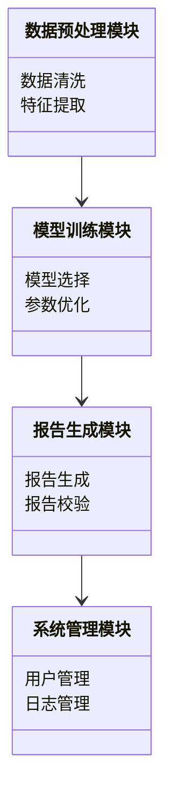
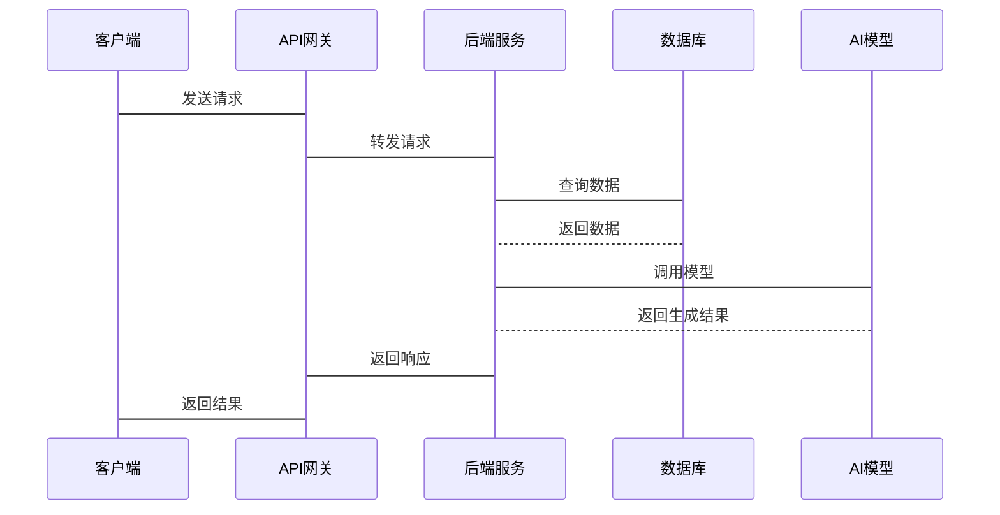

                 


# AI在金融监管报告生成中的应用

> 关键词：人工智能，金融监管，报告生成，自然语言处理，生成式模型，深度学习

> 摘要：随着人工智能技术的快速发展，AI在金融监管领域的应用日益广泛。本文详细探讨了AI在金融监管报告生成中的应用，从核心概念、算法原理、系统架构到实际案例，全面解析了AI如何提升金融监管效率和准确性。文章重点分析了生成式AI模型的工作机制，结合数学公式和系统设计，展示了AI在金融监管报告生成中的潜力与挑战。最后，本文总结了AI技术的优势，并展望了未来的发展方向。

---

## 第1章: AI与金融监管的背景介绍

### 1.1 人工智能的基本概念
#### 1.1.1 人工智能的定义与核心概念
人工智能（Artificial Intelligence, AI）是指通过模拟人类智能的思维方式、学习能力和问题解决能力，使计算机系统能够执行复杂任务的技术。AI的核心概念包括机器学习（Machine Learning）、自然语言处理（NLP）、计算机视觉（Computer Vision）和生成式模型（Generative Models）等。

#### 1.1.2 人工智能在金融领域的应用现状
在金融领域，AI技术已经应用于股票交易、风险管理、客户画像、信用评估等多个方面。AI通过分析海量数据，帮助金融机构做出更明智的决策。

#### 1.1.3 人工智能在金融监管中的重要性
金融监管是保障金融市场的稳定和合规性的重要环节。AI技术能够提高监管效率、降低监管成本，并通过实时数据分析发现潜在风险，从而提升监管的精准性和前瞻性。

---

### 1.2 金融监管的基本概念
#### 1.2.1 金融监管的定义与目标
金融监管是指通过对金融机构和市场的行为进行监督和管理，确保金融市场的稳定、公平和透明。其目标包括维护金融体系的稳定、保护投资者利益、防止金融犯罪等。

#### 1.2.2 金融监管的主要内容与方式
金融监管的内容包括对金融机构的资本充足性、流动性、风险敞口等进行监控，以及对市场行为（如交易行为、信息披露）进行监管。传统的监管方式依赖人工审查和规则制定，效率较低且成本较高。

#### 1.2.3 金融监管的挑战与发展趋势
随着金融市场的复杂化和全球化，传统监管方式难以应对日益增长的监管需求。AI技术的引入为金融监管提供了新的解决方案，能够更高效地处理海量数据，发现潜在风险。

---

### 1.3 AI在金融监管中的应用背景
#### 1.3.1 金融监管的复杂性与挑战
金融市场参与者众多，交易行为复杂，监管数据量大且分散。传统的监管方式难以应对这些挑战，尤其是在实时监控和风险预警方面存在明显不足。

#### 1.3.2 AI技术在金融监管中的潜在价值
AI技术能够通过大数据分析和模式识别，快速发现异常交易行为和潜在风险。生成式AI模型可以自动生成符合监管要求的报告，大大提高了监管效率。

#### 1.3.3 当前AI在金融监管中的应用现状
目前，AI在金融监管中的应用主要集中在风险评估、异常检测和报告生成等方面。生成式AI模型在监管报告中的应用还处于起步阶段，但展现出巨大潜力。

---

## 第2章: AI在金融监管报告生成中的核心概念与联系

### 2.1 AI生成报告的基本原理
#### 2.1.1 自然语言处理（NLP）在报告生成中的作用
自然语言处理（NLP）是AI生成文本报告的核心技术。通过NLP模型，计算机能够理解和生成人类语言，从而实现报告的自动生成。

#### 2.1.2 生成式AI模型的工作机制
生成式AI模型（如GPT、BERT）通过训练大规模文本数据，学习语言的语法和语义结构。在生成报告时，模型根据输入的上下文，逐步生成符合要求的文本内容。

#### 2.1.3 报告生成的关键步骤与流程
报告生成的关键步骤包括数据预处理、模型训练、生成优化和结果评估。模型需要根据监管要求和输入数据生成符合规范的报告内容。

---

### 2.2 金融监管报告的核心要素
#### 2.2.1 监管报告的结构与内容
金融监管报告通常包括机构概况、风险评估、合规性分析、监管建议等内容。报告的结构和内容需要符合监管机构的规范和要求。

#### 2.2.2 监管报告的合规性要求
监管报告需要满足法律法规的合规性要求，确保内容的准确性和完整性。生成式AI模型需要具备对监管规则的理解能力，才能生成符合要求的报告。

#### 2.2.3 监管报告的生成目标与约束
生成报告的目标是提高监管效率，降低人工成本。同时，报告生成需要满足实时性、准确性和合规性的要求，这对AI模型提出了较高的技术挑战。

---

### 2.3 AI模型与金融监管报告的关联性
#### 2.3.1 AI模型在数据处理中的应用
AI模型能够对海量监管数据进行清洗、整合和分析，提取关键信息用于报告生成。通过数据挖掘技术，模型能够发现数据中的潜在规律和风险点。

#### 2.3.2 AI模型在风险识别中的作用
生成式AI模型能够根据历史数据和市场动态，识别潜在的金融风险，并生成相应的风险预警报告。这为监管机构提供了及时的风险应对策略。

#### 2.3.3 AI模型在报告生成中的优势与局限性
AI模型的优势在于高效性和准确性，能够快速生成大量报告。但其局限性在于对监管规则的理解能力有限，可能生成不符合要求的报告内容。

---

## 第3章: AI驱动的金融监管报告生成算法原理

### 3.1 生成式AI模型的算法框架
#### 3.1.1 基于Transformer的生成模型
Transformer模型通过自注意力机制（Self-Attention）和位置编码（Positional Encoding）实现高效的文本生成。其核心公式为：

$$
\text{Attention}(Q, K, V) = \text{softmax}\left(\frac{QK^T}{\sqrt{d_k}}\right)V
$$

其中，$Q$、$K$、$V$分别为查询、键和值向量，$d_k$为键的维度。

#### 3.1.2 GAN（生成对抗网络）在报告生成中的应用
生成对抗网络（GAN）由生成器和判别器组成。生成器通过对抗训练生成逼真的文本内容，判别器则负责区分生成文本和真实文本。GAN的损失函数为：

$$
\mathcal{L} = -\mathbb{E}_{x \sim p_{\text{data}}}[ \log D(x)] - \mathbb{E}_{z \sim p_z}[ \log (1 - D(G(z)))]
$$

其中，$D(x)$是判别器对输入$x$的判别概率，$G(z)$是生成器生成的样本。

#### 3.1.3 基于规则的混合生成模型
混合生成模型结合了生成式模型和基于规则的生成方法。例如，首先通过生成式模型生成初步报告内容，然后通过规则引擎对报告进行校验和优化。

---

### 3.2 基于深度学习的文本生成算法
#### 3.2.1 Transformer模型的结构与特点
Transformer模型由编码器和解码器组成，编码器负责将输入文本转换为语义向量，解码器根据编码结果生成输出文本。其结构如下：

```
encoder_layer = {
    "input": "input_ids",
    "attention_mask": "attention_mask",
    "position_ids": "position_ids"
}
decoder_layer = {
    "input": "input_ids",
    "attention_mask": "attention_mask",
    "position_ids": "position_ids"
}
```

#### 3.2.2 注意力机制在文本生成中的作用
注意力机制（Attention）通过计算输入文本中每个词对当前生成词的影响程度，实现对文本上下文的高效利用。注意力权重的计算公式为：

$$
\alpha_{i,j} = \frac{\exp(\text{score}(i,j))}{\sum_{k} \exp(\text{score}(i,k))}
$$

其中，$\text{score}(i,j)$是查询与键的点积分数。

#### 3.2.3 解码器的生成策略与优化方法
解码器通过贪心搜索或蒙特卡洛采样生成文本内容。贪心搜索选择概率最高的词进行生成，而蒙特卡洛采样则能够生成多样化的文本内容。

---

### 3.3 AI模型训练的关键技术
#### 3.3.1 数据预处理与特征提取
数据预处理包括文本清洗、分词、停用词去除等步骤。特征提取则通过词袋模型（Bag-of-Words）或词嵌入模型（如Word2Vec）实现。

#### 3.3.2 模型训练的优化方法
模型训练中常用的优化方法包括学习率衰减（Learning Rate Decay）、批量归一化（Batch Normalization）和Adam优化器（Adam Optimizer）。

#### 3.3.3 模型评估与调优
模型评估通过 BLEU、ROUGE 等文本相似度指标进行。模型调优包括超参数优化和模型结构优化，以提高生成报告的质量。

---

## 第4章: AI模型在金融监管报告生成中的数学模型与公式

### 4.1 生成式AI模型的数学基础
#### 4.1.1 Transformer模型的数学公式
Transformer模型的编码器和解码器结构如下：

$$
\text{Encoder}(x) = \text{LayerNorm}(x + \text{MultiHeadAttention}(x, x, x))
$$

$$
\text{Decoder}(y) = \text{LayerNorm}(y + \text{MultiHeadAttention}(y, y, y) + \text{MultiHeadAttention}(x, x, x))
$$

---

### 4.2 基于深度学习的文本生成模型
#### 4.2.1 编码器-解码器结构的数学表达
编码器将输入文本转换为语义向量，解码器根据语义向量生成输出文本。编码器和解码器的结构如下：

$$
\text{Encoder}: x \rightarrow z \\
\text{Decoder}: z \rightarrow y
$$

其中，$x$是输入文本，$z$是语义向量，$y$是输出文本。

#### 4.2.2 GAN模型的损失函数与生成器判别器的对抗过程
GAN模型的生成器和判别器通过对抗训练不断优化。生成器的损失函数为：

$$
\mathcal{L}_G = -\mathbb{E}_{z \sim p_z}[ \log D(G(z))]
$$

判别器的损失函数为：

$$
\mathcal{L}_D = -\mathbb{E}_{x \sim p_{\text{data}}}[ \log D(x)] - \mathbb{E}_{z \sim p_z}[ \log (1 - D(G(z)))]
$$

---

### 4.3 模型训练与优化的数学分析
#### 4.3.1 损失函数的计算与优化
损失函数的计算包括生成器的损失和判别器的损失。通过反向传播（Backpropagation）算法，优化器（如Adam）对模型参数进行更新。

#### 4.3.2 梯度计算与反向传播
梯度计算通过链式法则实现，具体公式为：

$$
\nabla \theta L = \frac{\partial L}{\partial \theta} = \frac{\partial L}{\partial h} \cdot \frac{\partial h}{\partial \theta}
$$

其中，$\theta$是模型参数，$h$是中间层的输出。

#### 4.3.3 超参数调整与模型评估指标
超参数调整包括学习率、批量大小等。模型评估指标包括准确率、召回率、F1值等。

---

## 第5章: 金融监管报告生成系统的系统分析与架构设计

### 5.1 系统功能设计
#### 5.1.1 问题场景介绍
金融监管报告生成系统需要处理海量数据，生成符合监管要求的报告。系统需要具备数据采集、数据分析、报告生成和实时监控等功能。

#### 5.1.2 系统功能模块划分
系统功能模块包括数据预处理模块、模型训练模块、报告生成模块和系统管理模块。

#### 5.1.3 领域模型的Mermaid类图


---

### 5.2 系统架构设计
#### 5.2.1 系统架构的Mermaid架构图


---

### 5.3 系统接口设计
#### 5.3.1 系统接口的交互流程
系统接口包括数据接口、模型接口和报告接口。数据接口负责数据的输入和输出，模型接口负责模型的训练和调用，报告接口负责报告的生成和校验。

#### 5.3.2 系统交互的Mermaid序列图


---

## 第6章: 项目实战

### 6.1 环境安装与配置
#### 6.1.1 安装Python与相关库
安装Python 3.8及以上版本，以及以下库：

```
pip install numpy
pip install pandas
pip install torch
pip install transformers
pip install sentencepiece
```

#### 6.1.2 安装深度学习框架
选择TensorFlow或PyTorch框架，并安装相关库。

---

### 6.2 系统核心实现源代码
#### 6.2.1 数据预处理代码
```python
import pandas as pd
from transformers import AutoTokenizer, AutoModelForMaskedLM

def preprocess_data(data):
    tokenizer = AutoTokenizer.from_pretrained('bert-base-cased')
    encoded_inputs = tokenizer(data['text'], padding=True, truncation=True, max_length=512)
    return encoded_inputs
```

#### 6.2.2 模型训练代码
```python
import torch
from torch import nn
from torch.optim import Adam
from transformers import AutoModelForMaskedLM

class Generator(nn.Module):
    def __init__(self, vocab_size):
        super(Generator, self).__init__()
        self.lm_model = AutoModelForMaskedLM.from_pretrained('bert-base-cased')
        self.vocab_size = vocab_size
    def forward(self, input_ids, attention_mask):
        outputs = self.lm_model(input_ids=input_ids, attention_mask=attention_mask)
        return outputs.logits

def train_model(model, optimizer, criterion, train_loader, epochs):
    for epoch in range(epochs):
        for batch in train_loader:
            optimizer.zero_grad()
            outputs = model(batch['input_ids'], batch['attention_mask'])
            loss = criterion(outputs, batch['labels'])
            loss.backward()
            optimizer.step()
    return model
```

#### 6.2.3 报告生成代码
```python
import torch
from transformers import AutoTokenizer, AutoModelForMaskedLM

def generate_report(model, tokenizer, max_length=512):
    input_ids = torch.tensor([[tokenizer.cls_token_id]]).long()
    with torch.no_grad():
        outputs = model(input_ids, attention_mask=torch.ones(1, 1))
        generated = outputs.logits.argmax(dim=-1)
    report = tokenizer.decode(generated.numpy().tolist()[0], skip_special_tokens=True)
    return report
```

---

### 6.3 代码应用解读与分析
#### 6.3.1 数据预处理模块
数据预处理模块负责将原始文本数据转换为模型可以接受的格式，包括分词、编码等步骤。

#### 6.3.2 模型训练模块
模型训练模块包括生成式模型的定义、优化器的选择和训练循环的实现。训练过程中，模型通过反向传播算法不断优化参数。

#### 6.3.3 报告生成模块
报告生成模块通过调用训练好的模型，生成符合监管要求的报告内容。生成结果需要进行校验和优化，以确保报告的准确性和合规性。

---

### 6.4 实际案例分析与详细讲解
#### 6.4.1 案例背景
假设我们有一家银行，需要生成季度监管报告。报告内容包括机构概况、风险评估、合规性分析等。

#### 6.4.2 数据准备
准备监管报告的历史数据，包括机构信息、财务数据、交易记录等。

#### 6.4.3 模型训练
使用历史数据训练生成式模型，确保模型能够生成符合监管要求的报告内容。

#### 6.4.4 报告生成
通过调用训练好的模型，生成新的监管报告，并进行校验和优化。

#### 6.4.5 案例分析与总结
分析生成报告的质量和合规性，总结AI在金融监管报告生成中的优势和不足。

---

## 第7章: 总结与展望

### 7.1 总结
本文详细探讨了AI在金融监管报告生成中的应用，从核心概念、算法原理到系统设计和项目实战，全面解析了AI如何提升金融监管的效率和准确性。生成式AI模型在监管报告生成中的潜力巨大，但仍然面临一些技术挑战。

### 7.2 未来展望
随着生成式AI技术的不断进步，AI在金融监管中的应用将更加广泛。未来的研究方向包括模型的可解释性、生成报告的合规性优化以及多模态监管报告生成等。

### 7.3 最佳实践 tips
- 在实际应用中，建议结合业务需求选择合适的AI模型。
- 数据质量和模型训练数据的充分性对生成报告的质量至关重要。
- 报告生成后，需要进行人工校验和优化，确保报告的准确性和合规性。

### 7.4 注意事项
- AI模型的训练需要大量的计算资源，建议使用云计算平台进行训练。
- 模型的可解释性问题需要特别关注，尤其是在金融监管领域。
- 数据隐私和安全问题需要严格遵守相关法律法规。

### 7.5 拓展阅读
- 《生成式AI：从基础到实践》
- 《深度学习在金融中的应用》
- 《自然语言处理与金融文本分析》

---

## 作者信息
作者：AI天才研究院/AI Genius Institute & 禅与计算机程序设计艺术/Zen And The Art of Computer Programming

---

本文通过详细分析AI在金融监管报告生成中的应用，展示了AI技术在金融监管中的巨大潜力。希望本文能够为相关领域的研究和实践提供有价值的参考和启示。

