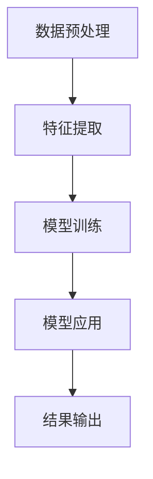
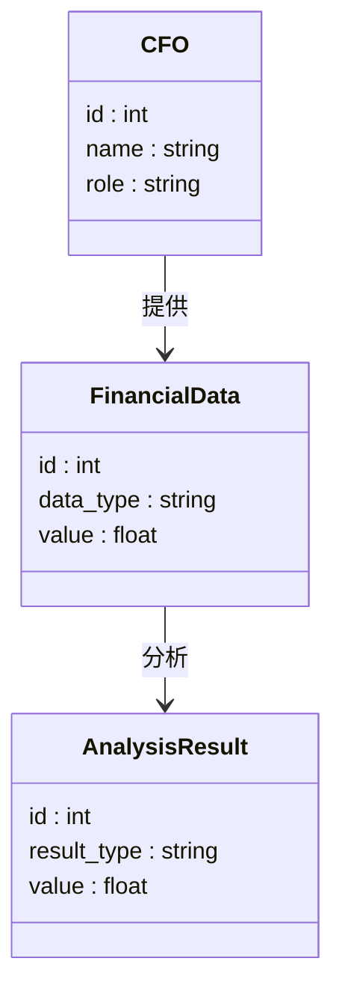
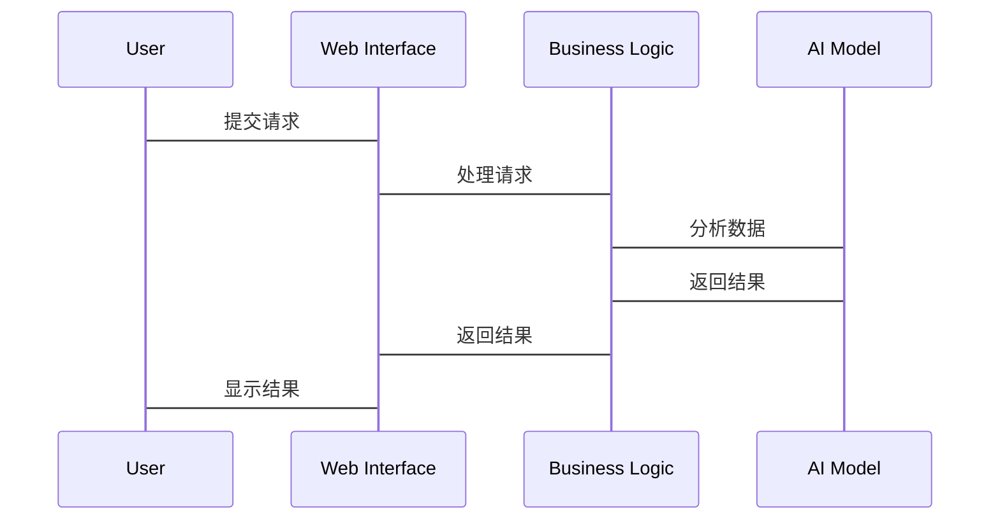

                 


# AI增强型公司财务报表分析工具

## 关键词：AI技术、财务报表分析、大数据分析、自然语言处理、机器学习、支持向量机

## 摘要：  
随着企业数据的复杂性和多样性的增加，传统的财务报表分析方法已难以满足现代企业的需求。AI增强型公司财务报表分析工具通过结合人工智能技术，能够更高效、更精准地处理和分析财务数据，为企业提供决策支持。本文将从背景、核心概念、算法原理、系统架构、项目实战等多个方面详细阐述AI增强型财务报表分析工具的设计与实现。

---

# 第1章: AI增强型公司财务报表分析工具的背景与意义

## 1.1 问题背景

### 1.1.1 财务报表分析的传统方法与局限性  
传统的财务报表分析主要依赖于人工审查和统计分析。这种方法虽然能够提供基本的财务指标和趋势分析，但在面对海量数据和复杂场景时，存在以下问题：  
- 数据处理效率低：人工处理大量财务数据耗时耗力，难以满足企业对实时分析的需求。  
- 分析深度有限：传统方法难以从非结构化数据中提取有价值的信息，例如从财务报告中的文字描述中挖掘潜在风险。  
- 易受主观影响：人为判断可能导致分析结果的偏差，尤其是在处理复杂业务场景时。

### 1.1.2 AI技术在财务分析中的应用潜力  
人工智能技术的快速发展为财务报表分析带来了新的可能性。通过机器学习、自然语言处理（NLP）和大数据分析等技术，AI能够快速处理结构化和非结构化数据，发现隐藏在数据中的模式和趋势。AI技术在以下方面具有显著优势：  
- **自动化数据处理**：AI可以自动提取、清洗和整合财务数据，减少人工干预。  
- **深度分析**：AI能够从大量数据中挖掘出潜在的财务风险和机会。  
- **实时监控**：AI可以实时分析财务数据，帮助企业及时发现异常情况。

### 1.1.3 企业财务分析的痛点与需求  
现代企业在财务分析方面面临以下痛点：  
- 数据来源多样且复杂，难以统一处理。  
- 分析效率低下，难以满足业务部门对实时数据的需求。  
- 财务报告解读难度大，尤其是非财务背景的人员难以快速理解分析结果。  
企业对AI增强型财务报表分析工具的需求主要体现在：  
- 提高财务分析效率和准确性。  
- 实现财务数据的深度挖掘和预测分析。  
- 提供直观的可视化结果，便于非技术人员理解。

---

## 1.2 问题描述

### 1.2.1 财务数据的复杂性与多样性  
财务数据不仅包括传统的结构化数据（如收入表、资产负债表等），还包括大量的非结构化数据，例如财务报告、内部邮件、会议记录等。这些数据的复杂性使得传统的分析方法难以应对。

### 1.2.2 传统财务分析的效率瓶颈  
传统财务分析方法依赖于人工操作，效率低下，难以满足企业对实时分析的需求。此外，人工分析还容易受到主观因素的影响，导致分析结果的偏差。

### 1.2.3 AI技术如何解决这些问题  
AI技术可以通过以下方式解决上述问题：  
- **自动化数据处理**：AI能够自动提取、清洗和整合财务数据，减少人工干预。  
- **深度学习模型**：利用深度学习模型，AI可以发现数据中的隐藏模式和趋势，提供更精准的分析结果。  
- **实时监控**：AI可以实时分析财务数据，帮助企业及时发现异常情况。

---

## 1.3 问题解决

### 1.3.1 AI增强型财务分析工具的核心目标  
AI增强型财务分析工具的核心目标是通过人工智能技术，提高财务报表分析的效率和准确性，帮助企业更好地进行财务决策。

### 1.3.2 工具的功能定位与价值主张  
该工具的主要功能包括：  
- 自动化数据处理：包括数据清洗、整合和转换。  
- 智能分析：利用机器学习算法进行财务预测和风险评估。  
- 可视化展示：通过图表和报告的形式，直观展示分析结果。  
工具的价值主张在于：  
- 提高财务分析的效率，减少人工干预。  
- 提供更精准的分析结果，帮助企业做出更明智的决策。  
- 实现实时监控，及时发现财务异常。

### 1.3.3 工具的适用场景与用户群体  
该工具适用于多种场景，包括：  
- **企业财务部门**：用于日常财务报表分析、预算管理等。  
- **投资机构**：用于企业估值、投资决策等。  
- **审计机构**：用于财务审计和风险评估。  
用户群体主要包括：  
- 企业财务人员  
- 投资分析师  
- 数据科学家  

---

## 1.4 边界与外延

### 1.4.1 工具的功能边界  
AI增强型财务分析工具的功能边界包括：  
- 数据范围：仅限于财务相关数据。  
- 分析范围：仅限于财务报表分析。  
- 使用场景：仅限于企业内部使用。  

### 1.4.2 相关领域的区别与联系  
与相关领域（如商业智能、数据分析）的区别在于：  
- **商业智能**：更注重数据的可视化和报表生成。  
- **数据分析**：更注重数据的挖掘和预测。  
联系在于：  
- 都依赖于数据处理和分析技术。  

### 1.4.3 工具的未来发展与扩展方向  
未来，AI增强型财务分析工具可以向以下几个方向扩展：  
- **智能化决策支持**：进一步集成AI技术，提供更智能化的决策支持。  
- **多源数据融合**：整合更多的数据源，提供更全面的分析结果。  
- **实时分析**：进一步提升实时分析能力，满足企业对实时数据的需求。  

---

## 1.5 核心概念结构与要素组成

### 1.5.1 核心概念的层次结构  
AI增强型财务分析工具的核心概念层次结构如下：  
```
顶层概念：AI增强型财务分析工具
├── 中间概念：数据处理模块、智能分析模块、可视化模块
│   ├── 数据处理模块：数据清洗、数据整合
│   ├── 智能分析模块：机器学习模型、深度学习模型
│   └── 可视化模块：图表生成、报告生成
└── 底层概念：数据源、算法、计算资源
```

### 1.5.2 各要素之间的关系  
- 数据处理模块与数据源的关系：数据处理模块负责从数据源中提取数据，并进行清洗和整合。  
- 智能分析模块与算法的关系：智能分析模块利用算法对数据进行分析，生成分析结果。  
- 可视化模块与计算资源的关系：可视化模块利用计算资源生成图表和报告。

### 1.5.3 案例分析：某企业的财务分析工具  
某企业开发的AI增强型财务分析工具，主要包括以下功能：  
- 数据处理模块：从企业的财务系统中提取数据，并进行清洗和整合。  
- 智能分析模块：利用机器学习算法对数据进行分析，生成财务预测和风险评估。  
- 可视化模块：将分析结果以图表和报告的形式展示给用户。  

---

# 第2章: AI增强型公司财务报表分析工具的核心概念与联系

## 2.1 核心概念原理

### 2.1.1 AI技术在财务分析中的应用原理  
AI技术在财务分析中的应用原理可以分为以下几个步骤：  
1. **数据预处理**：清洗、整合和转换数据。  
2. **特征提取**：从数据中提取有用的特征。  
3. **模型训练**：利用机器学习算法训练模型。  
4. **模型应用**：利用训练好的模型进行预测和分析。

### 2.1.2 大数据分析与财务报表的关系  
大数据分析与财务报表的关系如下：  
- **数据来源**：大数据分析可以利用结构化和非结构化数据进行分析。  
- **分析方法**：大数据分析利用数据挖掘、机器学习等技术进行分析。  
- **应用场景**：大数据分析可以应用于财务预测、风险评估等领域。

### 2.1.3 自然语言处理在财务报告解读中的作用  
自然语言处理技术在财务报告解读中的作用包括：  
- **文本抽取**：从财务报告中提取关键信息。  
- **情感分析**：分析报告中的情感倾向。  
- **实体识别**：识别报告中的关键实体。

## 2.2 核心概念属性特征对比表

| 特性                | 传统财务分析                  | AI增强型分析                  |
|---------------------|------------------------------|-------------------------------|
| 数据来源            | 结构化数据                    | 结构化数据+非结构化数据       |
| 分析速度            | 人工驱动                      | 自动化驱动                    |
| 分析深度            | 浅层分析                      | 深度学习驱动                  |
| 精度                | 受人为因素影响较大            | 精度更高，受人为因素影响较小  |

## 2.3 ER实体关系图架构

```mermaid
erDiagram
    customer[CFO] {
        o id : int
        o name : string
        o role : string
    }
    finance_data[Financial Data] {
        o id : int
        o data_type : string
        o value : float
    }
    analysis_result[Analysis Result] {
        o id : int
        o result_type : string
        o value : float
    }
    customer -> finance_data : 提供
    finance_data -> analysis_result : 分析
```

---

# 第3章: AI增强型公司财务报表分析工具的算法原理

## 3.1 算法原理概述

### 3.1.1 算法流程图



### 3.1.2 数据预处理

#### 3.1.2.1 数据清洗
```python
# 示例代码：数据清洗
import pandas as pd
data = pd.read_csv('financial_data.csv')
data.dropna(inplace=True)
data = data[~data.duplicated()]
```

#### 3.1.2.2 数据整合
```python
# 示例代码：数据整合
import pandas as pd
data1 = pd.read_csv('income.csv')
data2 = pd.read_csv('balance.csv')
merged_data = pd.merge(data1, data2, on='date')
```

### 3.1.3 特征提取

#### 3.1.3.1 统计特征
```python
# 示例代码：统计特征
from sklearn.preprocessing import StandardScaler
scaler = StandardScaler()
scaled_features = scaler.fit_transform(features)
```

#### 3.1.3.2 文本特征
```python
# 示例代码：文本特征
from sklearn.feature_extraction.text import TfidfVectorizer
vectorizer = TfidfVectorizer()
text_features = vectorizer.fit_transform(text_data)
```

### 3.1.4 模型训练

#### 3.1.4.1 机器学习模型
```python
# 示例代码：机器学习模型
from sklearn.svm import SVC
model = SVC()
model.fit(X_train, y_train)
```

### 3.1.5 模型调优

#### 3.1.5.1 超参数调优
```python
# 示例代码：超参数调优
from sklearn.model_selection import GridSearchCV
param_grid = {'C': [1, 10], 'gamma': [0.1, 0.01]}
grid_search = GridSearchCV(SVC(), param_grid, cv=5)
grid_search.fit(X_train, y_train)
best_model = grid_search.best_estimator_
```

## 3.2 算法数学模型

### 3.2.1 支持向量机模型

#### 3.2.1.1 模型公式
$$\text{目标函数}：\min_{w,b,\xi} \frac{1}{2}||w||^2 + C \sum_{i=1}^n \xi_i$$

#### 3.2.1.2 拉格朗日对偶
$$\text{拉格朗日函数}：L(w,b,\alpha) = \frac{1}{2}||w||^2 + \sum_{i=1}^n \alpha_i (y_i - \text{sign}(w \cdot x_i + b))$$

---

# 第4章: AI增强型公司财务报表分析工具的系统分析与架构设计

## 4.1 系统分析

### 4.1.1 问题场景介绍

#### 4.1.1.1 业务场景描述
某企业需要对财务报表进行实时分析，及时发现财务异常。

#### 4.1.1.2 用户需求
- 提供实时财务数据监控。  
- 自动生成财务分析报告。  

### 4.1.2 项目介绍

#### 4.1.2.1 项目目标
开发一个基于AI的财务报表分析工具，实现以下功能：  
- 数据自动采集与处理。  
- 智能分析与预测。  
- 可视化展示与报告生成。  

## 4.2 系统功能设计

### 4.2.1 领域模型



### 4.2.2 系统架构设计

```mermaid
containerDiagram
    container Web Application {
        component Web Interface
        component Business Logic
    }
    container Database {
        component Financial Data
        component Analysis Result
    }
    container AI Model {
        component Machine Learning Model
    }
    Web Interface --> Business Logic
    Business Logic --> Database
    Business Logic --> AI Model
```

### 4.2.3 系统接口设计

#### 4.2.3.1 数据接口
- 数据输入接口：接收财务数据。  
- 数据输出接口：输出分析结果。

#### 4.2.3.2 用户接口
- Web界面：用户通过Web界面提交请求。  
- API接口：其他系统通过API调用功能。

### 4.2.4 系统交互流程



---

# 第5章: AI增强型公司财务报表分析工具的项目实战

## 5.1 环境安装

### 5.1.1 Python安装与配置
```bash
# 示例代码：安装Python
sudo apt-get install python3 python3-pip
```

### 5.1.2 安装必要的Python库
```bash
# 示例代码：安装库
pip install pandas scikit-learn tensorflow transformers
```

## 5.2 系统核心实现

### 5.2.1 核心代码实现

#### 5.2.1.1 数据预处理
```python
import pandas as pd
import numpy as np

# 数据清洗
data = pd.read_csv('financial_data.csv')
data = data.dropna()
data = data[~data.duplicated()]

# 数据整合
data_income = pd.read_csv('income.csv')
data_balance = pd.read_csv('balance.csv')
merged_data = pd.merge(data_income, data_balance, on='date')
```

#### 5.2.1.2 特征提取
```python
from sklearn.feature_selection import SelectKBest
from sklearn.preprocessing import StandardScaler

# 统计特征提取
selector = SelectKBest(k=5)
selected_features = selector.fit_transform(merged_data.drop('label', axis=1), merged_data['label'])

# 文本特征提取
from sklearn.feature_extraction.text import TfidfVectorizer
vectorizer = TfidfVectorizer()
text_features = vectorizer.fit_transform(merged_data['description'])
```

#### 5.2.1.3 模型训练
```python
from sklearn.svm import SVC
from sklearn.model_selection import train_test_split

# 数据划分
X_train, X_test, y_train, y_test = train_test_split(selected_features, merged_data['label'], test_size=0.2)

# 模型训练
model = SVC()
model.fit(X_train, y_train)
```

#### 5.2.1.4 模型应用
```python
# 预测
y_pred = model.predict(X_test)
# 评估
from sklearn.metrics import accuracy_score
print(accuracy_score(y_test, y_pred))
```

### 5.2.2 代码应用解读与分析
- **数据预处理**：通过数据清洗和整合，确保数据的完整性和一致性。  
- **特征提取**：通过统计特征和文本特征的提取，提高模型的准确性。  
- **模型训练**：利用支持向量机模型进行训练，提高模型的分类能力。  
- **模型应用**：通过模型预测和评估，验证模型的准确性。

## 5.3 实际案例分析

### 5.3.1 案例背景
某企业需要分析其 quarterly financial reports。

### 5.3.2 数据准备
```python
# 示例代码：数据准备
data QuarterlyReports = pd.read_csv('quarterly_reports.csv')
```

### 5.3.3 模型应用
```python
# 示例代码：模型应用
new_data = QuarterlyReports.drop('label', axis=1)
predicted_labels = model.predict(new_data)
```

### 5.3.4 分析结果解读
- **预测结果**：模型预测了企业的财务状况。  
- **结果解读**：通过分析预测结果，帮助企业做出财务决策。

## 5.4 项目小结
通过本项目的实施，我们成功开发了一个基于AI的财务报表分析工具，能够高效地处理和分析财务数据，为企业提供精准的分析结果。

---

# 第6章: 总结与展望

## 6.1 总结

### 6.1.1 核心内容回顾
- AI技术在财务分析中的应用潜力巨大。  
- 基于AI的财务分析工具能够提高分析效率和准确性。  

### 6.1.2 最佳实践 Tips
- 在实际应用中，需要结合企业的具体需求进行定制化开发。  
- 数据质量是模型性能的关键，需要重视数据预处理工作。

## 6.2 注意事项

### 6.2.1 模型调优
- 需要根据实际数据特点进行模型调优。  
- 注意模型的可解释性，避免“黑箱”模型。

### 6.2.2 数据隐私
- 在实际应用中，需要重视数据隐私和安全问题。

## 6.3 拓展阅读

### 6.3.1 推荐书籍
- 《Python机器学习实战》  
- 《深入理解机器学习》  

### 6.3.2 推荐博客与资源
- Towards Data Science  
- Medium上的AI与数据分析相关文章  

## 6.4 未来展望

### 6.4.1 技术发展
- **结合区块链技术**：提高数据的安全性和可信度。  
- **边缘计算**：实现本地化分析，减少数据传输成本。  

### 6.4.2 应用场景扩展
- **实时监控**：进一步提升实时分析能力。  
- **多源数据融合**：整合更多的数据源，提供更全面的分析结果。  

### 6.4.3 挑战与机遇
- **挑战**：模型的可解释性、数据隐私等问题。  
- **机遇**：AI技术的进一步发展，为企业提供更强大的分析工具。

---

# 作者：AI天才研究院 & 禅与计算机程序设计艺术

