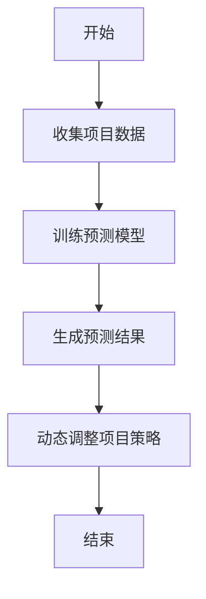
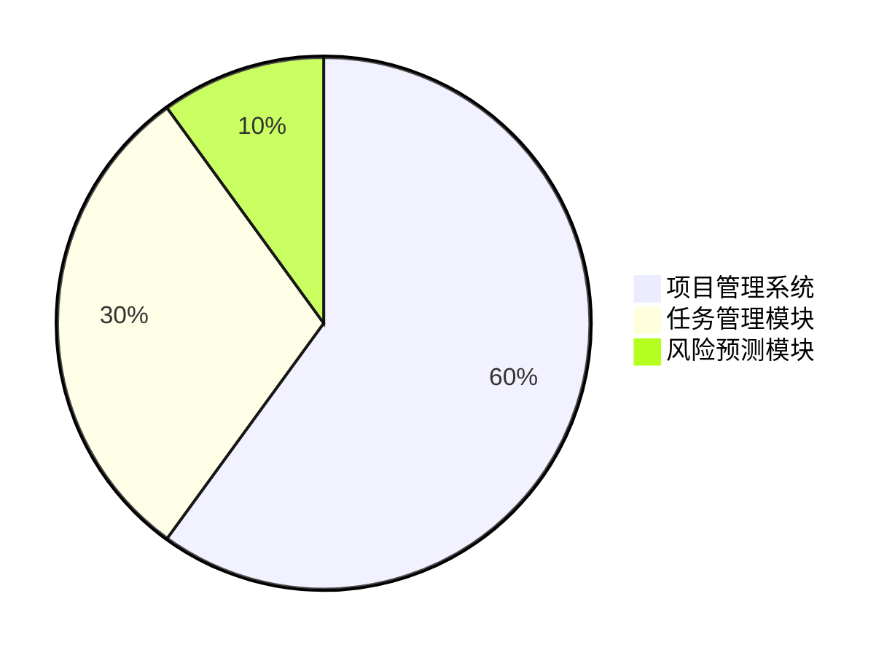

                 


# AI驱动的企业创新项目管理：敏捷方法与AI的深度融合

## 关键词：AI，企业创新，项目管理，敏捷方法，深度融合

## 摘要：  
在数字化转型的浪潮中，企业创新项目管理正面临着前所未有的挑战和机遇。传统的项目管理方法逐渐暴露出效率低下、灵活性不足等问题，而敏捷方法的引入为项目管理带来了新的可能性。然而，如何将敏捷方法与人工智能（AI）技术深度融合，进一步提升项目管理的智能化和效率，是当前企业创新项目管理领域的研究热点。本文将从AI驱动的项目管理核心概念出发，详细探讨敏捷方法与AI的深度融合原理，并通过实际案例分析，展示AI在敏捷项目管理中的应用场景和优势。文章最后将总结AI驱动的企业创新项目管理的最佳实践，为企业在数字化转型中的项目管理提供有益的参考。

---

## 第一部分: AI驱动的企业创新项目管理概述

### 第1章: AI与敏捷方法的结合背景

#### 1.1 企业创新项目管理的现状与挑战

##### 1.1.1 传统项目管理的局限性  
传统项目管理方法（如瀑布模型）注重严格的流程和阶段划分，但在实际应用中常常面临以下问题：  
1. **需求变更困难**：在项目后期变更需求会导致成本急剧上升。  
2. **灵活性不足**：面对复杂多变的市场环境，传统方法难以快速调整。  
3. **效率低下**：繁重的文档管理和审批流程降低了团队的响应速度。  

##### 1.1.2 敏捷方法的兴起与优势  
敏捷方法（如Scrum、Kanban）以迭代开发和持续交付为核心，具有以下优势：  
1. **快速响应需求变化**：通过短周期迭代（Sprint）及时调整项目方向。  
2. **提高团队协作效率**：强调团队自治和持续反馈，减少管理摩擦。  
3. **提升客户满意度**：通过持续交付可用的增量产品，客户可以更快地看到价值。  

##### 1.1.3 AI技术对企业创新的推动作用  
AI技术通过自动化、智能化的方式优化项目管理流程，例如：  
1. **智能任务分配**：基于团队成员的能力和当前工作负载，自动分配任务。  
2. **风险预测与 mitigation**：利用历史数据和机器学习模型预测项目风险并提供 mitigation 策略。  
3. **数据驱动的决策支持**：通过分析海量数据，为项目决策提供科学依据。  

#### 1.2 AI与敏捷方法的融合趋势

##### 1.2.1 数字化转型中的AI角色  
数字化转型要求企业具备快速创新和适应变化的能力，AI技术在其中扮演了关键角色：  
1. **数据驱动的决策**：AI通过分析历史数据和实时数据，帮助企业在复杂环境中做出最优决策。  
2. **自动化与智能化**：AI可以自动化处理重复性任务，释放人力资源专注于高价值工作。  

##### 1.2.2 敏捷方法在企业创新中的应用  
敏捷方法的核心理念与企业创新高度契合：  
1. **快速试错**：通过短周期迭代，企业可以在早期发现并修正错误。  
2. **客户导向**：敏捷方法强调与客户紧密合作，确保产品符合实际需求。  
3. **持续改进**：通过回顾和反思，不断优化项目流程和团队协作方式。  

##### 1.2.3 AI与敏捷方法的深度融合  
AI与敏捷方法的结合将推动项目管理进入新的阶段：  
1. **智能化的任务管理**：AI可以实时监控任务进度，动态调整优先级和资源分配。  
2. **预测性风险管理**：通过机器学习模型预测项目风险，并提前制定 mitigation 策略。  
3. **数据驱动的团队协作**：AI分析团队成员的协作模式，提出改进建议，提升团队效率。  

#### 1.3 本书的核心目标与框架

##### 1.3.1 本书的核心目标  
本文旨在探讨AI技术如何赋能敏捷项目管理，为企业创新项目管理提供新的思路和方法。  
- 提供AI驱动的项目管理核心概念和理论基础。  
- 分析敏捷方法与AI技术的深度融合原理。  
- 通过实际案例展示AI在敏捷项目管理中的应用场景和优势。  

##### 1.3.2 本书的结构安排  
本书分为三个主要部分：  
1. **AI驱动的企业创新项目管理概述**：介绍AI与敏捷方法的结合背景，分析其核心概念和优势。  
2. **AI驱动的项目管理算法原理**：详细讲解AI在项目管理中的算法实现和数学模型。  
3. **系统分析与架构设计方案**：从系统角度分析AI驱动的项目管理架构，并提供实际案例和最佳实践。  

##### 1.3.3 本书的读者群体  
本书适合以下读者阅读：  
- 企业IT管理者：希望优化项目管理流程的企业管理者。  
- 敏捷教练与项目经理：希望将AI技术引入项目管理的实践者。  
- AI技术爱好者：对AI在企业应用中感兴趣的技术人员。  

---

## 第二部分: AI驱动的项目管理核心概念

### 第2章: AI驱动的项目管理核心概念

#### 2.1 AI驱动的项目管理定义

##### 2.1.1 核心概念与问题背景  
AI驱动的项目管理是指利用人工智能技术优化项目管理流程，提升项目执行效率和成功率。  
- **核心概念**：通过AI技术实现任务分配、风险预测、资源优化等项目管理活动的自动化与智能化。  
- **问题背景**：传统项目管理方法在应对复杂多变的市场环境时显得灵活性不足，而敏捷方法虽然提高了灵活性，但仍然需要更高效的工具支持。  

##### 2.1.2 问题描述与解决思路  
- **问题描述**：  
  企业在创新项目管理中常常面临以下挑战：  
  1. 任务优先级难以动态调整。  
  2. 项目风险难以提前预测和有效 mitigation。  
  3. 团队协作效率低下。  
- **解决思路**：  
  利用AI技术构建智能项目管理平台，通过数据驱动的方式优化任务分配、风险预测和团队协作。  

##### 2.1.3 边界与外延  
- **边界**：AI驱动的项目管理主要关注项目执行阶段的优化，不涉及项目启动前的需求分析和目标设定。  
- **外延**：AI技术可以与项目管理的其他环节（如资源规划、成本控制）深度融合，形成更加智能化的项目管理体系。  

#### 2.2 核心概念与联系

##### 2.2.1 AI驱动的项目管理原理  
AI驱动的项目管理原理可以概括为：  
1. **数据采集**：收集项目相关的数据（如任务进度、团队反馈、历史数据）。  
2. **模型训练**：利用机器学习算法训练预测模型。  
3. **智能决策**：基于模型预测结果，动态调整项目管理策略。  

##### 2.2.2 核心概念属性特征对比表格  
| **概念**       | **传统项目管理** | **敏捷方法**   | **AI驱动的项目管理** |  
|----------------|------------------|----------------|------------------------|  
| 任务管理       | 线性、 rigid     | 迭代、灵活      | 智能化、动态调整       |  
| 风险管理       | 事后处理        | 事前预警        | 数据驱动、实时预测     |  
| 团队协作       | 层级分明        | 自组织、扁平化  | 智能辅助、高效协作     |  

##### 2.2.3 ER实体关系图架构（Mermaid流程图）  
```mermaid
erDiagram
    actor 项目经理 {
        string 项目ID
        string 项目目标
        string 项目进度
    }
    actor 团队成员 {
        string 团队ID
        string 团队技能
        string 当前负载
    }
    actor 客户 {
        string 客户需求
        string 反馈意见
    }
    database 项目管理系统 {
        key 项目ID
        key 团队ID
        date 项目开始时间
        date 项目结束时间
        string 风险列表
        string 任务优先级
    }
    项目经理 --> 项目管理系统 : 提交项目信息
    团队成员 --> 项目管理系统 : 更新任务进度
    客户 --> 项目管理系统 : 提供反馈
    项目管理系统 --> 项目经理 : 生成风险报告
    项目管理系统 --> 团队成员 : 分配任务
```

---

### 第3章: 敏捷方法与AI的融合原理

#### 3.1 敏捷方法的核心原理

##### 3.1.1 敏捷宣言与核心价值观  
敏捷宣言强调以下核心价值观：  
1. 个体互动高于流程和工具。  
2. 可以运行的软件高于全面的文档。  
3. 客户合作高于合同谈判。  
4. 响应变化高于遵循计划。  

##### 3.1.2 Scrum、Kanban等敏捷方法对比  
| **方法**   | **特点**                                      |  
|------------|-----------------------------------------------|  
| Scrum      | 基于迭代的管理框架，强调角色（如Scrum Master）、仪式（如Daily Stand-up）和工具（如燃尽图）。 |  
| Kanban      | 基于看板的可视化管理，强调持续流动和限制在制品数量。 |  

##### 3.1.3 敏捷方法在企业创新中的应用  
敏捷方法在企业创新中的应用场景包括：  
1. **新产品的快速原型开发**：通过短周期迭代快速验证产品可行性。  
2. **复杂项目的分解与管理**：将复杂项目分解为多个小任务，通过迭代方式逐步推进。  
3. **团队协作与沟通优化**：通过敏捷方法提升团队的协作效率和沟通能力。  

#### 3.2 AI在敏捷项目管理中的应用

##### 3.2.1 AI驱动的任务优先级排序  
AI可以通过分析任务的依赖关系、资源分配和风险因素，动态调整任务优先级。例如：  
1. 任务A依赖任务B，但任务B的风险较高，AI会优先安排任务B的开发。  
2. 通过历史数据，AI可以预测哪些任务更容易延误，并优先安排关键任务。  

##### 3.2.2 AI驱动的风险预测与 mitigation  
AI可以通过分析历史数据和当前项目状态，预测潜在风险并提出 mitigation 策略。例如：  
1. **预测任务延期风险**：AI分析任务的执行进度和资源分配情况，预测哪些任务可能会延期。  
2. **自动制定 mitigation 计划**：AI基于预测结果，自动生成风险 mitigation 方案，如重新分配资源或调整任务优先级。  

##### 3.2.3 AI驱动的团队协作优化  
AI可以通过分析团队成员的协作数据，优化团队的工作方式。例如：  
1. **自动分配任务**：AI根据团队成员的技能、当前负载和任务需求，自动分配任务。  
2. **实时反馈与建议**：AI可以实时监控团队协作情况，提供改进建议，如“建议在下一次Sprint中增加每日站会的频率”。  

---

### 第4章: AI驱动的项目管理算法原理

#### 4.1 算法原理概述

##### 4.1.1 AI驱动的项目管理流程（Mermaid流程图）  


##### 4.1.2 算法原理的数学模型与公式  
AI驱动的项目管理算法通常基于机器学习模型，以下是常见的数学模型：  
1. **线性回归模型**：用于预测项目进度。  
   $$ y = \beta_0 + \beta_1x + \epsilon $$  
   其中，$y$ 是项目进度，$x$ 是时间变量，$\beta_0$ 和 $\beta_1$ 是回归系数，$\epsilon$ 是误差项。  

2. **随机森林模型**：用于分类任务，如预测项目是否成功。  
   $$ P(y=1|x) = \sum_{i=1}^{n} \frac{1}{n} I(t_i(x) = 1) $$  
   其中，$t_i$ 是决策树，$I$ 是指示函数。  

##### 4.1.3 算法实现的步骤与代码示例  
以下是一个简单的任务优先级排序算法实现示例：  
```python
import pandas as pd
from sklearn.ensemble import RandomForestClassifier
from sklearn.model_selection import train_test_split

# 数据准备
data = pd.DataFrame({
    '任务ID': [1, 2, 3, 4],
    '任务优先级': [2, 3, 1, 2],
    '任务依赖关系': ['A', 'B', 'A', 'B'],
    '风险评分': [0.8, 0.6, 0.7, 0.9]
})

# 特征工程
X = data[['任务依赖关系', '风险评分']]
y = data['任务优先级']

# 数据分割
X_train, X_test, y_train, y_test = train_test_split(X, y, test_size=0.2)

# 模型训练
model = RandomForestClassifier(n_estimators=100)
model.fit(X_train, y_train)

# 预测与评估
print(model.score(X_test, y_test))
```

---

### 第5章: 系统分析与架构设计方案

#### 5.1 系统分析

##### 5.1.1 项目管理场景介绍  
假设我们正在管理一个新产品的开发项目，目标是在6个月内完成产品的设计、开发和测试。项目团队由5名开发人员、2名测试人员和1名项目经理组成。  

##### 5.1.2 系统功能需求分析  
主要功能需求包括：  
1. **任务管理**：支持任务的创建、分配和进度跟踪。  
2. **风险预测**：基于历史数据预测项目风险。  
3. **团队协作**：支持团队成员之间的协作和沟通。  

##### 5.1.3 系统非功能需求分析  
性能需求：  
1. 响应时间不超过2秒。  
2. 支持50名用户同时在线。  

---

#### 5.2 系统架构设计

##### 5.2.1 系统架构图（Mermaid架构图）  


##### 5.2.2 系统模块划分与功能描述  
1. **项目管理系统**：核心系统，负责协调其他模块的运行。  
2. **任务管理模块**：负责任务的创建、分配和进度跟踪。  
3. **风险预测模块**：基于历史数据和当前项目状态，预测潜在风险。  

##### 5.2.3 系统接口设计  
1. **任务管理模块接口**：  
   - 输入：任务ID、任务描述、任务优先级。  
   - 输出：任务分配结果。  

2. **风险预测模块接口**：  
   - 输入：项目ID、项目状态。  
   - 输出：风险评分和 mitigation 策略。  

##### 5.2.4 系统交互流程图（Mermaid序列图）  
```mermaid
sequenceDiagram
    actor 用户
    actor 项目经理
    actor 任务管理模块
    actor 风险预测模块

    用户 -> 项目经理: 提交新项目
    项目经理 -> 任务管理模块: 创建任务
    任务管理模块 -> 用户: 返回任务分配结果
    并发
    用户 -> 风险预测模块: 请求风险评估
    风险预测模块 -> 用户: 返回风险评分和 mitigation 策略
```

---

## 第三部分: 项目实战与总结

### 第6章: 项目实战

#### 6.1 环境安装与配置

##### 6.1.1 系统要求  
- 操作系统：Windows 10或更高版本，或macOS 10.15或更高版本。  
- 内存：至少8GB RAM。  
- 磁盘空间：至少20GB可用空间。  

##### 6.1.2 工具安装  
1. **Python**：安装Python 3.8或更高版本。  
2. **Jupyter Notebook**：用于数据可视化和算法实现。  
3. **Scikit-learn**：安装机器学习库。  
   ```bash
   pip install scikit-learn
   ```

#### 6.2 系统核心实现

##### 6.2.1 数据收集与预处理  
假设我们有一个项目数据集，包含以下字段：  
- 项目ID  
- 任务ID  
- 任务优先级  
- 任务依赖关系  
- 风险评分  

##### 6.2.2 任务优先级排序算法实现  
```python
from sklearn.ensemble import RandomForestClassifier
from sklearn.model_selection import train_test_split
import pandas as pd

# 数据加载
data = pd.read_csv('project_data.csv')

# 特征工程
X = data[['任务依赖关系', '风险评分']]
y = data['任务优先级']

# 数据分割
X_train, X_test, y_train, y_test = train_test_split(X, y, test_size=0.2)

# 模型训练
model = RandomForestClassifier(n_estimators=100)
model.fit(X_train, y_train)

# 预测与评估
print("模型准确率：", model.score(X_test, y_test))
```

##### 6.2.3 风险预测与 mitigation 策略  
1. **风险预测**：基于训练好的模型，预测新项目的风险评分。  
2. **风险 mitigation**：根据风险评分，制定相应的 mitigation 策略，如增加资源或调整任务优先级。  

#### 6.3 项目小结  
通过实际案例分析，我们可以看到AI驱动的敏捷项目管理在任务分配、风险预测和团队协作方面具有显著优势。AI技术的引入不仅提高了项目管理的效率，还提升了项目的成功率和客户满意度。

---

## 第7章: 最佳实践与总结

### 7.1 最佳实践

##### 7.1.1 数据质量管理  
确保数据的准确性和完整性，是AI驱动项目管理成功的关键。  
- 数据清洗：去除重复数据和异常值。  
- 数据标注：为数据添加必要的标签，便于模型训练。  

##### 7.1.2 模型优化与迭代  
- 定期更新模型：根据新的数据和项目需求，优化模型参数。  
- 模型解释性：选择具有可解释性的模型，便于分析和调整。  

### 7.2 小结与展望

##### 7.2.1 小结  
本文从理论到实践，详细探讨了AI驱动的企业创新项目管理的核心概念、算法原理和系统架构设计。通过实际案例分析，展示了AI技术在敏捷项目管理中的应用价值。  

##### 7.2.2 展望  
未来，随着AI技术的不断发展，AI驱动的项目管理将更加智能化和自动化。企业可以通过AI技术实现更加精准的需求预测和资源优化，进一步提升项目管理的效率和成功率。  

---

## 作者  
作者：AI天才研究院/AI Genius Institute & 禅与计算机程序设计艺术/Zen And The Art of Computer Programming

