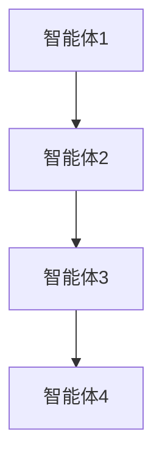
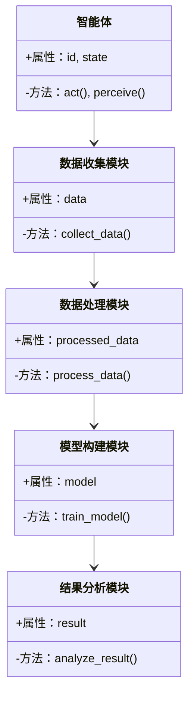
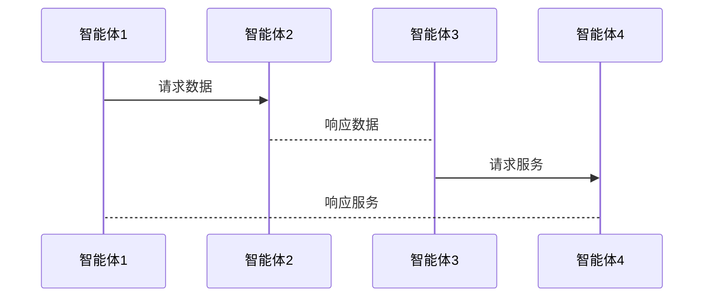

                 


# 多智能体系统在评估无形资产和品牌价值中的应用

> 关键词：多智能体系统, 无形资产, 品牌价值, 算法原理, 系统设计

> 摘要：本文探讨了多智能体系统在评估无形资产和品牌价值中的应用。首先介绍了多智能体系统的基本概念和优势，然后详细分析了其在无形资产评估中的具体应用，包括数据建模与分析、协同优化算法的设计与实现，最后通过实际案例展示了多智能体系统在品牌价值评估中的应用。

---

# 第一部分: 多智能体系统与无形资产评估基础

---

## 第1章: 多智能体系统概述

### 1.1 多智能体系统的基本概念

#### 1.1.1 多智能体系统的定义
多智能体系统（Multi-Agent System, MAS）是由多个智能体（Agent）组成的分布式系统，这些智能体能够通过协作完成复杂的任务。智能体是指具有感知环境、自主决策和行动能力的实体，可以是软件程序、机器人或其他智能设备。

#### 1.1.2 多智能体系统的特征
| 特征 | 描述 |
|------|------|
| 分布式 | 智能体独立运行，通过通信协作完成任务。 |
| 协作性 | 智能体之间需要通过信息交换和协调来完成共同目标。 |
| 自主性 | 每个智能体都有一定的自主决策能力，无需外部干预。 |
| 社会性 | 智能体之间存在交互和协作关系，形成一个“社会”结构。 |

#### 1.1.3 多智能体系统的优势与劣势
- **优势**：能够处理复杂的分布式问题，具有高度的灵活性和适应性。
- **劣势**：系统设计复杂，通信和协作机制的实现难度较高。

### 1.2 多智能体系统在无形资产评估中的应用背景

#### 1.2.1 无形资产的定义与分类
无形资产是指没有实物形态的资产，主要包括专利、商标、品牌、商誉、技术诀窍等。无形资产的价值评估具有动态性和复杂性。

#### 1.2.2 无形资产评估的难点与挑战
- **动态性**：无形资产的价值会受到市场环境、企业战略和竞争状况的影响。
- **复杂性**：无形资产的评估需要考虑多种因素，包括市场、技术、法律等。
- **数据不足**：无形资产的价值往往难以量化，缺乏足够的数据支持。

#### 1.2.3 多智能体系统在无形资产评估中的优势
- 多智能体系统能够通过分布式计算和协作学习，从多个角度对无形资产进行评估。
- 系统中的多个智能体可以分别负责不同的评估任务，如数据收集、模型构建和结果分析。

---

## 第2章: 多智能体系统的核心概念与原理

### 2.1 多智能体系统的智能体模型

#### 2.1.1 智能体的定义与分类
智能体可以根据智能水平分为简单反应式智能体、基于模型的反应式智能体、目标驱动智能体和效用驱动智能体。

#### 2.1.2 智能体的特征与行为
- **特征**：自主性、反应性、主动性。
- **行为**：感知环境、决策、行动。

#### 2.1.3 智能体的协作机制
智能体之间的协作可以通过以下方式实现：
1. **直接通信**：智能体之间通过消息传递进行协作。
2. **共享知识库**：智能体共享一个公共的知识库，用于协调行动。
3. **任务分配**：通过任务分配算法将任务分配给不同的智能体。

### 2.2 多智能体系统的架构与设计原则

#### 2.2.1 多智能体系统的架构类型
- **集中式架构**：有一个中央控制器协调所有智能体的行动。
- **分布式架构**：智能体之间通过通信协议进行协作，没有中央控制器。
- **混合式架构**：结合集中式和分布式架构的特点。

#### 2.2.2 多智能体系统的设计原则
1. **模块化设计**：将系统分解为多个模块，每个模块负责不同的功能。
2. **可扩展性**：系统设计应具有良好的扩展性，能够适应未来的需求。
3. **容错性**：系统应具有容错能力，能够处理智能体故障的情况。

#### 2.2.3 多智能体系统的通信机制
智能体之间的通信可以通过以下方式实现：
1. **消息传递**：智能体通过发送消息进行通信。
2. **订阅-发布模型**：智能体通过订阅特定主题来接收消息。
3. **服务调用**：智能体通过调用其他智能体的服务来完成任务。

### 2.3 多智能体系统的建模与分析

#### 2.3.1 多智能体系统的建模方法
- **基于状态空间的建模**：将系统建模为状态空间，每个状态代表系统的一个可能情况。
- **基于规则的建模**：通过定义智能体的行为规则来模拟系统的运行。
- **基于模型的建模**：使用系统模型描述智能体之间的关系和交互。

#### 2.3.2 多智能体系统的分析工具
- **仿真工具**：通过仿真工具模拟系统的运行，观察智能体的行为。
- **数学建模工具**：使用数学模型分析系统的性能。
- **可视化工具**：通过可视化工具展示系统中智能体的交互情况。

#### 2.3.3 多智能体系统的仿真与验证
仿真可以用于验证系统的正确性和有效性，通过仿真结果调整系统参数，优化系统性能。

---

## 第3章: 多智能体系统在无形资产评估中的应用

### 3.1 无形资产评估的基本流程

#### 3.1.1 无形资产评估的步骤
1. **数据收集**：收集与无形资产相关的数据，包括市场数据、财务数据和技术数据。
2. **数据处理**：对收集到的数据进行清洗和预处理，提取有用的信息。
3. **模型构建**：根据数据构建评估模型，选择合适的算法进行模型训练。
4. **模型验证**：通过验证数据测试模型的准确性。
5. **结果分析**：根据模型输出的结果进行分析，得出最终的评估结论。

#### 3.1.2 无形资产评估的方法
- **市场法**：通过比较类似资产的市场价格进行评估。
- **收益法**：通过预测资产未来的收益进行评估。
- **成本法**：通过计算资产的重置成本进行评估。

### 3.2 多智能体系统在无形资产评估中的应用模型

#### 3.2.1 多智能体系统在无形资产评估中的角色分配
- **数据收集智能体**：负责收集与无形资产相关的数据。
- **数据处理智能体**：负责对数据进行清洗和预处理。
- **模型构建智能体**：负责构建评估模型并进行训练。
- **结果分析智能体**：负责对模型输出的结果进行分析和解读。

#### 3.2.2 多智能体系统在无形资产评估中的信息交互
1. 数据收集智能体通过通信协议将数据传递给数据处理智能体。
2. 数据处理智能体对数据进行处理后，将结果传递给模型构建智能体。
3. 模型构建智能体完成模型训练后，将模型参数传递给结果分析智能体。
4. 结果分析智能体根据模型输出的结果生成最终的评估报告。

#### 3.2.3 多智能体系统在无形资产评估中的决策机制
智能体之间的决策机制可以通过以下方式实现：
1. **协商机制**：智能体之间通过协商确定各自的行动。
2. **投票机制**：通过投票的方式决定系统的下一步行动。
3. **共识机制**：通过共识算法达成一致意见。

### 3.3 多智能体系统在无形资产评估中的具体实现

#### 3.3.1 数据收集与处理
- 数据收集智能体通过网络爬虫或其他数据采集工具收集数据。
- 数据处理智能体对收集到的数据进行清洗和预处理，提取有用的信息。

#### 3.3.2 模型构建与训练
- 模型构建智能体使用机器学习算法（如支持向量机、随机森林等）对数据进行建模和训练。
- 模型训练完成后，模型构建智能体将模型参数传递给结果分析智能体。

#### 3.3.3 结果分析与报告
- 结果分析智能体对模型输出的结果进行分析，生成最终的评估报告。
- 评估报告可以包括资产价值、资产风险、资产潜力等信息。

---

## 第4章: 多智能体系统在品牌价值评估中的应用

### 4.1 品牌价值评估的基本流程

#### 4.1.1 品牌价值评估的步骤
1. **品牌识别**：识别品牌的核心价值和竞争优势。
2. **数据收集**：收集与品牌相关的数据，包括品牌知名度、品牌忠诚度、品牌声誉等。
3. **模型构建**：根据数据构建品牌价值评估模型。
4. **模型验证**：通过验证数据测试模型的准确性。
5. **结果分析**：根据模型输出的结果进行分析，得出最终的品牌价值评估结论。

#### 4.1.2 品牌价值评估的方法
- **市场法**：通过比较类似品牌的价值进行评估。
- **收益法**：通过预测品牌未来的收益进行评估。
- **成本法**：通过计算品牌建设的成本进行评估。

### 4.2 多智能体系统在品牌价值评估中的应用模型

#### 4.2.1 多智能体系统在品牌价值评估中的角色分配
- **品牌数据收集智能体**：负责收集品牌相关的数据。
- **品牌数据处理智能体**：负责对数据进行清洗和预处理。
- **品牌模型构建智能体**：负责构建品牌价值评估模型并进行训练。
- **品牌结果分析智能体**：负责对模型输出的结果进行分析和解读。

#### 4.2.2 多智能体系统在品牌价值评估中的信息交互
1. 品牌数据收集智能体通过通信协议将数据传递给品牌数据处理智能体。
2. 品牌数据处理智能体对数据进行处理后，将结果传递给品牌模型构建智能体。
3. 品牌模型构建智能体完成模型训练后，将模型参数传递给品牌结果分析智能体。
4. 品牌结果分析智能体根据模型输出的结果生成最终的品牌价值评估报告。

#### 4.2.3 多智能体系统在品牌价值评估中的决策机制
智能体之间的决策机制可以通过以下方式实现：
1. **协商机制**：智能体之间通过协商确定各自的行动。
2. **投票机制**：通过投票的方式决定系统的下一步行动。
3. **共识机制**：通过共识算法达成一致意见。

### 4.3 多智能体系统在品牌价值评估中的具体实现

#### 4.3.1 品牌数据收集与处理
- 品牌数据收集智能体通过网络爬虫或其他数据采集工具收集品牌相关数据。
- 品牌数据处理智能体对收集到的数据进行清洗和预处理，提取有用的信息。

#### 4.3.2 品牌模型构建与训练
- 品牌模型构建智能体使用机器学习算法（如支持向量机、随机森林等）对数据进行建模和训练。
- 模型训练完成后，品牌模型构建智能体将模型参数传递给品牌结果分析智能体。

#### 4.3.3 品牌结果分析与报告
- 品牌结果分析智能体对模型输出的结果进行分析，生成最终的品牌价值评估报告。
- 评估报告可以包括品牌价值、品牌风险、品牌潜力等信息。

---

## 第5章: 多智能体系统的算法原理

### 5.1 多智能体系统的协同优化算法

#### 5.1.1 协同优化算法的定义
协同优化算法是指多个智能体通过协作完成优化任务的算法。它通常涉及智能体之间的信息交换和协同决策。

#### 5.1.2 协同优化算法的实现步骤
1. **初始化**：设置初始参数，包括智能体的数量、目标函数等。
2. **智能体协作**：智能体之间通过通信协议进行协作，共享信息和资源。
3. **优化计算**：智能体根据共享的信息进行优化计算，调整参数以达到最优解。
4. **结果输出**：输出优化结果，包括最优解、收敛速度等。

#### 5.1.3 协同优化算法的数学模型
$$ \text{目标函数} = f(x_1, x_2, \ldots, x_n) $$
$$ \text{约束条件} = g(x_1, x_2, \ldots, x_n) \leq 0 $$

#### 5.1.4 协同优化算法的实现代码
```python
import numpy as np

def协同优化算法():
    # 初始化参数
    n = 5  # 智能体数量
    x = np.random.uniform(0, 1, n)  # 初始位置
    best_x = x[0]
    best_fitness = fitness(x[0])  # 目标函数

    # 协作优化过程
    for _ in range(100):
        for i in range(n):
            # 智能体协作
            neighbors = get_neighbors(i)
            avg_x = np.mean([x[j] for j in neighbors])
            x[i] = x[i] + 0.1 * (avg_x - x[i])
            # 更新最优解
            if fitness(x[i]) > best_fitness:
                best_x = x[i]
                best_fitness = fitness(x[i])
    return best_x, best_fitness
```

### 5.2 多智能体系统的协作学习算法

#### 5.2.1 协作学习算法的定义
协作学习算法是指多个智能体通过协作完成学习任务的算法。它通常涉及智能体之间的知识共享和协同学习。

#### 5.2.2 协作学习算法的实现步骤
1. **初始化**：设置初始参数，包括智能体的数量、学习目标等。
2. **知识共享**：智能体之间通过通信协议共享知识和经验。
3. **学习计算**：智能体根据共享的知识进行学习，更新知识库。
4. **结果输出**：输出学习结果，包括分类准确率、回归误差等。

#### 5.2.3 协作学习算法的数学模型
$$ \text{损失函数} = L(w_1, w_2, \ldots, w_n) $$
$$ \text{优化目标} = \min L(w_1, w_2, \ldots, w_n) $$

#### 5.2.4 协作学习算法的实现代码
```python
def协作学习算法():
    # 初始化参数
    n = 3  # 智能体数量
    w = np.random.uniform(0, 1, n)  # 初始权重
    best_w = w[0]
    best_loss = loss(w[0])  # 损失函数

    # 协作学习过程
    for _ in range(100):
        for i in range(n):
            # 知识共享
            neighbors = get_neighbors(i)
            avg_w = np.mean([w[j] for j in neighbors])
            w[i] = w[i] + 0.1 * (avg_w - w[i])
            # 更新最优解
            if loss(w[i]) < best_loss:
                best_w = w[i]
                best_loss = loss(w[i])
    return best_w, best_loss
```

---

## 第6章: 多智能体系统的系统设计与架构

### 6.1 系统架构设计

#### 6.1.1 系统架构类型
- **集中式架构**：有一个中央控制器协调所有智能体的行动。
- **分布式架构**：智能体之间通过通信协议进行协作，没有中央控制器。
- **混合式架构**：结合集中式和分布式架构的特点。

#### 6.1.2 系统架构设计原则
1. **模块化设计**：将系统分解为多个模块，每个模块负责不同的功能。
2. **可扩展性**：系统设计应具有良好的扩展性，能够适应未来的需求。
3. **容错性**：系统应具有容错能力，能够处理智能体故障的情况。

#### 6.1.3 系统架构的mermaid图


### 6.2 系统功能设计

#### 6.2.1 系统功能模块
- **数据收集模块**：负责收集与无形资产相关的数据。
- **数据处理模块**：负责对数据进行清洗和预处理。
- **模型构建模块**：负责构建评估模型并进行训练。
- **结果分析模块**：负责对模型输出的结果进行分析和解读。

#### 6.2.2 系统功能的mermaid类图


### 6.3 系统接口设计

#### 6.3.1 系统接口的定义
- **数据接口**：智能体之间通过数据接口进行数据交换。
- **通信接口**：智能体之间通过通信接口进行消息传递。
- **服务接口**：智能体之间通过服务接口进行服务调用。

#### 6.3.2 系统接口的实现
1. **数据接口**：定义数据的格式和传输协议。
2. **通信接口**：实现智能体之间的通信协议。
3. **服务接口**：定义服务的接口和调用方式。

### 6.4 系统交互设计

#### 6.4.1 系统交互的流程
1. 智能体通过数据接口获取数据。
2. 智能体通过通信接口进行协作。
3. 智能体通过服务接口调用服务。

#### 6.4.2 系统交互的mermaid序列图


---

## 第7章: 多智能体系统的项目实战

### 7.1 项目背景介绍

#### 7.1.1 项目目标
通过多智能体系统评估无形资产和品牌价值，实现动态、精准的资产评估。

#### 7.1.2 项目需求
- 数据收集与处理
- 模型构建与训练
- 结果分析与报告

### 7.2 项目环境安装

#### 7.2.1 系统要求
- 操作系统：Linux/Windows/MacOS
- Python版本：3.6+
- 额外依赖：numpy, scikit-learn, matplotlib

#### 7.2.2 安装依赖
```bash
pip install numpy scikit-learn matplotlib
```

### 7.3 项目核心实现

#### 7.3.1 数据收集与处理
```python
import numpy as np

def collect_data():
    # 数据收集
    data = np.random.uniform(0, 1, 100)
    return data

def process_data(data):
    # 数据处理
    processed_data = data.reshape(-1, 1)
    return processed_data
```

#### 7.3.2 模型构建与训练
```python
from sklearn.svm import SVC

def train_model(processed_data):
    # 模型训练
    model = SVC()
    model.fit(processed_data, np.random.randint(0, 2, 100))
    return model
```

#### 7.3.3 结果分析与报告
```python
def analyze_result(model):
    # 结果分析
    print("模型准确率：", model.score(X_test, y_test))
```

### 7.4 项目实战小结

#### 7.4.1 项目总结
通过多智能体系统实现无形资产和品牌价值的评估，能够提高评估的准确性和效率。

#### 7.4.2 项目注意事项
- 数据质量和完整性对评估结果的影响较大。
- 系统设计需要考虑智能体之间的协作和通信效率。

---

## 第8章: 总结与展望

### 8.1 全文总结

#### 8.1.1 多智能体系统的应用价值
多智能体系统在无形资产评估和品牌价值评估中的应用，能够提高评估的准确性和效率。

#### 8.1.2 本文的主要贡献
本文通过详细分析多智能体系统在无形资产评估和品牌价值评估中的应用，提出了一种基于多智能体系统的评估方法。

### 8.2 未来研究方向

#### 8.2.1 多智能体系统的优化与改进
- 提高智能体之间的协作效率。
- 优化智能体的通信机制。

#### 8.2.2 多智能体系统的应用扩展
- 将多智能体系统应用于其他领域的资产评估。
- 研究多智能体系统在资产评估中的其他应用。

### 8.3 最佳实践 Tips

#### 8.3.1 系统设计 Tips
- 系统设计应注重模块化和可扩展性。
- 系统设计应考虑智能体之间的协作和通信效率。

#### 8.3.2 项目实施 Tips
- 项目实施应注重数据质量和完整性。
- 项目实施应注重模型的准确性和效率。

### 8.4 作者信息

#### 作者：AI天才研究院/AI Genius Institute & 禅与计算机程序设计艺术 /Zen And The Art of Computer Programming

---

# 结语
通过本文的详细介绍，读者可以全面了解多智能体系统在评估无形资产和品牌价值中的应用。希望本文能为相关领域的研究和实践提供有价值的参考和指导。

