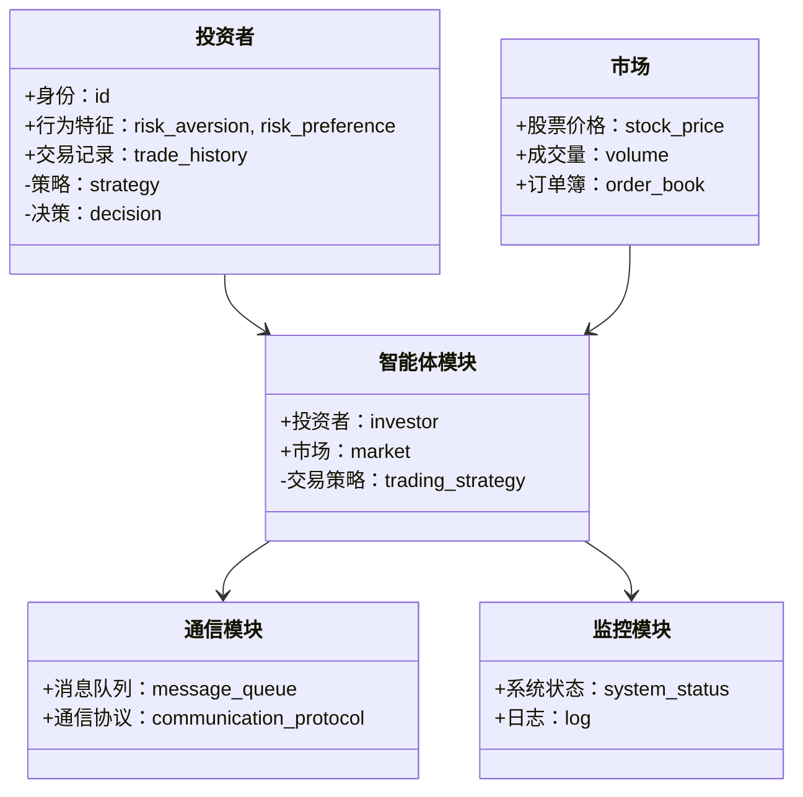
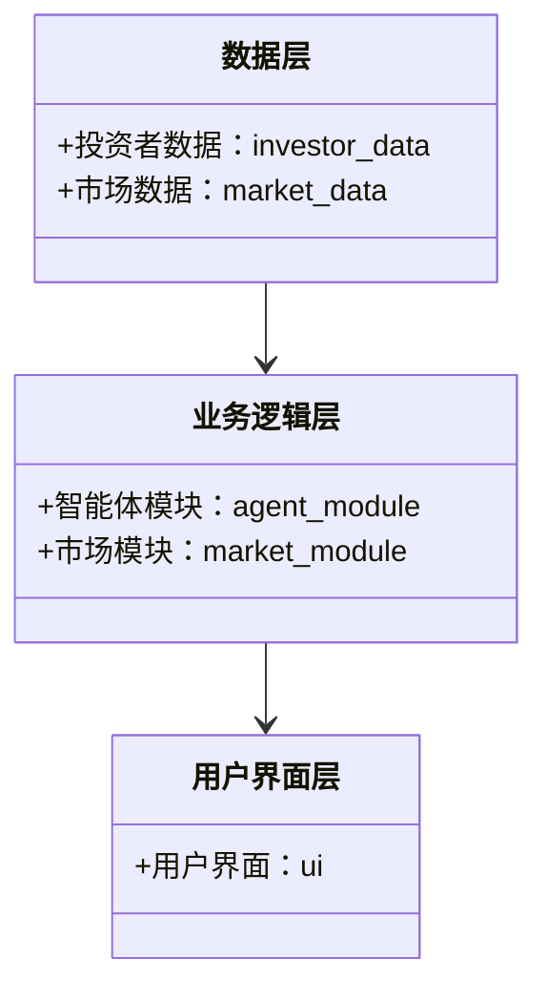
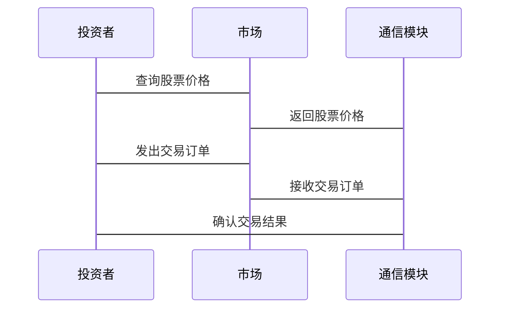

                 


# 多智能体系统模拟投资者行为

## 关键词：
多智能体系统、投资者行为模拟、行为建模、博弈论模型、系统架构设计

## 摘要：
多智能体系统（MAS）通过模拟多个智能体之间的交互行为，能够有效地建模和分析复杂的投资者行为。本文将从 MAS 的基本概念出发，详细探讨投资者行为建模的核心理论与方法，分析 MAS 在金融模拟中的优势，介绍基于强化学习和博弈论的算法原理，并通过系统架构设计和实际案例展示如何构建高效的投资者行为模拟系统。通过本文的系统讲解，读者能够全面理解多智能体系统模拟投资者行为的理论基础和实际应用。

---

# 正文

## 第一部分：多智能体系统与投资者行为模拟基础

### 第1章：多智能体系统概述

#### 1.1 多智能体系统的基本概念

##### 1.1.1 多智能体系统的定义与特点
多智能体系统（Multi-Agent System, MAS）是由多个智能体（Agent）组成的复杂系统。智能体是指能够在环境中感知、推理、决策和行动的实体。MAS 的特点包括：
- **分布式性**：智能体之间分布在网络中，没有中心化的控制。
- **交互性**：智能体之间通过通信和协作完成任务。
- **动态性**：环境和智能体的行为都是动态变化的。
- **社会性**：智能体之间的交互类似于社会行为，涉及合作与竞争。

##### 1.1.2 多智能体系统的核心要素
MAS 的核心要素包括：
- **智能体**：具备感知、推理、决策和行动能力。
- **环境**：智能体所处的外部环境，包括物理环境和信息环境。
- **通信**：智能体之间通过通信协议进行信息交换。
- **协作**：智能体通过协作完成共同目标。

##### 1.1.3 多智能体系统与单智能体系统的区别
单智能体系统（Single-Agent System）仅包含一个智能体，而 MAS 包含多个智能体。MAS 的复杂性在于智能体之间的交互和协作，这使得 MAS 更适合模拟复杂的社会系统，如金融市场。

#### 1.2 投资者行为模拟的背景与意义

##### 1.2.1 投资者行为的复杂性
投资者行为受到多种因素的影响，包括市场环境、个体心理、社会影响等。投资者的决策往往具有非理性特征，如羊群效应和从众心理。

##### 1.2.2 为什么要用多智能体系统模拟投资者行为
MAS 能够模拟多个投资者的交互行为，捕捉市场中的复杂动态。通过 MAS，可以研究投资者行为对市场的影响，为金融风险评估和政策制定提供依据。

##### 1.2.3 多智能体系统在金融领域的应用前景
MAS 在金融领域的应用包括：
- **市场模拟**：模拟股票市场的价格波动。
- **风险管理**：评估投资者行为对金融系统的影响。
- **政策制定**：模拟政策对市场的影响。

### 第2章：投资者行为建模基础

#### 2.1 投资者行为的基本理论

##### 2.1.1 投资者决策的理性与非理性
投资者的决策可以分为理性决策和非理性决策。理性决策基于数学模型，而非理性决策受到心理因素的影响。

##### 2.1.2 投资者心理与行为特征
投资者的心理特征包括风险偏好、风险厌恶和风险中性。行为特征包括过度自信、从众心理和羊群效应。

##### 2.1.3 投资者行为的分类与层次
投资者行为可以分为个体行为和群体行为。个体行为是投资者的个人决策，群体行为是多个投资者的交互结果。

#### 2.2 投资者行为模拟的数据来源

##### 2.2.1 市场交易数据
市场交易数据包括股票价格、成交量和订单簿数据。这些数据反映了投资者的交易行为。

##### 2.2.2 个体投资者行为数据
个体投资者行为数据包括投资者的交易记录、持仓数据和心理数据。这些数据用于建模个体投资者的行为特征。

##### 2.2.3 行为实验数据
行为实验数据来自实验室中的投资者行为实验。这些数据用于验证投资者行为模型的准确性。

### 第3章：多智能体系统与投资者行为模拟的关系

#### 3.1 多智能体系统在投资者行为模拟中的优势

##### 3.1.1 多智能体系统的分布式特性
MAS 的分布式特性使得它可以模拟多个投资者的交互行为，捕捉市场中的复杂动态。

##### 3.1.2 多智能体系统的交互性
MAS 的交互性使得它可以模拟投资者之间的信息交换和协作行为。

##### 3.1.3 多智能体系统的动态性
MAS 的动态性使得它可以模拟市场环境的实时变化，捕捉投资者行为的动态特征。

#### 3.2 投资者行为模拟中的 MAS 架构

##### 3.2.1 投资者行为模拟的 MAS 架构设计
MAS 架构设计包括智能体设计、通信协议设计和环境设计。智能体设计需要考虑投资者的行为特征，通信协议设计需要考虑智能体之间的信息交换，环境设计需要考虑市场环境的模拟。

##### 3.2.2 MAS 中的个体智能体与群体行为
个体智能体的行为特征决定了群体行为。群体行为是多个个体行为的综合结果，可以通过 MAS 进行模拟。

##### 3.2.3 MAS 在金融模拟中的应用案例
MAS 在金融模拟中的应用案例包括股票市场模拟和风险管理模拟。通过 MAS，可以研究投资者行为对市场的影响。

---

## 第二部分：多智能体系统与投资者行为的核心概念与联系

### 第4章：多智能体系统中的投资者行为建模

#### 4.1 投资者行为建模的 MAS 方法

##### 4.1.1 投资者行为模型的构建步骤
投资者行为模型的构建步骤包括数据收集、模型设计、模型验证和模型应用。数据收集需要收集投资者行为数据，模型设计需要设计投资者行为模型，模型验证需要验证模型的准确性，模型应用需要将模型应用于实际场景。

##### 4.1.2 投资者行为模型的类型
投资者行为模型的类型包括理性模型和非理性模型。理性模型基于理性决策，非理性模型基于非理性决策。

##### 4.1.3 投资者行为模型的验证与评估
投资者行为模型的验证与评估需要通过实证分析和模拟实验进行。实证分析需要验证模型的准确性，模拟实验需要验证模型的鲁棒性。

#### 4.2 投资者行为建模的核心理论与方法

##### 4.2.1 投资者行为模型的属性特征对比
投资者行为模型的属性特征包括模型类型、模型复杂度和模型适用性。理性模型适用于理性决策，非理性模型适用于非理性决策。

##### 4.2.2 投资者行为模型的 ER 实体关系图
投资者行为模型的 ER 实体关系图展示了投资者、交易数据和市场环境之间的关系。通过 ER 图可以清晰地理解投资者行为模型的结构。

---

## 第三部分：算法原理讲解

### 第5章：基于强化学习的投资者行为建模

#### 5.1 Q-Learning 算法的原理与应用

##### 5.1.1 Q-Learning 算法的基本原理
Q-Learning 算法是一种基于强化学习的算法。它通过智能体与环境的交互，学习最优策略。智能体通过与环境的交互，获得奖励，并更新 Q 表。

##### 5.1.2 Q-Learning 算法在投资者行为模拟中的应用
Q-Learning 算法可以用于模拟投资者的交易策略。智能体通过与市场的交互，学习最优交易策略。

##### 5.1.3 Q-Learning 算法的数学模型与公式
Q-Learning 算法的数学模型如下：

$$ Q(s, a) = Q(s, a) + \alpha (r + \gamma \max Q(s', a') - Q(s, a)) $$

其中，\( s \) 是状态，\( a \) 是动作，\( r \) 是奖励，\( \gamma \) 是折扣因子，\( \alpha \) 是学习率。

##### 5.1.4 Q-Learning 算法的 Python 实现
以下是 Q-Learning 算法的 Python 实现：

```python
class QLearning:
    def __init__(self, state_space, action_space, alpha=0.1, gamma=0.9):
        self.state_space = state_space
        self.action_space = action_space
        self.alpha = alpha
        self.gamma = gamma
        self.Q = defaultdict(lambda: defaultdict(int))

    def choose_action(self, state):
        max_action = max(self.Q[state].items(), key=lambda x: x[1])[0]
        return max_action

    def update_Q(self, state, action, reward, next_state):
        self.Q[state][action] += self.alpha * (reward + self.gamma * max(self.Q[next_state].values()) - self.Q[state][action])
```

---

## 第四部分：系统分析与架构设计

### 第6章：投资者行为模拟系统的架构设计

#### 6.1 问题场景介绍
投资者行为模拟系统需要模拟多个投资者在股票市场中的交易行为。系统需要考虑投资者的行为特征和市场环境的动态变化。

#### 6.2 系统功能设计

##### 6.2.1 系统功能模块
投资者行为模拟系统的功能模块包括：
- **智能体模块**：实现投资者的交易行为。
- **市场模块**：模拟股票市场的价格波动。
- **通信模块**：实现智能体之间的信息交换。
- **监控模块**：监控系统的运行状态。

##### 6.2.2 系统功能设计的领域模型
以下是投资者行为模拟系统的领域模型：



#### 6.3 系统架构设计

##### 6.3.1 系统架构的分层设计
投资者行为模拟系统的架构设计包括：
- **数据层**：存储投资者行为数据和市场数据。
- **业务逻辑层**：实现投资者行为模拟的核心逻辑。
- **用户界面层**：提供用户交互界面。

##### 6.3.2 系统架构设计的 Mermaid 图
以下是投资者行为模拟系统的架构设计图：



#### 6.4 系统接口设计

##### 6.4.1 系统接口的设计原则
系统接口设计需要遵循模块化、标准化和可扩展性原则。

##### 6.4.2 系统接口的实现
投资者行为模拟系统的接口包括：
- **投资者接口**：实现投资者的交易行为。
- **市场接口**：实现市场的价格波动。
- **通信接口**：实现智能体之间的信息交换。

#### 6.5 系统交互设计

##### 6.5.1 系统交互的 Mermaid 序列图
以下是投资者行为模拟系统的交互序列图：



---

## 第五部分：项目实战

### 第7章：投资者行为模拟系统的实现

#### 7.1 环境安装与配置

##### 7.1.1 系统运行环境
投资者行为模拟系统需要安装 Python 3.8 或更高版本，并安装以下库：
- **numpy**
- **pandas**
- **matplotlib**
- **scikit-learn**

##### 7.1.2 环境配置步骤
1. 安装 Python 和所需的库。
2. 配置开发环境，如 PyCharm 或 VS Code。
3. 创建项目目录，并初始化代码结构。

#### 7.2 系统核心实现

##### 7.2.1 智能体模块的实现
以下是智能体模块的 Python 实现：

```python
class InvestorAgent:
    def __init__(self, id, risk_aversion):
        self.id = id
        self.risk_aversion = risk_aversion
        self.trade_history = []
    
    def decide_action(self, market_data):
        # 根据市场数据和风险偏好决定交易行为
        if market_data['price'] > market_data['moving_average']:
            return 'buy'
        else:
            return 'sell'
    
    def execute_action(self, action, price):
        # 执行交易操作
        if action == 'buy':
            self.trade_history.append(('buy', price))
        elif action == 'sell':
            self.trade_history.append(('sell', price))
```

##### 7.2.2 市场模块的实现
以下是市场模块的 Python 实现：

```python
class Market:
    def __init__(self, initial_price):
        self.price = initial_price
        self.volume = 0
        self.order_book = {}
    
    def update_price(self, new_price):
        self.price = new_price
    
    def add_order(self, order):
        self.order_book[order['id']] = order
    
    def execute_order(self, order_id):
        if order_id in self.order_book:
            order = self.order_book.pop(order_id)
            self.volume += order['quantity']
```

#### 7.3 项目实战案例分析

##### 7.3.1 案例分析
以下是一个简单的投资者行为模拟案例：

```python
# 初始化市场
market = Market(100)

# 创建投资者
agent1 = InvestorAgent(1, 0.5)
agent2 = InvestorAgent(2, 0.3)

# 模拟市场更新
market.update_price(105)

# 智能体决策
agent1.decide_action({'price': 105, 'moving_average': 100})  # 返回 'buy'
agent2.decide_action({'price': 105, 'moving_average': 95})   # 返回 'sell'

# 执行交易
agent1.execute_action('buy', 105)
agent2.execute_action('sell', 105)

# 更新市场数据
market.add_order({'id': 1, 'type': 'buy', 'quantity': 5})
market.add_order({'id': 2, 'type': 'sell', 'quantity': 3})
market.execute_order(1)
market.execute_order(2)
```

##### 7.3.2 案例分析结果
通过上述代码，我们可以看到投资者的行为对市场的影响。投资者 1 决策买入，投资者 2 决策卖出，最终市场的交易量增加了 5。

#### 7.4 项目小结

##### 7.4.1 项目总结
通过本项目，我们实现了投资者行为模拟系统的核心功能，包括智能体模块和市场模块的实现。

##### 7.4.2 关键点总结
- 投资者行为建模是实现投资者行为模拟的核心。
- 多智能体系统的分布式特性使得它可以模拟多个投资者的交互行为。
- 强化学习算法可以用于投资者的交易策略模拟。

---

## 第六部分：最佳实践

### 第8章：投资者行为模拟系统的优化与扩展

#### 8.1 最佳实践 tips

##### 8.1.1 系统优化建议
- 优化智能体模块的性能，提高系统的运行效率。
- 增加市场的复杂性，模拟真实的市场环境。
- 引入更多的投资者行为特征，提高模型的准确性。

##### 8.1.2 注意事项
- 在实际应用中，需要考虑数据的实时性和准确性。
- 需要处理投资者行为的非理性特征，提高模型的鲁棒性。
- 需要进行系统的测试和验证，确保模型的准确性。

#### 8.2 小结

##### 8.2.1 内容回顾
本文详细讲解了多智能体系统模拟投资者行为的核心理论和实际应用。

##### 8.2.2 重要性总结
投资者行为模拟在金融领域具有重要的应用价值，可以帮助我们更好地理解市场的运行机制，为金融风险评估和政策制定提供依据。

#### 8.3 拓展阅读

##### 8.3.1 相关领域的研究进展
- 强化学习在金融领域的应用研究。
- 多智能体系统在经济模拟中的应用研究。

##### 8.3.2 推荐的进一步阅读资料
- 《Reinforcement Learning: Theory and Algorithms》
- 《Multi-Agent Systems: Complexity and Modeling》

---

## 作者信息

作者：AI天才研究院/AI Genius Institute & 禅与计算机程序设计艺术 /Zen And The Art of Computer Programming

---

感谢您的阅读！如果对本文内容有任何疑问或建议，请随时与我们联系！

