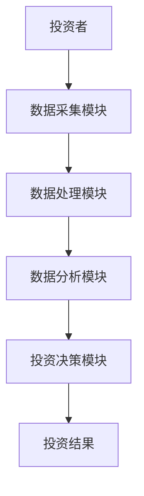

                 


# 巴菲特-芒格的脑机接口社交应用投资：思维互联的新时代

## 关键词
- 巴菲特投资理念
- 芒格思维模型
- 脑机接口技术
- 社交应用
- 投资策略
- 人工智能
- 数据驱动决策

## 摘要
本文探讨巴菲特和芒格的投资理念与脑机接口技术在社交应用中的结合，分析如何利用BCI技术提升投资决策的科学性和准确性。通过详细的技术分析和实际案例，阐述脑机接口在社交网络中的应用潜力，以及如何通过数据驱动的方法优化投资策略。最后，总结当前技术挑战和未来发展趋势，为投资者和技术开发者提供深度见解。

---

# 第1章 巴菲特与芒格的投资理念

## 1.1 巴菲特的价值投资理论

### 1.1.1 价值投资的核心概念
- 价值投资的定义：寻找市场低估的公司，长期持有，关注公司的内在价值。
- 核心原则：安全边际、长期思维、公司基本面分析。

### 1.1.2 巴菲特的投资策略
- 集中投资：将资金集中在少数优质资产上。
- 买入并持有：长期持有优质股票，避免频繁交易。
- 宏观视角：关注宏观经济和行业趋势。

### 1.1.3 成功案例分析
- 可口可乐：长期投资案例，分析其竞争优势和长期价值。
- 富国银行：通过基本面分析选择投资标的。

## 1.2 芒格的多元思维模型

### 1.2.1 多元思维模型的定义
- 多元思维模型：通过多个学科的思维方式来理解问题，做出更全面的决策。
- 核心思想：避免单一思维，注重多维度分析。

### 1.2.2 芒格的思维模型应用
- 跨学科分析：将心理学、经济学、物理学等学科的原理应用于投资决策。
- 边际成本与收益分析：通过边际思维优化投资组合。

### 1.2.3 成功案例分析
- 通过物理学杠杆原理理解企业的财务杠杆。
- 利用心理学认知偏差识别市场泡沫。

---

# 第2章 脑机接口技术基础

## 2.1 脑机接口的基本概念

### 2.1.1 脑机接口的定义
- 脑机接口（BCI）：通过技术手段直接连接人脑与外部设备，实现信息交互。
- 主要类型：侵入式、半侵入式和非侵入式。

### 2.1.2 脑机接口的工作原理
- 神经信号采集：通过电极采集大脑电信号。
- 数据处理：信号处理、特征提取、分类器分析。
- 输出与反馈：将分析结果转化为可执行指令。

### 2.1.3 脑机接口的分类与应用
- 健康医疗：神经康复、脑控假肢。
- 娱乐：游戏控制、虚拟现实交互。
- 教育：学习辅助、注意力训练。

## 2.2 脑机接口的关键技术

### 2.2.1 神经信号采集技术
- 电生理信号采集：EEG、EMG等。
- 信号处理：滤波、降噪、特征提取。

### 2.2.2 数据处理与分析算法
- 信号处理算法：小波变换、独立成分分析（ICA）。
- 分类算法：支持向量机（SVM）、随机森林、深度学习。

### 2.2.3 输出与反馈机制
- 硬件输出：控制外部设备。
- 软件反馈：用户界面显示分析结果。

---

# 第3章 脑机接口在社交应用中的投资潜力

## 3.1 社交网络与投资行为分析

### 3.1.1 社交网络数据的特征
- 用户行为数据：点击、点赞、评论。
- 用户情感分析：情绪识别、情感强度分析。
- 社交网络结构：社交影响力、信息传播路径。

### 3.1.2 投资行为的社交网络分析
- 集群分析：识别投资群体。
- 社会网络影响力：关键意见领袖（KOL）识别。
- 投资情绪传染：情绪在社交网络中的传播。

### 3.1.3 脑机接口在社交网络中的应用
- 实时情绪监测：通过BCI技术监测投资者情绪。
- 集群行为预测：基于情绪数据预测市场波动。
- 个性化投资建议：根据个人情绪和社交网络数据定制投资策略。

## 3.2 脑机接口技术在投资决策中的应用

### 3.2.1 投资者情绪分析
- 情绪分类：将投资者情绪分为积极、消极、中性。
- 情绪强度分析：量化情绪强度与市场波动的相关性。

### 3.2.2 市场趋势预测
- 情绪与价格关系：分析情绪数据与市场价格的相关性。
- 市场情绪指数：构建基于情绪数据的市场指数。
- 时间序列分析：使用ARIMA模型预测市场趋势。

### 3.2.3 个性化投资建议
- 用户画像：基于社交数据和情绪数据构建用户画像。
- 个性化策略：根据不同用户特征制定投资策略。
- 风险管理：根据情绪数据调整投资组合的风险敞口。

---

# 第4章 巴菲特与芒格投资理念与脑机接口技术的结合

## 4.1 巴菲特价值投资与脑机接口技术

### 4.1.1 价值投资中的数据驱动决策
- 数据的重要性：如何利用数据进行价值评估。
- 数据分析工具：利用大数据技术分析企业基本面。

### 4.1.2 脑机接口技术在价值评估中的应用
- 情绪分析：通过BCI技术分析投资者情绪，辅助价值判断。
- 数据驱动决策：利用情绪数据优化投资决策。

### 4.1.3 技术与投资理念的协同效应
- 数据与价值的结合：如何通过数据发现企业的内在价值。
- 技术辅助决策：利用BCI技术提升决策的科学性和准确性。

## 4.2 芒格的多元思维模型与脑机接口技术

### 4.2.1 多元思维模型的扩展应用
- 跨学科分析：将心理学、神经科学等学科知识应用于投资决策。
- 系统思维：从整体角度分析市场和企业。

### 4.2.2 脑机接口技术在多元思维中的作用
- 数据支持：提供科学的数据支持多元思维模型的应用。
- 技术辅助：通过技术手段实现跨学科数据的整合与分析。

### 4.2.3 技术与思维模型的结合案例
- 利用BCI技术分析投资者情绪，辅助价值投资决策。
- 通过大数据技术构建多元思维模型，优化投资组合。

---

# 第5章 脑机接口社交应用的投资策略

## 5.1 数据驱动的投资策略

### 5.1.1 数据采集与处理
- 数据源：社交平台数据、投资者情绪数据、市场数据。
- 数据清洗与预处理：去除噪声数据，进行数据标准化。

### 5.1.2 数据分析与建模
- 情绪分析模型：使用自然语言处理（NLP）技术进行情感分析。
- 市场预测模型：构建基于情绪数据的ARIMA模型预测市场价格。

### 5.1.3 投资决策优化
- 情绪驱动投资：根据投资者情绪数据调整投资策略。
- 数据驱动组合管理：利用数据优化投资组合的风险收益比。

## 5.2 技术驱动的投资策略

### 5.2.1 脑机接口技术的应用
- 实时监控投资者情绪，及时调整投资策略。
- 通过BCI技术预测市场情绪变化，提前布局投资。

### 5.2.2 个性化投资服务
- 根据投资者情绪和社交网络数据提供个性化投资建议。
- 通过BCI技术实现投资者与投资策略的深度匹配。

## 5.3 风险管理与伦理考量

### 5.3.1 技术风险
- 数据隐私问题：如何保护投资者的个人数据。
- 技术可靠性：脑机接口技术的准确性和稳定性。

### 5.3.2 伦理问题
- 投资者自主权：如何平衡技术辅助与投资者自主决策。
- 市场公平性：技术优势是否会导致市场不公平竞争。

---

# 第6章 系统架构与项目实战

## 6.1 系统架构设计

### 6.1.1 项目介绍
- 项目目标：构建一个基于BCI技术的社交应用投资系统。
- 项目范围：包括数据采集、分析、预测和投资决策优化。

### 6.1.2 系统功能设计
- 数据采集模块：采集投资者情绪数据和市场数据。
- 数据处理模块：清洗、转换和预处理数据。
- 数据分析模块：构建情绪分析模型和市场预测模型。
- 投资决策模块：根据分析结果优化投资策略。

### 6.1.3 系统架构图



### 6.1.4 系统接口设计
- 数据接口：与社交平台和市场数据源对接。
- 用户接口：为投资者提供实时情绪监控和投资建议。

## 6.2 项目核心实现

### 6.2.1 数据采集模块
- 使用Python的pyEEG库进行脑电信号采集。
- 代码示例：
  ```python
  import numpy as np
  from pyeeg import extract_features

  def collect_eeg_data():
      # 模拟数据采集
      eeg_data = np.random.randn(100, 10)  # 假设10个通道的数据
      return eeg_data

  eeg_data = collect_eeg_data()
  features = extract_features(eeg_data)
  ```

### 6.2.2 数据分析模块
- 使用机器学习算法进行情绪分类。
- 代码示例：
  ```python
  from sklearn.svm import SVC
  from sklearn.model_selection import train_test_split

  features = extract_features(eeg_data)
  labels = np.random.randint(2, size=100)  # 模拟情绪标签

  X_train, X_test, y_train, y_test = train_test_split(features, labels, test_size=0.2)
  clf = SVC().fit(X_train, y_train)
  accuracy = clf.score(X_test, y_test)
  print(f"准确率: {accuracy}")
  ```

### 6.2.3 投资决策模块
- 根据情绪分析结果优化投资组合。
- 代码示例：
  ```python
  import numpy as np
  import pandas as pd

  # 模拟市场数据
  market_data = pd.DataFrame(np.random.randn(100, 5), columns=['AAPL', 'GOOGL', 'MSFT', 'AMZN', 'FB'])
 情绪数据 = clf.predict_proba(X_test)[:, 1]  # 获取情绪强度

  # 构建投资组合
  weights = np.random.dirichlet([1,1,1,1,1])  # 等权重分配
  portfolio_value = np.dot(market_data, weights)
  ```

## 6.3 案例分析与实际应用

### 6.3.1 案例分析
- 案例一：利用情绪数据预测科技股价格波动。
- 案例二：通过BCI技术优化个人投资组合。

### 6.3.2 实际应用
- 现实中的社交应用投资平台：投资者情绪监控与投资建议。
- 技术在金融领域的应用前景：未来可能的发展方向。

## 6.4 项目小结

### 6.4.1 成果总结
- 成功构建了一个基于BCI技术的社交应用投资系统。
- 通过实际案例验证了技术的有效性和可行性。

### 6.4.2 经验总结
- 数据质量的重要性：高精度数据是准确分析的基础。
- 技术与业务的结合：技术的应用需要结合实际业务需求。

### 6.4.3 挑战与改进
- 技术挑战：提高数据采集和分析的准确性。
- 业务挑战：如何在实际业务中有效应用技术成果。

---

# 第7章 挑战与未来趋势

## 7.1 当前技术挑战

### 7.1.1 数据采集与处理
- 数据质量：如何获取高精度的神经信号。
- 数据量：处理大规模数据的计算能力要求。

### 7.1.2 技术可靠性
- 系统稳定性：脑机接口系统的可靠性。
- 技术成熟度：现有技术的局限性。

## 7.2 伦理与法律问题

### 7.2.1 数据隐私
- 投资者数据的隐私保护。
- 数据使用的法律合规性。

### 7.2.2 伦理问题
- 技术是否会影响投资者的自主决策。
- 技术是否会导致市场不公平竞争。

## 7.3 未来趋势

### 7.3.1 技术进步
- 新型脑机接口技术的发展：非侵入式技术的突破。
- 人工智能技术的融合：更智能的分析与决策。

### 7.3.2 市场应用
- 投资领域的广泛应用：从个人投资者到机构投资者。
- 社交应用的深化：更精准的用户画像和投资策略。

### 7.3.3 跨学科研究
- 神经科学与金融学的结合。
- 多元学科的交叉研究推动技术进步。

---

# 第8章 结论与展望

## 8.1 全文总结

### 8.1.1 核心观点回顾
- 巴菲特和芒格的投资理念与脑机接口技术的结合具有巨大的潜力。
- 脑机接口技术可以提升投资决策的科学性和准确性。

### 8.1.2 技术与投资的融合
- 数据驱动决策的重要性：技术如何改变投资方式。
- 跨学科研究的必要性：如何通过多学科知识优化投资策略。

## 8.2 未来展望

### 8.2.1 技术发展
- 新型脑机接口技术的应用：更高精度和更广应用范围。
- 人工智能技术的进一步融合：更智能的投资决策系统。

### 8.2.2 市场应用
- 个性化投资服务的普及：基于BCI技术的定制化投资建议。
- 投资教育的创新：利用BCI技术进行投资者教育和心理辅导。

## 8.3 致谢

### 8.3.1 致谢对象
- 谢谢读者的支持。
- 感谢技术专家和投资专家的指导。

---

# 附录

## 附录A 脑机接口技术相关工具

### A.1 数据采集工具
- pyEEG：Python中的脑电信号处理库。
- OpenBCI：开源脑机接口平台。

### A.2 数据分析工具
- scikit-learn：机器学习库。
- TensorFlow：深度学习框架。

## 附录B 相关文献

### B.1 经典文献
- 巴菲特定律书籍。
- 芒格的多元思维模型书籍。
- 脑机接口技术相关学术论文。

## 附录C 代码示例

### C.1 数据采集与处理
```python
import numpy as np
import pandas as pd

# 模拟数据采集
def collect_eeg_data(channels=10, samples=100):
    return np.random.randn(samples, channels)

eeg_data = collect_eeg_data()
```

### C.2 情绪分类模型
```python
from sklearn.svm import SVC
from sklearn.model_selection import train_test_split

X_train, X_test, y_train, y_test = train_test_split(eeg_data, labels)
clf = SVC().fit(X_train, y_train)
```

### C.3 投资决策系统
```python
import pandas as pd

market_data = pd.DataFrame(np.random.randn(100, 5), columns=['AAPL', 'GOOGL', 'MSFT', 'AMZN', 'FB'])
portfolio = market_data.dot(weights)
```

---

# 作者

作者：AI天才研究院/AI Genius Institute & 禅与计算机程序设计艺术 /Zen And The Art of Computer Programming

---

以上是《巴菲特-芒格的脑机接口社交应用投资：思维互联的新时代》的完整目录大纲。

