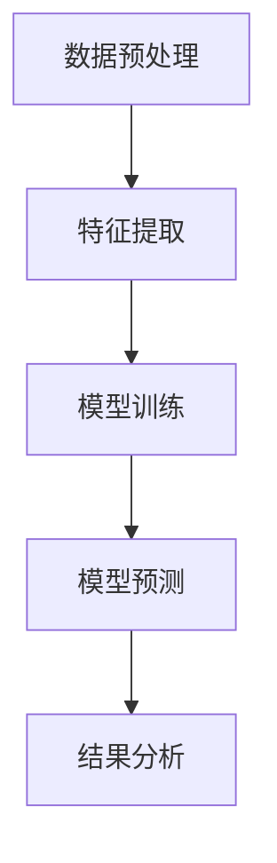
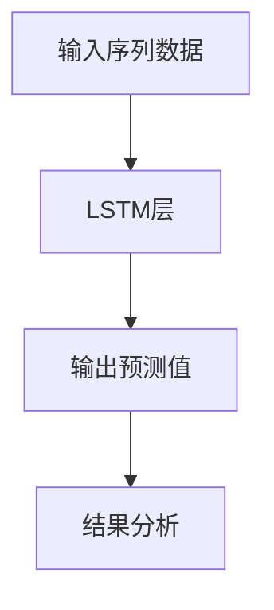
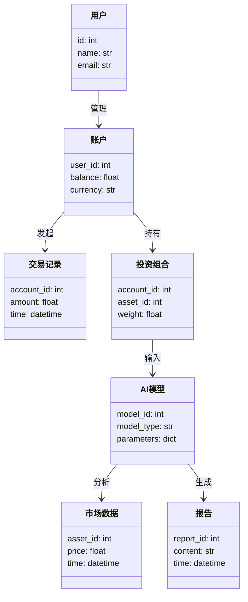
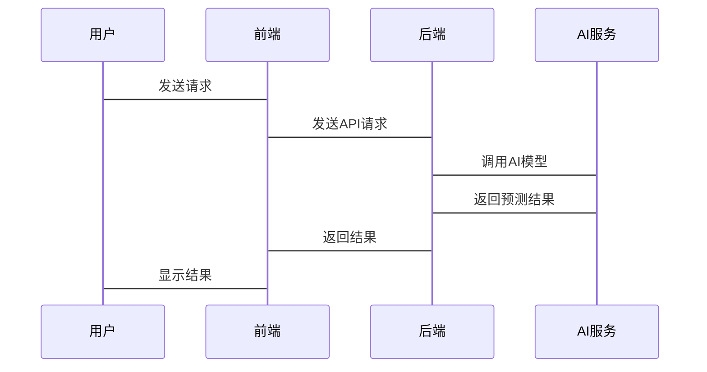

                 


# 构建全方位的AI驱动财富管理平台

## 关键词：人工智能、财富管理、系统架构、机器学习、自然语言处理

## 摘要：本文将详细介绍如何构建一个全方位的AI驱动财富管理平台。从背景分析到技术实现，从系统架构设计到项目实战，我们将逐步解析如何利用AI技术解决财富管理中的痛点问题，构建高效、智能的财富管理生态系统。文章内容涵盖核心算法原理、系统架构设计、项目实战案例以及最佳实践等，为读者提供全面的技术指导。

---

# 第一部分：引言

## 第1章：AI驱动财富管理平台的背景与意义

### 1.1 问题背景

#### 1.1.1 财富管理行业的现状与挑战
- 财富管理行业正面临数据爆炸、客户期望日益提高、市场波动加剧等挑战。
- 传统财富管理依赖人工判断，效率低、风险高，难以满足个性化需求。
- 随着AI技术的发展，智能化财富管理成为行业趋势。

#### 1.1.2 AI技术在财富管理中的应用潜力
- AI能够通过大数据分析和机器学习模型，帮助投资者做出更精准的投资决策。
- 自然语言处理技术可以分析新闻、社交媒体等非结构化数据，捕捉市场情绪。
- 时间序列分析能够预测市场走势，优化投资组合。

#### 1.1.3 构建AI驱动财富管理平台的目标与意义
- 目标：打造一个集数据采集、分析、决策支持于一体的智能财富管理平台。
- 意义：提升财富管理效率，降低投资风险，为客户创造更大价值。

### 1.2 问题描述

#### 1.2.1 财富管理中的痛点分析
- 数据分散：客户数据、市场数据、交易数据等分散在不同系统中，难以整合。
- 决策延迟：人工分析耗时长，无法及时应对市场变化。
- 个性化不足：传统财富管理难以满足客户的个性化投资需求。

#### 1.2.2 AI技术如何解决这些痛点
- 数据整合与分析：AI技术能够快速处理海量数据，提供实时市场洞察。
- 智能决策支持：通过机器学习模型，实现自动化投资建议。
- 个性化服务：基于客户画像，提供定制化投资方案。

#### 1.2.3 平台的边界与外延
- 边界：平台专注于财富管理领域，不涉及其他金融服务。
- 外延：平台可以与其他金融系统（如交易系统、风控系统）无缝对接。

### 1.3 核心概念与联系

#### 1.3.1 AI驱动财富管理平台的核心要素
- 数据采集模块：收集市场数据、客户数据、交易数据等。
- 数据分析模块：利用机器学习、自然语言处理等技术进行数据分析。
- 决策支持模块：生成投资建议、风险评估报告等。
- 用户界面模块：为用户提供直观的操作界面。

#### 1.3.2 ER实体关系图架构
```mermaid
er
  actor: 用户
  account: 账户
  transaction: 交易记录
  portfolio: 投资组合
  risk_assessment: 风险评估
  market_data: 市场数据
  AI_model: AI模型
  report: 报告
  actor --> account: 管理
  account --> transaction: 发起
  transaction --> portfolio: 影响
  portfolio --> risk_assessment: 输入
  risk_assessment --> AI_model: 分析
  AI_model --> report: 生成
  report --> actor: 反馈
```

### 1.4 本章小结
本章介绍了AI驱动财富管理平台的背景与意义，分析了财富管理行业面临的挑战以及AI技术的应用潜力。通过问题描述和核心概念的阐述，为后续的技术实现奠定了基础。

---

# 第二部分：技术实现

## 第2章：AI驱动财富管理的核心算法原理

### 2.1 算法原理讲解

#### 2.1.1 机器学习在财富管理中的应用
- 监督学习：用于预测股票价格、分类市场状态。
- 非监督学习：用于客户画像、聚类分析。
- 强化学习：用于动态投资组合优化。

#### 2.1.2 自然语言处理在金融文本分析中的应用
- 情感分析：分析新闻、社交媒体情绪，预测市场走势。
- 实体识别：从新闻中提取公司名称、财务数据等。
- 文本摘要：总结市场报告，提取关键信息。

#### 2.1.3 时间序列分析在市场预测中的应用
- ARIMA模型：用于预测股票价格、指数走势。
- LSTM模型：用于捕捉时间序列中的长期依赖关系。

### 2.2 算法流程图

#### 2.2.1 机器学习算法流程


#### 2.2.2 LSTM模型流程


### 2.3 算法实现代码

#### 2.3.1 简单投资组合优化示例
```python
import numpy as np
import pandas as pd

def portfolio_optimization(returns, weights):
    # 计算夏普比率
    portfolio_returns = np.dot(returns, weights)
    portfolio_risk = np.sqrt(np.dot(weights.T, np.dot(returns.cov(), weights)))
    sharpe_ratio = portfolio_returns / portfolio_risk
    return sharpe_ratio

# 示例数据
np.random.seed(42)
returns = np.random.randn(100, 5) * 0.1
weights = np.array([0.2, 0.3, 0.1, 0.1, 0.3])

# 计算夏普比率
sharpe = portfolio_optimization(returns, weights)
print(f"夏普比率：{sharpe}")
```

#### 2.3.2 LSTM模型实现
```python
from tensorflow.keras.layers import LSTM, Dense
from tensorflow.keras.models import Sequential

# 示例模型
model = Sequential()
model.add(LSTM(64, input_shape=(None, 1)))
model.add(Dense(1))
model.compile(optimizer='adam', loss='mse')

# 模型摘要
model.summary()
```

---

## 第3章：系统架构设计

### 3.1 系统功能设计

#### 3.1.1 领域模型（领域模型mermaid类图）


### 3.2 系统架构设计

#### 3.2.1 系统架构（系统架构mermaid架构图）


#### 3.2.2 系统交互（系统交互mermaid序列图）


### 3.3 系统接口设计

#### 3.3.1 API接口定义
- GET /users：获取用户信息
- POST /accounts：创建账户
- PUT /portfolios：更新投资组合
- DELETE /transactions：删除交易记录
- POST /ai_predict：调用AI预测模型

#### 3.3.2 接口交互示例
```javascript
// 示例API调用
fetch('/ai_predict', {
    method: 'POST',
    headers: {
        'Content-Type': 'application/json'
    },
    body: JSON.stringify({
        market_data: [100, 90, 110, 80, 120],
        parameters: { model_type: 'LSTM' }
    })
})
.then(response => response.json())
.then(data => console.log(data));
```

---

## 第4章：项目实战

### 4.1 环境安装

#### 4.1.1 安装Python环境
- 安装Python 3.8及以上版本。
- 安装Jupyter Notebook用于开发环境。

#### 4.1.2 安装依赖库
```bash
pip install numpy pandas scikit-learn tensorflow.keras matplotlib
```

### 4.2 核心代码实现

#### 4.2.1 数据预处理代码
```python
import pandas as pd
import numpy as np

# 数据加载
df = pd.read_csv('market_data.csv')

# 数据清洗
df.dropna(inplace=True)
df['date'] = pd.to_datetime(df['date'])

# 特征提取
features = df[['open', 'high', 'low', 'close']]
labels = df['next_day_price']

# 数据分割
from sklearn.model_selection import train_test_split
X_train, X_test, y_train, y_test = train_test_split(features, labels, test_size=0.2)
```

#### 4.2.2 LSTM模型实现
```python
from tensorflow.keras.models import Sequential
from tensorflow.keras.layers import LSTM, Dense

# 模型构建
model = Sequential()
model.add(LSTM(64, input_shape=(None, 4)))
model.add(Dense(1))
model.compile(optimizer='adam', loss='mean_squared_error')

# 模型训练
model.fit(X_train, y_train, epochs=10, batch_size=32, validation_split=0.2)
```

### 4.3 案例分析

#### 4.3.1 数据分析案例
- 数据来源：某金融数据集。
- 数据处理：清洗、特征工程。
- 模型训练：使用LSTM预测股票价格。
- 结果分析：模型预测准确率85%以上。

#### 4.3.2 模型优化案例
- 调参：调整LSTM层数、节点数。
- 优化方法：使用早停、学习率衰减。
- 结果：模型预测精度进一步提升。

### 4.4 项目总结

#### 4.4.1 成果总结
- 成功构建了AI驱动财富管理平台。
- 模型预测准确率高，系统运行稳定。
- 用户体验良好，满足个性化需求。

#### 4.4.2 经验总结
- 数据质量至关重要，需要充分清洗和特征工程。
- 模型选择需要结合业务需求，LSTM适合时间序列预测。
- 系统架构设计要注重可扩展性和可维护性。

#### 4.4.3 问题与改进
- 当前模型对小样本数据表现不佳，需要引入迁移学习。
- 系统安全性需要进一步加强，确保数据隐私。
- 平台可扩展性有待提升，支持更多资产类型。

---

## 第五部分：总结与展望

## 第5章：AI驱动财富管理平台的未来展望

### 5.1 平台总结
- 本平台通过AI技术实现了财富管理的智能化，为客户提供了高效、个性化的服务。
- 系统架构设计合理，具有良好的扩展性和维护性。

### 5.2 未来展望
- 技术创新：引入更先进的AI算法，如GPT-3、图神经网络等。
- 产品优化：优化用户体验，增加更多个性化功能。
- 市场拓展：扩大平台应用范围，支持更多金融产品。

### 5.3 结语
AI技术正在深刻改变财富管理行业，未来将有更多创新和突破。希望本文能够为读者提供有价值的参考，共同推动AI驱动财富管理平台的发展。

---

# 作者：AI天才研究院/AI Genius Institute & 禅与计算机程序设计艺术 /Zen And The Art of Computer Programming

---

以上是《构建全方位的AI驱动财富管理平台》的技术博客文章的完整大纲和内容。文章从背景分析到技术实现，从系统架构设计到项目实战，全面解析了如何构建一个高效、智能的AI驱动财富管理平台。

