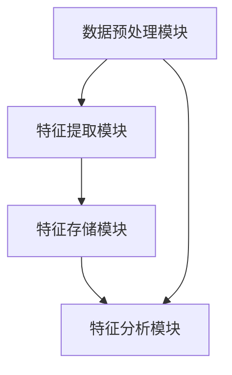

                 


# 《金融时间序列特征提取工具》

---

## 关键词：  
金融时间序列、特征提取、统计分析、机器学习、深度学习、LSTM、ARIMA

---

## 摘要：  
金融时间序列数据分析是金融领域的重要研究方向，其核心在于从复杂的时间序列数据中提取有用的特征信息，为后续的金融预测、风险评估和投资决策提供支持。本文从金融时间序列的基本概念出发，系统地介绍了特征提取的核心概念、经典算法及其在金融领域的应用。通过分析不同特征提取方法的特点，结合实际案例，深入探讨了如何选择和优化特征提取工具。本文还详细讲解了基于统计模型（如ARIMA）和机器学习模型（如LSTM）的特征提取方法，并通过代码实现和实际案例分析，帮助读者更好地理解和应用这些工具。最后，本文总结了金融时间序列特征提取的关键点，并给出了实际应用中的最佳实践建议。

---

## 第1章: 金融时间序列特征提取工具的背景与意义

### 1.1 金融时间序列的基本概念  
金融时间序列是指在金融市场上按照时间顺序记录的数据，例如股票价格、汇率、债券收益率等。这些数据通常具有以下特点：  
1. **时序性**：数据按时间顺序排列，反映了金融市场的动态变化。  
2. **连续性**：时间序列数据通常是连续的，但也可能包含缺失值。  
3. **波动性**：金融市场的不确定性导致数据波动较大。  
4. **周期性**：许多金融数据表现出明显的周期性，例如日周期、周周期、月周期等。  

### 1.2 金融时间序列分析的重要性  
金融时间序列分析是金融研究的核心内容之一，其主要目标是通过分析历史数据，发现潜在的规律和模式，为以下应用提供支持：  
1. **金融预测**：预测股票价格、汇率等未来走势。  
2. **风险评估**：评估金融资产的投资风险。  
3. **投资决策**：基于数据分析制定投资策略。  
4. **异常检测**：识别市场中的异常波动和潜在风险。  

### 1.3 特征提取在金融时间序列分析中的作用  
特征提取是金融时间序列分析的关键步骤，其目的是从原始数据中提取具有代表性的特征，以便后续的建模和分析。例如：  
1. **统计特征**：均值、标准差、偏度等，反映了数据的分布特征。  
2. **时间依赖特征**：自相关函数（ACF）、偏自相关函数（PACF），反映了数据的时序依赖性。  
3. **频域特征**：傅里叶变换（FFT）提取的频域特征，反映了数据的周期性。  

### 1.4 本书的核心目标与内容  
本书旨在系统地介绍金融时间序列特征提取的核心方法和技术，具体内容包括：  
1. 金融时间序列的基本概念和特征类型。  
2. 统计模型（如ARIMA）和机器学习模型（如LSTM）的特征提取方法。  
3. 实际案例分析，结合代码实现和结果解读。  
4. 特征提取工具的选择和优化建议。  

---

## 第2章: 金融时间序列特征提取的核心概念与联系

### 2.1 时间序列特征的类型与分析  
时间序列特征可以分为以下几类：  

#### 2.1.1 基本统计特征  
- **均值（Mean）**：数据的平均值，反映数据的中心趋势。  
- **标准差（Standard Deviation）**：数据的离散程度，反映数据的波动性。  
- **偏度（Skewness）**：数据分布的不对称性，反映数据的分布形态。  

#### 2.1.2 时间依赖特征  
- **自相关函数（ACF）**：衡量数据在不同时间 lag 上的相关性。  
- **偏自相关函数（PACF）**：去除中间变量影响后的自相关性。  

#### 2.1.3 频域特征  
- **傅里叶变换（FFT）**：将时间序列转换到频域，提取周期性特征。  
- **小波分析（Wavelet Analysis）**：用于多分辨率分析，提取局部特征。  

#### 2.1.4 高阶统计特征  
- **峰度（Kurtosis）**：数据分布的尖峰程度。  
- **最大值与最小值**：数据的极值特征。  

### 2.2 不同特征类型的特点对比  
以下是不同特征类型的特点对比：  

| 特征类型      | 描述                                      | 优点                          | 缺点                          |
|---------------|-----------------------------------------|-------------------------------|-------------------------------|
| 基本统计特征  | 反映数据的中心趋势和离散程度              | 计算简单，易于解释            | 无法捕捉时间依赖性            |
| 时间依赖特征  | 反映数据的时序相关性                      | 能捕捉时间序列的内在关系      | 计算复杂，对噪声敏感          |
| 频域特征      | 反映数据的周期性特征                      | 能提取周期性信息              | 对噪声敏感，计算复杂          |
| 高阶统计特征  | 反映数据的分布形态                        | 提供更丰富的特征信息          | 解释性较差                    |

### 2.3 时间序列特征提取的常用技术  
以下是几种常用的时间序列特征提取技术：  

#### 2.3.1 移动平均与指数平滑  
- **移动平均（Moving Average, MA）**：计算窗口内数据的平均值，用于平滑时间序列。  
- **指数平滑（Exponential Smoothing）**：基于指数衰减权重，对历史数据进行加权平均。  

#### 2.3.2 傅里叶变换与小波分析  
- **傅里叶变换（FFT）**：将时间序列转换到频域，提取周期性特征。  
- **小波分析（Wavelet Analysis）**：用于多分辨率分析，提取局部特征。  

#### 2.3.3 自相关与偏自相关函数  
- **自相关函数（ACF）**：衡量数据在不同时间 lag 上的相关性。  
- **偏自相关函数（PACF）**：去除中间变量影响后的自相关性。  

---

## 第3章: 金融时间序列特征提取的算法原理

### 3.1 自定义特征提取方法  
自定义特征提取方法是根据具体需求设计的特征提取方法，以下是一些常见的自定义特征提取方法：  

#### 3.1.1 均值、标准差、偏度等统计特征  
- **均值**：反映数据的中心趋势。  
- **标准差**：反映数据的波动性。  
- **偏度**：反映数据的分布形态。  

#### 3.1.2 自相关函数与偏自相关函数  
- **自相关函数（ACF）**：衡量数据在不同时间 lag 上的相关性。  
- **偏自相关函数（PACF）**：去除中间变量影响后的自相关性。  

#### 3.1.3 周期性与频率特征  
- **傅里叶变换（FFT）**：将时间序列转换到频域，提取周期性特征。  
- **小波分析（Wavelet Analysis）**：用于多分辨率分析，提取局部特征。  

### 3.2 基于统计模型的特征提取  
基于统计模型的特征提取方法主要包括 ARIMA 模型等。  

#### 3.2.1 ARIMA 模型的特征提取  
ARIMA（Auto-Regressive Integrated Moving Average）模型是一种常用的时间序列预测模型，其基本假设是时间序列数据可以通过自回归和移动平均的方式进行建模。  

##### 3.2.1.1 ARIMA 模型的数学公式  
ARIMA 模型的数学公式如下：  
$$
y_t = \phi_1 y_{t-1} + \phi_2 y_{t-2} + \dots + \phi_p y_{t-p} + \theta_1 \epsilon_{t-1} + \theta_2 \epsilon_{t-2} + \dots + \theta_q \epsilon_{t-q} + \epsilon_t
$$  
其中，$y_t$ 是观测值，$\phi_i$ 和 $\theta_j$ 是模型参数，$\epsilon_t$ 是白噪声。  

##### 3.2.1.2 ARIMA 模型的特征提取流程  
1. **数据预处理**：对时间序列数据进行差分处理，消除趋势和季节性。  
2. **模型参数估计**：通过极大似然估计法估计模型参数。  
3. **残差分析**：对模型的残差进行检验，确保残差符合白噪声假设。  

### 3.3 基于机器学习的特征提取  
基于机器学习的特征提取方法主要包括 LSTM（长短期记忆网络）和 CNN（卷积神经网络）等。  

#### 3.3.1 LSTM 在时间序列特征提取中的应用  
LSTM 是一种特殊的 RNN（循环神经网络），能够有效捕捉时间序列中的长期依赖关系。  

##### 3.3.1.1 LSTM 的数学公式  
LSTM 的核心在于其细胞状态（Cell State）和门控机制（Gate）。  
1. **输入门（Input Gate）**：控制当前时刻输入的信息：  
$$
i_t = \sigma(W_i x_t + U_i h_{t-1} + b_i)
$$  
2. **遗忘门（Forget Gate）**：决定遗忘哪些信息：  
$$
f_t = \sigma(W_f x_t + U_f h_{t-1} + b_f)
$$  
3. **细胞状态更新**：  
$$
c_t = f_t \cdot c_{t-1} + i_t \cdot \tanh(W_c x_t + U_c h_{t-1} + b_c)
$$  
4. **输出门（Output Gate）**：生成当前时刻的输出：  
$$
o_t = \sigma(W_o x_t + U_o h_{t-1} + b_o)
$$  
5. **隐藏层输出**：  
$$
h_t = o_t \cdot \tanh(c_t)
$$  

#### 3.3.2 CNN 在时间序列特征提取中的应用  
CNN 通过卷积操作提取局部特征，适用于时间序列的模式识别。  

##### 3.3.2.1 一维卷积层的数学公式  
一维卷积层的输出为：  
$$
y_t = \sum_{i=1}^k w_i x_{t-i} + b
$$  
其中，$k$ 是卷积核的大小，$w_i$ 是卷积核的权重，$b$ 是偏置项。  

---

## 第4章: 金融时间序列特征提取工具的系统分析与架构设计

### 4.1 项目背景与目标  
本项目旨在开发一个金融时间序列特征提取工具，支持多种特征提取方法，并能够对特征进行存储、管理和分析。  

### 4.2 系统功能设计  
系统的功能模块包括：  
1. **数据预处理模块**：支持数据清洗、差分、标准化等操作。  
2. **特征提取模块**：支持统计特征、时间依赖特征、频域特征等多种特征提取方法。  
3. **特征存储模块**：将提取的特征存储到数据库中，便于后续分析。  
4. **特征分析模块**：支持特征的可视化、统计分析和质量检验。  

### 4.3 系统架构设计  
以下是系统的架构设计图：  



---

## 第5章: 项目实战

### 5.1 环境安装与配置  
1. **安装 Python 和相关库**：  
   ```bash
   pip install numpy pandas scikit-learn keras tensorflow
   ```

2. **安装时间序列分析工具**：  
   ```bash
   pip install statsmodels
   ```

### 5.2 核心代码实现  
以下是一个基于 LSTM 的时间序列特征提取代码示例：  

```python
import numpy as np
from keras.models import Sequential
from keras.layers import LSTM, Dense, Dropout
from sklearn.preprocessing import MinMaxScaler

# 数据预处理
data = np.random.random((1000, 1))
scaler = MinMaxScaler()
data_scaled = scaler.fit_transform(data)

# 模型定义
model = Sequential()
model.add(LSTM(50, input_shape=(None, 1)))
model.add(Dropout(0.2))
model.add(Dense(1, activation='linear'))

# 模型编译
model.compile(loss='mean_squared_error', optimizer='adam')

# 模型训练
model.fit(data_scaled, epochs=10, batch_size=32)
```

### 5.3 代码实现与结果分析  
1. **数据预处理**：对原始数据进行标准化处理，确保模型输入的稳定性。  
2. **模型训练**：通过 LSTM 模型提取时间序列的特征信息。  
3. **特征分析**：对提取的特征进行可视化分析，验证特征的有效性。  

### 5.4 小结  
通过实际案例分析，我们可以看到 LSTM 在时间序列特征提取中的强大能力。然而，特征提取的效果还依赖于数据的质量和模型的参数设置。

---

## 第6章: 最佳实践、小结与注意事项

### 6.1 最佳实践 tips  
1. **数据预处理**：确保数据的完整性和准确性，避免噪声干扰。  
2. **特征选择**：根据具体需求选择合适的特征提取方法，避免过拟合。  
3. **模型调优**：通过网格搜索等方法优化模型参数，提高特征提取效果。  

### 6.2 小结  
本书系统地介绍了金融时间序列特征提取的核心方法和技术，结合实际案例分析了不同特征提取方法的特点和应用场景。通过代码实现和结果解读，帮助读者更好地理解和应用这些工具。  

### 6.3 注意事项  
1. **数据质量**：金融时间序列数据通常具有高度的波动性和不确定性，需要谨慎处理。  
2. **模型选择**：根据具体问题选择合适的模型，避免盲目追求复杂性。  
3. **结果验证**：通过交叉验证等方法验证特征提取结果的有效性。  

---

## 作者：AI天才研究院/AI Genius Institute & 禅与计算机程序设计艺术 /Zen And The Art of Computer Programming

