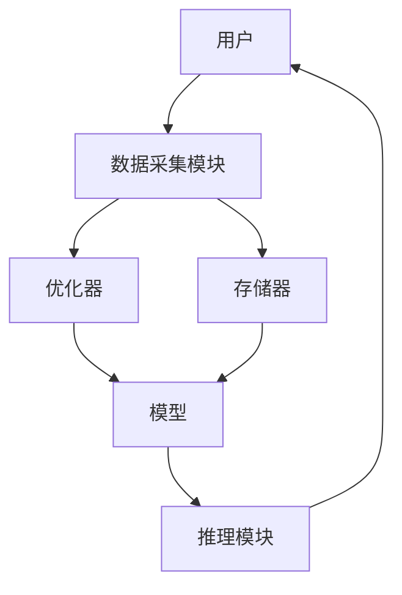
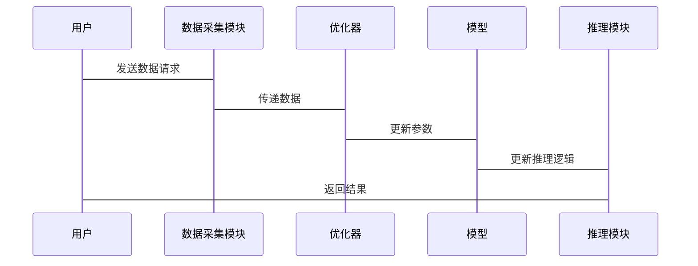

                 


# AI Agent 的持续学习：实现 LLM 的终身学习能力

---

## 关键词：AI Agent、持续学习、LLM、终身学习能力、模型优化、在线学习

---

## 摘要：  
本文深入探讨AI Agent的持续学习能力，重点分析如何实现大语言模型（LLM）的终身学习能力。通过结合在线学习、知识蒸馏和记忆增强等机制，本文详细阐述了LLM在持续学习中的算法原理、系统架构和实际应用。文章从理论到实践，逐步解析了AI Agent如何通过不断适应新数据和任务环境，实现真正的智能化和自主化学习能力。  

---

# 第一部分: AI Agent 的持续学习概述

## 第1章: AI Agent 的持续学习概述

### 1.1 AI Agent 的基本概念

#### 1.1.1 AI Agent 的定义  
AI Agent（人工智能代理）是指能够感知环境、自主决策并执行任务的智能实体。它可以是一个软件程序、机器人或其他智能系统，具备以下核心特征：  
- **自主性**：能够在没有外部干预的情况下独立运行。  
- **反应性**：能够实时感知环境并做出响应。  
- **目标导向**：通过优化目标函数来实现特定任务。  

#### 1.1.2 AI Agent 的核心特征  
AI Agent的核心特征包括：  
1. **环境感知**：通过传感器或数据输入接口获取环境信息。  
2. **决策能力**：基于感知信息，通过算法生成决策或行动。  
3. **学习能力**：通过与环境的交互，不断优化自身的知识库和行为策略。  

#### 1.1.3 AI Agent 的应用场景  
AI Agent广泛应用于以下领域：  
- **智能助手**：如 Siri、Alexa 等。  
- **机器人控制**：用于工业机器人或服务机器人。  
- **自动驾驶**：如 Tesla 的自动驾驶系统。  
- **游戏AI**：在电子游戏中实现智能对手或队友。  

---

### 1.2 持续学习的定义与特点

#### 1.2.1 持续学习的定义  
持续学习（Continuous Learning）是指模型在不断变化的环境中，通过在线学习或增量学习的方式，逐步优化自身性能的过程。与传统的批量学习不同，持续学习的特点在于：  

#### 1.2.2 持续学习的核心特点  
1. **在线性**：数据是逐步到达的，模型需要实时更新。  
2. **适应性**：能够适应新数据和新任务的变化。  
3. **累积性**：模型的知识和能力随着时间推移不断累积。  

#### 1.2.3 持续学习与传统学习的区别  
| 特性       | 传统学习             | 持续学习             |  
|------------|----------------------|----------------------|  
| 数据输入方式 | 批量输入              | 在线输入              |  
| 模型更新频率 | 一次性或周期性更新     | 实时更新              |  
| 适应性      | 较低                 | 较高                 |  

---

### 1.3 LLM 的终身学习能力

#### 1.3.1 LLM 的定义与特点  
大语言模型（LLM）是指基于大规模数据训练的大型语言模型，如 GPT-3、GPT-4 等。其特点包括：  
1. **大规模参数**：通常包含数亿甚至数十亿的参数。  
2. **上下文理解**：能够理解上下文并生成连贯的文本。  
3. **多任务能力**：可以通过调整提示（prompt）完成多种任务。  

#### 1.3.2 LLM 的持续学习能力  
LLM 的持续学习能力体现在以下方面：  
1. **在线微调**：通过增量数据不断优化模型参数。  
2. **知识蒸馏**：通过教师-学生框架传递知识。  
3. **记忆增强**：通过外部存储器记录长期信息。  

#### 1.3.3 LLM 终身学习能力的应用场景  
1. **智能客服**：通过持续学习提升对话理解和生成能力。  
2. **内容生成**：实时生成动态更新的文本内容。  
3. **个性化推荐**：根据用户行为实时优化推荐策略。  

---

### 1.4 本章小结  
本章介绍了AI Agent的基本概念、持续学习的核心特点，以及LLM的终身学习能力。通过对比传统学习与持续学习的差异，我们理解了持续学习在AI Agent中的重要性，为后续章节的深入分析奠定了基础。

---

# 第二部分: 持续学习的核心机制

## 第2章: 持续学习的机制与原理

### 2.1 在线学习机制

#### 2.1.1 在线学习的基本原理  
在线学习的核心思想是通过实时更新模型参数，逐步逼近目标函数的最优解。其基本流程包括：  
1. **数据输入**：模型接收单样本或小批量数据。  
2. **模型更新**：通过优化算法（如SGD、Adam）更新参数。  
3. **结果输出**：模型基于更新后的参数生成输出。  

#### 2.1.2 在线学习的核心算法  
在线学习的典型算法包括：  
- **随机梯度下降（SGD）**：适用于实时更新场景。  
- **Adam 优化器**：结合动量和自适应学习率的优化算法。  

#### 2.1.3 在线学习的优缺点  
| 优点       | 缺点       |  
|------------|------------|  
| 实时性强    | �易受噪声干扰  |  
| 资源消耗低  | 需要良好的数据流控制 |  

---

### 2.2 知识蒸馏机制

#### 2.2.1 知识蒸馏的定义  
知识蒸馏（Knowledge Distillation）是一种通过教师模型指导学生模型学习的技术。教师模型通常是一个预训练的大模型，而学生模型是一个较小的模型。  

#### 2.2.2 知识蒸馏的核心算法  
知识蒸馏的核心公式为：  
$$ \mathcal{L} = \alpha \cdot \mathcal{L}_{\text{CE}} + (1-\alpha) \cdot \mathcal{L}_{\text{KL}} $$  
其中，$\mathcal{L}_{\text{CE}}$ 是交叉熵损失，$\mathcal{L}_{\text{KL}}$ 是KL散度损失，$\alpha$ 是平衡系数。  

#### 2.2.3 知识蒸馏的优缺点  
| 优点       | 缺点       |  
|------------|------------|  
| 知识传递效率高 | 学生模型性能受限于教师模型的质量 |  
| 资源消耗低  | 需要额外的教师模型训练成本 |  

---

### 2.3 回忆增强机制

#### 2.3.1 回忆增强的基本原理  
回忆增强（Memory Augmented）通过引入外部存储器，帮助模型记忆长期信息。常见的实现方式包括：  
- **外存-内存网络（Recurrent Memory Network）**：通过可寻址的存储器实现记忆功能。  
- **图结构记忆网络**：利用图结构表示复杂的记忆关系。  

#### 2.3.2 回忆增强的核心算法  
回忆增强的典型算法包括：  
- **Delta Memory**：通过差分更新存储器内容。  
- **Episodic Memory**：基于事件或任务的记忆机制。  

#### 2.3.3 回忆增强的优缺点  
| 优点       | 缺点       |  
|------------|------------|  
| 长期记忆能力强 | 记忆存储和检索效率较低 |  
| 对任务迁移能力强 | 需要额外的存储和计算资源 |  

---

### 2.4 本章小结  
本章详细介绍了持续学习的三种核心机制：在线学习、知识蒸馏和回忆增强。通过对比分析，我们理解了每种机制的优缺点及其适用场景，为后续的算法设计奠定了基础。

---

# 第三部分: 持续学习的算法原理

## 第3章: 持续学习算法的数学模型

### 3.1 Meta-Learning 算法

#### 3.1.1 Meta-Learning 的定义  
Meta-Learning 是一种通过在多个任务上学习，提升模型对新任务的适应能力的技术。其核心思想是：模型通过学习任务之间的关系，快速适应新任务。  

#### 3.1.2 Meta-Learning 的数学模型  
Meta-Learning 的损失函数通常包括两个部分：  
$$ \mathcal{L} = \mathcal{L}_{\text{meta}} + \lambda \mathcal{L}_{\text{task}} $$  
其中，$\mathcal{L}_{\text{meta}}$ 是元损失，$\mathcal{L}_{\text{task}}$ 是任务损失，$\lambda$ 是超参数。  

#### 3.1.3 Meta-Learning 的优缺点  
| 优点       | 缺点       |  
|------------|------------|  
| 适应性强    | 训练复杂度高 |  
| 适用于零样本学习 | 需要大量元任务数据 |  

---

### 3.2 Recurrent Inference Networks 算法

#### 3.2.1 Recurrent Inference Networks 的定义  
Recurrent Inference Networks 是一种通过递归推理更新模型参数的技术。其核心思想是：通过循环推理逐步优化模型输出。  

#### 3.2.2 Recurrent Inference Networks 的数学模型  
Recurrent Inference Networks 的递推公式为：  
$$ x_{t+1} = f(x_t, y_t) $$  
其中，$x_t$ 表示第 $t$ 步的输入，$y_t$ 表示第 $t$ 步的输出，$f$ 是递归函数。  

#### 3.2.3 Recurrent Inference Networks 的优缺点  
| 优点       | 缺点       |  
|------------|------------|  
| 推理能力强    | 计算复杂度高 |  
| 适用于动态环境 | 需要设计复杂的递归函数 |  

---

### 3.3 本章小结  
本章详细解析了Meta-Learning和Recurrent Inference Networks的数学模型及其优缺点。通过公式推导和实例分析，我们理解了这些算法在持续学习中的具体应用。

---

# 第四部分: 系统分析与架构设计

## 第4章: 持续学习的系统架构设计

### 4.1 应用场景分析

#### 4.1.1 持续学习的应用场景  
持续学习在以下场景中具有重要应用：  
- **在线推荐系统**：实时更新用户偏好。  
- **智能对话系统**：动态优化对话策略。  
- **实时数据分析**：快速响应数据变化。  

---

### 4.2 系统功能设计

#### 4.2.1 系统功能模块  
持续学习系统的功能模块包括：  
1. **数据采集模块**：实时收集新数据。  
2. **模型更新模块**：基于新数据更新模型参数。  
3. **知识存储模块**：存储长期记忆和经验。  
4. **推理模块**：基于更新后的模型进行推理和决策。  

#### 4.2.2 系统功能的ER实体关系图  
```mermaid
erDiagram
    actor 用户
    actor 环境
    actor 优化器
    actor 存储器
    actor 推理模块
    用户 --> 数据采集模块
    环境 --> 数据采集模块
    数据采集模块 --> 优化器
    优化器 --> 模型
    模型 --> 推理模块
    推理模块 --> 用户
    数据采集模块 --> 存储器
    存储器 --> 模型
```

---

### 4.3 系统架构设计

#### 4.3.1 系统架构图  


---

### 4.4 系统接口设计

#### 4.4.1 接口描述  
1. **数据采集接口**：接收实时数据流。  
2. **模型更新接口**：更新模型参数。  
3. **推理接口**：生成输出结果。  

#### 4.4.2 接口的交互流程  


---

### 4.5 本章小结  
本章通过应用场景分析、系统功能设计和架构图展示，详细阐述了持续学习系统的整体架构和各模块之间的关系。通过接口设计和交互流程图，我们理解了系统的具体实现方式。

---

# 第五部分: 项目实战

## 第5章: 持续学习的项目实现

### 5.1 环境安装

#### 5.1.1 安装依赖  
```bash
pip install numpy
pip install matplotlib
pip install scikit-learn
```

---

### 5.2 核心代码实现

#### 5.2.1 在线学习代码示例  
```python
import numpy as np

def online_learning(X, y, model, optimizer):
    for x, y_true in zip(X, y):
        y_pred = model.predict(x)
        loss = np.mean((y_true - y_pred) ** 2)
        optimizer.update(model.parameters, loss)
```

#### 5.2.2 知识蒸馏代码示例  
```python
def knowledge_distillation(teacher, student, X, y):
    y_teacher = teacher.predict(X)
    y_student = student.predict(X)
    loss = np.mean((y_teacher - y_student) ** 2)
    student.update(loss)
```

---

### 5.3 案例分析与解读

#### 5.3.1 在线推荐系统案例  
**案例背景**：实时推荐用户可能感兴趣的内容。  
**实现步骤**：  
1. 数据采集：实时收集用户行为数据。  
2. 模型更新：基于新数据更新推荐模型。  
3. 推荐结果：生成个性化推荐列表。  

---

### 5.4 本章小结  
本章通过具体的代码实现和案例分析，展示了持续学习技术在实际项目中的应用。通过环境安装和代码实现，我们理解了如何将理论应用于实践。

---

# 第六部分: 总结与展望

## 第6章: 总结与展望

### 6.1 最佳实践 Tips

#### 6.1.1 数据质量的重要性  
持续学习的效果高度依赖于数据质量，建议在实际应用中采用数据清洗和特征工程技术。  

#### 6.1.2 模型选择的注意事项  
根据具体任务需求选择合适的模型和优化算法，避免过度优化。  

#### 6.1.3 系统设计的注意事项  
在系统设计中，需重点关注数据流的实时性和系统的可扩展性。  

---

### 6.2 小结

#### 6.2.1 本章内容回顾  
本文从理论到实践，详细探讨了AI Agent的持续学习能力，重点分析了LLM的终身学习能力及其实现机制。  

#### 6.2.2 未来展望  
未来，随着AI技术的不断发展，持续学习将在更多领域得到应用，如实时决策、动态环境下的自适应系统等。  

---

### 6.3 注意事项

#### 6.3.1 模型的泛化能力  
持续学习模型的泛化能力可能受到任务多样性和数据稀疏性的限制。  

#### 6.3.2 计算资源的需求  
持续学习需要实时更新模型，对计算资源的需求较高。  

---

### 6.4 拓展阅读

#### 6.4.1 推荐书籍  
1. 《Deep Learning》（Ian Goodfellow 等著）  
2. 《Neural Networks and Deep Learning》（ Yoshua Bengio 著）  

#### 6.4.2 推荐论文  
1. "A Survey on Continual Learning"（ArXiv 2020）  
2. "Progress and Compress: A New Perspective on Neural Network Training"（ICML 2021）  

---

## 作者：AI天才研究院 & 禅与计算机程序设计艺术

