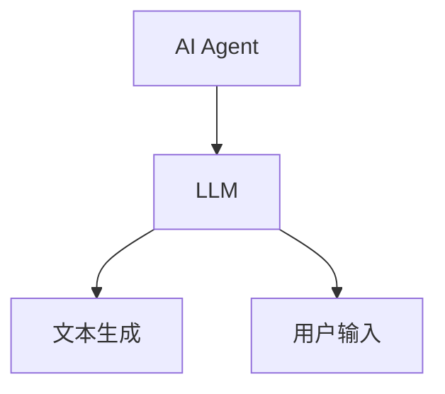
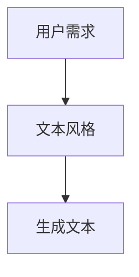
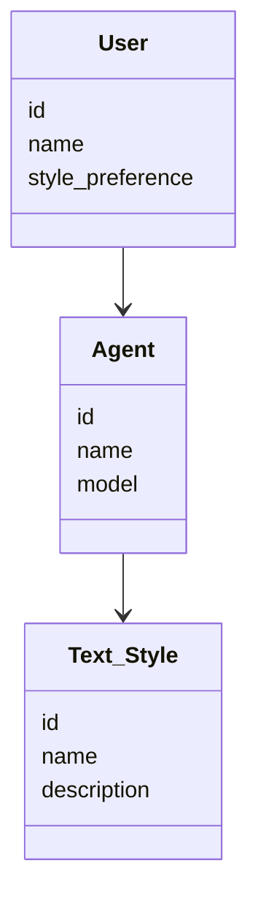
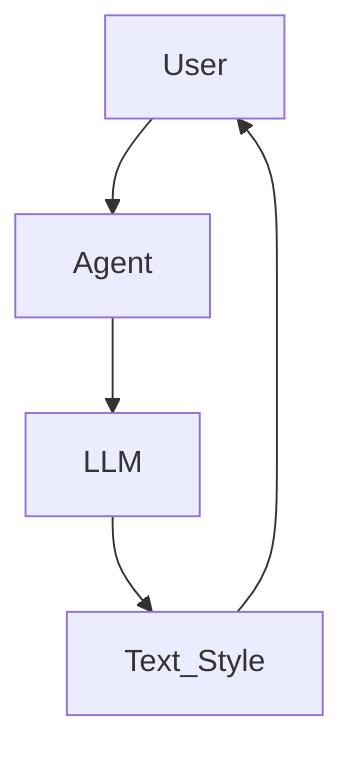
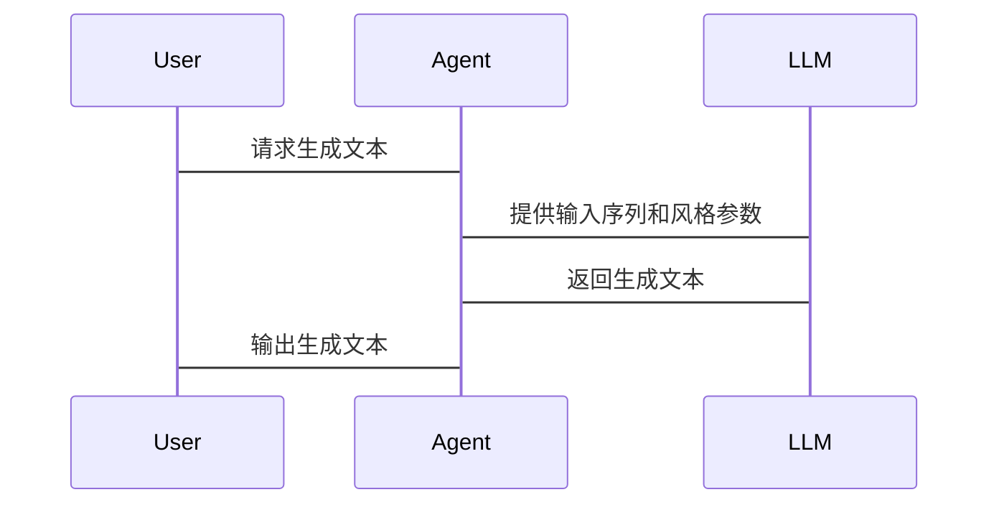

                 


```markdown
# LLM在AI Agent中的文本风格个性化定制

> 关键词：LLM，AI Agent，文本风格，个性化定制，自然语言处理，人工智能

> 摘要：本文探讨了如何在AI Agent中利用大语言模型（LLM）实现文本风格的个性化定制，分析了当前技术的挑战与解决方案，并通过实际案例展示了如何通过算法优化和系统设计实现多样化的文本风格生成。文章从背景介绍、核心概念、算法原理、系统设计、项目实战等多方面展开，为读者提供全面的技术指导。

---

# 第一部分: LLM在AI Agent中的文本风格个性化定制背景介绍

# 第1章: 问题背景与核心概念

## 1.1 问题背景
### 1.1.1 当前AI Agent的发展现状
随着人工智能技术的飞速发展，AI Agent（智能助手）已成为我们生活中不可或缺的一部分。从Siri到ChatGPT，AI Agent通过自然语言处理技术，帮助用户完成信息查询、任务执行等多样化的需求。然而，现有的AI Agent在文本交互上仍存在一些问题，尤其是在文本风格的个性化定制方面。

### 1.1.2 LLM在AI Agent中的应用痛点
大语言模型（LLM）的引入为AI Agent带来了强大的文本生成和理解能力，但同时也带来了新的挑战。例如，如何根据用户的个性化需求生成符合其风格的文本，如何在不同场景下灵活调整文本风格，以及如何在保证生成质量的同时实现高效的个性化定制。

### 1.1.3 文本风格个性化的重要性
文本风格个性化是提升AI Agent用户体验的关键因素。通过个性化定制，AI Agent能够更好地理解用户的需求，生成更符合用户习惯和喜好的文本，从而提高交互的效率和满意度。

## 1.2 问题描述
### 1.2.1 LLM在AI Agent中的核心问题
在实际应用中，LLM在AI Agent中的使用存在以下问题：
- 如何在不同场景下实现文本风格的多样化？
- 如何根据用户反馈动态调整文本风格？
- 如何在保证生成质量的同时提高个性化定制的效率？

### 1.2.2 文本风格个性化的需求分析
文本风格个性化的需求主要体现在以下几个方面：
- 用户对不同场景下的文本风格有不同的偏好，例如正式场合需要正式语言，休闲场合需要轻松语言。
- 用户可能希望AI Agent能够根据其历史行为和偏好生成特定风格的文本。
- 在某些特定领域（如法律、医学等），文本风格需要符合行业规范和要求。

### 1.2.3 当前技术的局限性与挑战
当前的技术在实现文本风格个性化定制方面面临以下挑战：
- LLM的训练数据通常不具备足够的多样性，导致生成的文本风格较为单一。
- 文本风格的生成需要结合上下文信息，而现有模型在处理复杂上下文关系时仍存在一定的局限性。
- 如何在保证生成质量的前提下，高效地实现个性化定制，是一个亟待解决的问题。

## 1.3 问题解决与边界
### 1.3.1 解决方案的提出
为了解决上述问题，本文提出以下解决方案：
- 利用LLM的强大生成能力，结合用户反馈和上下文信息，实现文本风格的动态调整。
- 通过引入风格切换机制，使AI Agent能够在不同场景下灵活切换文本风格。
- 建立风格库，将常见的文本风格进行分类，便于快速匹配和生成。

### 1.3.2 技术实现的边界与外延
在实现文本风格个性化定制时，需要明确技术实现的边界：
- 仅关注文本生成部分，不涉及其他AI Agent功能（如任务执行、信息检索等）。
- 生成的文本风格需要符合语法规则和逻辑性，避免无效输出。
- 个性化定制仅限于文本风格层面，不涉及其他形式（如语音、图像等）。

### 1.3.3 核心概念的结构化分析
为了更好地理解问题，我们需要对核心概念进行结构化分析，如下表所示：

| 核心概念 | 定义 | 属性 | 示例 |
|----------|------|------|------|
| LLM     | 大语言模型 | 参数量大、训练数据多、生成能力强 | GPT-3、BERT等 |
| AI Agent | 智能助手 | 能够理解用户意图、执行任务、生成文本 | Siri、Alexa、ChatGPT |

## 1.4 核心概念与联系
### 1.4.1 LLM与AI Agent的关系
通过下图可以看出，LLM作为AI Agent的核心模块，负责处理文本生成、理解等任务，而AI Agent则通过LLM的能力为用户提供服务。



### 1.4.2 文本风格与用户需求的关联
文本风格与用户需求密切相关。下图展示了用户需求与文本风格之间的映射关系。



### 1.4.3 核心概念的ER实体关系图
下图展示了核心概念的ER实体关系图。

```mermaid
erd
    user {
        id
        name
        style_preference
    }
    agent {
        id
        name
        model
    }
    text_style {
        id
        name
        description
    }
    user --> style_preference
    agent --> text_style
    user --> agent
```

---

# 第二部分: 核心概念与原理

# 第2章: LLM与AI Agent的核心原理

## 2.1 LLM的基本原理
### 2.1.1 大语言模型的训练机制
大语言模型通常采用Transformer架构，通过自注意力机制捕捉文本中的长距离依赖关系，从而实现对上下文的理解。

### 2.1.2 模型的编码与解码过程
LLM的编码过程包括输入文本的向量化和位置编码，解码过程则通过自回归生成模型逐词生成文本。

### 2.1.3 模型的上下文理解能力
LLM通过上下文理解生成连贯的文本，同时能够捕捉文本中的情感、意图等信息。

## 2.2 AI Agent的基本原理
### 2.2.1 AI Agent的定义与分类
AI Agent是一种能够感知环境、理解用户意图并执行任务的智能体，根据应用场景可分为通用型和专业型两类。

### 2.2.2 Agent的感知与决策机制
AI Agent通过感知用户输入和环境信息，结合内部知识库和推理能力，做出决策并生成相应的文本输出。

### 2.2.3 Agent与人类用户的交互模式
AI Agent与用户的交互模式主要包括问答式、命令式和对话式三种，其中对话式最为复杂，需要实时理解和生成自然语言。

## 2.3 LLM在AI Agent中的应用原理
### 2.3.1 LLM作为知识库的使用
LLM可以作为AI Agent的知识库，通过文本生成和理解能力，帮助Agent完成信息检索和知识问答。

### 2.3.2 LLM作为生成器的使用
LLM作为生成器，负责根据用户需求生成符合特定风格的文本，如对话回复、邮件撰写等。

### 2.3.3 LLM作为推理器的使用
LLM还可以作为推理器，通过上下文理解能力和逻辑推理，帮助Agent完成复杂的任务，如问题解答、决策支持等。

---

# 第3章: 文本风格个性化的核心原理

## 3.1 文本风格的定义与分类
### 3.1.1 文本风格的定义
文本风格是指文本在语言表达上的独特特征，包括词汇选择、句式结构、情感倾向等方面。

### 3.1.2 文本风格的分类
文本风格可以分为正式、非正式、幽默、严肃、简洁、详细等多种类型，具体分类可以根据实际应用场景进行调整。

### 3.1.3 不同风格的特点与应用场景
- **正式风格**：适用于商务沟通、法律文件等场合。
- **非正式风格**：适用于日常交流、朋友聊天等场合。
- **幽默风格**：适用于轻松愉快的场景，如社交媒体、娱乐信息等。
- **严肃风格**：适用于新闻报道、学术论文等场合。

## 3.2 文本风格个性化的需求分析
### 3.2.1 用户需求的多样性
不同用户对文本风格的需求存在显著差异，有些用户偏好简洁明了的表达，而有些用户则喜欢详细且具体的描述。

### 3.2.2 不同场景下的风格要求
在不同的应用场景下，文本风格的要求也有所不同。例如，在客服系统中，文本风格需要保持礼貌和专业；在社交媒体上，则需要更具亲和力和个性化。

### 3.2.3 个性化风格的实现目标
个性化风格的实现目标包括：
- 提高用户满意度和交互体验。
- 提升AI Agent的智能化水平。
- 扩大AI Agent的应用场景和用户群体。

## 3.3 文本风格个性化的核心算法
### 3.3.1 基于LLM的文本风格生成算法
通过调整LLM的生成参数，可以实现不同风格的文本生成。例如，通过控制温度（temperature）和重复率（repetition penalty）等参数，可以生成多样化风格的文本。

### 3.3.2 基于规则的文本风格定制算法
基于规则的算法通过预定义的风格规则，对生成的文本进行后处理，确保文本符合特定的风格要求。

### 3.3.3 基于反馈的风格优化算法
通过用户反馈不断优化生成模型，使其能够更好地适应用户的风格偏好。

---

# 第三部分: 算法原理与实现

# 第4章: 基于LLM的文本风格生成算法

## 4.1 算法概述
基于LLM的文本风格生成算法通过调整模型的生成参数，实现不同风格的文本生成。其核心思想是通过参数调节，引导模型生成符合特定风格的文本。

## 4.2 算法实现步骤
1. **模型加载**：加载预训练的LLM模型，如GPT-3、BERT等。
2. **参数调整**：根据目标风格，调整模型的生成参数，如温度（temperature）、重复率（repetition penalty）等。
3. **文本生成**：输入种子文本，生成符合目标风格的文本。
4. **风格评估**：通过预定义的风格评估指标，评估生成文本的风格匹配程度。
5. **风格优化**：根据评估结果，进一步优化生成参数，提升风格匹配度。

## 4.3 算法实现的数学模型
文本生成的数学模型如下所示：

$$ P(w_{n}|w_{1}, w_{2}, ..., w_{n-1}) = \text{softmax}(W w_{n} + b) $$

其中，$w_{n}$ 表示第n个词的词向量，$W$ 和 $b$ 是模型参数。

## 4.4 算法实现的Python代码
```python
import torch
import torch.nn as nn

class LLMGenerator:
    def __init__(self, vocab_size):
        self.model = nn.Linear(vocab_size, vocab_size)
    
    def generate(self, input_sequence, temperature=1.0, repetition_penalty=1.0):
        output = []
        for i in range(len(input_sequence)):
            logits = self.model(input_sequence[i])
            logits /= temperature
            # 计算惩罚项
            penalty = repetition_penalty * (1 - torch.mean(torch.abs(input_sequence[i] - input_sequence[:i].mean())))
            logits -= penalty
            # 生成下一个词
            next_word = torch.argmax(logits)
            output.append(next_word)
        return output
```

---

# 第5章: 基于反馈的风格优化算法

## 5.1 算法概述
基于反馈的风格优化算法通过用户反馈不断优化生成模型，使其能够更好地适应用户的风格偏好。

## 5.2 算法实现步骤
1. **用户反馈收集**：通过用户对生成文本的评分或选择，收集用户的偏好信息。
2. **风格评估指标定义**：定义评估风格匹配程度的指标，如相似度、相关性等。
3. **模型优化**：根据用户反馈和评估结果，优化生成模型的参数，提升风格匹配度。

## 5.3 算法实现的数学模型
风格优化的数学模型如下所示：

$$ \text{loss} = \lambda_1 L_{\text{CE}} + \lambda_2 L_{\text{style}} $$

其中，$L_{\text{CE}}$ 是交叉熵损失，$L_{\text{style}}$ 是风格损失，$\lambda_1$ 和 $\lambda_2$ 是权重系数。

## 5.4 算法实现的Python代码
```python
import torch
import torch.nn as nn

class StyleOptimizer:
    def __init__(self, generator, style_criterion):
        self.generator = generator
        self.style_criterion = style_criterion
    
    def optimize(self, input_sequence, target_style, num_steps=100):
        for _ in range(num_steps):
            # 生成文本
            generated = self.generator.generate(input_sequence)
            # 计算风格损失
            style_loss = self.style_criterion(generated, target_style)
            # 反向传播并优化
            self.generator.optimizer.zero_grad()
            total_loss = style_loss
            total_loss.backward()
            self.generator.optimizer.step()
        return generated
```

---

# 第四部分: 系统分析与架构设计

# 第6章: 系统分析与架构设计

## 6.1 问题场景介绍
在本节中，我们将分析一个具体的场景：用户希望AI Agent能够根据不同的对话对象和场合，生成符合特定风格的文本。

## 6.2 系统功能设计
### 6.2.1 领域模型设计
下图展示了系统的领域模型。



### 6.2.2 系统架构设计
下图展示了系统的整体架构。



### 6.2.3 接口设计
系统主要接口包括：
- `generate_style(input_sequence, style_id)`：根据输入序列和风格ID生成文本。
- `update_stylePreference(user_id, style_id)`：更新用户的风格偏好。
- `evaluate_style(generated_text, style_id)`：评估生成文本的风格匹配程度。

### 6.2.4 交互流程图
下图展示了用户与AI Agent的交互流程。



---

# 第五部分: 项目实战

# 第7章: 项目实战

## 7.1 环境安装
为了实现文本风格个性化定制，需要安装以下环境：
- Python 3.8+
- PyTorch 1.9+
- Hugging Face Transformers库

安装命令如下：
```bash
pip install torch transformers
```

## 7.2 系统核心实现

### 7.2.1 核心代码实现
```python
from transformers import GPT2LMHeadModel, GPT2Tokenizer
import torch

class StyleCustomizedAgent:
    def __init__(self, model_name='gpt2'):
        self.tokenizer = GPT2Tokenizer.from_pretrained(model_name)
        self.model = GPT2LMHeadModel.from_pretrained(model_name)
    
    def generate(self, input_text, temperature=1.0, repetition_penalty=1.0):
        inputs = self.tokenizer.encode(input_text, return_tensors='pt')
        outputs = self.model.generate(
            inputs,
            temperature=temperature,
            repetition_penalty=repetition_penalty
        )
        return self.tokenizer.decode(outputs[0])
```

### 7.2.2 代码解读
上述代码实现了基于GPT-2模型的文本生成功能，通过调整温度和重复率参数，可以生成不同风格的文本。

### 7.2.3 实际案例分析
以下是一个实际案例：

```python
agent = StyleCustomizedAgent()
input_text = "今天天气很好，"
# 正式风格
response1 = agent.generate(input_text, temperature=0.7, repetition_penalty=1.2)
print(response1)  # 正式风格的回复
# 轻松风格
response2 = agent.generate(input_text, temperature=1.2, repetition_penalty=1.5)
print(response2)  # 轻松风格的回复
```

## 7.3 项目小结
通过上述实现，我们可以看到，基于LLM的文本风格个性化定制是完全可行的。通过调整生成参数和引入风格评估机制，可以显著提升生成文本的风格多样性。

---

# 第六部分: 最佳实践与总结

# 第8章: 最佳实践与总结

## 8.1 最佳实践
### 8.1.1 参数调整
通过实验确定最优的生成参数组合，以达到最佳的风格匹配效果。
### 8.1.2 风格评估
建立科学的风格评估指标，确保生成文本的风格符合用户需求。
### 8.1.3 模型优化
定期更新模型参数，引入新的风格样本，保持模型的生成能力。

## 8.2 小结
本文详细探讨了LLM在AI Agent中的文本风格个性化定制问题，分析了当前技术的挑战与解决方案，并通过实际案例展示了如何通过算法优化和系统设计实现多样化的文本风格生成。

## 8.3 注意事项
在实际应用中，需要注意以下几点：
- 确保生成文本的语义正确性和逻辑性。
- 避免生成敏感或不当内容。
- 定期收集用户反馈，优化生成模型。

## 8.4 拓展阅读
- 建议读者进一步阅读相关领域的最新论文和文献，了解更先进的技术和方法。
- 参与开源社区，了解最新的模型和工具。

---

# 结语

通过本文的学习，读者可以深入了解LLM在AI Agent中的文本风格个性化定制的技术细节，并通过实际案例掌握如何在实际应用中实现这一目标。希望本文能够为相关领域的研究和实践提供有价值的参考。

---

# 作者

作者：AI天才研究院/AI Genius Institute & 禅与计算机程序设计艺术/Zen And The Art of Computer Programming
```

