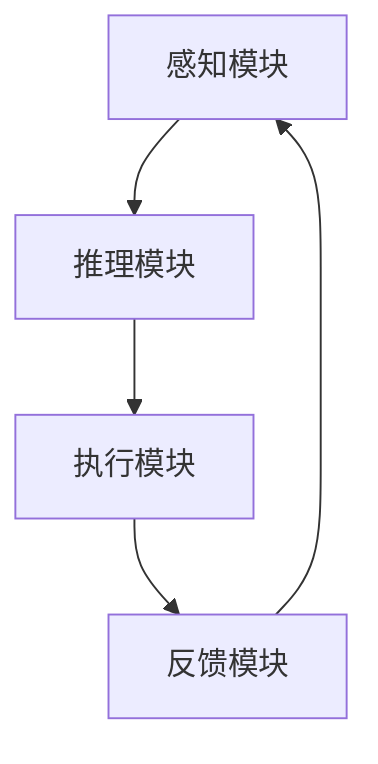
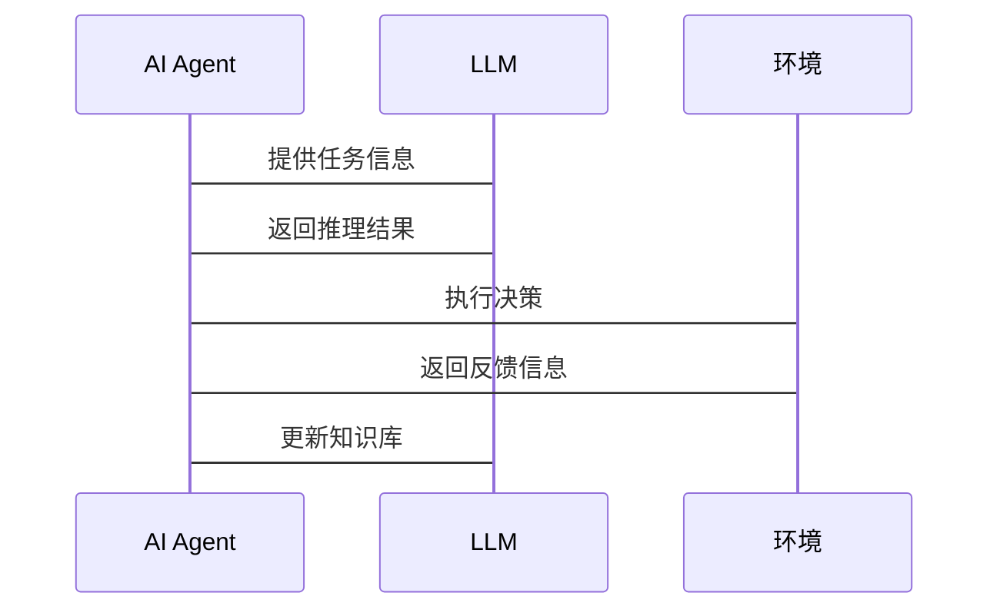

                 


# LLM在AI Agent抽象思维能力上的应用

## 关键词：LLM, AI Agent, 抽象思维能力, 自然语言处理, 人工智能, 思维模型, 知识图谱

## 摘要：大语言模型（LLM）在AI Agent的抽象思维能力上具有巨大潜力，通过深度理解与推理能力，LLM能够显著提升AI Agent的决策和问题解决能力。本文将详细探讨LLM在AI Agent中的应用，从背景、核心概念、算法原理、系统架构到项目实战，全面解析其在抽象思维能力上的实现与优化。

---

## 第一部分: LLM与AI Agent的背景介绍

### 第1章: LLM的基本概念

#### 1.1.1 大语言模型的定义
大语言模型（Large Language Model, LLM）是指基于深度学习训练的大型神经网络模型，能够理解和生成人类语言。LLM通过大量数据训练，能够捕捉语言的模式和语义信息，从而实现自然语言处理任务，如文本生成、翻译、问答等。

#### 1.1.2 LLM的核心特点
- **大规模数据训练**：通常使用数百万或数十亿的参数进行训练，能够处理复杂的语言模式。
- **上下文理解**：能够通过上下文理解语义，生成连贯的文本。
- **多任务能力**：通过微调或提示工程技术，LLM可以适应多种任务和领域。

#### 1.1.3 LLM与传统NLP模型的区别
传统NLP模型通常针对特定任务训练，参数量较小，且缺乏上下文理解能力。而LLM通过巨大的参数规模和复杂的架构设计，能够处理更广泛的任务和复杂的语义理解。

### 第2章: AI Agent的基本概念

#### 2.1 AI Agent的定义
AI Agent（人工智能代理）是指能够感知环境、自主决策并执行任务的智能体。AI Agent可以通过传感器获取信息，通过推理和规划做出决策，并通过执行器与环境交互。

#### 2.2 AI Agent的核心功能
- **感知**：通过传感器获取环境信息。
- **推理**：基于感知信息进行逻辑推理和知识推理。
- **决策**：基于推理结果做出决策。
- **执行**：通过执行器执行决策结果。

#### 2.3 AI Agent的应用场景
AI Agent广泛应用于自动驾驶、智能助手、机器人控制、游戏AI等领域。在这些场景中，AI Agent需要具备感知环境、理解任务目标、制定策略并执行任务的能力。

### 第3章: LLM与AI Agent的结合背景

#### 3.1 抽象思维能力的重要性
抽象思维能力是指从具体信息中提取本质特征，形成概念和规则的能力。在AI Agent中，抽象思维能力是实现高级推理和决策的基础。

#### 3.2 LLM在AI Agent中的作用
LLM通过强大的语言理解和生成能力，能够帮助AI Agent提取任务中的关键信息，形成抽象的概念和规则，从而提升AI Agent的推理和决策能力。

#### 3.3 LLM与AI Agent结合的潜力
通过结合LLM的自然语言处理能力和AI Agent的自主决策能力，可以实现更加智能化和个性化的AI系统，广泛应用于智能助手、智能客服、自动驾驶等领域。

---

## 第二部分: 抽象思维能力的定义与实现

### 第4章: 抽象思维能力的定义

#### 4.1 抽象思维的定义
抽象思维是指从具体事物中提取本质特征，形成一般概念和规则的能力。在AI Agent中，抽象思维能力是通过理解和处理语言信息、提取语义特征来实现的。

#### 4.2 抽象思维的关键特征
- **概念提取**：从具体信息中提取一般性概念。
- **规则推理**：基于概念和规则进行逻辑推理。
- **语义理解**：理解语言中的语义信息。

#### 4.3 抽象思维与具体思维的区别
具体思维关注具体细节和实例，而抽象思维关注事物的本质特征和一般规律。在AI Agent中，抽象思维能力是实现高级决策和推理的基础。

### 第5章: LLM在抽象思维中的应用

#### 5.1 LLM如何支持抽象思维
- **语义理解**：LLM能够理解语言中的语义信息，提取抽象概念。
- **知识推理**：LLM通过知识图谱和推理规则，能够进行逻辑推理。
- **生成能力**：LLM能够生成符合抽象概念的文本。

#### 5.2 抽象思维能力的衡量标准
- **概念提取能力**：能够从具体信息中提取关键概念。
- **推理能力**：能够基于概念和规则进行逻辑推理。
- **生成能力**：能够生成符合抽象概念的文本。

#### 5.3 LLM在抽象思维中的优势
- **强大的语义理解能力**：LLM能够理解复杂的语言信息。
- **大规模知识库**：LLM通过大规模数据训练，具备广泛的知识覆盖。
- **动态推理能力**：LLM能够根据上下文进行动态推理。

---

## 第三部分: LLM与AI Agent的结合原理

### 第6章: LLM的输入输出机制

#### 6.1 LLM的输入处理
- **文本输入**：LLM接受文本输入，如自然语言句子或提示。
- **上下文输入**：LLM可以处理上下文信息，如对话历史或任务描述。
- **结构化输入**：LLM可以接受结构化输入，如JSON格式的数据。

#### 6.2 LLM的输出处理
- **文本生成**：LLM生成自然语言文本，如回答、解释或建议。
- **摘要提取**：LLM提取文本摘要，如从长文本中提取关键信息。
- **问答系统**：LLM回答用户的问题，提供相关信息。

#### 6.3 LLM的训练过程
- **数据准备**：收集和整理大规模的训练数据，包括文本和标签。
- **模型训练**：使用训练数据对LLM进行端到端训练，优化模型参数。
- **微调优化**：根据具体任务对LLM进行微调，优化模型性能。

### 第7章: AI Agent的决策过程

#### 7.1 AI Agent的感知阶段
- **信息获取**：AI Agent通过传感器获取环境信息。
- **信息处理**：AI Agent对获取的信息进行预处理和特征提取。
- **语义理解**：AI Agent通过LLM对信息进行语义理解。

#### 7.2 AI Agent的推理阶段
- **知识推理**：AI Agent基于知识库进行推理，形成初步决策。
- **逻辑推理**：AI Agent通过逻辑推理，确定最佳决策方案。
- **不确定性处理**：AI Agent处理推理中的不确定性，选择最优决策。

#### 7.3 AI Agent的执行阶段
- **决策执行**：AI Agent根据推理结果，执行相应的操作。
- **反馈处理**：AI Agent根据执行结果进行反馈处理，调整决策策略。
- **持续优化**：AI Agent通过反馈不断优化自身的决策和推理能力。

### 第8章: LLM在AI Agent中的具体应用

#### 8.1 抽象思维能力的实现
- **概念提取**：通过LLM提取任务中的关键概念。
- **规则推理**：通过LLM进行逻辑推理，形成决策规则。
- **文本生成**：通过LLM生成符合抽象概念的文本。

#### 8.2 LLM在AI Agent中的算法选择
- **预训练模型选择**：选择适合任务的预训练LLM模型。
- **微调策略**：根据具体任务对LLM进行微调。
- **推理算法**：选择适合任务的逻辑推理算法。

#### 8.3 LLM与AI Agent的协同工作
- **信息共享**：AI Agent与LLM共享信息，协同完成任务。
- **任务分配**：AI Agent根据任务需求，分配LLM执行具体任务。
- **结果整合**：AI Agent整合LLM的输出结果，形成最终决策。

---

## 第四部分: 算法原理与数学模型

### 第9章: LLM的训练过程

#### 9.1 LLM的训练目标
- **语言模型目标**：最小化条件概率，生成流畅的文本。
- **任务目标**：针对具体任务，优化模型性能。

#### 9.2 LLM的损失函数
$$ \text{损失函数} = -\sum_{i=1}^{n} \log P(w_i | w_{i-1}, \ldots, w_1) $$

其中，$w_i$表示第i个词，$P(w_i | w_{i-1}, \ldots, w_1)$表示在给定前面词的条件下，生成词的概率。

#### 9.3 LLM的优化算法
- **梯度下降**：使用随机梯度下降（SGD）优化模型参数。
- **Adam优化器**：使用Adam优化器，结合动量和自适应学习率。

### 第10章: LLM的推理机制

#### 10.1 基于概率的推理
- **条件概率计算**：根据上下文计算下一个词的概率分布。
- **采样生成**：根据概率分布进行采样，生成文本。

#### 10.2 基于规则的推理
- **知识图谱查询**：通过知识图谱进行实体识别和关系推理。
- **逻辑推理**：基于规则进行逻辑推理，形成决策。

#### 10.3 基于神经网络的推理
- **注意力机制**：通过自注意力机制捕捉长距离依赖。
- **Transformer架构**：使用Transformer架构进行高效的序列处理。

---

## 第五部分: 系统分析与架构设计

### 第11章: AI Agent的系统架构

#### 11.1 系统功能设计
- **感知模块**：负责获取环境信息。
- **推理模块**：负责逻辑推理和知识推理。
- **执行模块**：负责执行决策结果。

#### 11.2 系统架构图


#### 11.3 系统接口设计
- **输入接口**：接收环境信息和用户输入。
- **输出接口**：输出决策结果和执行指令。
- **反馈接口**：接收执行结果的反馈信息。

### 第12章: 系统交互流程

#### 12.1 交互流程图


---

## 第六部分: 项目实战

### 第13章: 环境安装与配置

#### 13.1 环境安装
- **Python安装**：安装Python 3.8及以上版本。
- **库安装**：安装必要的库，如TensorFlow、PyTorch、Hugging Face的transformers库。

#### 13.2 环境配置
- **虚拟环境创建**：使用venv创建虚拟环境。
- **路径配置**：配置Python和库的路径。

### 第14章: 核心代码实现

#### 14.1 数据预处理
```python
import torch
from transformers import AutoTokenizer, AutoModelForCausalLM

# 加载预训练模型和tokenizer
model_name = "gpt2-large"
tokenizer = AutoTokenizer.from_pretrained(model_name)
model = AutoModelForCausalLM.from_pretrained(model_name)

# 定义生成函数
def generate_text(prompt, max_length=50):
    inputs = tokenizer.encode(prompt, return_tensors="pt")
    input_ids = inputs.input_ids
    attention_mask = inputs.attention_mask
    outputs = model.generate(
        input_ids=input_ids,
        attention_mask=attention_mask,
        max_length=max_length,
        temperature=0.7,
        top_p=0.9
    )
    return tokenizer.decode(outputs[0], skip_special_tokens=True)
```

#### 14.2 模型加载与推理
```python
# 加载模型和tokenizer
tokenizer = AutoTokenizer.from_pretrained("gpt2-large")
model = AutoModelForCausalLM.from_pretrained("gpt2-large")

# 定义推理函数
def infer_sequence(sequence):
    inputs = tokenizer(sequence, return_tensors="pt", padding=True, truncation=True)
    with torch.no_grad():
        outputs = model.generate(
            inputs.input_ids,
            attention_mask=inputs.attention_mask,
            max_length=50,
            temperature=0.7,
            top_p=0.9
        )
    return tokenizer.decode(outputs[0], skip_special_tokens=True)
```

#### 14.3 代码解读与分析
- **数据预处理**：将输入文本转换为模型可接受的格式。
- **模型加载**：加载预训练的LLM模型。
- **生成函数**：定义生成文本的函数，包括提示和生成长度的设置。
- **推理函数**：定义推理函数，基于输入序列生成输出序列。

### 第15章: 实际案例分析

#### 15.1 案例背景
假设我们有一个AI Agent，需要根据用户的问题进行推理并生成回答。

#### 15.2 案例分析
用户输入：“如何提高学习效率？”
AI Agent通过LLM生成回答：“建议您制定学习计划，合理分配时间，并确保充足的休息。”

#### 15.3 代码实现
```python
prompt = "如何提高学习效率？"
response = generate_text(prompt)
print(response)
```

#### 15.4 案例总结
通过LLM的文本生成能力，AI Agent能够提供符合用户需求的回答，展示了LLM在AI Agent中的实际应用。

### 第16章: 项目小结

#### 16.1 核心代码总结
- 数据预处理：将输入文本转换为模型可接受的格式。
- 模型加载：加载预训练的LLM模型。
- 生成函数：定义生成文本的函数，包括提示和生成长度的设置。
- 推理函数：定义推理函数，基于输入序列生成输出序列。

#### 16.2 项目成果
通过本项目的实施，我们实现了基于LLM的AI Agent，能够通过自然语言处理能力，帮助用户解决问题。

#### 16.3 经验总结
- **数据质量**：高质量的数据是模型性能的关键。
- **模型选择**：选择适合任务的模型至关重要。
- **推理优化**：优化推理过程可以提升性能。

---

## 第七部分: 最佳实践与注意事项

### 第17章: 最佳实践

#### 17.1 数据质量
- 确保训练数据的质量和多样性。
- 处理数据中的噪声和偏差。

#### 17.2 模型调优
- 根据具体任务对模型进行微调。
- 调整生成参数，如温度和top_p，以优化生成效果。

#### 17.3 系统可扩展性
- 设计可扩展的系统架构，支持模型的更新和扩展。
- 使用云服务和分布式计算提升系统的处理能力。

### 第18章: 小结

#### 18.1 核心观点总结
- LLM在AI Agent的抽象思维能力上具有巨大潜力。
- 通过结合LLM的自然语言处理能力和AI Agent的自主决策能力，可以实现更加智能化和个性化的AI系统。

#### 18.2 未来展望
- 随着LLM技术的不断发展，AI Agent的抽象思维能力将更加智能化和多样化。
- 结合多模态数据和跨领域知识，未来的AI Agent将具备更强大的抽象思维能力。

### 第19章: 注意事项

#### 19.1 模型的局限性
- LLM可能存在生成错误信息的风险，需要进行内容审核。
- 模型对某些领域知识的覆盖可能不足，需要结合领域知识进行优化。

#### 19.2 系统的安全性
- 注意保护用户的隐私数据，防止数据泄露。
- 设计安全的交互机制，防止系统被恶意攻击。

### 第20章: 拓展阅读

#### 20.1 推荐书籍
- 《Effective Python》：帮助您更好地使用Python进行开发。
- 《Deep Learning》：深入理解深度学习的理论和实践。

#### 20.2 推荐论文
- "Attention Is All You Need"：介绍Transformer架构的经典论文。
- "GPT-3: Pretrained Text Generation at Scale"：介绍GPT-3模型的论文。

#### 20.3 推荐博客
- Hugging Face的官方博客：获取最新的模型和工具信息。
- Towards Data Science：数据科学领域的优质技术博客。

---

## 作者：AI天才研究院 & 禅与计算机程序设计艺术

