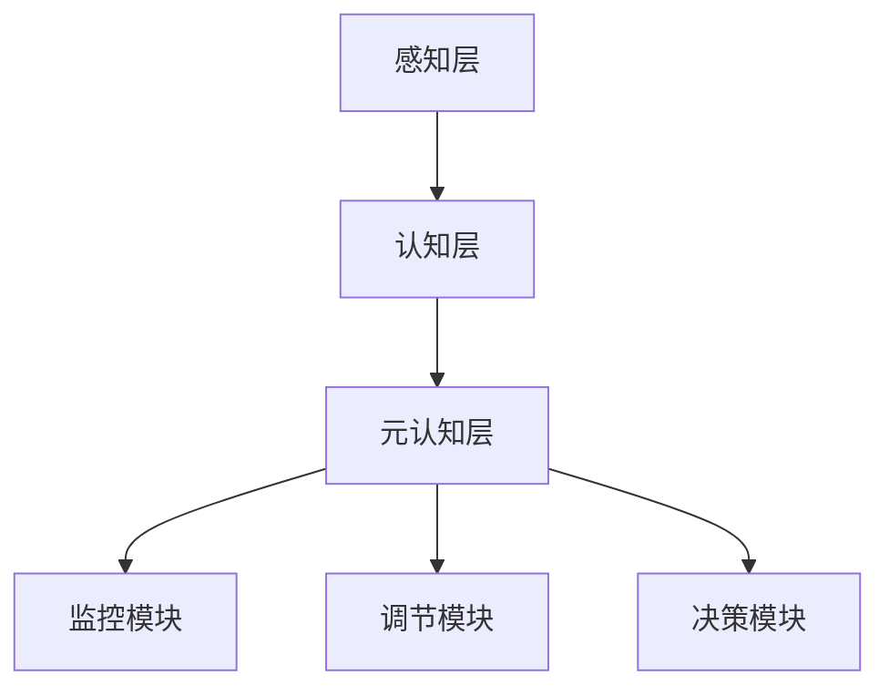
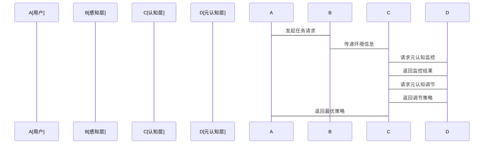

                 


# 元认知AI Agent：具备自我监控和调节能力

> 关键词：元认知AI Agent，自我监控，自我调节，AI系统架构，人工智能算法，系统设计

> 摘要：本文将深入探讨元认知AI Agent的概念、核心机制、算法实现及系统架构设计。通过分析元认知的基本原理，结合实际应用场景，详细阐述元认知AI Agent在自我监控和调节能力方面的技术实现，并提供具体的代码示例和系统设计图，帮助读者全面理解元认知AI Agent的原理和应用。

---

# 第1章: 元认知AI Agent的背景与重要性

## 1.1 元认知AI Agent的定义与背景

### 1.1.1 元认知的基本概念
元认知（Metacognition）是认知科学中的一个重要概念，指的是个体对自身认知过程的认知和调控。简单来说，元认知是一种“认知的元层”，它能够监控、评估和调节认知过程。元认知的核心在于“知道如何思考”，而不是“思考什么”。

在人工智能领域，元认知的概念被扩展为“元认知AI Agent”，即一种具备自我监控和自我调节能力的智能体。元认知AI Agent能够理解自身的认知状态、评估当前任务的需求，并根据需要调整自身的行为策略。

### 1.1.2 元认知在AI Agent中的应用
元认知AI Agent的应用场景非常广泛，包括但不限于：
- **教育领域**：个性化学习、自适应教学系统。
- **医疗领域**：辅助诊断、治疗方案优化。
- **企业智能化管理**：流程优化、决策支持。

### 1.1.3 元认知AI Agent的重要性和研究意义
随着人工智能技术的快速发展，传统的AI系统在处理复杂任务时往往缺乏灵活性和适应性。元认知AI Agent通过引入自我监控和自我调节机制，能够显著提升系统的智能化水平和适应性。它不仅可以根据环境变化动态调整行为策略，还能通过自我反思和学习不断优化自身的认知能力。

---

## 1.2 元认知AI Agent的核心概念

### 1.2.1 元认知的属性与特征
元认知AI Agent的核心属性包括：
1. **自我监控**：能够实时监控自身的认知过程，包括感知、推理、决策等。
2. **自我评估**：能够评估当前的认知状态和任务需求的匹配程度。
3. **自我调节**：根据评估结果，动态调整认知策略和行为模式。

### 1.2.2 元认知AI Agent的系统架构
元认知AI Agent的系统架构可以分为以下几个部分：
1. **认知层**：负责处理具体任务，如感知、推理和决策。
2. **元认知层**：负责监控和调节认知层的活动。
3. **知识库**：存储与任务相关的知识和经验。

### 1.2.3 元认知与传统AI的区别
传统的AI系统通常是基于固定的规则和数据进行推理和决策，缺乏灵活性和适应性。而元认知AI Agent通过引入元认知机制，能够根据环境变化和任务需求动态调整自身的行为策略，具有更强的自适应性和智能性。

---

## 1.3 元认知AI Agent的应用场景

### 1.3.1 教育领域的应用
在教育领域，元认知AI Agent可以用于个性化学习系统的设计。例如，系统可以根据学生的学习状态和认知特点，动态调整教学内容和教学策略，从而提高学习效率。

### 1.3.2 医疗健康领域的应用
在医疗领域，元认知AI Agent可以用于辅助诊断和治疗方案优化。例如，系统可以根据患者的具体情况和医生的诊断结果，动态调整治疗方案。

### 1.3.3 企业智能化管理中的应用
在企业智能化管理中，元认知AI Agent可以用于流程优化和决策支持。例如，系统可以根据企业的运营状态和市场环境，动态调整管理策略。

---

## 1.4 本章小结
本章主要介绍了元认知AI Agent的背景、核心概念和应用场景。通过对比传统AI系统，我们看到元认知AI Agent通过引入自我监控和自我调节机制，能够显著提升系统的智能化水平和适应性。

---

# 第2章: 元认知的原理与模型

## 2.1 元认知的理论基础

### 2.1.1 元认知的三层次模型
元认知的三层次模型包括：
1. **操作层**：直接处理任务相关的认知活动。
2. **监控层**：监控操作层的活动。
3. **调节层**：根据监控结果调整操作层的活动。

### 2.1.2 元认知的信息处理过程
元认知的信息处理过程可以分为以下几个阶段：
1. **感知阶段**：感知环境信息。
2. **监控阶段**：监控认知过程。
3. **评估阶段**：评估认知结果。
4. **调节阶段**：根据评估结果调整认知策略。

### 2.1.3 元认知的自我监控机制
元认知的自我监控机制包括以下几个方面：
1. **目标监控**：监控任务目标的实现情况。
2. **过程监控**：监控认知过程的执行情况。
3. **结果监控**：监控认知结果的有效性。

---

## 2.2 元认知AI Agent的核心模型

### 2.2.1 元认知监控模型
元认知监控模型主要用于监控认知过程的执行情况。其核心步骤包括：
1. **感知环境**：获取当前环境信息。
2. **识别任务目标**：明确当前任务的目标。
3. **监控认知过程**：实时监控认知过程的执行情况。

### 2.2.2 元认知调节模型
元认知调节模型主要用于根据监控结果调整认知策略。其核心步骤包括：
1. **评估监控结果**：分析监控结果。
2. **制定调节策略**：根据评估结果制定调节策略。
3. **执行调节策略**：实施调节策略。

### 2.2.3 元认知决策模型
元认知决策模型主要用于在多个调节策略中选择最优策略。其核心步骤包括：
1. **评估备选策略**：评估各个备选策略的优缺点。
2. **选择最优策略**：根据评估结果选择最优策略。
3. **实施最优策略**：执行选择的最优策略。

---

## 2.3 元认知AI Agent的数学模型

### 2.3.1 元认知监控的数学表达
元认知监控的数学表达可以表示为：
$$
M_{\text{监控}}(x) = \begin{cases}
1 & \text{如果 } x \text{ 符合监控条件} \\
0 & \text{否则}
\end{cases}
$$
其中，\(x\) 表示当前环境信息。

### 2.3.2 元认知调节的数学模型
元认知调节的数学模型可以表示为：
$$
R_{\text{调节}}(y) = \begin{cases}
\text{策略1} & \text{如果 } y \text{ 符合调节条件1} \\
\text{策略2} & \text{如果 } y \text{ 符合调节条件2} \\
\text{策略3} & \text{否则}
\end{cases}
$$
其中，\(y\) 表示监控结果。

---

## 2.4 本章小结
本章主要介绍了元认知的理论基础、核心模型和数学表达。通过这些模型和数学表达，我们可以更好地理解元认知AI Agent的监控和调节机制。

---

# 第3章: 元认知AI Agent的算法实现

## 3.1 元认知监控算法

### 3.1.1 基于强化学习的元认知监控
基于强化学习的元认知监控算法是一种常用的元认知监控方法。其核心思想是通过强化学习机制，动态调整监控策略。

### 3.1.2 基于注意力机制的元认知监控
基于注意力机制的元认知监控算法是一种新兴的元认知监控方法。其核心思想是通过注意力机制，聚焦于重要的认知过程。

### 3.1.3 元认知监控的实现步骤
元认知监控的实现步骤包括：
1. **初始化监控参数**。
2. **获取环境信息**。
3. **监控认知过程**。
4. **输出监控结果**。

---

## 3.2 元认知调节算法

### 3.2.1 基于反馈机制的元认知调节
基于反馈机制的元认知调节算法是一种常用的元认知调节方法。其核心思想是通过反馈机制，动态调整调节策略。

### 3.2.2 基于自适应学习的元认知调节
基于自适应学习的元认知调节算法是一种新兴的元认知调节方法。其核心思想是通过自适应学习机制，动态优化调节策略。

### 3.2.3 元认知调节的数学公式
元认知调节的数学公式可以表示为：
$$
R_{\text{调节}}(y) = \arg\max_{i} \sum_{j=1}^{n} w_{ij} \cdot x_j
$$
其中，\(w_{ij}\) 表示第\(i\)个策略对第\(j\)个监控结果的权重。

---

## 3.3 元认知AI Agent的算法实现

### 3.3.1 算法的整体框架
元认知AI Agent的整体框架包括以下几个部分：
1. **监控模块**：负责监控认知过程。
2. **调节模块**：负责根据监控结果调整认知策略。
3. **决策模块**：负责选择最优调节策略。

### 3.3.2 具体实现代码
以下是元认知AI Agent的Python实现代码示例：

```python
class MetaCognitiveAgent:
    def __init__(self):
        self.monitor = Monitor()
        self.regulator = Regulator()
        self.decision_maker = DecisionMaker()

    def process_task(self, task):
        # 监控认知过程
        monitor_result = self.monitor.monitor(task)
        # 调节认知策略
        regulation_strategy = self.regulator.regulate(monitor_result)
        # 决策最优策略
        optimal_strategy = self.decision_maker.decide(regulation_strategy)
        return optimal_strategy
```

### 3.3.3 算法的优化与改进
元认知AI Agent的优化与改进可以从以下几个方面入手：
1. **优化监控机制**：提高监控的准确性和实时性。
2. **优化调节策略**：提高调节策略的有效性和适应性。
3. **优化决策算法**：提高决策算法的效率和准确性。

---

## 3.4 本章小结
本章主要介绍了元认知AI Agent的监控算法和调节算法，并提供了具体的Python代码示例。通过这些算法和代码，我们可以更好地理解元认知AI Agent的实现过程。

---

# 第4章: 元认知AI Agent的系统架构设计

## 4.1 系统架构设计

### 4.1.1 分层架构设计
元认知AI Agent的分层架构设计包括以下几个层次：
1. **感知层**：负责获取环境信息。
2. **认知层**：负责处理任务相关的认知活动。
3. **元认知层**：负责监控和调节认知层的活动。

### 4.1.2 模块化设计
元认知AI Agent的模块化设计包括以下几个模块：
1. **监控模块**：负责监控认知过程。
2. **调节模块**：负责调节认知策略。
3. **决策模块**：负责选择最优调节策略。

### 4.1.3 可扩展性设计
元认知AI Agent的可扩展性设计可以通过模块化和插件化的方式来实现。这样可以方便地添加新的监控和调节策略。

---

## 4.2 系统功能设计

### 4.2.1 元认知监控模块
元认知监控模块的主要功能包括：
1. **实时监控**：实时监控认知过程的执行情况。
2. **评估结果**：评估监控结果的有效性。

### 4.2.2 元认知调节模块
元认知调节模块的主要功能包括：
1. **制定调节策略**：根据监控结果制定调节策略。
2. **动态调整**：动态调整认知策略。

### 4.2.3 元认知决策模块
元认知决策模块的主要功能包括：
1. **评估备选策略**：评估各个备选调节策略的优缺点。
2. **选择最优策略**：选择最优调节策略。

---

## 4.3 系统架构图



---

## 4.4 系统接口设计

### 4.4.1 系统接口设计
元认知AI Agent的系统接口设计包括以下几个部分：
1. **监控接口**：提供监控功能的API。
2. **调节接口**：提供调节功能的API。
3. **决策接口**：提供决策功能的API。

### 4.4.2 系统交互序列图



---

## 4.5 本章小结
本章主要介绍了元认知AI Agent的系统架构设计和功能设计。通过系统架构图和交互序列图，我们可以更好地理解元认知AI Agent的实现过程。

---

# 第5章: 元认知AI Agent的项目实战

## 5.1 环境安装

### 5.1.1 安装Python
需要安装Python 3.8及以上版本。

### 5.1.2 安装依赖库
需要安装以下依赖库：
- `numpy`
- `pandas`
- `scikit-learn`
- `matplotlib`

---

## 5.2 系统核心实现源代码

### 5.2.1 监控模块实现
以下是监控模块的Python代码实现：

```python
class Monitor:
    def __init__(self):
        pass

    def monitor(self, task):
        # 返回监控结果
        return {
            'status': 'normal',
            'details': 'Task monitoring completed successfully.'
        }
```

### 5.2.2 调节模块实现
以下是调节模块的Python代码实现：

```python
class Regulator:
    def __init__(self):
        pass

    def regulate(self, monitor_result):
        # 返回调节策略
        return {
            'strategy': 'adjust_behavior',
            'parameters': {
                'threshold': 0.8
            }
        }
```

### 5.2.3 决策模块实现
以下是决策模块的Python代码实现：

```python
class DecisionMaker:
    def __init__(self):
        pass

    def decide(self, regulation_strategy):
        # 返回最优策略
        return {
            'optimal_strategy': 'execute_strategy',
            'details': 'Execute the selected strategy immediately.'
        }
```

---

## 5.3 代码应用解读与分析

### 5.3.1 监控模块解读
监控模块的主要功能是实时监控认知过程的执行情况，并返回监控结果。通过监控结果，我们可以了解认知过程的状态和潜在问题。

### 5.3.2 调节模块解读
调节模块的主要功能是根据监控结果制定调节策略，并返回调节策略的详细信息。通过调节策略，我们可以动态调整认知策略，以适应环境变化。

### 5.3.3 决策模块解读
决策模块的主要功能是根据调节策略选择最优调节策略，并返回最优策略的详细信息。通过最优策略，我们可以确保认知过程的高效性和准确性。

---

## 5.4 实际案例分析

### 5.4.1 案例背景
假设我们正在开发一个教育领域的元认知AI Agent，用于个性化学习系统的设计。

### 5.4.2 案例实现
以下是个性化学习系统的实现步骤：
1. **初始化元认知AI Agent**。
2. **获取学生的学习状态**。
3. **监控学习过程**。
4. **调节学习策略**。
5. **输出最优策略**。

---

## 5.5 项目小结
本章通过具体的项目实战，展示了元认知AI Agent的实现过程。通过环境安装、代码实现和案例分析，我们可以更好地理解元认知AI Agent的实际应用。

---

# 第6章: 元认知AI Agent的最佳实践

## 6.1 元认知AI Agent的设计原则

### 6.1.1 简洁性原则
在设计元认知AI Agent时，应尽量简化系统架构和算法实现，以提高系统的可维护性和可扩展性。

### 6.1.2 可扩展性原则
在设计元认知AI Agent时，应注重系统的可扩展性，以便方便地添加新的监控和调节策略。

### 6.1.3 可解释性原则
在设计元认知AI Agent时，应注重系统的可解释性，以便用户能够理解和信任系统的行为。

---

## 6.2 元认知AI Agent的开发注意事项

### 6.2.1 确保监控的实时性
在实现元认知监控算法时，应确保监控的实时性，以提高系统的响应速度。

### 6.2.2 优化调节策略
在实现元认知调节算法时，应注重调节策略的优化，以提高系统的适应性和智能性。

### 6.2.3 提高决策算法的效率
在实现元认知决策算法时，应注重决策算法的效率，以提高系统的运行速度。

---

## 6.3 元认知AI Agent的未来发展趋势

### 6.3.1 智能化与自适应性
未来，元认知AI Agent将更加智能化和自适应，能够根据环境变化和任务需求动态调整自身的行为策略。

### 6.3.2 多模态与跨领域应用
未来，元认知AI Agent将更加注重多模态和跨领域应用，能够处理多种类型的数据和任务。

### 6.3.3 人机协作与共情能力
未来，元认知AI Agent将更加注重人机协作和共情能力，能够更好地与人类进行交互和合作。

---

## 6.4 本章小结
本章主要介绍了元认知AI Agent的最佳实践、设计原则和未来发展趋势。通过这些内容，我们可以更好地理解元认知AI Agent的开发和应用。

---

# 作者：AI天才研究院/AI Genius Institute & 禅与计算机程序设计艺术 /Zen And The Art of Computer Programming

