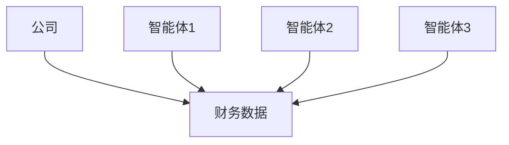
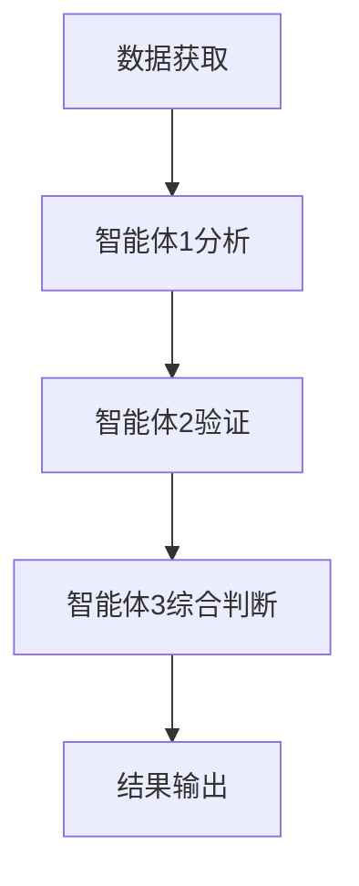
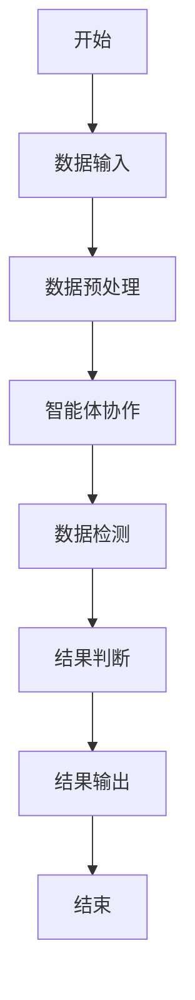
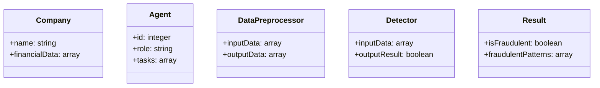
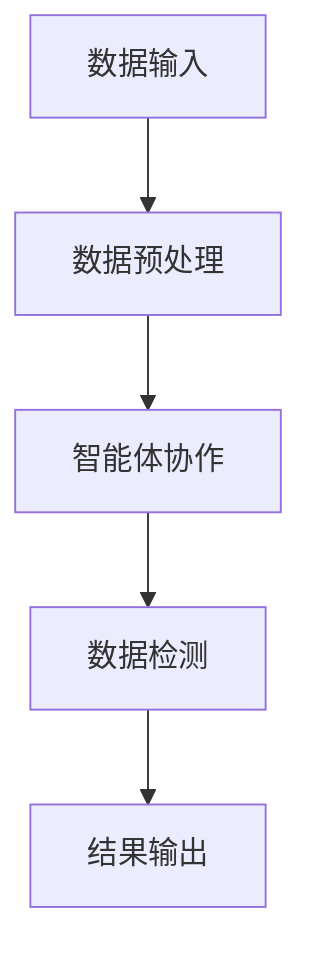
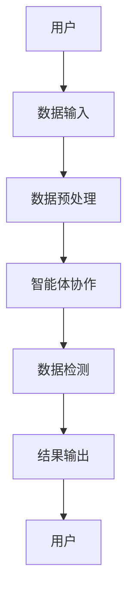

                 


# 基于多智能体的自动化公司财务造假检测系统

## 关键词：多智能体系统、财务造假检测、自动化检测系统、算法原理、系统架构设计

## 摘要：
本文介绍了一种基于多智能体的自动化公司财务造假检测系统。该系统通过多智能体协作机制，利用数据预处理、智能体协作和结果判断等算法，实现对公司财务数据的自动化检测。文章详细讲解了系统的背景、核心概念、算法原理、系统架构设计以及实际案例分析，帮助读者全面理解如何构建和优化基于多智能体的财务造假检测系统。

---

# 第一部分: 基于多智能体的自动化公司财务造假检测系统概述

## 第1章: 背景介绍与问题背景

### 1.1 问题背景
#### 1.1.1 财务造假的现状与危害
财务造假是指公司通过虚构、篡改或隐瞒财务数据，误导利益相关者的行为。近年来，财务造假事件频发，不仅损害了投资者的利益，还破坏了市场的信任机制。例如，某些公司通过虚增收入、隐瞒债务等方式虚构业绩，导致投资者蒙受巨大损失。因此，如何有效检测财务造假，成为企业和社会关注的焦点。

#### 1.1.2 传统财务造假检测方法的局限性
传统的财务造假检测方法主要包括人工审查、基于规则的检测和单模型预测等。然而，这些方法存在以下问题：
- **人工审查效率低**：依赖人工经验，耗时长且成本高。
- **基于规则的检测局限性**：规则难以覆盖所有可能的造假手段，且容易被规避。
- **单模型预测的准确性不足**：单一模型难以捕捉复杂的财务造假模式，漏检率和误检率较高。

#### 1.1.3 多智能体技术在财务检测中的应用潜力
多智能体系统（Multi-Agent System，MAS）是一种由多个智能体组成的分布式系统，智能体之间通过协作完成任务。在财务造假检测中，多智能体系统可以通过以下方式提升检测效果：
- **分布式协作**：多个智能体分别负责不同的检测任务，如收入、成本、利润等，提高检测效率。
- **信息共享与推理**：智能体之间可以共享数据和推理结果，增强检测的全面性。
- **自适应性**：智能体可以根据检测结果动态调整检测策略，适应不同的造假模式。

### 1.2 问题描述
#### 1.2.1 财务造假的典型模式与特征
财务造假通常包括以下几种模式：
- **虚增收入**：通过虚构交易或提前确认收入。
- **隐瞒债务**：通过隐藏负债或虚减负债。
- **虚增利润**：通过虚增收入、虚减成本或虚增其他收益。
- **关联交易造假**：通过关联方交易转移资金或利润。

财务造假的特征包括：
- 数据异常：某些财务指标偏离行业平均水平。
- 关联性异常：收入与成本、收入与利润、成本与利润之间存在不合理的关系。
- 时间一致性差：某些财务数据在时间序列上表现出不合理的波动。

#### 1.2.2 传统财务检测系统的不足
传统财务检测系统主要依赖人工审查和基于规则的检测方法，存在以下不足：
- **检测效率低**：人工审查耗时长，难以应对海量数据。
- **检测准确性差**：基于规则的检测方法难以覆盖所有造假手段，误检率和漏检率较高。
- **缺乏动态适应性**：难以应对不断变化的造假手段和策略。

#### 1.2.3 多智能体系统的目标
本系统的目标是通过多智能体协作机制，实现对公司财务数据的自动化检测，提高检测效率和准确性。具体目标包括：
- **高效性**：通过多智能体的并行计算和分布式协作，提高检测效率。
- **准确性**：通过多个智能体的协作和推理，降低误检率和漏检率。
- **动态适应性**：通过智能体的自适应学习能力，应对不断变化的造假手段。

### 1.3 问题解决与边界
#### 1.3.1 多智能体系统在财务检测中的解决方案
本系统通过以下方式实现财务造假检测：
- **智能体分工协作**：多个智能体分别负责不同的检测任务，如数据预处理、收入检测、成本检测、利润检测等。
- **信息共享与推理**：智能体之间通过共享数据和推理结果，协同完成检测任务。
- **动态调整策略**：智能体可以根据检测结果动态调整检测策略，提高检测效果。

#### 1.3.2 系统的边界与适用范围
系统的边界包括：
- **输入**：公司财务数据，包括收入、成本、利润、资产负债表等。
- **输出**：检测结果，包括是否检测到财务造假，以及具体的造假模式。
- **约束**：系统适用于上市公司、新三板公司等公开披露财务数据的企业。

系统的适用范围包括：
- **上市公司**：需要定期披露财务数据的企业。
- **新三板公司**：需要定期披露财务数据的企业。
- **其他企业**：需要内部财务检测的企业。

#### 1.3.3 系统的核心要素与组成
系统的组成包括：
- **数据输入模块**：负责接收公司财务数据。
- **智能体协作模块**：负责多个智能体的协作和任务分配。
- **数据检测模块**：负责对财务数据进行检测。
- **结果输出模块**：负责输出检测结果。

---

## 第2章: 多智能体系统的核心概念与原理

### 2.1 多智能体系统的基本原理
#### 2.1.1 多智能体系统的定义与特点
多智能体系统（Multi-Agent System，MAS）是由多个智能体组成的分布式系统，智能体之间通过协作完成任务。智能体的特点包括：
- **自主性**：智能体能够自主决策。
- **反应性**：智能体能够根据环境变化调整行为。
- **协作性**：智能体之间可以协作完成任务。
- **社会性**：智能体之间可以进行通信和协调。

#### 2.1.2 多智能体系统的组成与结构
多智能体系统的组成包括：
- **智能体**：负责完成具体的任务。
- **通信机制**：负责智能体之间的通信。
- **协作机制**：负责智能体之间的协作。
- **环境**：智能体所处的环境，如财务数据。

#### 2.1.3 多智能体系统的核心算法与机制
多智能体系统的核心算法包括：
- **分布式计算**：通过智能体的并行计算提高效率。
- **协作推理**：通过智能体之间的协作完成推理任务。
- **自适应学习**：通过智能体的自适应学习能力应对变化的环境。

### 2.2 多智能体系统与财务检测的结合
#### 2.2.1 多智能体系统在财务检测中的优势
多智能体系统在财务检测中的优势包括：
- **高效性**：通过多个智能体的协作，提高检测效率。
- **准确性**：通过多个智能体的协作，提高检测准确性。
- **动态适应性**：通过智能体的自适应学习能力，应对变化的环境。

#### 2.2.2 多智能体系统与财务数据的关联
多智能体系统与财务数据的关联包括：
- **数据预处理**：智能体负责对财务数据进行预处理。
- **数据检测**：智能体负责对财务数据进行检测。
- **数据推理**：智能体通过推理发现数据中的异常。

#### 2.2.3 多智能体系统在财务检测中的具体应用
多智能体系统在财务检测中的具体应用包括：
- **收入检测**：通过智能体检测收入数据的异常。
- **成本检测**：通过智能体检测成本数据的异常。
- **利润检测**：通过智能体检测利润数据的异常。

### 2.3 多智能体系统的核心概念与联系
#### 2.3.1 实体关系图（ER图）架构
以下是多智能体系统的ER图架构：


#### 2.3.2 多智能体协作流程图
以下是多智能体系统的协作流程图：


---

## 第3章: 基于多智能体的财务造假检测算法原理

### 3.1 算法原理概述
#### 3.1.1 算法的整体流程
算法的整体流程包括：
1. 数据预处理：对财务数据进行清洗和标准化。
2. 智能体协作：通过多个智能体的协作完成检测任务。
3. 数据检测：对财务数据进行检测，发现异常。
4. 结果判断：根据检测结果判断是否检测到财务造假。

#### 3.1.2 算法的核心步骤
算法的核心步骤包括：
- **数据预处理**：对财务数据进行清洗和标准化。
- **智能体协作**：通过多个智能体的协作完成检测任务。
- **数据检测**：对财务数据进行检测，发现异常。
- **结果判断**：根据检测结果判断是否检测到财务造假。

#### 3.1.3 算法的优化与改进
算法的优化与改进包括：
- **分布式计算**：通过智能体的并行计算提高效率。
- **协作推理**：通过智能体之间的协作完成推理任务。
- **自适应学习**：通过智能体的自适应学习能力应对变化的环境。

### 3.2 算法实现细节
#### 3.2.1 数据预处理
数据预处理的步骤包括：
1. 数据清洗：去除异常值和缺失值。
2. 数据标准化：将数据标准化到统一的范围。
3. 数据转换：将数据转换为适合检测的形式。

#### 3.2.2 智能体协作机制
智能体协作机制包括：
- **任务分配**：智能体之间根据任务分配进行协作。
- **通信机制**：智能体之间通过通信机制共享数据和推理结果。
- **协作推理**：智能体之间通过协作推理完成检测任务。

#### 3.2.3 结果判断与输出
结果判断与输出的步骤包括：
1. 数据检测：对财务数据进行检测，发现异常。
2. 结果判断：根据检测结果判断是否检测到财务造假。
3. 结果输出：输出检测结果。

### 3.3 算法流程图
以下是算法的流程图：


### 3.4 算法数学模型与公式
#### 3.4.1 数据预处理公式
$$x_{i} = \frac{data_{i}}{max(data)}$$

#### 3.4.2 智能体协作权重计算
$$w_{i} = \frac{1}{1 + e^{-x}}$$

#### 3.4.3 结果判断阈值
$$threshold = 0.8$$

---

## 第4章: 系统分析与架构设计方案

### 4.1 问题场景介绍
#### 4.1.1 系统的目标与功能
系统的目标是实现对公司财务数据的自动化检测，提高检测效率和准确性。系统的功能包括：
- **数据输入**：接收公司财务数据。
- **数据预处理**：对财务数据进行清洗和标准化。
- **智能体协作**：通过多个智能体的协作完成检测任务。
- **数据检测**：对财务数据进行检测，发现异常。
- **结果输出**：输出检测结果。

#### 4.1.2 系统的输入与输出
系统的输入包括：
- **财务数据**：包括收入、成本、利润、资产负债表等。

系统的输出包括：
- **检测结果**：包括是否检测到财务造假，以及具体的造假模式。

#### 4.1.3 系统的约束与限制
系统的约束与限制包括：
- **数据格式**：财务数据需要符合系统要求的格式。
- **计算资源**：系统需要足够的计算资源支持多智能体的协作。
- **数据隐私**：系统需要确保财务数据的安全性和隐私性。

### 4.2 系统功能设计
#### 4.2.1 领域模型类图
以下是系统的领域模型类图：


#### 4.2.2 系统架构设计
以下是系统的架构设计：


#### 4.2.3 系统接口设计
系统的接口设计包括：
- **数据输入接口**：接收公司财务数据。
- **数据预处理接口**：对财务数据进行清洗和标准化。
- **智能体协作接口**：通过智能体协作完成检测任务。
- **数据检测接口**：对财务数据进行检测，发现异常。
- **结果输出接口**：输出检测结果。

#### 4.2.4 系统交互流程图
以下是系统的交互流程图：


---

## 第5章: 项目实战

### 5.1 环境安装与配置
#### 5.1.1 系统环境
- 操作系统：Linux/Windows/MacOS
- 程序语言：Python
- 开发工具：Jupyter Notebook/PyCharm
- 第三方库：numpy、pandas、scikit-learn、networkx、mermaid

#### 5.1.2 安装步骤
1. 安装Python：
   ```bash
   python --version
   ```
2. 安装第三方库：
   ```bash
   pip install numpy pandas scikit-learn networkx mermaid
   ```

### 5.2 系统核心实现源代码
#### 5.2.1 数据预处理代码
```python
import numpy as np
import pandas as pd

def data_preprocessing(data):
    # 数据清洗
    data.dropna(inplace=True)
    # 数据标准化
    data = (data - data.min()) / (data.max() - data.min())
    return data
```

#### 5.2.2 智能体协作代码
```python
import networkx as nx

class Agent:
    def __init__(self, id, role):
        self.id = id
        self.role = role
        self.tasks = []
        
    def assign_task(self, task):
        self.tasks.append(task)
        
    def complete_task(self):
        self.tasks = []
        
def agent_collaboration(agents, tasks):
    for agent in agents:
        if len(agents[i].tasks) == 0:
            assign_task(tasks.pop(0))
```

#### 5.2.3 数据检测代码
```python
from sklearn.ensemble import IsolationForest

def detect_fraudulent(data):
    model = IsolationForest(random_state=42)
    model.fit(data)
    result = model.predict(data)
    return result
```

### 5.3 代码应用解读与分析
#### 5.3.1 数据预处理代码解读
数据预处理代码实现了数据清洗和标准化，确保数据符合检测要求。

#### 5.3.2 智能体协作代码解读
智能体协作代码实现了多个智能体的协作，每个智能体负责不同的任务。

#### 5.3.3 数据检测代码解读
数据检测代码使用了Isolation Forest算法，通过异常检测发现财务数据中的异常。

### 5.4 实际案例分析与详细讲解
#### 5.4.1 案例背景
假设我们有一家公司的财务数据，包括收入、成本、利润等。

#### 5.4.2 数据预处理
对数据进行清洗和标准化，确保数据符合检测要求。

#### 5.4.3 智能体协作
通过多个智能体的协作，分别对收入、成本、利润进行检测。

#### 5.4.4 数据检测
使用Isolation Forest算法对数据进行异常检测，发现异常。

#### 5.4.5 结果分析
根据检测结果，判断是否检测到财务造假。

### 5.5 项目小结
通过本项目，我们实现了一个基于多智能体的财务造假检测系统，通过多个智能体的协作，提高了检测效率和准确性。系统的实现步骤包括数据预处理、智能体协作、数据检测和结果输出。

---

## 第6章: 总结与展望

### 6.1 系统总结
本系统通过多智能体协作机制，实现了对公司财务数据的自动化检测，提高了检测效率和准确性。系统的实现步骤包括数据预处理、智能体协作、数据检测和结果输出。

### 6.2 未来展望
未来，我们可以进一步优化系统，通过引入更多的智能体和更复杂的协作机制，提高检测的准确性和效率。同时，我们也可以探索将系统应用于更多的领域，如金融风险评估、企业信用评分等。

---

## 第7章: 最佳实践 tips、小结、注意事项、拓展阅读

### 7.1 最佳实践 tips
- **数据预处理**：确保数据清洗和标准化的准确性。
- **智能体协作**：合理分配任务，提高协作效率。
- **数据检测**：选择合适的算法，提高检测准确性。

### 7.2 小结
通过本系统的实现，我们掌握了基于多智能体的财务造假检测系统的实现方法，包括数据预处理、智能体协作、数据检测和结果输出。

### 7.3 注意事项
- **数据隐私**：确保财务数据的安全性和隐私性。
- **系统优化**：通过优化算法和架构设计，提高系统性能。
- **系统维护**：定期更新算法和模型，适应变化的环境。

### 7.4 拓展阅读
- **多智能体系统**：推荐阅读《Multi-Agent Systems》。
- **异常检测**：推荐阅读《Anomaly Detection》。
- **财务检测**：推荐阅读《Financial Fraud Detection》。

---

## 作者：AI天才研究院/AI Genius Institute & 禅与计算机程序设计艺术/Zen And The Art of Computer Programming

