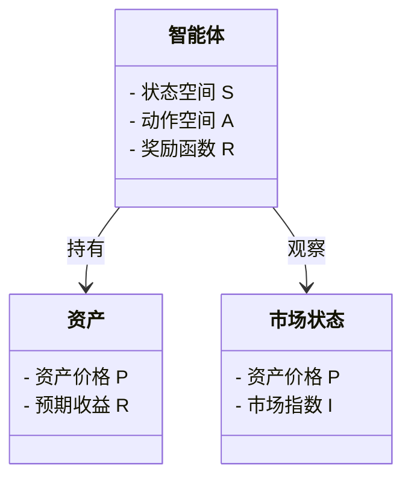
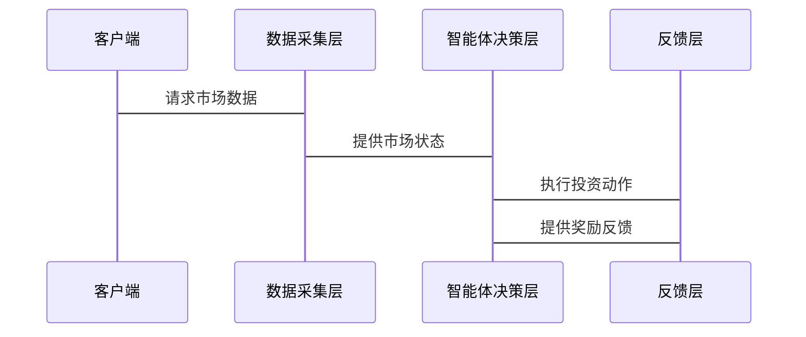

                 


# 多智能体强化学习在动态调整投资组合中的应用

> 关键词：多智能体强化学习，动态投资组合调整，投资组合管理，强化学习，金融应用

> 摘要：本文探讨了多智能体强化学习（MARI）在动态调整投资组合中的应用，详细分析了其核心概念、算法原理、系统架构设计，以及在实际投资组合管理中的应用案例。文章从理论基础到实践应用，全面阐述了多智能体强化学习如何帮助投资者在复杂金融市场中优化投资组合，同时应对市场波动和不确定性。

---

## 第一部分: 多智能体强化学习在动态调整投资组合中的应用基础

---

## 第1章: 动态投资组合调整的背景与挑战

### 1.1 投资组合管理的动态调整需求

#### 1.1.1 传统投资组合管理的局限性
传统的投资组合管理方法通常基于均值-方差模型（Markowitz优化理论）或现代投资组合理论（MPT）。然而，这些方法假设市场是静态的，且资产回报是固定的，无法应对实际市场中的动态变化和不确定性。此外，传统方法通常依赖历史数据，无法有效捕捉实时市场波动。

#### 1.1.2 动态调整投资组合的必要性
在实际金融市场中，市场环境不断变化，经济指标、政策变化、突发事件等因素都会影响资产价格和风险水平。为了在这些动态环境中最大化收益并最小化风险，投资组合需要实时调整。动态调整投资组合能够根据最新的市场信息做出决策，从而提高投资组合的适应性和盈利能力。

#### 1.1.3 多智能体强化学习在投资组合调整中的优势
多智能体强化学习（MARI）通过多个智能体的协作，能够更好地捕捉市场中的复杂关系和非线性动态。每个智能体可以专注于特定资产或市场领域，通过协作和竞争优化整体投资组合的性能。MARI能够实时适应市场变化，提供动态的投资组合调整策略。

### 1.2 多智能体强化学习的基本概念

#### 1.2.1 多智能体系统的定义
多智能体系统（Multi-Agent System, MAS）由多个智能体组成，每个智能体都具有一定的自主性、反应性和协作能力。智能体之间通过通信和协作完成复杂的任务。

#### 1.2.2 强化学习的基本原理
强化学习（Reinforcement Learning, RL）是一种机器学习方法，通过智能体与环境的交互，学习最优策略以最大化累积奖励。智能体通过执行动作、观察状态和接收奖励来优化其决策过程。

#### 1.2.3 多智能体强化学习的核心特征
多智能体强化学习（MARI）结合了MAS和RL的优势，通过多个智能体的协作和竞争，实现复杂任务的优化。MARI中的智能体可以共享信息、协调决策，并通过分布式计算提高系统的整体性能。

### 1.3 动态投资组合调整的挑战

#### 1.3.1 市场波动性对投资组合的影响
金融市场的波动性使得投资组合的风险管理和收益优化变得复杂。传统的静态优化方法难以应对实时市场波动。

#### 1.3.2 多智能体协作中的协调问题
在多智能体系统中，智能体之间的协作和协调是关键挑战。如何设计有效的通信机制和协作策略，以确保智能体之间的协同优化，是一个复杂的任务。

#### 1.3.3 动态调整中的实时决策需求
动态投资组合调整需要实时做出决策，这对计算效率和算法的实时性提出了高要求。如何在实时环境下实现高效的多智能体协作，是一个技术难点。

### 1.4 本章小结
本章介绍了动态投资组合调整的背景与挑战，分析了传统投资组合管理的局限性，阐述了多智能体强化学习的核心概念及其在投资组合调整中的优势。

---

## 第2章: 多智能体强化学习的核心概念与联系

### 2.1 多智能体强化学习的核心原理

#### 2.1.1 多智能体系统的组成部分
多智能体系统由智能体、环境、通信机制和协作策略组成。智能体负责感知环境、执行动作和学习优化；环境提供状态反馈和奖励；通信机制促进智能体之间的信息共享；协作策略确保智能体的协同优化。

#### 2.1.2 强化学习中的状态、动作和奖励机制
在强化学习中，智能体通过与环境的交互，感知状态（当前市场情况），执行动作（买卖资产），并获得奖励（收益或损失）。奖励机制用于指导智能体学习最优策略。

#### 2.1.3 多智能体协作中的通信与协调
多智能体系统中的通信机制允许智能体共享信息，协调决策。通过通信，智能体可以交换市场信息、优化策略和调整动作，从而实现整体性能的提升。

### 2.2 多智能体强化学习与传统强化学习的对比

#### 2.2.1 传统强化学习的特点
传统强化学习通常涉及单个智能体与环境的交互，智能体通过试错学习最优策略。其优点是简单高效，但难以应对复杂多变的任务。

#### 2.2.2 多智能体强化学习的独特优势
多智能体强化学习通过多个智能体的协作，能够更好地应对复杂任务。多个智能体可以专注于不同的任务，通过协作实现整体优化。

#### 2.2.3 两者在投资组合调整中的应用对比
在投资组合调整中，传统强化学习难以应对多资产、多市场的复杂情况，而多智能体强化学习通过多个智能体的协作，能够更有效地优化投资组合。

### 2.3 多智能体强化学习的数学模型与公式

#### 2.3.1 多智能体强化学习的基本公式
多智能体强化学习中的目标是最小化全局损失函数，公式如下：
$$ L = \sum_{i=1}^{n} L_i $$
其中，$L_i$ 是第 $i$ 个智能体的损失函数。

#### 2.3.2 投资组合调整中的数学模型
投资组合调整的数学模型可以表示为：
$$ \text{minimize} \quad \sum_{i=1}^{n} w_i r_i $$
$$ \text{subject to} \quad \sum_{i=1}^{n} w_i = 1 $$
其中，$w_i$ 是第 $i$ 个资产的权重，$r_i$ 是其预期收益。

#### 2.3.3 通过公式对比分析多智能体协作的效果
通过对比单智能体和多智能体强化学习的公式，可以发现多智能体协作能够更有效地分散风险，提高投资组合的收益。

### 2.4 本章小结
本章详细阐述了多智能体强化学习的核心概念和数学模型，分析了其与传统强化学习的区别和优势。

---

## 第3章: 多智能体强化学习的算法原理

### 3.1 多智能体强化学习的算法流程

#### 3.1.1 算法初始化阶段
在算法初始化阶段，需要设置智能体的参数、环境的状态空间和动作空间，以及奖励机制。

#### 3.1.2 状态观测与动作选择
智能体通过观察当前市场状态，选择最优的动作（如买入、卖出或持有某种资产）。

#### 3.1.3 奖励计算与策略更新
智能体根据执行动作后的奖励，更新其策略，以最大化累积奖励。

### 3.2 多智能体强化学习的数学模型

#### 3.2.1 状态空间和动作空间
状态空间 $S$ 包括市场指数、资产价格等；动作空间 $A$ 包括买入、卖出或持有资产。

#### 3.2.2 奖励函数
奖励函数 $R: S \times A \rightarrow \mathbb{R}$，定义了智能体执行动作后的奖励。

#### 3.2.3 策略函数
策略函数 $\pi(a|s)$ 表示在状态 $s$ 下选择动作 $a$ 的概率。

### 3.3 多智能体强化学习的通信与协作机制

#### 3.3.1 智能体之间的通信
智能体通过共享市场信息、策略和奖励，实现协作。

#### 3.3.2 分布式强化学习
分布式强化学习（Distributed Reinforcement Learning, DRL）通过多个智能体的协作，实现全局优化。

### 3.4 本章小结
本章详细介绍了多智能体强化学习的算法流程和数学模型，分析了其通信与协作机制。

---

## 第4章: 系统分析与架构设计

### 4.1 问题场景介绍

#### 4.1.1 投资组合动态调整的场景
在金融市场上，投资者需要根据实时市场信息，动态调整其投资组合。

#### 4.1.2 系统目标
系统的目标是通过多智能体强化学习，实现投资组合的动态优化。

### 4.2 系统功能设计

#### 4.2.1 领域模型
领域模型包括智能体、资产、市场状态和奖励机制。

#### 4.2.2 系统架构
系统架构分为数据采集层、智能体决策层和反馈层。

### 4.3 系统架构设计

#### 4.3.1 领域模型Mermaid类图


#### 4.3.2 系统架构Mermaid架构图


### 4.4 系统接口设计

#### 4.4.1 智能体与数据采集层的接口
智能体通过接口获取市场状态数据。

#### 4.4.2 智能体与反馈层的接口
智能体通过接口执行动作，并接收奖励反馈。

### 4.5 系统交互Mermaid序列图

#### 4.5.1 投资组合调整的交互流程


### 4.6 本章小结
本章详细设计了多智能体强化学习系统的架构和接口，为后续的实现提供了基础。

---

## 第5章: 项目实战

### 5.1 环境安装与配置

#### 5.1.1 安装Python环境
安装Python 3.8及以上版本，并安装必要的库，如TensorFlow、Keras和OpenAI Gym。

#### 5.1.2 安装强化学习框架
安装DRL框架，如Ray、Multi-Agent RL Toolkit等。

### 5.2 系统核心实现

#### 5.2.1 多智能体强化学习算法实现
实现分布式强化学习算法，如DQN、PPO等。

#### 5.2.2 投资组合调整的核心代码
```python
class InvestmentAgent:
    def __init__(self, state_space, action_space):
        self.state_space = state_space
        self.action_space = action_space
        # 初始化策略网络和价值网络
        self.policy = PolicyNetwork(state_space, action_space)
        self.critic = CriticNetwork(state_space)
    
    def act(self, state):
        # 根据策略网络选择动作
        action = self.policy.act(state)
        return action
    
    def update(self, state, action, reward):
        # 更新策略网络和价值网络
        self.policy.update(state, action, reward)
        self.critic.update(state, reward)
```

#### 5.2.3 数据预处理与特征工程
对市场数据进行标准化、去噪和特征提取，以便智能体更好地学习。

### 5.3 项目实战与分析

#### 5.3.1 环境搭建与数据准备
准备金融市场数据，包括股票价格、指数、经济指标等。

#### 5.3.2 算法实现与优化
实现多智能体强化学习算法，并通过回测验证其性能。

#### 5.3.3 实际案例分析
分析实际投资组合调整案例，比较传统方法与强化学习方法的效果。

### 5.4 本章小结
本章通过实际项目，详细展示了多智能体强化学习在投资组合调整中的应用。

---

## 第6章: 高级主题与应用

### 6.1 多智能体强化学习的前沿技术

#### 6.1.1 分布式多智能体强化学习
通过分布式计算，实现大规模多智能体系统的优化。

#### 6.1.2 异构多智能体协作
不同类型的智能体协作，提高系统的适应性和性能。

#### 6.1.3 多目标优化
在投资组合调整中，同时优化收益、风险和流动性等多个目标。

### 6.2 多智能体强化学习在金融领域的应用拓展

#### 6.2.1 联邦学习
通过联邦学习，实现多机构之间的数据协作和模型训练。

#### 6.2.2 与其他技术的结合
将多智能体强化学习与区块链、大数据等技术结合，提升系统的安全性和效率。

### 6.3 实际应用中的挑战与解决方案

#### 6.3.1 数据依赖性
如何获取高质量的市场数据，是多智能体强化学习应用的关键。

#### 6.3.2 计算资源需求
大规模多智能体系统的计算需求较高，需要高效的计算资源。

#### 6.3.3 监管与合规性
金融领域的监管要求严格，应用多智能体强化学习需要符合相关法规。

### 6.4 本章小结
本章探讨了多智能体强化学习的前沿技术和实际应用，分析了其在金融领域的潜力和挑战。

---

## 第7章: 最佳实践、小结与未来展望

### 7.1 最佳实践

#### 7.1.1 系统设计中的注意事项
在系统设计中，需要合理分配智能体的任务，确保协作的有效性。

#### 7.1.2 算法实现中的技巧
在算法实现中，需要注意智能体之间的通信和同步，避免信息延迟和冲突。

#### 7.1.3 实际应用中的建议
在实际应用中，需要结合具体市场环境，调整智能体的参数和策略。

### 7.2 小结
本文详细探讨了多智能体强化学习在动态调整投资组合中的应用，从理论到实践，全面阐述了其核心概念、算法原理和系统设计。

### 7.3 未来展望

#### 7.3.1 技术进步
随着人工智能和分布式计算技术的发展，多智能体强化学习在金融领域的应用将更加广泛。

#### 7.3.2 市场需求
投资者对动态投资组合调整的需求日益增加，多智能体强化学习的应用前景广阔。

#### 7.3.3 研究方向
未来的研究可以集中在多智能体协作机制、分布式强化学习算法优化以及金融市场的复杂性建模等方面。

### 7.4 本章小结
本章总结了全文内容，提出了最佳实践建议，并展望了未来的研究方向。

---

## 作者信息

作者：AI天才研究院/AI Genius Institute & 禅与计算机程序设计艺术/Zen And The Art of Computer Programming

---

感谢您的阅读！如果需要更详细的内容或具体代码示例，请随时联系！

