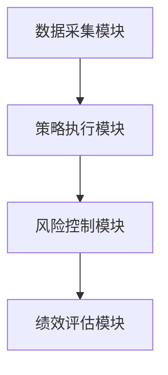
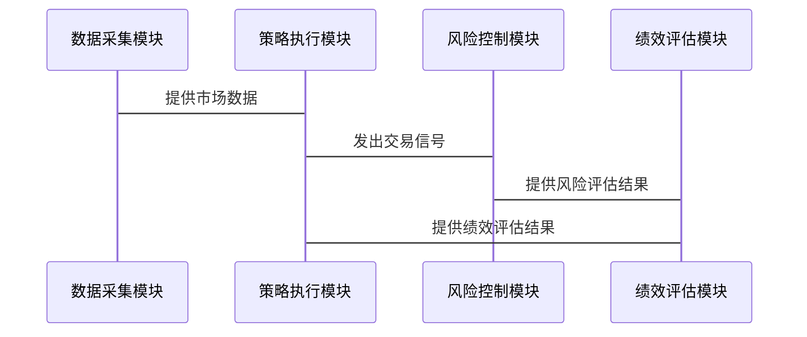

                 


# 如何利用特价股票策略构建多元化对冲基金

> 关键词：特价股票策略，对冲基金，多元化投资，风险管理，量化交易

> 摘要：本文将详细介绍如何利用特价股票策略构建一个多元化对冲基金。从特价股票策略的定义和特点出发，探讨其在对冲基金中的应用，分析构建多元化对冲基金的必要性及优势。结合数学模型与算法原理，详细讲解如何将特价股票策略应用于对冲基金的系统架构设计与实现。通过实际案例分析，展示如何通过量化交易和风险管理构建一个高效、稳定的对冲基金。

---

## 第一部分: 特价股票策略与对冲基金概述

### 第1章: 特价股票策略与对冲基金概述

#### 1.1 特价股票策略的定义与特点

##### 1.1.1 特价股票的定义
特价股票是指在特定市场条件下，由于市场波动、信息不对称或其他因素导致股票价格偏离其内在价值的股票。这些股票通常具有短期套利机会，可以通过量化交易手段快速捕捉这些机会并获利。

##### 1.1.2 特价股票策略的核心特点
- **短期性**：特价股票策略通常关注短期价格波动，交易周期较短。
- **套利性**：通过发现市场中的价格差异，利用套利机会获利。
- **量化驱动**：依赖数学模型和算法进行交易决策。

##### 1.1.3 特价股票策略与传统投资策略的区别
- **传统投资策略**：注重长期价值投资，依赖基本面分析。
- **特价股票策略**：注重短期价格波动，依赖技术分析和量化模型。

#### 1.2 对冲基金的基本概念

##### 1.2.1 对冲基金的定义
对冲基金是一种通过做多和做空相结合的投资方式，旨在在不同市场条件下实现稳定收益的投资基金。

##### 1.2.2 对冲基金的主要特点
- **杠杆使用**：可以通过杠杆放大收益。
- **多样化投资**：通过多种策略分散风险。
- **绝对收益目标**：追求独立于市场表现的绝对收益。

##### 1.2.3 对冲基金的运作模式
- **做多**：买入低估资产，等待价格上涨后卖出获利。
- **做空**：借入高估资产，卖出后等待价格下跌再买回还借。

#### 1.3 构建多元化对冲基金的意义

##### 1.3.1 多元化投资的优势
- **风险分散**：通过多种策略和资产类别降低风险。
- **收益增强**：通过多元化策略捕捉不同市场机会。

##### 1.3.2 特价股票策略在对冲基金中的作用
- **收益增强**：利用短期套利机会提升整体收益。
- **风险对冲**：通过做空部分资产对冲市场风险。

##### 1.3.3 多元化对冲基金的风险控制
- **分散策略风险**：通过多种策略降低单一策略的风险。
- **动态调整**：根据市场变化及时调整投资组合。

---

## 第二部分: 特价股票策略的核心原理

### 第2章: 特价股票策略的原理与实施方法

#### 2.1 特价股票策略的原理

##### 2.1.1 市场套利机会的识别
- **跨市场套利**：利用不同市场之间的价格差异。
- **跨期套利**：利用同一资产在不同时间点的价格差异。

##### 2.1.2 事件驱动策略的应用
- **并购事件**：公司并购前后股价的变化。
- **重组事件**：公司重组对股价的影响。

##### 2.1.3 时间序列分析在特价股票策略中的作用
- **趋势分析**：通过时间序列分析识别短期趋势。
- **波动性分析**：通过波动性指标捕捉短期套利机会。

#### 2.2 特价股票策略的实施方法

##### 2.2.1 数据收集与处理
- **数据来源**：股票价格、市场数据、新闻数据。
- **数据清洗**：去除噪声数据，确保数据质量。

##### 2.2.2 策略模型的构建与优化
- **模型构建**：基于时间序列分析构建套利模型。
- **模型优化**：通过回测优化模型参数。

##### 2.2.3 策略的回测与验证
- **回测方法**：使用历史数据验证策略的有效性。
- **风险控制**：通过回测分析策略的风险暴露。

#### 2.3 特价股票策略的风险管理

##### 2.3.1 风险的来源与类型
- **市场风险**：市场价格波动带来的风险。
- **流动性风险**：市场流动性不足导致的执行风险。
- **模型风险**：模型假设不符合实际带来的风险。

##### 2.3.2 风险控制的策略与方法
- **头寸限制**：限制单一资产的最大头寸。
- **动态调整**：根据市场变化及时调整投资组合。

##### 2.3.3 风险调整后的收益评估
- **夏普比率**：衡量风险调整后的收益。
- **最大回撤**：评估策略的最大亏损幅度。

---

## 第三部分: 对冲基金的数学模型与算法原理

### 第3章: 对冲基金的数学模型与算法

#### 3.1 对冲基金的收益与风险模型

##### 3.1.1 单因素模型
- **单因素模型**：基于一个因子（如市值）构建投资组合。
- **模型公式**：$$ R_i = \alpha + \beta (R_m - R_f) + \epsilon $$

##### 3.1.2 多因素模型
- **多因素模型**：基于多个因子构建投资组合。
- **模型公式**：$$ R_i = \alpha + \beta_1 F_1 + \beta_2 F_2 + \dots + \beta_n F_n + \epsilon $$

##### 3.1.3 CAPM模型在对冲基金中的应用
- **CAPM模型**：$$ E(R_i) = R_f + \beta_i (R_m - R_f) $$
- **应用**：用于评估资产的预期收益。

#### 3.2 特价股票策略的数学公式

##### 3.2.1 市场中性策略的数学表达
- **做多组合**：$$ \sum_{i=1}^{n} w_i^+ R_i $$
- **做空组合**：$$ \sum_{i=1}^{n} w_i^- R_i $$
- **市场中性组合**：$$ \sum_{i=1}^{n} (w_i^+ - w_i^-) R_i $$

##### 3.2.2 事件驱动策略的数学模型
- **事件触发条件**：$$ \text{事件发生时，调整投资组合} $$
- **收益计算**：$$ \text{收益} = \text{卖出价} - \text{买入价} $$

##### 3.2.3 策略组合优化的数学公式
- **优化目标**：$$ \min \sum_{i=1}^{n} w_i^2 $$
- **约束条件**：$$ \sum_{i=1}^{n} w_i = 0 $$

#### 3.3 算法的实现与优化

##### 3.3.1 算法实现的基本步骤
1. 数据采集与处理
2. 策略模型构建
3. 模型回测与优化
4. 风险控制策略设计

##### 3.3.2 算法优化的方法与技巧
- **参数优化**：使用遗传算法或随机搜索优化模型参数。
- **模型组合**：结合多个策略提升整体收益。

##### 3.3.3 算法的性能评估与改进
- **回测结果分析**：分析策略在不同市场环境下的表现。
- **改进措施**：根据回测结果调整策略参数。

---

## 第四部分: 对冲基金的系统架构与设计

### 第4章: 对冲基金的系统架构设计

#### 4.1 系统功能模块设计

##### 4.1.1 数据采集模块
- **功能**：采集实时市场数据和历史数据。
- **工具**：使用API接口或数据仓库。

##### 4.1.2 策略执行模块
- **功能**：根据策略模型生成交易信号。
- **工具**：使用量化交易平台或API。

##### 4.1.3 风险控制模块
- **功能**：实时监控和控制投资组合风险。
- **工具**：使用风险管理系统。

##### 4.1.4 绩效评估模块
- **功能**：评估投资组合的绩效。
- **工具**：使用绩效评估软件或自定义脚本。

#### 4.2 系统架构图



#### 4.3 系统接口设计

##### 4.3.1 数据接口
- **输入**：市场数据、历史数据。
- **输出**：交易信号。

##### 4.3.2 交易接口
- **输入**：交易信号。
- **输出**：交易执行结果。

#### 4.4 系统交互序列图



---

## 第五部分: 项目实战

### 第5章: 项目实战

#### 5.1 环境安装与配置

##### 5.1.1 环境要求
- 操作系统：Windows/Mac/Linux
- Python版本：Python 3.8+
- 依赖库：Pandas、NumPy、Matplotlib、Backtrader

##### 5.1.2 安装步骤
1. 安装Python
2. 安装依赖库
   ```bash
   pip install pandas numpy matplotlib backtrader
   ```

#### 5.2 系统核心实现源代码

##### 5.2.1 策略模型实现
```python
import pandas as pd
import numpy as np

# 数据处理
data = pd.read_csv('stock_data.csv')
data['return'] = data['close'].pct_change()

# 策略实现
class MeanReversionStrategy(bt.Strategy):
    def __init__(self):
        self.position_size = 0
        self.entry_price = 0

    def next(self):
        if not self.position:
            if data['return'].iloc[-1] < -0.01:
                self.position_size = 1
                self.entry_price = data['close'].iloc[-1]
                self.buy()
        else:
            if data['return'].iloc[-1] > 0.01:
                self.sell()

# 回测设置
cerebro = bt.Cerebro()
cerebro.addstrategy(MeanReversionStrategy)
cerebro.run()
```

##### 5.2.2 风险管理实现
```python
class RiskManager:
    def __init__(self, max_loss):
        self.max_loss = max_loss

    def manage(self, position, price):
        if position.size > 0 and price < self.entry_price * (1 - self.max_loss/100):
            position.close()
```

#### 5.3 实际案例分析与代码解读

##### 5.3.1 案例分析
- **数据来源**：某股票的历史价格数据。
- **策略应用**：利用均值回归策略捕捉短期套利机会。

##### 5.3.2 代码解读
```python
# 数据处理部分
data = pd.read_csv('stock_data.csv')
data['return'] = data['close'].pct_change()

# 策略部分
class MeanReversionStrategy(bt.Strategy):
    def __init__(self):
        self.position_size = 0
        self.entry_price = 0

    def next(self):
        if not self.position:
            if data['return'].iloc[-1] < -0.01:
                self.position_size = 1
                self.entry_price = data['close'].iloc[-1]
                self.buy()
        else:
            if data['return'].iloc[-1] > 0.01:
                self.sell()

# 回测部分
cerebro = bt.Cerebro()
cerebro.addstrategy(MeanReversionStrategy)
cerebro.run()
```

##### 5.3.3 性能评估
- **回测结果**：策略在历史数据中的表现。
- **风险调整后收益**：通过夏普比率评估风险调整后的收益。

#### 5.4 项目小结

---

## 第六部分: 最佳实践与总结

### 第6章: 最佳实践与总结

#### 6.1 最佳实践

##### 6.1.1 系统优化建议
- **数据源优化**：使用多数据源提升数据质量。
- **算法优化**：结合多种策略提升整体收益。

##### 6.1.2 风险管理建议
- **动态调整**：根据市场变化及时调整投资组合。
- **风险分散**：通过多元化策略降低风险。

#### 6.2 小结

##### 6.2.1 核心内容回顾
- 特价股票策略的核心原理。
- 对冲基金的系统架构设计。
- 项目实战与性能评估。

##### 6.2.2 未来展望
- 结合人工智能技术提升策略效果。
- 开发更复杂的量化交易模型。

#### 6.3 注意事项

##### 6.3.1 风险提示
- 市场风险：市场价格波动带来的风险。
- 涵盖所有可能的风险点。

##### 6.3.2 操作建议
- 定期回顾和调整投资策略。
- 保持对市场的敏感性。

#### 6.4 拓展阅读

##### 6.4.1 推荐书籍
- 《Python金融数据分析》
- 《算法交易：复杂策略与其实现》

##### 6.4.2 推荐工具
- **数据工具**：Pandas、NumPy。
- **回测工具**：Backtrader、Zipline。

---

## 作者信息

作者：AI天才研究院/AI Genius Institute & 禅与计算机程序设计艺术 /Zen And The Art of Computer Programming

---

# 结语

通过本文的详细讲解，读者可以全面了解如何利用特价股票策略构建多元化对冲基金。从理论到实践，从策略设计到系统实现，本文为读者提供了全面的指导和建议。希望本文能为对冲基金从业者和量化交易爱好者提供有价值的参考和启发。

