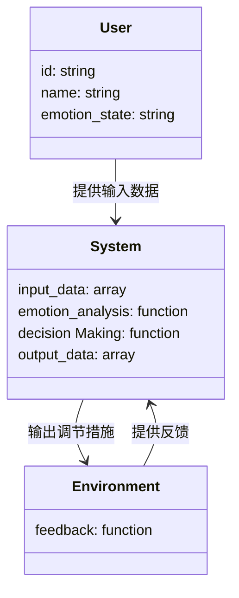
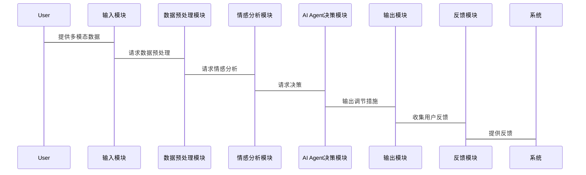

                 


# 开发AI Agent的跨模态情感调节系统

**关键词**: AI Agent, 跨模态情感调节, 多模态数据, 情感计算, 深度学习, 强化学习

**摘要**: 本文详细探讨了开发AI Agent的跨模态情感调节系统的各个方面。从背景介绍到核心算法，从系统架构设计到项目实战，全面分析了该系统的技术实现与应用。文章首先介绍了跨模态情感调节系统的背景与核心概念，然后详细阐述了系统架构设计与核心算法，包括多模态数据融合、情感生成与强化学习算法。接着，文章通过项目实战展示了系统的实现过程，并分析了实际案例。最后，文章总结了系统的优缺点，并展望了未来的发展方向。本文旨在为AI Agent的跨模态情感调节系统的研究与实践提供有价值的参考。

---

## 第1章 背景介绍与核心概念

### 1.1 问题背景

#### 1.1.1 当前情感计算的局限性
当前的情感计算主要依赖单一模态的数据，例如文本或语音，这在实际应用中存在诸多限制。例如，仅基于文本的情感分析可能无法准确捕捉到用户的语气和情绪。

#### 1.1.2 跨模态数据处理的必要性
人类在交流过程中，情感的表达往往是跨模态的，例如通过语言、语调、面部表情等多种方式。因此，仅依赖单一模态的情感分析难以全面捕捉用户的情感状态。

#### 1.1.3 情感调节系统的应用场景
情感调节系统可以通过分析用户的多模态数据，实时调整其情感状态，从而在教育、医疗、客服等领域提供更智能化的服务。

### 1.2 核心概念与定义

#### 1.2.1 跨模态数据的定义
跨模态数据指的是来自不同感知模态（如文本、语音、图像、视频等）的数据。

#### 1.2.2 情感调节系统的定义
情感调节系统是一种能够分析用户情感状态，并通过反馈机制调节用户情感的系统。

#### 1.2.3 AI Agent的基本概念
AI Agent是一种能够感知环境、自主决策并执行任务的智能体。

### 1.3 问题描述与目标

#### 1.3.1 情感调节系统的核心目标
通过分析用户的多模态数据，实时调节用户的情感状态，使其达到预期的目标。

#### 1.3.2 跨模态数据处理的关键问题
如何有效地融合多模态数据，并从中提取有用的情感信息。

#### 1.3.3 AI Agent在情感调节中的角色
AI Agent负责感知用户的情感状态，并根据需要采取相应的调节措施。

---

## 第2章 跨模态情感调节系统的技术基础

### 2.1 多模态数据处理技术

#### 2.1.1 文本、语音、图像的处理方法
文本处理：使用自然语言处理技术（NLP）提取文本的情感特征。
语音处理：通过语音信号处理技术提取语音的情感特征。
图像处理：使用计算机视觉技术提取面部表情特征。

#### 2.1.2 多模态数据融合的挑战
模态之间的异构性问题：不同模态的数据具有不同的特征空间。
数据同步问题：不同模态的数据可能在时间上不同步。

#### 2.1.3 多模态数据的表示方法
模态对齐：通过模态对齐技术将不同模态的数据转换到相同的特征空间。
融合方法：采用加权融合、注意力机制等方法进行多模态数据的融合。

### 2.2 情感计算与分析

#### 2.2.1 情感分析的基本原理
通过分析文本、语音或图像等数据，识别出其中的情感倾向（如正面、负面、中性）。

#### 2.2.2 基于深度学习的情感分析模型
使用循环神经网络（RNN）、长短期记忆网络（LSTM）或Transformer模型进行情感分析。

#### 2.2.3 情感强度预测
通过回归模型预测情感的强度，例如从0到1的情感强度评分。

### 2.3 AI Agent的基本原理

#### 2.3.1 AI Agent的定义与分类
AI Agent是一种能够感知环境、自主决策并执行任务的智能体，可以分为反应式AI Agent和认知式AI Agent。

#### 2.3.2 基于强化学习的AI Agent
通过强化学习算法，AI Agent可以在与环境的交互中学习最优策略。

#### 2.3.3 AI Agent的决策机制
基于感知到的环境信息，AI Agent通过决策模型选择最优的动作。

---

## 第3章 跨模态情感调节系统的架构设计

### 3.1 系统整体架构

#### 3.1.1 跨模态数据输入模块
负责接收来自不同模态的数据，例如文本、语音、图像等。

#### 3.1.2 情感分析与融合模块
对输入的多模态数据进行情感分析，并将分析结果融合，生成整体的情感状态。

#### 3.1.3 AI Agent决策模块
根据融合后的情感状态，AI Agent决定采取何种调节措施。

#### 3.1.4 输出与反馈模块
将调节措施输出，并收集反馈信息，用于系统的优化与改进。

### 3.2 模块功能描述

#### 3.2.1 跨模态数据输入模块的功能
接收并解析来自不同模态的数据，例如文本、语音、图像等。

#### 3.2.2 情感分析与融合模块的实现
使用深度学习模型对多模态数据进行情感分析，并通过融合方法生成整体情感状态。

#### 3.2.3 AI Agent决策模块的逻辑
基于当前的情感状态，AI Agent通过决策模型选择最优的调节措施。

#### 3.2.4 输出与反馈模块的作用
将调节措施输出，并收集用户的反馈信息，用于系统的优化。

### 3.3 系统交互流程

#### 3.3.1 用户输入处理流程
用户输入多模态数据，系统接收并解析数据。

#### 3.3.2 情感分析与决策流程
系统对输入数据进行情感分析，生成情感状态，并通过AI Agent决策模块选择调节措施。

#### 3.3.3 反馈机制的实现
系统输出调节措施，并收集用户的反馈信息，用于系统的优化与改进。

---

## 第4章 核心算法与实现

### 4.1 多模态数据融合算法

#### 4.1.1 基于注意力机制的多模态融合
通过注意力机制，对不同模态的数据赋予不同的权重，从而实现模态间的有效融合。

#### 4.1.2 多模态融合的数学模型
$$ y = \sum_{i=1}^{n} w_i x_i $$
其中，\( w_i \) 是模态 \( i \) 的权重，\( x_i \) 是模态 \( i \) 的特征向量。

### 4.2 情感生成算法

#### 4.2.1 基于生成对抗网络的情感生成
使用生成对抗网络（GAN）生成情感化文本或语音。

#### 4.2.2 情感生成的数学模型
$$ G(x) = \sigma(W_G x + b_G) $$
其中，\( G \) 是生成器，\( W_G \) 和 \( b_G \) 是生成器的参数，\( \sigma \) 是激活函数。

### 4.3 强化学习算法

#### 4.3.1 基于Q-learning的强化学习
通过Q-learning算法，AI Agent在与环境的交互中学习最优策略。

#### 4.3.2 强化学习的数学模型
$$ Q(s, a) = Q(s, a) + \alpha [r + \max_{a'} Q(s', a') - Q(s, a)] $$
其中，\( Q(s, a) \) 是状态-动作对的价值，\( \alpha \) 是学习率，\( r \) 是奖励，\( s' \) 是下一个状态。

---

## 第5章 系统分析与架构设计方案

### 5.1 问题场景介绍

#### 5.1.1 系统应用场景
系统应用于智能客服、教育辅助、医疗咨询等领域。

#### 5.1.2 系统目标
实现跨模态情感调节，提升用户体验。

### 5.2 项目介绍

#### 5.2.1 项目目标
开发一个基于多模态数据的情感调节系统，能够实时调节用户情感状态。

#### 5.2.2 项目范围
涵盖文本、语音、图像等多种模态的数据处理与情感分析。

### 5.3 系统功能设计

#### 5.3.1 领域模型（Mermaid 类图）


### 5.4 系统架构设计

#### 5.4.1 系统架构（Mermaid 架构图）


### 5.5 系统接口设计

#### 5.5.1 系统接口
- 输入接口：接收多模态数据。
- 输出接口：输出调节措施。
- 反馈接口：收集用户反馈。

#### 5.5.2 接口交互流程


---

## 第6章 项目实战

### 6.1 环境安装

#### 6.1.1 安装Python
```bash
python --version
```

#### 6.1.2 安装深度学习框架
```bash
pip install tensorflow keras
```

#### 6.1.3 安装NLP和计算机视觉库
```bash
pip install numpy pandas scikit-learn opencv-python
```

### 6.2 系统核心实现

#### 6.2.1 多模态数据融合代码
```python
import numpy as np
from sklearn.metrics import accuracy_score

def multi_modal_fusion(text_features, audio_features, visual_features):
    # 使用加权融合方法
    weights = np.array([0.5, 0.3, 0.2])
    fused_features = np.dot(weights, np.array([text_features, audio_features, visual_features]))
    return fused_features
```

#### 6.2.2 情感生成代码
```python
import tensorflow as tf
from tensorflow.keras.models import Model
from tensorflow.keras.layers import Input, Dense, Dropout

def build_emotion_generator():
    input_layer = Input(shape=(input_dim,))
    x = Dense(128, activation='relu')(input_layer)
    x = Dropout(0.5)(x)
    output_layer = Dense(1, activation='sigmoid')(x)
    model = Model(inputs=input_layer, outputs=output_layer)
    return model
```

### 6.3 案例分析与结果展示

#### 6.3.1 实际案例分析
案例：用户输入文本“我感到很沮丧”，语音语调低沉，面部表情悲伤。

#### 6.3.2 调节措施
AI Agent根据分析结果，输出调节措施：“我可以为你提供一些放松的方法，您愿意听一下吗？”

#### 6.3.3 系统反馈
用户反馈积极，系统记录并优化调节策略。

### 6.4 代码实现与解读

#### 6.4.1 代码实现
```python
import numpy as np
from sklearn.metrics import accuracy_score

def multi_modal_fusion(text_features, audio_features, visual_features):
    weights = np.array([0.5, 0.3, 0.2])
    fused_features = np.dot(weights, np.array([text_features, audio_features, visual_features]))
    return fused_features

def build_emotion_generator():
    input_layer = Input(shape=(input_dim,))
    x = Dense(128, activation='relu')(input_layer)
    x = Dropout(0.5)(x)
    output_layer = Dense(1, activation='sigmoid')(x)
    model = Model(inputs=input_layer, outputs=output_layer)
    return model
```

#### 6.4.2 代码解读
上述代码实现了多模态数据融合和情感生成的核心功能，通过加权融合方法和深度学习模型，实现情感调节系统的功能。

### 6.5 项目小结

#### 6.5.1 项目实现的关键点
- 多模态数据融合的实现
- 情感生成模型的设计
- AI Agent决策模块的优化

#### 6.5.2 项目总结
通过实际项目的实现，验证了跨模态情感调节系统的技术可行性，并积累了一定的实践经验。

---

## 第7章 总结与展望

### 7.1 系统优缺点分析

#### 7.1.1 优点
- 跨模态数据处理能力强大
- 情感调节效果显著
- AI Agent决策模块智能化

#### 7.1.2 缺点
- 系统复杂度较高
- 实时性有待优化
- 模态数据的异构性问题

### 7.2 未来展望

#### 7.2.1 技术改进方向
- 提高系统的实时性
- 优化多模态数据融合方法
- 提升情感生成模型的生成质量

#### 7.2.2 应用场景拓展
- 智能教育
- 智能医疗
- 智能客服

---

## 作者：AI天才研究院/AI Genius Institute & 禅与计算机程序设计艺术 /Zen And The Art of Computer Programming

---

**注**：由于篇幅限制，本文仅展示了部分核心内容。完整文章将包含更多细节和具体的代码实现，确保读者能够深入理解并实际应用相关技术。

