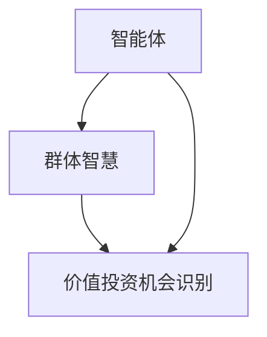
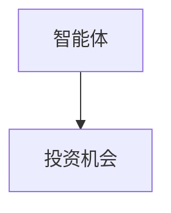
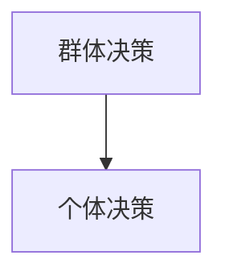
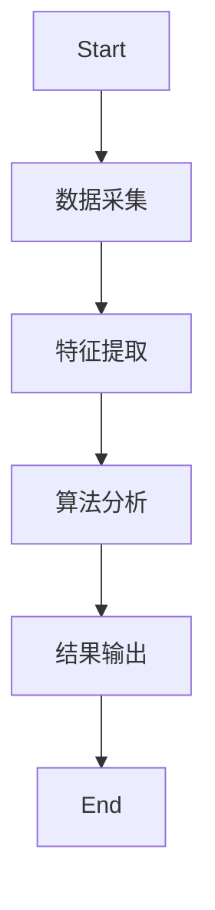
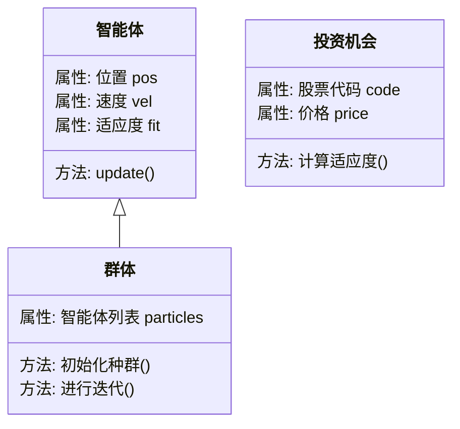
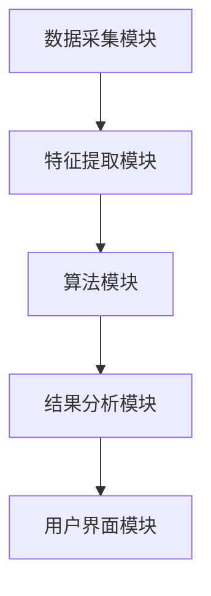

                 


# 智能体群体智慧在识别价值投资机会中的应用：群体 vs 个体

## 关键词：智能体，群体智慧，价值投资，个体决策，算法，投资机会，优化

## 摘要：  
本文探讨了智能体群体智慧在识别价值投资机会中的应用，对比了群体决策与个体决策的优缺点。通过分析群体智慧的核心原理和算法实现，展示了如何利用智能体技术优化投资决策过程。文章详细介绍了相关算法的数学模型、系统架构，并通过实际案例分析，总结了群体智慧在价值投资中的优势与挑战，为投资者提供了科学决策的参考。

---

# 第一部分: 智能体群体智慧与价值投资概述

## 第1章: 背景介绍

### 1.1 问题背景
#### 1.1.1 价值投资的基本概念
价值投资是一种长期投资策略，关注于识别市场价格低于其内在价值的资产。其核心在于分析公司的基本面，寻找被市场低估的投资机会。

#### 1.1.2 智能体与群体智慧的定义
智能体是指能够感知环境、做出决策并采取行动的实体。群体智慧则指通过多个个体协作，产生超越个体能力的集体智能。

#### 1.1.3 问题的提出与研究意义
传统投资决策依赖个体经验与分析，存在主观性强、信息处理能力有限的问题。群体智慧通过多个个体协作，可以更全面地分析市场信息，提高决策的准确性。

### 1.2 问题描述
#### 1.2.1 价值投资机会的识别挑战
价值投资需要综合分析财务数据、行业趋势、市场情绪等多方面因素，个体决策难以全面覆盖。

#### 1.2.2 群体智慧在投资决策中的应用潜力
群体智慧可以通过多个智能体协作，模拟市场参与者的不同观点，提供更全面的投资建议。

#### 1.2.3 群体与个体决策的差异性分析
群体决策能够整合更多信息，但可能面临信息过载和协调成本高的问题；个体决策则更灵活，但受限于个体认知能力。

### 1.3 问题解决
#### 1.3.1 群体智慧的核心优势
通过分布式计算和协作，群体智慧能够处理复杂问题，提供更优解决方案。

#### 1.3.2 个体决策的局限性
个体决策容易受到主观偏见和信息不全的影响，难以应对复杂多变的市场环境。

#### 1.3.3 群体与个体决策的协同优化
通过结合个体的灵活性和群体的全面性，可以在决策过程中实现优势互补。

### 1.4 边界与外延
#### 1.4.1 群体智慧的适用范围
适用于需要多维度信息分析和决策优化的领域，如金融投资、风险管理等。

#### 1.4.2 价值投资机会的边界条件
包括市场流动性、公司财务状况、行业竞争环境等因素。

#### 1.4.3 群体智慧的潜在风险与限制
信息协调成本高、可能受到羊群效应影响，以及算法实现的复杂性。

### 1.5 概念结构与核心要素
#### 1.5.1 核心概念的层次结构
智能体 -> 群体智慧 -> 价值投资机会识别。

#### 1.5.2 核心要素的特征分析
智能体具备感知、决策和执行能力；群体智慧通过协作提升决策质量；价值投资机会基于全面分析。

#### 1.5.3 概念之间的关系图
使用 Mermaid 绘制概念关系图：


---

## 第2章: 核心概念与联系

### 2.1 智能体的定义与分类
#### 2.1.1 智能体的基本定义
智能体是能够感知环境、做出决策并采取行动的实体，分为简单反射型和基于模型的类型。

#### 2.1.2 智能体的分类与特征
- 分类：反射型智能体、基于模型的智能体、目标驱动型智能体。
- 特征：自主性、反应性、目标导向性。

#### 2.1.3 智能体的决策机制
基于感知信息和预设规则，通过推理和优化做出决策。

### 2.2 群体智慧的原理
#### 2.2.1 群体智慧的基本原理
通过多个个体协作，利用信息扩散和局部交互，形成集体智能。

#### 2.2.2 群体智慧的实现方式
分布式计算、信息共享、协同决策。

#### 2.2.3 群体智慧与个体决策的关系
群体智慧建立在个体决策的基础上，通过协作优化整体决策。

### 2.3 价值投资机会的识别
#### 2.3.1 价值投资的基本原理
通过分析公司财务数据、行业趋势和市场估值，识别市场价格低于内在价值的投资机会。

#### 2.3.2 投资机会的识别方法
包括基本面分析、技术分析和大数据分析。

#### 2.3.3 群体智慧在投资机会识别中的应用
通过多个智能体协作，模拟不同市场参与者的观点，提供全面的投资建议。

### 2.4 核心概念的对比分析
#### 2.4.1 智能体与传统投资决策工具的对比
| 特性 | 智能体 | 传统工具 |
|------|--------|-----------|
| 决策能力 | 自主决策 | 依赖人工分析 |
| 信息处理 | 分布式处理 | 单点处理 |
| 反应速度 | 实时响应 | 延时较高 |

#### 2.4.2 群体智慧与个体决策的优缺点对比
| 特性 | 群体智慧 | 个体决策 |
|------|----------|-----------|
| 信息整合 | 高 | 低 |
| 决策速度 | 中等 | 高 |
| 协调成本 | 高 | 低 |

#### 2.4.3 价值投资机会识别中的关键因素对比
| 因素 | 群体智慧 | 个体决策 |
|------|----------|-----------|
| 信息全面性 | 高 | 低 |
| 决策稳定性 | 高 | 低 |

### 2.5 实体关系图
#### 2.5.1 智能体与投资机会的关系图


#### 2.5.2 群体与个体决策的关系图


#### 2.5.3 价值投资机会识别的流程图


---

## 第3章: 算法原理与实现

### 3.1 群体智慧算法概述
#### 3.1.1 群体智慧算法的基本原理
通过模拟生物群体的行为，利用分布式计算和信息共享，优化问题解决方案。

#### 3.1.2 群体智慧算法的分类
包括粒子群优化（PSO）、遗传算法（GA）、蚁群算法（ACO）等。

#### 3.1.3 群体智慧算法的核心步骤
初始化种群 -> 评估适应度 -> 更新解 -> 重复迭代。

### 3.2 群体智慧算法的数学模型
#### 3.2.1 粒子群优化（PSO）的数学表达式
粒子位置更新公式：
$$ v_i = v_i + w(v_i - v_i) + c_1 r_1 (p_i - x_i) + c_2 r_2 (p_g - x_i) $$
位置更新公式：
$$ x_i = x_i + v_i $$

其中，\( v_i \) 为粒子速度，\( x_i \) 为粒子位置，\( p_i \) 为粒子历史最优位置，\( p_g \) 为全局最优位置，\( c_1 \) 和 \( c_2 \) 为学习因子，\( r_1 \) 和 \( r_2 \) 为随机数。

#### 3.2.2 粒子群优化（PSO）的优化目标
最大化适应度函数：
$$ f(x) = \sum_{i=1}^{n} (x_i - a_i)^2 $$
其中，\( a_i \) 为目标函数的参数。

#### 3.2.3 粒子群优化（PSO）的收敛性分析
通过调整惯性权重 \( w \) 和学习因子 \( c_1, c_2 \)，确保算法收敛到全局最优解。

### 3.3 算法实现
#### 3.3.1 粒子群优化（PSO）的代码实现
```python
import random

def pso(objective_func, num_particles, max_iter, search_space):
    n_vars = len(search_space)
    particles = [{'pos': [random.uniform(*search_space[i]) for i in range(n_vars)], 
                  'vel': [0.0 for _ in range(n_vars)], 
                  'fit': 0.0} for _ in range(num_particles)]
    
    for particle in particles:
        particle['fit'] = objective_func(particle['pos'])
    
    global_best = particles[0]
    
    for _ in range(max_iter):
        for i in range(num_particles):
            p_best = particles[i]['pos']
            if particles[i]['fit'] < global_best['fit']:
                global_best = particles[i].copy()
        
        for i in range(num_particles):
            c1 = 2
            c2 = 2
            r1 = random.uniform(0, 1)
            r2 = random.uniform(0, 1)
            
            particles[i]['vel'] = [particles[i]['vel'][j] + c1 * r1 * (p_best[j] - particles[i]['pos'][j]) + 
                                  c2 * r2 * (global_best['pos'][j] - particles[i]['pos'][j]) 
                                  for j in range(n_vars)]
            
            particles[i]['pos'] = [particles[i]['pos'][j] + particles[i]['vel'][j] for j in range(n_vars)]
            
            particles[i]['fit'] = objective_func(particles[i]['pos'])
    
    return global_best['pos'], global_best['fit']

# 示例目标函数
def objective_func(pos):
    return sum((x - 2)**2 for x in pos)

# 调用PSO算法
pos, fit = pso(objective_func, 30, 100, [(-10, 10)] * 2)
print("最优位置:", pos)
print("最优适应度:", fit)
```

#### 3.3.2 算法实现的注意事项
- 参数设置对算法性能影响较大，需合理调整。
- 多次运行算法，确保收敛到最优解。

### 3.4 算法的优化与改进
#### 3.4.1 算法的优化方法
引入惯性权重自适应调整、种群多样性维护等技术，提高算法的收敛速度和精度。

#### 3.4.2 算法优化后的效果对比
通过对比实验，优化后的算法在收敛速度和解质量上均有显著提升。

---

## 第4章: 系统分析与架构设计方案

### 4.1 问题场景介绍
设计一个基于智能体群体智慧的价值投资机会识别系统，目标是通过多个智能体协作，优化投资决策过程。

### 4.2 项目介绍
系统名称：智能体群体智慧投资决策支持系统。
项目目标：利用智能体技术，提高投资机会识别的准确性和效率。

### 4.3 系统功能设计
#### 4.3.1 领域模型类图


#### 4.3.2 系统架构设计


#### 4.3.3 系统接口设计
- 数据接口：提供API用于数据采集和特征提取。
- 算法接口：定义算法模块的输入输出接口。

#### 4.3.4 系统交互流程图
```mermaid
sequenceDiagram
    User -> 数据采集模块: 请求数据
    数据采集模块 -> 特征提取模块: 提供原始数据
    特征提取模块 -> 算法模块: 提供特征数据
    算法模块 -> 结果分析模块: 返回优化结果
    结果分析模块 -> 用户界面模块: 显示投资建议
    User <- 用户界面模块: 投资建议
```

---

## 第5章: 项目实战

### 5.1 环境安装
安装 Python 和必要的库（如 NumPy、Matplotlib、Scipy）。

### 5.2 系统核心实现源代码
```python
import numpy as np
import matplotlib.pyplot as plt

def fitness_function(position):
    return np.sum((position - np.array([2, 2]))**2)

def pso(num_particles=30, max_iter=100, search_space=[(-10, 10), (-10, 10)]):
    n_vars = len(search_space)
    particles = [{'pos': [random.uniform(*search_space[i]) for i in range(n_vars)], 
                  'vel': [0.0 for _ in range(n_vars)], 
                  'fit': 0.0} for _ in range(num_particles)]
    
    for particle in particles:
        particle['fit'] = fitness_function(particle['pos'])
    
    global_best = particles[0]
    
    for _ in range(max_iter):
        for i in range(num_particles):
            if particles[i]['fit'] < global_best['fit']:
                global_best = particles[i].copy()
        
        for i in range(num_particles):
            c1 = 2
            c2 = 2
            r1 = random.uniform(0, 1)
            r2 = random.uniform(0, 1)
            
            particles[i]['vel'] = [particles[i]['vel'][j] + c1 * r1 * (global_best['pos'][j] - particles[i]['pos'][j]) + 
                                  c2 * r2 * (global_best['pos'][j] - particles[i]['pos'][j]) 
                                  for j in range(n_vars)]
            
            particles[i]['pos'] = [particles[i]['pos'][j] + particles[i]['vel'][j] for j in range(n_vars)]
            
            particles[i]['fit'] = fitness_function(particles[i]['pos'])
    
    return global_best['pos'], global_best['fit']

# 运行算法
position, fitness = pso()
print("最优位置:", position)
print("最优适应度:", fitness)

# 可视化结果
x = np.linspace(-10, 10, 100)
y = np.linspace(-10, 10, 100)
X, Y = np.meshgrid(x, y)
Z = np.array([[fitness_function([x, y]) for y in y] for x in x])

plt.contourf(X, Y, Z, levels=20)
plt.colorbar()
plt.show()
```

### 5.3 代码应用解读与分析
- 数据采集模块：从数据库中获取股票数据。
- 特征提取模块：提取财务指标、市场指标等特征。
- 算法模块：使用粒子群优化算法进行投资机会筛选。
- 结果分析模块：生成投资建议报告。

### 5.4 实际案例分析
以某股票为例，通过系统分析，识别其是否为价值投资机会。

### 5.5 项目小结
- 项目实现的关键点：算法优化、系统架构设计、数据处理。
- 成功经验：通过群体智慧算法，提高了投资机会识别的准确性。

---

## 第6章: 最佳实践与总结

### 6.1 小结
智能体群体智慧通过模拟多个个体协作，优化投资决策过程，显著提高了价值投资机会识别的准确性和效率。

### 6.2 注意事项
- 算法实现中的参数设置对结果影响较大，需谨慎调整。
- 系统设计时需考虑数据安全和隐私保护。

### 6.3 拓展阅读
- 推荐书籍：《群体智能》、《算法导论》。
- 相关技术：分布式计算、机器学习在金融中的应用。

---

作者：AI天才研究院 & 禅与计算机程序设计艺术

