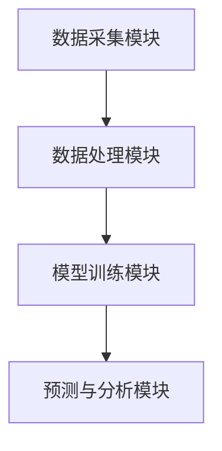
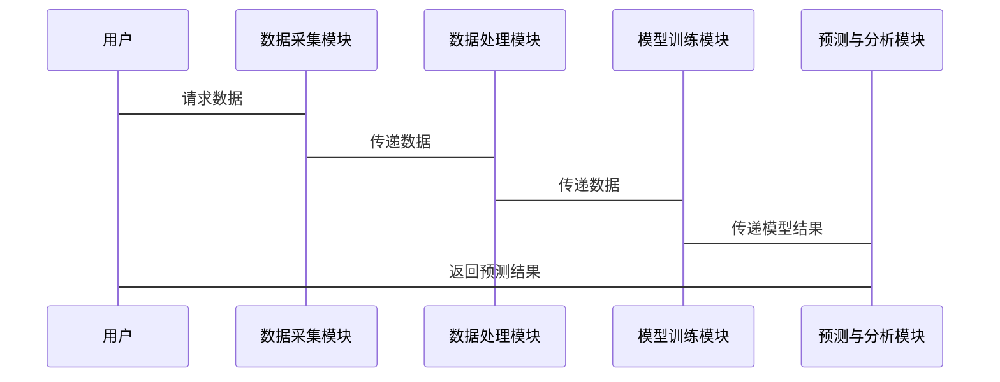

                 


# 智能算法识别市场情绪拐点信号

> 关键词：智能算法，市场情绪，拐点信号，机器学习，时间序列分析

> 摘要：本文将详细探讨如何利用智能算法识别市场情绪拐点信号。通过结合时间序列分析、机器学习和自然语言处理等技术，本文将从理论到实践，系统地阐述如何构建一个高效的市场情绪拐点识别系统。文章内容包括市场情绪拐点的基本概念、智能算法的核心原理、系统的架构设计以及实际项目的实现。

---

# 第一部分: 智能算法识别市场情绪拐点信号的背景与基础

# 第1章: 市场情绪拐点与智能算法概述

## 1.1 市场情绪拐点的基本概念

### 1.1.1 市场情绪拐点的定义
市场情绪拐点是指在金融市场中，投资者情绪从一个阶段（如乐观）转向另一个阶段（如悲观）的关键点。这些拐点通常对应市场趋势的变化，例如从上涨转为下跌，或者从下跌转为上涨。

### 1.1.2 市场情绪拐点的重要性
市场情绪拐点是投资者和交易员关注的核心问题，因为它们往往预示着市场的重大变化。准确识别这些拐点可以帮助投资者做出更明智的决策。

### 1.1.3 市场情绪拐点的影响因素
市场情绪拐点受多种因素影响，包括经济数据、公司财报、政策变化、市场新闻等。这些因素通过影响投资者的心理和行为，进而引发市场情绪的变化。

---

## 1.2 智能算法的基本概念

### 1.2.1 智能算法的定义
智能算法是指能够模拟人类智能的算法，包括机器学习、深度学习、自然语言处理等技术。这些算法能够从数据中学习模式，并自动做出预测或决策。

### 1.2.2 智能算法的核心特点
智能算法的核心特点包括数据驱动、自适应性、可扩展性和高准确性。与传统算法相比，智能算法能够处理更复杂的数据，并能够通过学习不断优化性能。

### 1.2.3 智能算法与传统算法的区别
传统算法通常基于固定的规则和逻辑，而智能算法则能够从数据中学习并自适应。智能算法更擅长处理非结构化数据（如文本、图像）和复杂问题。

---

## 1.3 市场情绪拐点识别的背景与需求

### 1.3.1 金融市场中的情绪分析需求
金融市场中的情绪分析需求主要来源于投资者对市场趋势的预测需求。通过分析市场情绪，投资者可以更好地把握市场的波动和潜在机会。

### 1.3.2 智能算法在情绪拐点识别中的优势
智能算法在情绪拐点识别中的优势包括高精度、实时性、自动化和可扩展性。与传统方法相比，智能算法能够更快速、更准确地识别市场情绪的变化。

### 1.3.3 当前市场情绪拐点识别的主要挑战
当前市场情绪拐点识别的主要挑战包括数据噪声、模型过拟合、市场复杂性和算法计算成本高等问题。这些问题需要通过技术创新和优化来解决。

---

## 1.4 本章小结
本章介绍了市场情绪拐点的基本概念、智能算法的核心特点以及市场情绪拐点识别的背景与需求。通过对比传统算法与智能算法的优缺点，我们明确了智能算法在市场情绪拐点识别中的优势和挑战。

---

# 第二部分: 市场情绪拐点识别的核心概念与联系

# 第2章: 市场情绪拐点识别的核心概念

## 2.1 数据来源与特征提取

### 2.1.1 市场数据的多维度特征
市场数据的多维度特征包括价格数据、成交量数据、市场新闻、社交媒体情绪等。这些特征能够反映市场的整体情绪和趋势。

### 2.1.2 文本数据的情感分析特征
文本数据的情感分析特征是通过分析新闻标题、社交媒体评论等文本数据，提取出市场参与者的情绪倾向。

### 2.1.3 市场行为数据的特征提取
市场行为数据的特征提取包括分析交易量、订单簿数据等，以捕捉市场的微观结构信息。

---

## 2.2 智能算法的核心原理

### 2.2.1 机器学习算法的基本原理
机器学习算法通过训练数据学习特征与标签之间的关系，从而能够对新数据进行分类或回归预测。

### 2.2.2 深度学习算法的基本原理
深度学习算法通过构建多层神经网络，能够自动提取数据中的高层次特征，适用于处理非结构化数据。

### 2.2.3 时间序列分析的基本原理
时间序列分析是一种通过分析数据的时间依赖性，预测未来趋势的方法。常用的方法包括ARIMA、LSTM等。

---

## 2.3 市场情绪拐点识别的流程与步骤

### 2.3.1 数据采集与预处理
数据采集与预处理包括数据清洗、特征提取和数据标准化等步骤，确保数据的质量和一致性。

### 2.3.2 特征提取与选择
特征提取与选择是通过选择与市场情绪拐点相关性较高的特征，提高模型的预测性能。

### 2.3.3 模型训练与优化
模型训练与优化包括选择合适的算法、调整模型参数以及进行交叉验证等步骤，以确保模型的泛化能力。

### 2.3.4 结果分析与验证
结果分析与验证是通过评估模型的性能指标，如准确率、召回率等，验证模型的有效性。

---

## 2.4 核心概念对比与联系

### 2.4.1 不同算法的对比分析
通过对比不同算法的优缺点，选择最适合当前任务的算法。例如，LSTM适用于时间序列数据，而SVM适用于分类任务。

### 2.4.2 数据特征与算法选择的关系
数据特征与算法选择密切相关。例如，文本数据更适合使用NLP技术，而数值数据则适合使用机器学习算法。

### 2.4.3 模型性能与市场环境的关系
模型性能受到市场环境的影响。例如，在市场波动剧烈的时期，模型可能需要更高的鲁棒性。

---

## 2.5 本章小结
本章详细介绍了市场情绪拐点识别的核心概念，包括数据来源、特征提取、智能算法的基本原理以及识别流程与步骤。通过对不同算法的对比分析，我们明确了如何根据实际需求选择合适的算法。

---

# 第三部分: 市场情绪拐点识别的算法原理与数学模型

# 第3章: 时间序列分析算法

## 3.1 时间序列分析的基本原理

### 3.1.1 时间序列的基本特征
时间序列的基本特征包括趋势、周期性、季节性等。这些特征能够帮助我们理解数据的变化规律。

### 3.1.2 时间序列分析的主要方法
时间序列分析的主要方法包括ARIMA、LSTM、Prophet等。每种方法都有其独特的优缺点。

### 3.1.3 时间序列分析的优缺点
时间序列分析的优点是能够捕捉数据的时序依赖性，缺点是需要较长的历史数据，且对异常值较为敏感。

---

## 3.2 常用时间序列算法

### 3.2.1 ARIMA模型
ARIMA模型是一种经典的统计模型，适用于线性时间序列数据。其数学公式为：
$$ ARIMA(p, d, q) $$
其中，p为自回归阶数，d为差分阶数，q为移动平均阶数。

### 3.2.2 LSTM网络
LSTM（长短期记忆网络）是一种深度学习模型，能够捕捉时间序列数据中的长期依赖关系。其核心组件包括记忆单元和门控机制。

### 3.2.3 Prophet模型
Prophet模型是由Facebook开源的时间序列预测模型，适用于具有明确时间依赖性的数据。其数学公式为：
$$ Prophet(t) = a + b \cdot t + c \cdot \sin(d \cdot t) $$

---

## 3.3 时间序列算法的实现步骤

### 3.3.1 数据预处理
数据预处理包括数据清洗、特征工程和数据标准化等步骤。

### 3.3.2 模型训练
模型训练包括选择合适的算法、调整模型参数以及进行交叉验证。

### 3.3.3 模型预测与评估
模型预测与评估包括对未来数据的预测以及对模型性能的评估，如均方误差（MSE）、平均绝对误差（MAE）等。

---

## 3.4 时间序列算法的优缺点对比

### 3.4.1 ARIMA模型的优缺点
优点：统计基础扎实，适合线性时间序列数据；缺点：难以捕捉非线性关系。

### 3.4.2 LSTM网络的优缺点
优点：能够捕捉长期依赖关系；缺点：计算复杂，需要大量数据。

### 3.4.3 Prophet模型的优缺点
优点：简单易用，适合业务场景；缺点：对异常值敏感。

---

## 3.5 本章小结
本章详细介绍了时间序列分析的基本原理和常用算法，包括ARIMA、LSTM和Prophet模型。通过对不同算法的优缺点对比，我们明确了如何选择合适的算法来实现市场情绪拐点的识别。

---

# 第四部分: 市场情绪拐点识别的系统分析与架构设计

# 第4章: 系统分析与架构设计

## 4.1 问题场景介绍
市场情绪拐点识别系统需要能够实时监测市场数据，并通过智能算法预测市场情绪的变化。系统需要处理多源异构数据，并具有高实时性和高准确性。

## 4.2 系统功能设计
### 4.2.1 数据采集模块
数据采集模块负责从多种数据源（如股票市场数据、社交媒体数据）获取原始数据。

### 4.2.2 数据处理模块
数据处理模块负责对采集到的数据进行清洗、转换和特征提取。

### 4.2.3 模型训练模块
模型训练模块负责选择合适的算法，并对数据进行建模和训练。

### 4.2.4 预测与分析模块
预测与分析模块负责对未来的市场情绪进行预测，并生成报告和警报。

## 4.3 系统架构设计
### 4.3.1 系统架构图


### 4.3.2 系统接口设计
系统接口设计包括数据接口、算法接口和用户接口。数据接口负责与数据源交互，算法接口负责与模型训练模块交互，用户接口负责与最终用户交互。

### 4.3.3 系统交互图


---

## 4.4 本章小结
本章通过系统分析与架构设计，明确了市场情绪拐点识别系统的功能模块和系统架构。通过对系统接口和交互流程的详细设计，我们为后续的系统实现奠定了基础。

---

# 第五部分: 市场情绪拐点识别的项目实战

# 第5章: 项目实战

## 5.1 环境安装与配置

### 5.1.1 安装Python环境
需要安装Python 3.8及以上版本，并安装必要的库，如Pandas、NumPy、Scikit-learn、Keras、TensorFlow等。

### 5.1.2 数据源获取
可以从Yahoo Finance获取股票数据，从Twitter API获取社交媒体数据。

### 5.1.3 工具安装
安装Jupyter Notebook用于数据分析和建模。

---

## 5.2 系统核心实现

### 5.2.1 数据预处理
```python
import pandas as pd
import numpy as np

# 加载数据
data = pd.read_csv('stock_data.csv')

# 数据清洗
data.dropna(inplace=True)

# 特征提取
data['Senti'] = data['News'].apply(lambda x: 1 if x > 0 else 0)
```

### 5.2.2 模型训练
```python
from sklearn.model_selection import train_test_split
from sklearn.linear_model import LogisticRegression

# 划分训练集和测试集
X_train, X_test, y_train, y_test = train_test_split(data[['Price', 'Volume']], data['Senti'], test_size=0.2)

# 训练模型
model = LogisticRegression().fit(X_train, y_train)
```

### 5.2.3 模型预测与评估
```python
from sklearn.metrics import accuracy_score

# 预测
y_pred = model.predict(X_test)

# 评估
print('准确率:', accuracy_score(y_test, y_pred))
```

---

## 5.3 案例分析与详细解读

### 5.3.1 案例背景
假设我们有一个股票数据集，包含价格、成交量和新闻标题等特征。我们的目标是通过分析这些数据，识别市场情绪拐点。

### 5.3.2 数据分析
通过分析数据，我们发现新闻标题的正面情绪与股价上涨密切相关。因此，我们选择使用情感分析模型来预测市场情绪。

### 5.3.3 模型实现
```python
from tensorflow.keras.models import Sequential
from tensorflow.keras.layers import LSTM, Dense, Embedding

# 定义LSTM模型
model = Sequential()
model.add(Embedding(词汇表大小, 32, input_length=10))
model.add(LSTM(32))
model.add(Dense(1, activation='sigmoid'))
model.compile(optimizer='adam', loss='binary_crossentropy', metrics=['accuracy'])
model.fit(X_train, y_train, epochs=10, batch_size=32)
```

---

## 5.4 本章小结
本章通过实际项目，详细展示了市场情绪拐点识别系统的实现过程。从环境安装到数据预处理，再到模型训练和评估，我们逐步完成了一个完整的市场情绪拐点识别系统。

---

# 第六部分: 总结与展望

# 第6章: 总结与展望

## 6.1 本章总结
本文详细探讨了智能算法在市场情绪拐点识别中的应用，从理论到实践，系统地阐述了如何构建一个高效的市场情绪拐点识别系统。我们通过对比不同的算法，选择了最适合当前任务的模型，并通过实际项目验证了模型的有效性。

## 6.2 未来研究方向
未来的研究方向包括如何提高模型的实时性和准确性，如何处理多源异构数据，以及如何优化系统的计算效率。此外，还可以探索更先进的算法，如图神经网络和强化学习，来进一步提升市场情绪拐点识别的性能。

---

# 作者：AI天才研究院/AI Genius Institute & 禅与计算机程序设计艺术 /Zen And The Art of Computer Programming

---

以上是《智能算法识别市场情绪拐点信号》的技术博客文章的完整内容。希望这篇文章能够为读者提供清晰的思路和实用的技术指导。

