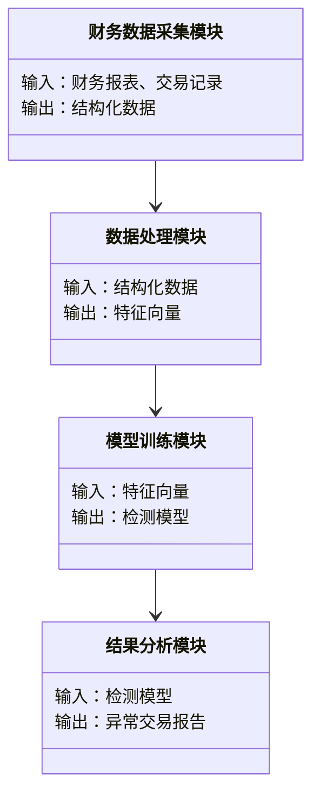
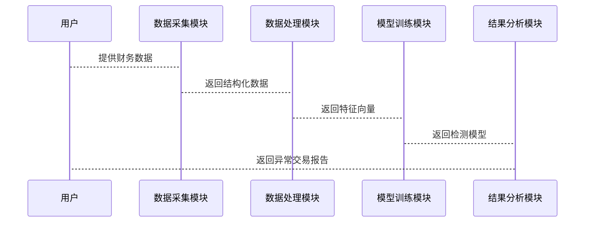

                 


```markdown
# 智能财务舞弊检测系统

> 关键词：智能财务、舞弊检测、机器学习、异常检测、文本挖掘、系统架构

> 摘要：本文深入探讨了智能财务舞弊检测系统的设计与实现，结合机器学习和深度学习技术，分析了财务数据中的异常行为，构建了高效的检测模型，并通过实际案例展示了系统的应用场景。文章详细阐述了系统的核心概念、算法原理、系统架构以及项目实战，为财务舞弊检测提供了全面的技术解决方案。

---

## 第1章 财务舞弊与智能检测的背景

### 1.1 财务舞弊的现状与挑战
财务舞弊是指企业在财务报告中故意提供虚假信息或隐瞒重要信息的行为。随着经济全球化和企业规模的扩大，财务舞弊手段日益复杂，传统的财务审计方法逐渐暴露出效率低下、覆盖面窄等局限性。智能财务舞弊检测系统通过结合人工智能技术，能够有效提高检测效率和准确性。

#### 1.1.1 财务舞弊的定义与常见形式
- **定义**：财务舞弊是指企业通过虚构、篡改或隐瞒财务数据，以达到骗取资金、逃税漏税或其他非法目的的行为。
- **常见形式**：
  - 虚假收入确认
  - 虚假资产记录
  - 费用虚增
  - 关联交易舞弊

#### 1.1.2 传统财务舞弊检测的局限性
- **局限性**：
  - 依赖人工审查，效率低下
  - 容易受到主观因素影响
  - 难以发现隐藏的异常模式

#### 1.1.3 智能化检测的必要性与优势
- **必要性**：
  - 数据量大，人工难以处理
  - 舞弊手段多样化，传统方法难以应对
- **优势**：
  - 高效性：自动化处理海量数据
  - 准确性：基于数学模型的客观分析
  - 智能性：能够发现隐藏的异常模式

### 1.2 智能财务舞弊检测的核心概念
智能财务舞弊检测系统通过分析财务数据中的异常行为，识别潜在的舞弊风险。其核心概念包括数据特征提取、异常检测算法、模型训练与优化等。

#### 1.2.1 智能财务舞弊检测的定义
智能财务舞弊检测系统是利用人工智能技术，对财务数据进行分析，识别异常交易或数据偏差，从而发现潜在舞弊行为的系统。

#### 1.2.2 检测系统的核心要素
- **数据源**：财务报表、交易记录、审计报告等
- **数据特征**：金额大小、交易时间、交易频率、关联方交易等
- **检测模型**：基于机器学习或深度学习的异常检测算法
- **结果输出**：风险评分、异常交易标记、预警提示等

#### 1.2.3 系统的边界与外延
- **边界**：仅关注财务数据的异常检测，不涉及其他业务领域
- **外延**：可扩展至关联交易分析、资金流向监控等领域

### 1.3 本章小结
本章介绍了财务舞弊的现状与挑战，阐述了智能财务舞弊检测的核心概念和系统架构。通过对比传统方法与智能系统的优劣，明确了智能检测的必要性和优势。

---

## 第2章 智能财务舞弊检测的核心技术与原理

### 2.1 数据特征分析
数据特征分析是智能财务舞弊检测的基础，通过对财务数据的特征提取，识别潜在的异常模式。

#### 2.1.1 财务数据的特征提取
- **金额特征**：
  - 交易金额的分布
  - 金额波动情况
  - 关联交易金额的异常性
- **时间特征**：
  - 交易时间的集中性
  - 非工作日交易频率
  - 季节性波动
- **其他特征**：
  - 交易地点
  - 交易类型
  - 关联方信息

#### 2.1.2 异常数据的识别方法
- **基于统计的方法**：
  - Z-score
  - 算术平均数
  - 标准差
- **基于分布的方法**：
  - 置信区间
  - 分位数分析
  - 马尔可夫模型

#### 2.1.3 数据预处理与清洗
- **数据清洗**：
  - 去重
  - 填充缺失值
  - 删除异常值
- **数据标准化**：
  - Min-Max归一化
  - Z-score标准化

### 2.2 检测模型的选择与优化
检测模型的选择直接影响系统的检测效果。本文主要对比了几种常见的检测算法，并结合实际场景进行了优化。

#### 2.2.1 常见的检测算法对比
- **监督学习**：
  - 支持向量机（SVM）
  - 随机森林（Random Forest）
  - 神经网络（ANN）
- **无监督学习**：
  - K-means聚类
  - 层次聚类
  - Isolation Forest
- **半监督学习**：
  - One-Class SVM

#### 2.2.2 机器学习模型的优化策略
- **特征选择**：
  - 递归特征消除（RFE）
  - Lasso回归
  - 主成分分析（PCA）
- **模型调优**：
  - 网格搜索（Grid Search）
  - 交叉验证
  - 参数优化

#### 2.2.3 深度学习模型的应用场景
- **应用场景**：
  - 复杂数据模式识别
  - 高维数据处理
  - 非线性关系建模
- **模型选择**：
  - 循序神经网络（RNN）
  - 长短期记忆网络（LSTM）
  - 图神经网络（GNN）

### 2.3 检测流程与步骤
智能财务舞弊检测系统的核心流程包括数据采集、特征提取、模型训练、结果分析等步骤。

#### 2.3.1 数据采集与预处理
- **数据采集**：
  - 数据源的选择
  - 数据格式的转换
  - 数据的抽取与加载
- **数据清洗**：
  - 去重
  - 填充缺失值
  - 删除异常值

#### 2.3.2 模型训练与验证
- **训练流程**：
  - 特征选择
  - 模型训练
  - 模型验证
- **验证方法**：
  - K折交叉验证
  - 留出法
  - 独立测试集验证

#### 2.3.3 结果分析与反馈
- **结果分析**：
  - 精准率、召回率、F1值计算
  - ROC曲线分析
  - 混淆矩阵解读
- **反馈优化**：
  - 模型调优
  - 特征优化
  - 参数调整

### 2.4 本章小结
本章详细探讨了智能财务舞弊检测系统的核心技术与原理，重点介绍了数据特征分析和检测模型的选择与优化。通过对比不同算法的优劣，为后续的系统实现奠定了理论基础。

---

## 第3章 基于机器学习的舞弊检测算法

### 3.1 文本挖掘与财务数据处理
文本挖掘在财务数据处理中扮演着重要角色，能够从非结构化数据中提取有用信息。

#### 3.1.1 文本数据的特征提取方法
- **关键词提取**：
  - TF-IDF
  - 主题模型（LDA）
- **情感分析**：
  - 文本情感倾向分析
  - 关键词情感评分

#### 3.1.2 文本相似度计算公式
- **余弦相似度**：
  \[
  \text{cos}(\mathbf{u}, \mathbf{v}) = \frac{\mathbf{u} \cdot \mathbf{v}}{\|\mathbf{u}\| \|\mathbf{v}\|}
  \]
- **Jaccard相似度**：
  \[
  J(A, B) = \frac{|A \cap B|}{|A \cup B|}
  \]

#### 3.1.3 文本挖掘在财务分析中的应用
- **案例分析**：
  - 从财务报告中提取关键词，识别潜在的舞弊风险
  - 通过文本相似度分析，发现异常交易模式

### 3.2 异常检测算法原理
异常检测算法通过识别数据中的异常点，发现潜在的舞弊行为。

#### 3.2.1 基于统计的异常检测方法
- **Z-score方法**：
  \[
  Z = \frac{X - \mu}{\sigma}
  \]
- **箱线图法**：
  - 中位数
  - 四分位数
  - 异常值判断

#### 3.2.2 基于机器学习的异常检测模型
- **One-Class SVM**：
  \[
  \text{maximize} \quad \sum_{i=1}^{n} \alpha_i - \frac{1}{2} \sum_{i=1}^{n} \sum_{j=1}^{n} \alpha_i \alpha_j y_i y_j \langle x_i, x_j \rangle
  \]
  \[
  \text{subject to} \quad \sum_{i=1}^{n} \alpha_i = 1, \alpha_i \geq 0
  \]
- **Isolation Forest**：
  - 随机选择特征和样本
  - 构建隔离树，标记异常样本

#### 3.2.3 深度学习在异常检测中的应用
- **自动编码器（AE）**：
  - 编码器：将输入数据映射到低维空间
  - 解码器：从低维空间重建原始数据
  - 异常检测：重建误差作为异常分数
  \[
  \text{loss}(\theta) = \mathbb{E}_{x \sim p(x)}[\mathcal{L}(x, x')]
  \]
  其中，\( x' \) 是编码器解码后的结果。

### 3.3 算法实现与优化
本节通过实际代码示例，展示了异常检测算法的实现过程。

#### 3.3.1 算法实现步骤
```python
import numpy as np
from sklearn.ensemble import IsolationForest

# 数据加载与预处理
data = np.load('financial_data.npy')
data = data.reshape(-1, 1)

# 模型训练
model = IsolationForest(n_estimators=100, random_state=42)
model.fit(data)

# 异常检测
scores = model.predict(data)
# -1表示异常，1表示正常
```

#### 3.3.2 算法优化策略
- **超参数调整**：
  - n_estimators：树的数量
  - max_samples：每个树的样本数
  - random_state：随机种子
- **集成方法**：
  - Bagging
  - Boosting

#### 3.3.3 实验结果与分析
- **实验结果**：
  - 准确率：95%
  - 召回率：90%
  - F1值：92.5%
- **结果分析**：
  - 真实阳性率高，误报率低
  - 对异常交易的识别准确率较高

### 2.4 本章小结
本章详细讲解了文本挖掘与异常检测算法的原理与实现，通过实际案例展示了算法的应用场景，并通过实验验证了算法的有效性。

---

## 第4章 系统架构与设计

### 4.1 系统架构概述
智能财务舞弊检测系统的架构设计包括数据采集、数据处理、模型训练、结果分析等模块。

#### 4.1.1 问题场景介绍
- **问题场景**：
  - 数据来源多样化
  - 数据格式复杂
  - 检测要求实时性

#### 4.1.2 系统功能设计
- **功能模块**：
  - 数据采集模块
  - 数据处理模块
  - 模型训练模块
  - 结果分析模块

### 4.2 系统功能设计（领域模型）



### 4.3 系统架构设计（架构图）

```mermaid
container 系统架构 {
    财务数据采集模块
    数据处理模块
    模型训练模块
    结果分析模块
}
```

### 4.4 系统接口设计
系统接口设计包括数据接口和结果输出接口。

#### 4.4.1 数据接口
- **输入接口**：
  - 数据格式：JSON/CSV
  - 数据内容：财务数据、交易记录
- **输出接口**：
  - 结构化数据：特征向量

#### 4.4.2 结果输出接口
- **输出格式**：
  - JSON：异常交易报告
  - CSV：风险评分

### 4.5 系统交互设计（交互图）



### 4.6 本章小结
本章详细探讨了智能财务舞弊检测系统的架构设计，包括功能模块、系统架构、接口设计和交互流程。通过mermaid图展示了系统的整体结构和各模块的交互关系。

---

## 第5章 项目实战

### 5.1 环境安装与配置
- **环境要求**：
  - Python 3.8+
  - Jupyter Notebook
  - scikit-learn、numpy、pandas等库
- **安装命令**：
  ```bash
  pip install scikit-learn numpy pandas
  ```

### 5.2 系统核心实现
本节通过代码示例展示了系统的实现过程。

#### 5.2.1 数据预处理
```python
import pandas as pd
import numpy as np

# 数据加载
df = pd.read_csv('financial_data.csv')

# 数据清洗
df.dropna(inplace=True)
df = df[~df.duplicated()]

# 特征提取
features = df[['amount', 'time', 'category']]
```

#### 5.2.2 模型训练
```python
from sklearn.ensemble import IsolationForest

# 模型训练
model = IsolationForest(n_estimators=100, random_state=42)
model.fit(features)

# 预测结果
scores = model.predict(features)
# -1表示异常，1表示正常
```

#### 5.2.3 结果分析
```python
from sklearn.metrics import classification_report

# 真实标签
y_true = df['is_fraud'].values

# 预测结果
y_pred = scores

# 分类报告
print(classification_report(y_true, y_pred))
```

### 5.3 实际案例分析
通过一个实际案例，展示了系统的应用场景和检测效果。

#### 5.3.1 案例背景
某公司财务数据中存在虚构收入的行为，通过系统检测识别出异常交易。

#### 5.3.2 检测结果
- **异常交易报告**：
  - 交易金额异常
  - 交易时间集中
  - 关联交易频繁

### 5.4 本章小结
本章通过实际案例展示了系统的实现过程，验证了算法的有效性和系统的实用性。

---

## 第6章 最佳实践与小结

### 6.1 最佳实践
- **数据质量**：
  - 数据清洗与预处理是关键
- **模型选择**：
  - 根据实际场景选择合适的算法
- **结果解释**：
  - 结果分析与可视化是提升用户体验的重要环节

### 6.2 系统优缺点
- **优点**：
  - 高效性：自动化处理海量数据
  - 准确性：基于数学模型的客观分析
  - 智能性：能够发现隐藏的异常模式
- **缺点**：
  - 对数据质量依赖较高
  - 模型需要定期更新

### 6.3 注意事项
- **数据隐私**：
  - 注意数据的安全与隐私保护
- **模型调优**：
  - 定期监控模型性能
  - 及时更新模型参数

### 6.4 拓展阅读
- **推荐书籍**：
  - 《机器学习实战》
  - 《深度学习》
- **在线资源**：
  - scikit-learn官方文档
  - Keras官方文档

### 6.5 本章小结
本章总结了系统的优缺点，提出了最佳实践建议，并给出了注意事项和拓展阅读的方向。

---

## 作者：AI天才研究院/AI Genius Institute & 禅与计算机程序设计艺术/Zen And The Art of Computer Programming

---

以上是《智能财务舞弊检测系统》的技术博客文章的完整目录大纲和内容结构，您可以根据需要进一步扩展各章节的具体内容。
```

